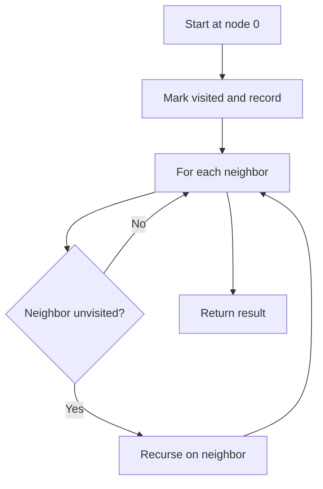

# GRP-002: Lab Network DFS

## 📋 Problem Summary

Perform a Depth-First Search (DFS) traversal on an undirected graph starting from node 0, returning nodes in preorder (recording when first visited). The challenge is to explore as deeply as possible along each branch before backtracking, maintaining the correct visitation order.

## 🌍 Real-World Scenario

**Scenario Title:** Laboratory Network Exploration System

Imagine you're developing a network diagnostic tool for a research laboratory's computer network. The lab has multiple computers (nodes) connected by network cables (edges). When troubleshooting network issues, technicians need to systematically explore the network starting from the main server (node 0) to identify all reachable computers.

DFS is ideal for this scenario because it follows each network path to its end before trying alternative routes. This mirrors how a technician might physically trace network cables - following one cable path completely before returning to check other connections. The preorder traversal records each computer as soon as it's discovered, creating a log of the exploration sequence.

For example, starting from the main server, DFS might explore the entire east wing of the lab before checking the west wing. This depth-first approach is particularly useful for detecting network segments, identifying isolated computers, and understanding the network's hierarchical structure. It's also memory-efficient compared to BFS, as it only needs to remember the current path rather than all nodes at each level.

**Why This Problem Matters:**

- **File System Traversal:** DFS is used in directory tree exploration and file searching
- **Maze Solving:** Finding paths through complex structures by exploring each route fully
- **Dependency Resolution:** Detecting circular dependencies in software packages or build systems


## Detailed Explanation

### ASCII Diagram: DFS Exploration

```
Graph with 5 nodes:

    0 --- 1 --- 4
    |
    2

Adjacency List:
0: [1, 2]
1: [0, 4]
2: [0]
4: [1]

DFS Traversal from node 0 (Recursive):
Start at 0 → Visit 0 (record)
  Go to neighbor 1 → Visit 1 (record)
    Go to neighbor 4 → Visit 4 (record)
    Backtrack to 1 (no more unvisited neighbors)
  Backtrack to 0
  Go to neighbor 2 → Visit 2 (record)
  Backtrack to 0
Done

Result: 0 1 4 2

Call Stack Visualization:
dfs(0) → dfs(1) → dfs(4) → return → return → dfs(2) → return

Legend:
--- = edge
→ = exploration direction
```

## ✅ Input/Output Clarifications (Read This Before Coding)

- **Preorder recording:** Record a node when you first visit it, not when you backtrack
- **Recursion vs Iteration:** Can use recursive approach (implicit stack) or iterative (explicit stack)
- **Edge bidirectionality:** Each edge (u,v) must be added to both adj[u] and adj[v]
- **Visitation order:** Determined by the order of neighbors in the adjacency list
- **Disconnected graphs:** Only nodes reachable from node 0 are visited

Common interpretation mistake:

- ❌ **Wrong:** Recording nodes during backtracking (postorder)
- ✅ **Correct:** Recording nodes when first encountered (preorder)

### Core DFS Concept

DFS uses a stack (either the call stack via recursion or an explicit stack) to explore a graph by going as deep as possible along each branch before backtracking. This creates a depth-first exploration pattern.
DFS follows a path until it runs out of hallway, then it backtracks to the next door.

<!-- mermaid -->


### Why BFS Doesn't Work Here

BFS explores level by level, which would give a different traversal order. For the example graph, BFS would visit 0 → 1 → 2 → 4, while DFS visits 0 → 1 → 4 → 2.

## Naive Approach

### Intuition

Use recursion with a visited array to explore the graph depth-first, recording nodes in preorder.

### Algorithm

1. Create a visited array of size n, all false
2. Create a result list
3. Call recursive DFS function starting from node 0
4. In DFS function:
   - Mark current node as visited
   - Add current node to result
   - For each unvisited neighbor, recursively call DFS
5. Return result

### Time Complexity

- **O(V + E)** where V is vertices and E is edges
- Each node visited once, each edge examined once

### Space Complexity

- **O(V)** for visited array, result list, and recursion stack (worst case: linear chain)

### Why This Works

The recursive call stack naturally implements the depth-first exploration. By marking nodes visited and adding to result immediately upon visiting, we achieve preorder traversal.

### Decision Tree

```
Start DFS(0)
│
├─ Mark 0 visited, add to result
│  └─ For each neighbor of 0:
│     │
│     ├─ Neighbor 1 (unvisited)
│     │  └─ DFS(1)
│     │     ├─ Mark 1 visited, add to result
│     │     └─ For each neighbor of 1:
│     │        ├─ Neighbor 0 (visited) → skip
│     │        └─ Neighbor 4 (unvisited)
│     │           └─ DFS(4)
│     │              ├─ Mark 4 visited, add to result
│     │              └─ Neighbor 1 (visited) → skip
│     │
│     └─ Neighbor 2 (unvisited)
│        └─ DFS(2)
│           ├─ Mark 2 visited, add to result
│           └─ Neighbor 0 (visited) → skip
│
└─ Return result
```

## Optimal Approach

### Key Insight

The recursive approach is already optimal. The key optimization is marking nodes as visited immediately to prevent redundant exploration.

### Algorithm

1. Initialize visited array (size n, all false) and result list
2. Define recursive DFS helper function:
   ```
   dfs(node):
       visited[node] = true
       result.add(node)
       for each neighbor in adj[node]:
           if not visited[neighbor]:
               dfs(neighbor)
   ```
3. Call dfs(0)
4. Return result

### Time Complexity

- **O(V + E)** - Optimal for graph traversal

### Space Complexity

- **O(V)** - For visited array, result, and recursion stack

### Why This Is Optimal

We must visit every reachable node exactly once and examine every edge, making O(V + E) the theoretical lower bound.


## Implementations

### Java
```java
import java.util.*;

class Solution {
    private List<Integer> result;
    private boolean[] visited;
    
    public List<Integer> dfsTraversal(int n, List<List<Integer>> adj) {
        result = new ArrayList<>();
        visited = new boolean[n];
        
        // Start DFS from node 0
        dfs(0, adj);
        
        return result;
    }
    
    private void dfs(int node, List<List<Integer>> adj) {
        // Mark as visited and add to result (preorder)
        visited[node] = true;
        result.add(node);
        
        // Recursively visit all unvisited neighbors
        for (int neighbor : adj.get(node)) {
            if (!visited[neighbor]) {
                dfs(neighbor, adj);
            }
        }
    }
}

class Main {
    public static void main(String[] args) {
        Scanner sc = new Scanner(System.in);
        int n = sc.nextInt();
        int m = sc.nextInt();
        
        List<List<Integer>> adj = new ArrayList<>();
        for (int i = 0; i < n; i++) {
            adj.add(new ArrayList<>());
        }
        
        for (int i = 0; i < m; i++) {
            int u = sc.nextInt();
            int v = sc.nextInt();
            adj.get(u).add(v);
            adj.get(v).add(u);
        }

        // Sort neighbors for deterministic traversal
        for (int i = 0; i < n; i++) {
            Collections.sort(adj.get(i));
        }

        Solution solution = new Solution();
        List<Integer> result = solution.dfsTraversal(n, adj);
        
        for (int i = 0; i < result.size(); i++) {
            System.out.print(result.get(i));
            if (i < result.size() - 1) System.out.print(" ");
        }
        System.out.println();
        sc.close();
    }
}
```

### Python
```python
import sys
sys.setrecursionlimit(200000)
from typing import List

def dfs_traversal(n: int, adj: List[List[int]]) -> List[int]:
    """
    Perform DFS traversal starting from node 0.
    
    Args:
        n: Number of nodes
        adj: Adjacency list representation
    
    Returns:
        List of nodes in preorder DFS visitation order
    """
    result = []

    # Sort neighbors for deterministic traversal
    for neighbors in adj:
        neighbors.sort()

    visited = [False] * n
    
    def dfs(node):
        # Mark as visited and add to result (preorder)
        visited[node] = True
        result.append(node)
        
        # Recursively visit all unvisited neighbors
        for neighbor in adj[node]:
            if not visited[neighbor]:
                dfs(neighbor)
    
    # Start DFS from node 0
    dfs(0)
    
    return result

def main():
    n = int(input())
    m = int(input())
    
    adj = [[] for _ in range(n)]
    
    for _ in range(m):
        u, v = map(int, input().split())
        adj[u].append(v)
        adj[v].append(u)
    
    result = dfs_traversal(n, adj)
    print(' '.join(map(str, result)))

if __name__ == "__main__":
    main()
```

### C++
```cpp
#include <iostream>
#include <vector>
#include <algorithm>
using namespace std;

class Solution {
private:
    vector<int> result;
    vector<bool> visited;
    
    void dfs(int node, vector<vector<int>>& adj) {
        // Mark as visited and add to result (preorder)
        visited[node] = true;
        result.push_back(node);
        
        // Recursively visit all unvisited neighbors
        for (int neighbor : adj[node]) {
            if (!visited[neighbor]) {
                dfs(neighbor, adj);
            }
        }
    }
    
public:
    vector<int> dfsTraversal(int n, vector<vector<int>>& adj) {
        result.clear();
        visited.assign(n, false);
        
        // Start DFS from node 0
        dfs(0, adj);
        
        return result;
    }
};

int main() {
    ios::sync_with_stdio(false);
    cin.tie(nullptr);
    
    int n, m;
    cin >> n >> m;
    
    vector<vector<int>> adj(n);
    
    for (int i = 0; i < m; i++) {
        int u, v;
        cin >> u >> v;
        adj[u].push_back(v);
        adj[v].push_back(u);
    }

    // Sort neighbors for deterministic traversal
    for (int i = 0; i < n; i++) {
        sort(adj[i].begin(), adj[i].end());
    }

    Solution solution;
    vector<int> result = solution.dfsTraversal(n, adj);
    
    for (int i = 0; i < result.size(); i++) {
        cout << result[i];
        if (i < result.size() - 1) cout << " ";
    }
    cout << "\n";
    
    return 0;
}
```

### JavaScript
```javascript
const readline = require("readline");

class Solution {
  dfsTraversal(n, adj) {
    const result = [];
    const visited = new Array(n).fill(false);
    
    const dfs = (node) => {
      // Mark as visited and add to result (preorder)
      visited[node] = true;
      result.push(node);
      
      // Recursively visit all unvisited neighbors
      for (const neighbor of adj[node]) {
        if (!visited[neighbor]) {
          dfs(neighbor);
        }
      }
    };
    
    // Start DFS from node 0
    dfs(0);
    
    return result;
  }
}

const rl = readline.createInterface({
  input: process.stdin,
  output: process.stdout,
});

let data = [];
rl.on("line", (line) => data.push(line.trim()));
rl.on("close", () => {
  let ptr = 0;
  const n = parseInt(data[ptr++]);
  const m = parseInt(data[ptr++]);
  
  const adj = Array.from({ length: n }, () => []);

  for (let i = 0; i < m; i++) {
    const [u, v] = data[ptr++].split(" ").map(Number);
    adj[u].push(v);
    adj[v].push(u);
  }

  // Sort neighbors for deterministic traversal
  for (let i = 0; i < n; i++) {
    adj[i].sort((a, b) => a - b);
  }

  const solution = new Solution();
  const result = solution.dfsTraversal(n, adj);
  console.log(result.join(" "));
});
```

## 🧪 Test Case Walkthrough (Dry Run)

Use the sample:

- n = 5 nodes
- Edges: (0,1), (0,2), (1,4)

Adjacency list:
- 0: [1, 2]
- 1: [0, 4]
- 2: [0]
- 4: [1]

Initialize:
- visited = [false, false, false, false, false]
- result = []

DFS execution:

| Call | Node | Action | Visited | Result | Next Call |
|-----:|:----:|:-------|:--------|:-------|:----------|
| 1 | 0 | Visit 0, mark visited | [T,F,F,F,F] | [0] | dfs(1) |
| 2 | 1 | Visit 1, mark visited | [T,T,F,F,F] | [0,1] | dfs(4) |
| 3 | 4 | Visit 4, mark visited | [T,T,F,F,T] | [0,1,4] | return (no unvisited neighbors) |
| 4 | 1 | Return to 1 | [T,T,F,F,T] | [0,1,4] | return |
| 5 | 0 | Continue with neighbor 2 | [T,T,F,F,T] | [0,1,4] | dfs(2) |
| 6 | 2 | Visit 2, mark visited | [T,T,T,F,T] | [0,1,4,2] | return |
| 7 | 0 | All neighbors visited | [T,T,T,F,T] | [0,1,4,2] | return |

**Observations:**
- Node 0 explored first, then followed path 0→1→4 completely before backtracking
- Node 2 visited last as it's the second neighbor of 0
- Node 3 never visited (not connected to component containing 0)

Answer is `0 1 4 2`.


## ✅ Proof of Correctness

### Invariant

At any point during DFS, all nodes in the result list have been visited, and all their descendants in the DFS tree that have been explored are also in the result.

### Why the approach is correct

**Base case:** Starting node 0 is marked visited and added to result.

**Inductive step:** For any node n, before we recursively explore its neighbors, we mark n as visited and add it to result (preorder). This ensures:
1. Each reachable node is visited exactly once (visited array prevents revisits)
2. Nodes are recorded in preorder (added before exploring children)
3. All paths are explored (recursion continues until no unvisited neighbors remain)

**Completeness:** Every node reachable from the source will eventually be discovered because we explore all neighbors of every visited node.

## 💡 Interview Extensions (High-Value Add-ons)

- **Extension 1:** Implement iterative DFS using an explicit stack instead of recursion
- **Extension 2:** Detect cycles in the graph during DFS traversal
- **Extension 3:** Find all connected components by running DFS from each unvisited node
- **Extension 4:** Compute DFS tree and identify back edges, tree edges, forward edges, and cross edges

### Common Mistakes to Avoid

1. **Recording in Postorder Instead of Preorder**

   - ❌ Wrong: Adding node to result after exploring all neighbors
   - ✅ Correct: Adding node to result immediately when first visited
   - **Why:** Preorder means recording during the first visit, not after backtracking

2. **Not Marking Visited Early Enough**

   - ❌ Wrong: Marking visited after exploring neighbors
   - ✅ Correct: Marking visited immediately upon entering the function
   - **Impact:** Can lead to infinite recursion or duplicate visits

3. **Forgetting Bidirectional Edges**

   - ❌ Wrong: Only adding edge (u,v) to adj[u]
   - ✅ Correct: Add v to adj[u] AND u to adj[v] for undirected graphs
   - **Description:** Missing edges leads to incomplete traversal

4. **Stack Overflow on Large Graphs**

   - ❌ Wrong: Using recursion on very deep graphs without considering stack limits
   - ✅ Correct: Use iterative DFS with explicit stack for very large graphs
   - **Prevention:** Be aware of recursion depth limits (~10^4 to 10^6 depending on language/system)

5. **Confusing DFS with BFS**

   - ❌ Wrong: Using a queue instead of stack/recursion
   - ✅ Correct: Use stack (explicit or call stack) for DFS, queue for BFS
   - **Description:** Queue gives breadth-first, not depth-first traversal

## Related Concepts

- **Breadth-First Search (BFS):** Alternative traversal using queue for level-order exploration
- **Topological Sort:** DFS-based algorithm for ordering directed acyclic graphs
- **Strongly Connected Components:** Kosaraju's and Tarjan's algorithms use DFS
- **Cycle Detection:** DFS can detect cycles using back edges
- **Maze Solving:** DFS is a natural approach for exploring all paths in a maze
