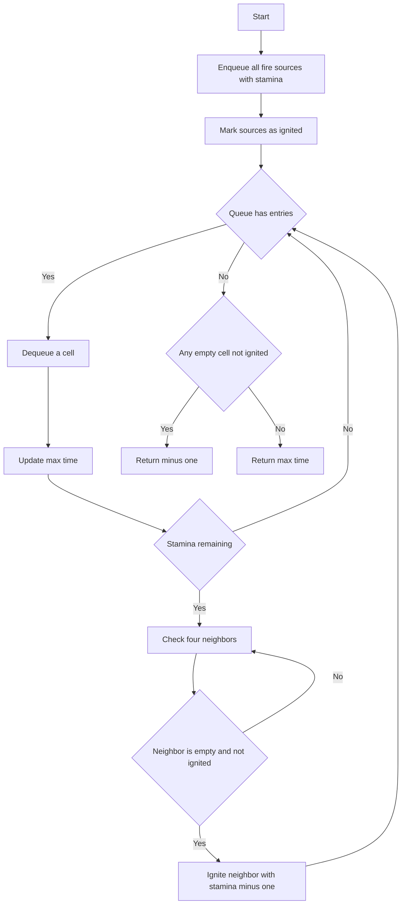

# GRP-011: Library Fire With Exhaustion

## 📋 Problem Summary

Simulate fire spread in a grid where fire sources have stamina that decreases with each spread. Compute the number of minutes until no new cells ignite, considering that fire stops spreading when stamina reaches zero.

## 🌍 Real-World Scenario

**Scenario Title:** Wildfire Simulation with Fuel Depletion

Imagine simulating wildfire spread where each fire source has limited fuel (stamina). As the fire spreads, it consumes fuel and eventually burns out. This models real wildfire behavior where fires don't spread indefinitely but are limited by available fuel.

This type of simulation helps firefighters predict fire spread patterns, plan containment strategies, and estimate when fires will naturally subside. The stamina mechanic represents fuel availability, wind strength, or firefighting efforts that gradually reduce fire intensity.

**Why This Problem Matters:**

- **Disaster Management:** Predicting fire/flood spread with decay
- **Epidemic Modeling:** Disease spread with immunity buildup
- **Network Propagation:** Information spread with diminishing reach
- **Game Development:** Spell effects with limited range/duration


## Detailed Explanation

### Flow Diagram: Fire Spread with Stamina

The fire spreads like a runner with limited fuel: once the tank is empty, it stops branching.

<!-- mermaid -->


```
Initial grid:
[2] [0]    Fire at (0,0) with stamina 2
[0] [0]

Minute 0: Fire at (0,0), stamina=2
Minute 1: Spread to (0,1) and (1,0), stamina=1
Minute 2: Spread from (0,1) to (1,1), stamina=0
         Spread from (1,0) to (1,1), stamina=0
         Fire exhausted, no more spread

Total: 2 minutes
```

## ✅ Input/Output Clarifications (Read This Before Coding)

- **Fire sources:** Cells with value 2 in grid
- **Stamina:** Initial stamina from stamina grid
- **Spread rule:** Fire spreads to 4-adjacent cells, stamina decreases by 1
- **Exhaustion:** Fire stops spreading when stamina reaches 0
- **Return -1:** If any empty cell never catches fire

## Optimal Approach

### Algorithm

```
fire_spread_time(grid, stamina):
    queue = []  // (row, col, remaining_stamina, time)
    ignited = set()
    
    // Initialize with all fire sources
    for i, j in grid:
        if grid[i][j] == 2:
            queue.add((i, j, stamina[i][j], 0))
            ignited.add((i, j))
    
    max_time = 0
    
    while queue not empty:
        (r, c, stam, time) = queue.dequeue()
        max_time = max(max_time, time)
        
        if stam > 0:
            for (dr, dc) in [(0,1), (1,0), (0,-1), (-1,0)]:
                nr, nc = r + dr, c + dc
                if valid(nr, nc) and grid[nr][nc] == 0 and (nr,nc) not in ignited:
                    ignited.add((nr, nc))
                    queue.enqueue((nr, nc, stam - 1, time + 1))
    
    // Check if all empty cells ignited
    for i, j in grid:
        if grid[i][j] == 0 and (i,j) not in ignited:
            return -1
    
    return max_time
```

### Time Complexity: **O(rows × cols × max_stamina)**
### Space Complexity: **O(rows × cols)**


## Implementations

### Java
```java
import java.util.*;

class Solution {
    private int[][] dirs = {{0,1}, {1,0}, {0,-1}, {-1,0}};

    public int fireSpreadTime(int[][] grid, int[][] stamina) {
        int rows = grid.length;
        int cols = grid[0].length;
        Queue<int[]> queue = new LinkedList<>();
        Set<String> ignited = new HashSet<>();

        // Initialize with fire sources
        for (int i = 0; i < rows; i++) {
            for (int j = 0; j < cols; j++) {
                if (grid[i][j] == 2) {
                    int s = 0;
                    if (stamina != null && i < stamina.length && j < stamina[i].length) {
                        s = stamina[i][j];
                    }
                    queue.offer(new int[]{i, j, s, 0});
                    ignited.add(i + "," + j);
                }
            }
        }

        int maxTime = 0;

        while (!queue.isEmpty()) {
            int[] curr = queue.poll();
            int r = curr[0], c = curr[1], stam = curr[2], time = curr[3];
            maxTime = Math.max(maxTime, time);

            if (stam > 0) {
                for (int[] dir : dirs) {
                    int nr = r + dir[0];
                    int nc = c + dir[1];
                    String key = nr + "," + nc;

                    if (nr >= 0 && nr < rows && nc >= 0 && nc < cols &&
                        grid[nr][nc] == 0 && !ignited.contains(key)) {
                        ignited.add(key);
                        queue.offer(new int[]{nr, nc, stam - 1, time + 1});
                    }
                }
            }
        }

        // Check if all empty cells ignited
        for (int i = 0; i < rows; i++) {
            for (int j = 0; j < cols; j++) {
                if (grid[i][j] == 0 && !ignited.contains(i + "," + j)) {
                    return -1;
                }
            }
        }

        return maxTime;
    }
}

class Main {
    public static void main(String[] args) {
        Scanner sc = new Scanner(System.in);
        int r = sc.nextInt();
        int c = sc.nextInt();

        int[][] grid = new int[r][c];
        for (int i = 0; i < r; i++) {
            for (int j = 0; j < c; j++) {
                grid[i][j] = sc.nextInt();
            }
        }

        // Handle optional stamina matrix
        int[][] stamina = new int[r][c];
        for (int i = 0; i < r; i++) {
            for (int j = 0; j < c; j++) {
                if (sc.hasNextInt()) {
                    stamina[i][j] = sc.nextInt();
                } else {
                    stamina[i][j] = 0;
                }
            }
        }

        Solution solution = new Solution();
        int result = solution.fireSpreadTime(grid, stamina);
        System.out.println(result);
        sc.close();
    }
}
```

### Python
```python
import sys
sys.setrecursionlimit(200000)
from collections import deque
from typing import List

def fire_spread_time(grid: List[List[int]], stamina: List[List[int]]) -> int:
    rows, cols = len(grid), len(grid[0])
    queue = deque()
    ignited = set()
    
    for i in range(rows):
        for j in range(cols):
            if grid[i][j] == 2:
                # Use default stamina 0 if stamina grid missing/incomplete
                s = stamina[i][j] if i < len(stamina) and j < len(stamina[i]) else 0
                queue.append((i, j, s, 0))
                ignited.add((i, j))
    
    max_time = 0
    
    while queue:
        r, c, stam, time = queue.popleft()
        max_time = max(max_time, time)
        
        if stam > 0:
            for dr, dc in [(0,1), (1,0), (0,-1), (-1,0)]:
                nr, nc = r + dr, c + dc
                if (0 <= nr < rows and 0 <= nc < cols and 
                    grid[nr][nc] == 0 and (nr, nc) not in ignited):
                    ignited.add((nr, nc))
                    queue.append((nr, nc, stam - 1, time + 1))
    
    for i in range(rows):
        for j in range(cols):
            if grid[i][j] == 0 and (i, j) not in ignited:
                return -1
    
    return max_time

def main():
    try:
        input_data = sys.stdin.read().split()
    except Exception:
        return

    if not input_data:
        return
    
    iterator = iter(input_data)
    try:
        r = int(next(iterator))
        c = int(next(iterator))
        
        grid = []
        for _ in range(r):
            row = []
            for _ in range(c):
                row.append(int(next(iterator)))
            grid.append(row)
            
        stamina = []
        try:
            for _ in range(r):
                row = []
                for _ in range(c):
                    row.append(int(next(iterator)))
                stamina.append(row)
        except StopIteration:
            # Fill remaining with 0s
            while len(stamina) < r:
                stamina.append([0] * c)
        
        result = fire_spread_time(grid, stamina)
        print(result)
    except StopIteration:
        pass

if __name__ == "__main__":
    main()
```

### C++
```cpp
#include <iostream>
#include <vector>
#include <queue>
#include <set>
using namespace std;

class Solution {
private:
    int dirs[4][2] = {{0,1}, {1,0}, {0,-1}, {-1,0}};

public:
    int fireSpreadTime(vector<vector<int>>& grid, vector<vector<int>>& stamina) {
        int rows = grid.size();
        int cols = grid[0].size();
        queue<tuple<int,int,int,int>> q;  // row, col, stamina, time
        set<pair<int,int>> ignited;

        // Initialize with fire sources
        for (int i = 0; i < rows; i++) {
            for (int j = 0; j < cols; j++) {
                if (grid[i][j] == 2) {
                    q.push({i, j, stamina[i][j], 0});
                    ignited.insert({i, j});
                }
            }
        }

        int maxTime = 0;

        while (!q.empty()) {
            auto [r, c, stam, time] = q.front();
            q.pop();
            maxTime = max(maxTime, time);

            if (stam > 0) {
                for (auto& dir : dirs) {
                    int nr = r + dir[0];
                    int nc = c + dir[1];

                    if (nr >= 0 && nr < rows && nc >= 0 && nc < cols &&
                        grid[nr][nc] == 0 && ignited.find({nr, nc}) == ignited.end()) {
                        ignited.insert({nr, nc});
                        q.push({nr, nc, stam - 1, time + 1});
                    }
                }
            }
        }

        // Check if all empty cells ignited
        for (int i = 0; i < rows; i++) {
            for (int j = 0; j < cols; j++) {
                if (grid[i][j] == 0 && ignited.find({i, j}) == ignited.end()) {
                    return -1;
                }
            }
        }

        return maxTime;
    }
};

int main() {
    ios::sync_with_stdio(false);
    cin.tie(nullptr);

    int r, c;
    cin >> r >> c;

    vector<vector<int>> grid(r, vector<int>(c));
    for (int i = 0; i < r; i++) {
        for (int j = 0; j < c; j++) {
            cin >> grid[i][j];
        }
    }

    vector<vector<int>> stamina(r, vector<int>(c, 0));
    for (int i = 0; i < r; i++) {
        for (int j = 0; j < c; j++) {
            if (cin.peek() != EOF) {
                cin >> stamina[i][j];
            }
        }
    }

    Solution solution;
    cout << solution.fireSpreadTime(grid, stamina) << endl;

    return 0;
}
```

### JavaScript
```javascript
const readline = require("readline");

class Solution {
  fireSpreadTime(grid, stamina) {
    const rows = grid.length;
    const cols = grid[0].length;
    const queue = [];
    const ignited = new Set();

    // Initialize with fire sources
    for (let i = 0; i < rows; i++) {
      for (let j = 0; j < cols; j++) {
        if (grid[i][j] === 2) {
          const s = (i < stamina.length && j < stamina[i].length) ? stamina[i][j] : 0;
          queue.push([i, j, s, 0]);
          ignited.add(`${i},${j}`);
        }
      }
    }

    let maxTime = 0;
    const dirs = [[0,1], [1,0], [0,-1], [-1,0]];

    while (queue.length > 0) {
      const [r, c, stam, time] = queue.shift();
      maxTime = Math.max(maxTime, time);

      if (stam > 0) {
        for (const [dr, dc] of dirs) {
          const nr = r + dr;
          const nc = c + dc;
          const key = `${nr},${nc}`;

          if (nr >= 0 && nr < rows && nc >= 0 && nc < cols &&
              grid[nr][nc] === 0 && !ignited.has(key)) {
            ignited.add(key);
            queue.push([nr, nc, stam - 1, time + 1]);
          }
        }
      }
    }

    // Check if all empty cells ignited
    for (let i = 0; i < rows; i++) {
      for (let j = 0; j < cols; j++) {
        if (grid[i][j] === 0 && !ignited.has(`${i},${j}`)) {
          return -1;
        }
      }
    }

    return maxTime;
  }
}

const rl = readline.createInterface({
  input: process.stdin,
  output: process.stdout,
});

let data = [];
rl.on("line", (line) => data.push(line.trim()));
rl.on("close", () => {
  const tokens = data.join(" ").split(/\s+/).filter(t => t.length > 0);
  if (tokens.length === 0) return;

  let ptr = 0;
  const r = Number(tokens[ptr++]);
  const c = Number(tokens[ptr++]);

  // Check if we have enough tokens for the grid
  if (ptr + r * c > tokens.length) return; // Incomplete grid input

  const grid = [];
  for (let i = 0; i < r; i++) {
    const row = [];
    for (let j = 0; j < c; j++) {
      if (ptr < tokens.length) {
        row.push(Number(tokens[ptr++]));
      } else {
        return; // Incomplete input
      }
    }
    grid.push(row);
  }

  // Check if we have stamina grid
  if (ptr + r * c > tokens.length) return; // Incomplete stamina grid

  const stamina = [];
  for (let i = 0; i < r; i++) {
    const row = [];
    for (let j = 0; j < c; j++) {
      if (ptr < tokens.length) {
        row.push(Number(tokens[ptr++]));
      } else {
        row.push(0); // Use default stamina if missing
      }
    }
    stamina.push(row);
  }

  const solution = new Solution();
  console.log(solution.fireSpreadTime(grid, stamina));
});
```

## 🧪 Test Case Walkthrough (Dry Run)

Grid: `[[2,0],[0,0]]`, Stamina: `[[2,0],[0,0]]`

| Time | Queue | Ignited | Action |
|-----:|:------|:--------|:-------|
| 0 | [(0,0,2,0)] | {(0,0)} | Start |
| 1 | [(0,1,1,1),(1,0,1,1)] | {(0,0),(0,1),(1,0)} | Spread from (0,0) |
| 2 | [(1,0,1,1),(1,1,0,2)] | {(0,0),(0,1),(1,0),(1,1)} | Spread from (0,1) |
| 3 | [(1,1,0,2)] | {(0,0),(0,1),(1,0),(1,1)} | Spread from (1,0) |
| 4 | [] | {(0,0),(0,1),(1,0),(1,1)} | stam=0, no more spread |

All cells ignited, max_time = 2


## ✅ Proof of Correctness

**Theorem:** Multi-source BFS with stamina tracking correctly simulates fire spread.

**Proof:** BFS ensures cells are ignited in chronological order. Stamina tracking ensures fire only spreads while fuel remains. The ignited set prevents duplicate processing.

## 💡 Interview Extensions (High-Value Add-ons)

- **Extension 1:** Add firefighting actions that reduce stamina
- **Extension 2:** Handle different terrain types with varying spread rates
- **Extension 3:** Optimize using priority queue for faster spread paths
- **Extension 4:** Track which fire source ignited each cell

### Common Mistakes to Avoid

1. **Not Tracking Stamina Correctly**
   - ❌ Wrong: Using global stamina instead of per-spread stamina
   - ✅ Correct: Track remaining stamina for each spread
   - **Impact:** Incorrect spread patterns

2. **Forgetting to Check All Empty Cells**
   - ❌ Wrong: Only returning max_time
   - ✅ Correct: Check if all empty cells were ignited, return -1 if not
   - **Description:** Missing the "all cells must ignite" requirement

3. **Duplicate Ignition**
   - ❌ Wrong: Not using ignited set
   - ✅ Correct: Track ignited cells to prevent re-processing
   - **Prevention:** Use set to track ignited cells

4. **Wrong Time Tracking**
   - ❌ Wrong: Incrementing time globally
   - ✅ Correct: Track time per cell in queue
   - **Description:** Cells at same level should have same time

5. **Not Handling Walls**
   - ❌ Wrong: Spreading to wall cells (grid[i][j] == 1)
   - ✅ Correct: Only spread to empty cells (grid[i][j] == 0)
   - **Description:** Walls should block fire spread

## Related Concepts

- **Multi-Source BFS:** Standard pattern for simultaneous sources
- **Rotting Oranges:** Similar problem without stamina
- **Flood Fill:** Related grid traversal problem
- **Dijkstra's Algorithm:** Weighted version of multi-source BFS
- **Cellular Automata:** Simulation of grid-based systems
