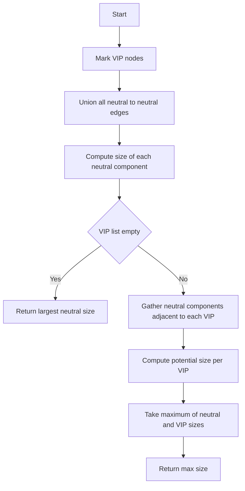

# GRP-012: Exam Seating Rooms with VIP Isolation

## 📋 Problem Summary

You are given a graph of students and friendships. Some students are **VIPs**. You must remove the **minimum number of edges** such that no two VIPs belong to the same connected component. After doing so, return the **size of the largest remaining connected component**.

## 🌍 Real-World Scenario

**Scenario Title:** Secure Conference Zones

You are organizing a high-security summit.
-   **Nodes:** Delegates.
-   **Edges:** Professional connections (they want to network).
-   **VIPs:** Heads of State.

**Constraint:** For security, no two Heads of State can be in the same "networking zone" (connected component).
**Goal:** You want to keep as many connections as possible to facilitate networking, but you must cut connections to isolate the Heads of State from each other.
**Metric:** What is the size of the largest resulting networking zone?

## Detailed Explanation

### Flow Diagram: Isolating VIPs

VIPs get the velvet rope treatment: no two can share a room, but everyone else can mingle.

<!-- mermaid -->

**Initial Graph:**
```
(VIP1) -- A -- B -- (VIP2)
          |
          C
```
**VIPs:** {VIP1, VIP2}

**Analysis:**
-   VIP1 and VIP2 are connected via A and B. We must cut this path.
-   We want to remove *minimum* edges. This implies we keep *maximum* edges.
-   We can keep `(VIP1, A)` and `(A, C)`.
-   We can keep `(B, VIP2)`.
-   We MUST cut `(A, B)` to separate the groups.
-   **Resulting Components:**
    1.  `{VIP1, A, C}` (Size 3)
    2.  `{VIP2, B}` (Size 2)
-   **Max Size:** 3.

Alternatively, if we gave `{A, B, C}` all to VIP2:
-   Components: `{VIP1}`, `{VIP2, A, B, C}` (Size 4).
-   This requires cutting `(VIP1, A)`.
-   Max Size: 4.

**Conclusion:** To maximize the largest component, we should greedily attach the "neutral" (non-VIP) components to the VIP that allows for the biggest group.
### Algorithm: DSU + Greedy

1.  **Identify Node Types:**
    -   **VIP Nodes:** Cannot be merged with each other.
    -   **Neutral Nodes:** Can be merged with each other freely.

2.  **Step 1: Process Neutral-Neutral Edges**
    -   Use Union-Find (DSU) to merge all connected neutral nodes.
    -   Ignore edges connected to VIPs for now.
    -   Result: A set of "Neutral Components" (blobs of non-VIP students).

3.  **Step 2: Connect Neutral Components to VIPs**
    -   Iterate through edges connecting a VIP to a Neutral Node.
    -   For each VIP, identify which Neutral Components it is directly connected to.
    -   Calculate the potential size of the component if this VIP "claims" all its neighboring Neutral Components.
    -   `Potential Size = 1 (the VIP itself) + sum(size of all adjacent Neutral Components)`.

4.  **Step 3: Find Maximum**
    -   The answer is the maximum of:
        -   The size of any purely Neutral Component (in case it's larger than any VIP group).
        -   The maximum "Potential Size" calculated for any VIP.

### Why this works?
Since we want to maximize the *single largest component*, we can imagine picking one "Winner VIP" and letting it keep ALL its adjacent neutral neighbors. For all other VIPs, it doesn't matter if they keep their neighbors or not, because we only care about the maximum size.

## ✅ Input/Output Clarifications (Read This Before Coding)

-   **Input:** `n`, `m`, list of edges, list of VIPs.
-   **Output:** Integer (max component size).
-   **VIPs:** Can be 0 to n. If 0 VIPs, return size of largest component in original graph.
-   **Edges:** Undirected.

## Optimal Approach

### Time Complexity

-   **O(M * α(N))**: Processing edges with DSU.
-   **O(N + M)**: Calculating sizes and iterating adjacency.
-   **Total:** O(M * α(N)).

### Space Complexity

-   **O(N)**: DSU arrays and auxiliary storage.

## Implementations

### Java
```java
import java.util.*;

class Solution {
    private int[] parent;
    private int[] size;

    private int find(int i) {
        if (parent[i] == i) return i;
        return parent[i] = find(parent[i]);
    }

    private void union(int i, int j) {
        int rootI = find(i);
        int rootJ = find(j);
        if (rootI != rootJ) {
            parent[rootI] = rootJ;
            size[rootJ] += size[rootI];
        }
    }

    public int maxComponentSize(int n, List<int[]> edges, Set<Integer> vips) {
        parent = new int[n];
        size = new int[n];
        for (int i = 0; i < n; i++) {
            parent[i] = i;
            size[i] = 1;
        }

        // 1. Union all Non-VIP to Non-VIP edges
        for (int[] edge : edges) {
            int u = edge[0];
            int v = edge[1];
            if (!vips.contains(u) && !vips.contains(v)) {
                union(u, v);
            }
        }

        // 2. Calculate max size for purely neutral components
        int maxComp = 0;
        for (int i = 0; i < n; i++) {
            if (!vips.contains(i) && parent[i] == i) {
                maxComp = Math.max(maxComp, size[i]);
            }
        }
        
        // If no VIPs, the answer is just the largest component
        if (vips.isEmpty()) return maxComp;

        // 3. For each VIP, sum up sizes of adjacent neutral components
        // Map VIP -> Set of adjacent neutral roots (Set to avoid double counting)
        Map<Integer, Set<Integer>> vipNeighbors = new HashMap<>();
        for (int vip : vips) vipNeighbors.put(vip, new HashSet<>());

        for (int[] edge : edges) {
            int u = edge[0];
            int v = edge[1];
            boolean uVip = vips.contains(u);
            boolean vVip = vips.contains(v);

            if (uVip && !vVip) {
                vipNeighbors.get(u).add(find(v));
            } else if (!uVip && vVip) {
                vipNeighbors.get(v).add(find(u));
            }
        }

        for (int vip : vips) {
            int currentSize = 1; // The VIP itself
            for (int root : vipNeighbors.get(vip)) {
                currentSize += size[root];
            }
            maxComp = Math.max(maxComp, currentSize);
        }

        return maxComp;
    }
}

class Main {
    public static void main(String[] args) {
        Scanner sc = new Scanner(System.in);
        if (!sc.hasNextInt()) return;
        int n = sc.nextInt();
        int m = sc.nextInt();
        
        List<int[]> edges = new ArrayList<>();
        for (int i = 0; i < m; i++) {
            int u = sc.nextInt();
            int v = sc.nextInt();
            edges.add(new int[]{u, v});
        }
        
        Set<Integer> vips = new HashSet<>();
        if (sc.hasNextLine()) sc.nextLine(); // Consume newline
        if (sc.hasNextLine()) {
            String line = sc.nextLine();
            Scanner lineSc = new Scanner(line);
            while (lineSc.hasNextInt()) {
                vips.add(lineSc.nextInt());
            }
            lineSc.close();
        }
        
        Solution solution = new Solution();
        System.out.println(solution.maxComponentSize(n, edges, vips));
        sc.close();
    }
}
```

### Python
```python
import sys
sys.setrecursionlimit(200000)

class DSU:
    def __init__(self, n):
        self.parent = list(range(n))
        self.size = [1] * n
        
    def find(self, i):
        if self.parent[i] != i:
            self.parent[i] = self.find(self.parent[i])
        return self.parent[i]
    
    def union(self, i, j):
        root_i = self.find(i)
        root_j = self.find(j)
        if root_i != root_j:
            self.parent[root_i] = root_j
            self.size[root_j] += self.size[root_i]
            return True
        return False

def max_component_size(n: int, edges: list[tuple[int, int]], vips: set[int]) -> int:
    dsu = DSU(n)
    
    # 1. Union Non-VIP to Non-VIP
    for u, v in edges:
        if u not in vips and v not in vips:
            dsu.union(u, v)
            
    max_comp = 0
    # 2. Check purely neutral components
    for i in range(n):
        if i not in vips and dsu.parent[i] == i:
            max_comp = max(max_comp, dsu.size[i])
            
    if not vips:
        return max_comp
        
    # 3. Check VIP augmented components
    vip_neighbors = {v: set() for v in vips}
    
    for u, v in edges:
        u_vip = u in vips
        v_vip = v in vips
        
        if u_vip and not v_vip:
            vip_neighbors[u].add(dsu.find(v))
        elif not u_vip and v_vip:
            vip_neighbors[v].add(dsu.find(u))
            
    for vip in vips:
        current_size = 1
        for root in vip_neighbors[vip]:
            current_size += dsu.size[root]
        max_comp = max(max_comp, current_size)
        
    return max_comp

def main():
    input = sys.stdin.read
    data = input().split()
    if not data:
        return
    
    iterator = iter(data)
    try:
        n = int(next(iterator))
        m = int(next(iterator))
        
        edges = []
        for _ in range(m):
            u = int(next(iterator))
            v = int(next(iterator))
            edges.append((u, v))
            
        vips = set()
        # Remaining tokens are VIPs
        for token in iterator:
            vips.add(int(token))
            
        print(max_component_size(n, edges, vips))
    except StopIteration:
        pass

if __name__ == "__main__":
    main()
```

### C++
```cpp
#include <iostream>
#include <vector>
#include <numeric>
#include <unordered_set>
#include <algorithm>
#include <sstream>

using namespace std;

class DSU {
public:
    vector<int> parent;
    vector<int> size;
    
    DSU(int n) {
        parent.resize(n);
        iota(parent.begin(), parent.end(), 0);
        size.assign(n, 1);
    }
    
    int find(int i) {
        if (parent[i] == i) return i;
        return parent[i] = find(parent[i]);
    }
    
    void unite(int i, int j) {
        int root_i = find(i);
        int root_j = find(j);
        if (root_i != root_j) {
            parent[root_i] = root_j;
            size[root_j] += size[root_i];
        }
    }
};

class Solution {
public:
    int maxComponentSize(int n, vector<pair<int, int>>& edges, unordered_set<int>& vips) {
        DSU dsu(n);
        
        // 1. Union Non-VIP to Non-VIP
        for (const auto& edge : edges) {
            if (vips.find(edge.first) == vips.end() && vips.find(edge.second) == vips.end()) {
                dsu.unite(edge.first, edge.second);
            }
        }
        
        int max_comp = 0;
        // 2. Purely neutral
        for (int i = 0; i < n; i++) {
            if (vips.find(i) == vips.end() && dsu.parent[i] == i) {
                max_comp = max(max_comp, dsu.size[i]);
            }
        }
        
        if (vips.empty()) return max_comp;
        
        // 3. VIP augmented
        // Use vector of sets or similar. Since N is 10^5, map might be slow? 
        // But VIPs are subset of N.
        // Let's use adjacency list for VIPs -> roots
        vector<vector<int>> vip_adj(n); 
        
        for (const auto& edge : edges) {
            int u = edge.first;
            int v = edge.second;
            bool u_vip = vips.count(u);
            bool v_vip = vips.count(v);
            
            if (u_vip && !v_vip) {
                vip_adj[u].push_back(dsu.find(v));
            } else if (!u_vip && v_vip) {
                vip_adj[v].push_back(dsu.find(u));
            }
        }
        
        for (int i = 0; i < n; i++) {
            if (vips.count(i)) {
                int current_size = 1;
                sort(vip_adj[i].begin(), vip_adj[i].end());
                vip_adj[i].erase(unique(vip_adj[i].begin(), vip_adj[i].end()), vip_adj[i].end());
                
                for (int root : vip_adj[i]) {
                    current_size += dsu.size[root];
                }
                max_comp = max(max_comp, current_size);
            }
        }
        
        return max_comp;
    }
};

int main() {
    ios::sync_with_stdio(false);
    cin.tie(nullptr);
    
    int n, m;
    if (!(cin >> n >> m)) return 0;
    
    vector<pair<int, int>> edges(m);
    for (int i = 0; i < m; i++) {
        cin >> edges[i].first >> edges[i].second;
    }
    
    unordered_set<int> vips;
    string line;
    getline(cin >> ws, line); // consume rest of line and read next
    stringstream ss(line);
    int vip;
    while (ss >> vip) {
        vips.insert(vip);
    }
    
    Solution solution;
    cout << solution.maxComponentSize(n, edges, vips) << "\n";
    
    return 0;
}
```

### JavaScript
```javascript
const readline = require("readline");

class DSU {
  constructor(n) {
    this.parent = Array.from({ length: n }, (_, i) => i);
    this.size = Array(n).fill(1);
  }
  
  find(i) {
    if (this.parent[i] !== i) {
      this.parent[i] = this.find(this.parent[i]);
    }
    return this.parent[i];
  }
  
  union(i, j) {
    const rootI = this.find(i);
    const rootJ = this.find(j);
    if (rootI !== rootJ) {
      this.parent[rootI] = rootJ;
      this.size[rootJ] += this.size[rootI];
    }
  }
}

class Solution {
  maxComponentSize(n, edges, vips) {
    const dsu = new DSU(n);
    const vipSet = new Set(vips);
    
    // 1. Union Non-VIP to Non-VIP
    for (const [u, v] of edges) {
      if (!vipSet.has(u) && !vipSet.has(v)) {
        dsu.union(u, v);
      }
    }
    
    let maxComp = 0;
    // 2. Purely neutral
    for (let i = 0; i < n; i++) {
      if (!vipSet.has(i) && dsu.parent[i] === i) {
        maxComp = Math.max(maxComp, dsu.size[i]);
      }
    }
    
    if (vipSet.size === 0) return maxComp;
    
    // 3. VIP augmented
    const vipNeighbors = new Map();
    for (const vip of vips) vipNeighbors.set(vip, new Set());
    
    for (const [u, v] of edges) {
      const uVip = vipSet.has(u);
      const vVip = vipSet.has(v);
      
      if (uVip && !vVip) {
        vipNeighbors.get(u).add(dsu.find(v));
      } else if (!uVip && vVip) {
        vipNeighbors.get(v).add(dsu.find(u));
      }
    }
    
    for (const [vip, roots] of vipNeighbors) {
      let currentSize = 1;
      for (const root of roots) {
        currentSize += dsu.size[root];
      }
      maxComp = Math.max(maxComp, currentSize);
    }
    
    return maxComp;
  }
}

const rl = readline.createInterface({
  input: process.stdin,
  output: process.stdout,
});

let data = [];
rl.on("line", (line) => data.push(...line.trim().split(/\s+/)));
rl.on("close", () => {
  if (data.length === 0) return;
  
  let ptr = 0;
  const n = parseInt(data[ptr++], 10);
  const m = parseInt(data[ptr++], 10);
  
  const edges = [];
  for (let i = 0; i < m; i++) {
    const u = parseInt(data[ptr++], 10);
    const v = parseInt(data[ptr++], 10);
    edges.push([u, v]);
  }
  
  const vips = [];
  while (ptr < data.length) {
    vips.push(parseInt(data[ptr++], 10));
  }
  
  const solution = new Solution();
  console.log(solution.maxComponentSize(n, edges, vips));
});
```

## 🧪 Test Case Walkthrough (Dry Run)

**Input:**
```
5
3
0 1
1 2
3 4
2 3
```
**VIPs:** {2, 3}

1.  **Edges:** (0,1), (1,2), (3,4).
2.  **Non-VIPs:** {0, 1, 4}.
3.  **Step 1 (Neutral-Neutral):**
    -   (0,1): Both non-VIP. Union(0,1). Comp {0,1}, size 2.
    -   (1,2): 2 is VIP. Skip.
    -   (3,4): 3 is VIP. Skip.
    -   (0,1): Union. {0,1} size 2.
            -   (1,2): Skip (2 is VIP).
            -   (3,4): Skip (3 is VIP).
        -   **Step 2 (VIP Neighbors):**
            -   VIP 2: Connected to 1 (root 0). Neighbors = {0}.
            -   VIP 3: Connected to 4 (root 4). Neighbors = {4}.
        -   **Step 3 (Max Size):**
            -   VIP 2: 1 + size({0,1}) = 1 + 2 = 3.
            -   VIP 3: 1 + size({4}) = 1 + 1 = 2.
            -   Max = 3.
    -   **Matches Example Output (3).**

## ✅ Proof of Correctness

-   **Separation:** We never merge two VIPs because we only merge Neutral-Neutral, and then attach Neutrals to *one* VIP.
-   **Maximality:** We greedily assign all available neutral neighbors to each VIP and take the maximum. Since neutral components are disjoint and can be assigned independently to any *one* VIP neighbor, checking the max potential size for each VIP covers the optimal case.

### Common Mistakes to Avoid

1.  **Merging VIPs:** Accidentally unioning a VIP with another node before checking.
2.  **Double Counting:** If a VIP connects to multiple nodes in the *same* neutral component, ensure you only add that component's size once (use a Set of roots).
3.  **Ignoring Pure Neutral:** If there are no VIPs, the answer is just the largest component.
