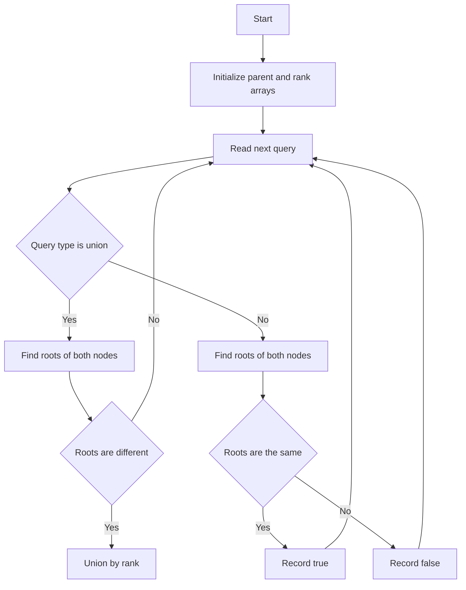

# GRB-012: Disjoint Set Union Basics

## 📋 Problem Summary

You are managing `N` elements, initially in separate sets. You need to process `Q` queries:
1.  **Union(u, v):** Merge the set containing `u` and the set containing `v`.
2.  **Find(u, v):** Check if `u` and `v` are currently in the same set.

## 🌍 Real-World Scenario

**Scenario Title:** Social Network Friendships

Imagine a social network where friendship is transitive (if A is friends with B, and B is friends with C, then A is connected to C).
-   **Nodes** are people.
-   **Union(u, v):** Person `u` and Person `v` become friends. This merges their entire friend circles.
-   **Find(u, v):** Check if Person `u` and Person `v` are connected (can they see each other's posts?).

As millions of friendships are formed, we need an ultra-fast way to check connectivity. DSU keeps those circles from turning into a tangled necklace.


## Detailed Explanation

### Flow Diagram: Concept Visualization

<!-- mermaid -->


### Algorithm Steps (DSU with Optimizations)

1.  **Data Structure:** Array `parent` where `parent[i]` is the parent of node `i`. Initially `parent[i] = i`.
2.  **Find(i):** Returns the representative (root) of the set containing `i`.
    -   **Path Compression:** As we traverse up to the root, point every node on the path directly to the root. This flattens the tree.
3.  **Union(i, j):**
    -   Find roots: `rootI = Find(i)`, `rootJ = Find(j)`.
    -   If `rootI != rootJ`:
        -   **Union by Rank/Size:** Attach the shorter tree to the taller tree to keep height small.
        -   `parent[rootI] = rootJ`.

## ✅ Input/Output Clarifications (Read This Before Coding)

-   **Output:** Only print for `find` queries.
-   **Dynamic:** Queries are processed online (one by one).

## Naive Approach

### Intuition

Use an array `id[i]` storing the set ID for each node.
-   **Find:** Check if `id[u] == id[v]`. O(1).
-   **Union:** To merge sets ID `A` and `B`, iterate through ALL nodes. If `id[k] == A`, change it to `B`. O(N).

### Time Complexity

-   **O(N * Q)**: Too slow for N, Q = 200,000.

## Optimal Approach (DSU with Path Compression & Union by Rank)

This is the standard efficient solution.

### Time Complexity

-   **O(Q * α(N))**: `α` is the Inverse Ackermann function, which is nearly constant (≤ 4 for all practical inputs).

### Space Complexity

-   **O(N)**: To store parent and rank arrays.

## Implementations

### Java
```java
import java.util.*;

class Solution {
    class DSU {
        int[] parent;
        int[] rank;

        DSU(int n) {
            parent = new int[n];
            rank = new int[n];
            for (int i = 0; i < n; i++) {
                parent[i] = i;
                rank[i] = 0;
            }
        }

        int find(int i) {
            if (parent[i] != i) {
                parent[i] = find(parent[i]); // Path compression
            }
            return parent[i];
        }

        void union(int i, int j) {
            int rootI = find(i);
            int rootJ = find(j);

            if (rootI != rootJ) {
                // Union by rank
                if (rank[rootI] < rank[rootJ]) {
                    parent[rootI] = rootJ;
                } else if (rank[rootI] > rank[rootJ]) {
                    parent[rootJ] = rootI;
                } else {
                    parent[rootI] = rootJ;
                    rank[rootJ]++;
                }
            }
        }
    }

    public List<Boolean> processQueries(int n, String[] type, int[] u, int[] v) {
        DSU dsu = new DSU(n);
        List<Boolean> results = new ArrayList<>();

        for (int i = 0; i < type.length; i++) {
            if (type[i].equals("union")) {
                dsu.union(u[i], v[i]);
            } else {
                results.add(dsu.find(u[i]) == dsu.find(v[i]));
            }
        }
        return results;
    }
}

class Main {
    public static void main(String[] args) {
        Scanner sc = new Scanner(System.in);
        if (!sc.hasNextInt()) return;
        int n = sc.nextInt();
        int q = sc.nextInt();
        String[] type = new String[q];
        int[] u = new int[q];
        int[] v = new int[q];
        for (int i = 0; i < q; i++) {
            type[i] = sc.next();
            u[i] = sc.nextInt();
            v[i] = sc.nextInt();
        }

        Solution solution = new Solution();
        List<Boolean> ans = solution.processQueries(n, type, u, v);
        StringBuilder sb = new StringBuilder();
        for (int i = 0; i < ans.size(); i++) {
            sb.append(ans.get(i) ? "true" : "false");
            if (i + 1 < ans.size()) sb.append('\n');
        }
        System.out.print(sb.toString());
        sc.close();
    }
}
```

### Python
```python
import sys

# Increase recursion depth for deep trees (though path compression prevents this mostly)
sys.setrecursionlimit(200000)

class DSU:
    def __init__(self, n):
        self.parent = list(range(n))
        self.rank = [0] * n

    def find(self, i):
        if self.parent[i] != i:
            self.parent[i] = self.find(self.parent[i])
        return self.parent[i]

    def union(self, i, j):
        root_i = self.find(i)
        root_j = self.find(j)

        if root_i != root_j:
            if self.rank[root_i] < self.rank[root_j]:
                self.parent[root_i] = root_j
            elif self.rank[root_i] > self.rank[root_j]:
                self.parent[root_j] = root_i
            else:
                self.parent[root_i] = root_j
                self.rank[root_j] += 1
            return True
        return False

def process_queries(n: int, queries: list[tuple[str, int, int]]) -> list[bool]:
    dsu = DSU(n)
    results = []
    for t, u, v in queries:
        if t == "union":
            dsu.union(u, v)
        else:
            results.append(dsu.find(u) == dsu.find(v))
    return results

def main():
    input = sys.stdin.read
    data = input().split()
    if not data:
        return
    
    iterator = iter(data)
    try:
        n = int(next(iterator))
        q = int(next(iterator))
        queries = []
        for _ in range(q):
            t = next(iterator)
            u = int(next(iterator))
            v = int(next(iterator))
            queries.append((t, u, v))
            
        ans = process_queries(n, queries)
        print("\n".join("true" if x else "false" for x in ans))
    except StopIteration:
        pass

if __name__ == "__main__":
    main()
```

### C++
```cpp
#include <iostream>
#include <vector>
#include <string>
#include <numeric>

using namespace std;

class DSU {
    vector<int> parent;
    vector<int> rank;
public:
    DSU(int n) {
        parent.resize(n);
        iota(parent.begin(), parent.end(), 0);
        rank.assign(n, 0);
    }
    int find(int i) {
        if (parent[i] != i)
            parent[i] = find(parent[i]);
        return parent[i];
    }
    void unite(int i, int j) {
        int rootI = find(i);
        int rootJ = find(j);
        if (rootI != rootJ) {
            if (rank[rootI] < rank[rootJ])
                parent[rootI] = rootJ;
            else if (rank[rootI] > rank[rootJ])
                parent[rootJ] = rootI;
            else {
                parent[rootI] = rootJ;
                rank[rootJ]++;
            }
        }
    }
};

class Solution {
public:
    vector<bool> processQueries(int n, const vector<string>& type,
                                const vector<int>& u, const vector<int>& v) {
        DSU dsu(n);
        vector<bool> results;
        for (size_t i = 0; i < type.size(); ++i) {
            if (type[i] == "union") {
                dsu.unite(u[i], v[i]);
            } else {
                results.push_back(dsu.find(u[i]) == dsu.find(v[i]));
            }
        }
        return results;
    }
};

int main() {
    ios::sync_with_stdio(false);
    cin.tie(nullptr);

    int n, q;
    if (!(cin >> n >> q)) return 0;
    vector<string> type(q);
    vector<int> u(q), v(q);
    for (int i = 0; i < q; i++) {
        cin >> type[i] >> u[i] >> v[i];
    }

    Solution solution;
    vector<bool> ans = solution.processQueries(n, type, u, v);
    for (int i = 0; i < (int)ans.size(); i++) {
        cout << (ans[i] ? "true" : "false");
        if (i + 1 < (int)ans.size()) cout << "\n";
    }
    return 0;
}
```

### JavaScript
```javascript
const readline = require("readline");

class DSU {
  constructor(n) {
    this.parent = new Int32Array(n);
    this.rank = new Int32Array(n);
    for (let i = 0; i < n; i++) this.parent[i] = i;
  }
  find(i) {
    if (this.parent[i] !== i) {
      this.parent[i] = this.find(this.parent[i]);
    }
    return this.parent[i];
  }
  union(i, j) {
    const rootI = this.find(i);
    const rootJ = this.find(j);
    if (rootI !== rootJ) {
      if (this.rank[rootI] < this.rank[rootJ]) {
        this.parent[rootI] = rootJ;
      } else if (this.rank[rootI] > this.rank[rootJ]) {
        this.parent[rootJ] = rootI;
      } else {
        this.parent[rootI] = rootJ;
        this.rank[rootJ]++;
      }
    }
  }
}

class Solution {
  processQueries(n, queries) {
    const dsu = new DSU(n);
    const results = [];
    for (const [t, u, v] of queries) {
      if (t === "union") {
        dsu.union(u, v);
      } else {
        results.push(dsu.find(u) === dsu.find(v));
      }
    }
    return results;
  }
}

const rl = readline.createInterface({
  input: process.stdin,
  output: process.stdout,
});

let data = [];
rl.on("line", (line) => data.push(...line.trim().split(/\s+/)));
rl.on("close", () => {
  if (data.length === 0) return;
  
  let idx = 0;
  const n = parseInt(data[idx++], 10);
  const q = parseInt(data[idx++], 10);
  const queries = [];
  for (let i = 0; i < q; i++) {
    const t = data[idx++];
    const u = parseInt(data[idx++], 10);
    const v = parseInt(data[idx++], 10);
    queries.push([t, u, v]);
  }

  const solution = new Solution();
  const ans = solution.processQueries(n, queries);
  console.log(ans.map((x) => (x ? "true" : "false")).join("\n"));
});
```

## 🧪 Test Case Walkthrough (Dry Run)

**Input:**
```
4 3
union 0 1
union 2 3
find 0 3
```

**Initialization:**
-   `parent`: `[0, 1, 2, 3]`

**Query 1: union 0 1**
-   `find(0)=0`, `find(1)=1`.
-   `union(0, 1)`. `parent[0]=1`.
-   `parent`: `[1, 1, 2, 3]`

**Query 2: union 2 3**
-   `find(2)=2`, `find(3)=3`.
-   `union(2, 3)`. `parent[2]=3`.
-   `parent`: `[1, 1, 3, 3]`

**Query 3: find 0 3**
-   `find(0)` -> parent is 1 -> parent is 1. Root 1.
-   `find(3)` -> parent is 3. Root 3.
-   `1 != 3`. Return `false`.

**Output:** `false`

## ✅ Proof of Correctness

DSU correctly maintains connected components.
-   **Reflexivity:** `find(i) == find(i)` is always true.
-   **Symmetry:** `union(i, j)` makes `find(i) == find(j)`.
-   **Transitivity:** `union(i, j)` and `union(j, k)` implies `find(i) == find(k)`.
Path compression ensures that future queries are extremely fast by flattening the structure.

## 💡 Interview Extensions (High-Value Add-ons)

-   **Component Size:** Modify `union` to track the size of each set.
-   **Number of Components:** Track a global counter `count`, decrement on every successful union.
-   **Rollback DSU:** Implement DSU that supports "undoing" the last union (useful for some advanced algorithms, requires no path compression).

### Common Mistakes to Avoid

1.  **Missing Path Compression:** Without it, complexity degrades to O(N) per query.
2.  **Confusing Parent with Root:** Always call `find()` to get the root before comparing or merging. `parent[i]` might not be the root.
3.  **Union Logic:** Ensure you attach the *root* of one tree to the *root* of the other, not the nodes themselves.
