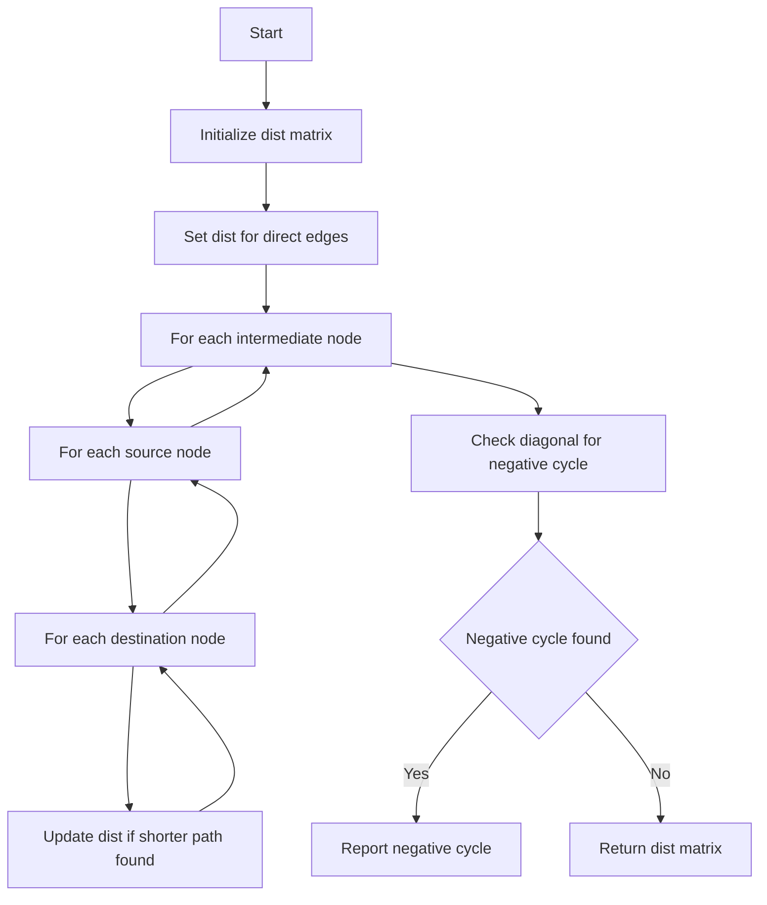

# GRB-015: Floyd-Warshall All-Pairs

## 📋 Problem Summary

Given a directed weighted graph (represented as an adjacency matrix), compute the shortest path distance between **every pair of nodes**.
-   If a **negative cycle** exists, output `NEGATIVE CYCLE`.
-   Otherwise, output the `N x N` distance matrix.

## 🌍 Real-World Scenario

**Scenario Title:** Airline Routing

Imagine you are building a flight booking system.
-   **Nodes** are airports.
-   **Edges** are direct flights with costs.
-   **Goal:** A user might want to fly from *any* airport A to *any* airport B. You need a pre-computed table of the cheapest possible routes between all pairs of cities.
-   Floyd-Warshall computes this entire table in one go, allowing instant lookups for "Cheapest flight from NYC to London".


## Detailed Explanation

### Flow Diagram: Concept Visualization

<!-- mermaid -->


### Algorithm Steps

1.  **Initialize:** `dist[i][j]` is the weight of edge `i->j`, or infinity if no edge. `dist[i][i] = 0`.
2.  **Triple Loop:**
    -   `for k from 0 to n-1`: (Intermediate node)
        -   `for i from 0 to n-1`: (Source)
            -   `for j from 0 to n-1`: (Destination)
                -   `dist[i][j] = min(dist[i][j], dist[i][k] + dist[k][j])`
3.  **Negative Cycle Check:**
    -   After the loops, check if any `dist[i][i] < 0`. If so, a negative cycle exists.

## ✅ Input/Output Clarifications (Read This Before Coding)

-   **Input Format:** `-1` represents infinity (no edge). Convert this to a large constant (e.g., `1e15`) internally.
-   **Output Format:** Convert large constants back to `-1`.
-   **Constraints:** N <= 500. O(N^3) is ~1.25 * 10^8 operations, which fits within 2 seconds in C++/Java. Python might be tight but usually passes if optimized (PyPy).

## Naive Approach

### Intuition

Run Bellman-Ford from every node.

### Time Complexity

-   **O(N^2 * M)**: Since M can be N^2, this is O(N^4). Too slow.

## Optimal Approach (Floyd-Warshall)

Dynamic Programming approach. `dp[k][i][j]` = shortest path from `i` to `j` using only nodes `0..k` as intermediates. We optimize space to `dp[i][j]`. It is the travel agent that tries every possible layover.

### Time Complexity

-   **O(N^3)**: Three nested loops.

### Space Complexity

-   **O(N^2)**: Distance matrix.

## Implementations

### Java
```java
import java.util.*;

class Solution {
    public long[][] floydWarshall(long[][] dist) {
        int n = dist.length;
        long INF = 1_000_000_000_000_000L; // 1e15

        // Preprocess: Convert -1 to INF
        for (int i = 0; i < n; i++) {
            for (int j = 0; j < n; j++) {
                if (i != j && dist[i][j] == -1) {
                    dist[i][j] = INF;
                }
            }
        }

        for (int k = 0; k < n; k++) {
            for (int i = 0; i < n; i++) {
                for (int j = 0; j < n; j++) {
                    if (dist[i][k] != INF && dist[k][j] != INF) {
                        dist[i][j] = Math.min(dist[i][j], dist[i][k] + dist[k][j]);
                    }
                }
            }
        }

        // Check for negative cycles
        for (int i = 0; i < n; i++) {
            if (dist[i][i] < 0) return null;
        }

        // Postprocess: Convert INF back to -1
        for (int i = 0; i < n; i++) {
            for (int j = 0; j < n; j++) {
                if (dist[i][j] >= INF / 2) { // Check for large values
                     dist[i][j] = -1;
                }
            }
        }

        return dist;
    }
}

class Main {
    public static void main(String[] args) {
        Scanner sc = new Scanner(System.in);
        if (!sc.hasNextInt()) return;
        int n = sc.nextInt();
        long[][] dist = new long[n][n];
        for (int i = 0; i < n; i++) {
            for (int j = 0; j < n; j++) {
                dist[i][j] = sc.nextLong();
            }
        }

        Solution solution = new Solution();
        long[][] ans = solution.floydWarshall(dist);
        if (ans == null) {
            System.out.print("NEGATIVE CYCLE");
        } else {
            StringBuilder sb = new StringBuilder();
            for (int i = 0; i < n; i++) {
                for (int j = 0; j < n; j++) {
                    if (j > 0) sb.append(' ');
                    sb.append(ans[i][j]);
                }
                if (i + 1 < n) sb.append('\n');
            }
            System.out.print(sb.toString());
        }
        sc.close();
    }
}
```

### Python
```python
import sys

def floyd_warshall(dist: list[list[int]]):
    n = len(dist)
    INF = 10**15
    
    # Preprocess
    for i in range(n):
        for j in range(n):
            if i != j and dist[i][j] == -1:
                dist[i][j] = INF
                
    for k in range(n):
        for i in range(n):
            for j in range(n):
                if dist[i][k] != INF and dist[k][j] != INF:
                    if dist[i][k] + dist[k][j] < dist[i][j]:
                        dist[i][j] = dist[i][k] + dist[k][j]
                        
    # Negative Cycle Check
    for i in range(n):
        if dist[i][i] < 0:
            return None
            
    # Postprocess
    for i in range(n):
        for j in range(n):
            if dist[i][j] >= INF // 2:
                dist[i][j] = -1
                
    return dist

def main():
    input = sys.stdin.read
    data = input().split()
    if not data:
        return
    
    iterator = iter(data)
    try:
        n = int(next(iterator))
        dist = [[0] * n for _ in range(n)]
        for i in range(n):
            for j in range(n):
                dist[i][j] = int(next(iterator))
                
        ans = floyd_warshall(dist)
        if ans is None:
            print("NEGATIVE CYCLE")
        else:
            out = []
            for i in range(n):
                out.append(" ".join(str(x) for x in ans[i]))
            print("\n".join(out))
    except StopIteration:
        pass

if __name__ == "__main__":
    main()
```

### C++
```cpp
#include <iostream>
#include <vector>
#include <algorithm>

using namespace std;

class Solution {
public:
    vector<vector<long long>> floydWarshall(vector<vector<long long>> dist) {
        int n = dist.size();
        long long INF = 1e15;

        for (int i = 0; i < n; i++) {
            for (int j = 0; j < n; j++) {
                if (i != j && dist[i][j] == -1) {
                    dist[i][j] = INF;
                }
            }
        }

        for (int k = 0; k < n; k++) {
            for (int i = 0; i < n; i++) {
                for (int j = 0; j < n; j++) {
                    if (dist[i][k] != INF && dist[k][j] != INF) {
                        if (dist[i][k] + dist[k][j] < dist[i][j]) {
                            dist[i][j] = dist[i][k] + dist[k][j];
                        }
                    }
                }
            }
        }

        for (int i = 0; i < n; i++) {
            if (dist[i][i] < 0) return {};
        }

        for (int i = 0; i < n; i++) {
            for (int j = 0; j < n; j++) {
                if (dist[i][j] >= INF / 2) {
                    dist[i][j] = -1;
                }
            }
        }
        return dist;
    }
};

int main() {
    ios::sync_with_stdio(false);
    cin.tie(nullptr);

    int n;
    if (!(cin >> n)) return 0;
    vector<vector<long long>> dist(n, vector<long long>(n));
    for (int i = 0; i < n; i++) {
        for (int j = 0; j < n; j++) {
            cin >> dist[i][j];
        }
    }

    Solution solution;
    vector<vector<long long>> ans = solution.floydWarshall(dist);
    if (ans.empty()) {
        cout << "NEGATIVE CYCLE";
    } else {
        for (int i = 0; i < n; i++) {
            for (int j = 0; j < n; j++) {
                if (j) cout << ' ';
                cout << ans[i][j];
            }
            if (i + 1 < n) cout << "\n";
        }
    }
    return 0;
}
```

### JavaScript
```javascript
const readline = require("readline");

class Solution {
  floydWarshall(dist) {
    const n = dist.length;
    const INF = 1e15; // Safe large number

    // Preprocess
    for (let i = 0; i < n; i++) {
      for (let j = 0; j < n; j++) {
        if (i !== j && dist[i][j] === -1) {
          dist[i][j] = INF;
        }
      }
    }

    for (let k = 0; k < n; k++) {
      for (let i = 0; i < n; i++) {
        for (let j = 0; j < n; j++) {
          if (dist[i][k] !== INF && dist[k][j] !== INF) {
            if (dist[i][k] + dist[k][j] < dist[i][j]) {
              dist[i][j] = dist[i][k] + dist[k][j];
            }
          }
        }
      }
    }

    // Negative Cycle Check
    for (let i = 0; i < n; i++) {
      if (dist[i][i] < 0) return null;
    }

    // Postprocess
    for (let i = 0; i < n; i++) {
      for (let j = 0; j < n; j++) {
        if (dist[i][j] >= INF / 2) {
          dist[i][j] = -1;
        }
      }
    }

    return dist;
  }
}

const rl = readline.createInterface({
  input: process.stdin,
  output: process.stdout,
});

let data = [];
rl.on("line", (line) => data.push(...line.trim().split(/\s+/)));
rl.on("close", () => {
  if (data.length === 0) return;
  
  let idx = 0;
  const n = parseInt(data[idx++], 10);
  const dist = Array.from({ length: n }, () => new Array(n).fill(0));
  for (let i = 0; i < n; i++) {
    for (let j = 0; j < n; j++) {
      dist[i][j] = parseInt(data[idx++], 10);
    }
  }

  const solution = new Solution();
  const ans = solution.floydWarshall(dist);
  if (ans === null) {
    console.log("NEGATIVE CYCLE");
  } else {
    const out = [];
    for (let i = 0; i < n; i++) {
      out.push(ans[i].join(" "));
    }
    console.log(out.join("\n"));
  }
});
```

## 🧪 Test Case Walkthrough (Dry Run)

**Input:**
```
3
0 1 4
-1 0 2
-1 -1 0
```
**Matrix:**
```
0  1  4
∞  0  2
∞  ∞  0
```
**k=0:** No changes (Row 0 and Col 0 are mostly ∞).
**k=1:**
-   `dist[0][2] = min(4, dist[0][1] + dist[1][2])`
-   `dist[0][2] = min(4, 1 + 2) = 3`.
-   Matrix:
    ```
    0  1  3
    ∞  0  2
    ∞  ∞  0
    ```
**k=2:** No changes.

**Result:** Matches example output.

## ✅ Proof of Correctness

Floyd-Warshall is based on the recurrence:
`dp[k][i][j] = min(dp[k-1][i][j], dp[k-1][i][k] + dp[k-1][k][j])`.
This considers all paths from `i` to `j` using intermediate nodes `{0...k}`. By the time `k=N-1`, we consider all possible intermediate nodes, thus finding the shortest path.

## 💡 Interview Extensions (High-Value Add-ons)

-   **Path Reconstruction:** Store `next[i][j] = k` whenever you update `dist[i][j]`. This allows reconstructing the actual path.
-   **Transitive Closure:** Use boolean OR/AND instead of min/sum to find reachability (Warshall's Algorithm).
-   **Minimax Path:** Minimize the maximum edge weight on the path (modify relaxation logic).

### Common Mistakes to Avoid

1.  **Loop Order:** The loop order MUST be `k` (intermediate), then `i` (source), then `j` (dest). Swapping them breaks the DP state dependency.
2.  **Overflow:** Adding two `INF` values can overflow if not careful. Use `long long` and check for `INF` before adding.
3.  **Negative Cycle Detection:** Simply checking `dist[i][i] < 0` works, but only if you don't care *which* cycle.
