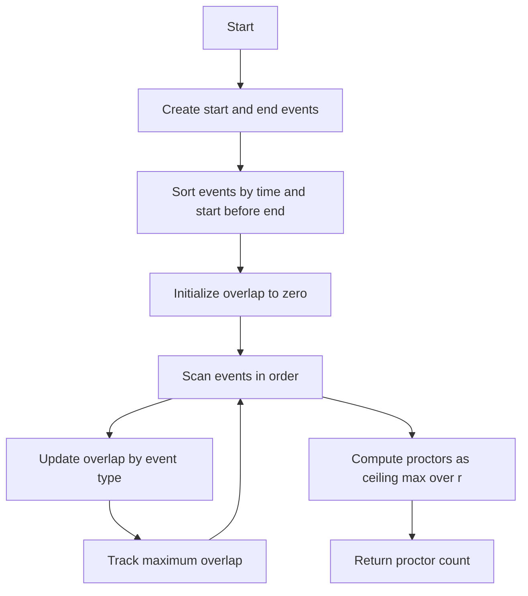

# GRD-008: Exam Proctor Allocation

## 📋 Problem Summary

You are given `n` exam intervals `[start, end]`. A single proctor can supervise up to `r` exams simultaneously. Find the minimum number of proctors required to cover all exams.

## 🌍 Real-World Scenario

**Scenario Title:** Managing University Exam Halls

It's finals week at a large university. There are hundreds of exams scheduled at various times.
- Some exams run from 9 AM to 12 PM.
- Others run from 10 AM to 1 PM.
- A few short ones run from 11 AM to 12:30 PM.

The university has a limited number of invigilators (proctors). Each invigilator can watch over a large hall containing up to `r` distinct exam groups at once (assuming they are in the same room or adjacent sections).
To minimize staffing costs, the administration wants to know the peak demand: What is the maximum number of exams happening at the exact same time? And consequently, how many proctors are needed if each can handle `r` exams?

**Why This Problem Matters:**

- **Resource Dimensioning:** Determining the capacity needed (servers, staff, bandwidth) to handle peak load.
- **Cost Efficiency:** Avoiding over-hiring by understanding the true maximum overlap.


## Detailed Explanation

### Flow Diagram: Timeline of Overlaps

The busiest minute tells you how many proctors to pull from the bench.

<!-- mermaid -->


Exams: A[0-10], B[5-7], C[6-9].
Capacity `r = 2`.

```text
Time: 0 1 2 3 4 5 6 7 8 9 10
      |---------|---------|
A:    [====================]
B:              [====]
C:                [======]

Overlap Count:
T=0 to 5: 1 (A)
T=5 to 6: 2 (A, B)
T=6 to 7: 3 (A, B, C)  <-- PEAK LOAD
T=7 to 9: 2 (A, C)
T=9 to 10: 1 (A)

Max Overlap = 3.
Proctors Needed = ceil(3 / 2) = 2.
```
## ✅ Input/Output Clarifications (Read This Before Coding)

- **Intervals:** `[start, end]` usually means the exam is active during this time.
- **Boundary Conditions:** Does an exam ending at 7 overlap with one starting at 7?
  - Standard interpretation: Yes, if closed intervals `[s, e]`.
  - Or No, if half-open `[s, e)`.
  - **Clarification:** For "maximum overlap" problems, usually if one ends at `t` and another starts at `t`, they overlap at the instant `t`. We should treat start events as happening *before* end events if times are equal to maximize safety (conservative estimate). Or, if the problem implies continuous time, `[start, end]` overlaps `[end, end+k]`.
  - Let's assume inclusive boundaries for safety: Start adds +1, End adds -1. If times are equal, process Start first to see the peak.

## Naive Approach

### Intuition

Create an array representing every minute (or second) of the timeline. Increment counts for each exam. Find max value.

### Algorithm

1. Find min start and max end.
2. Create array `timeline` of size `max_end - min_start + 1`.
3. For each exam `[s, e]`, loop `t` from `s` to `e`: `timeline[t]++`.
4. Find max in `timeline`.

### Time Complexity

- **O(N * MaxTime)**: If exams are long or times are large (`10^9`), this is impossible (TLE/MLE).

### Space Complexity

- **O(MaxTime)**: Too large.

### Limitations

- Depends on coordinate range, not just `N`.

## Optimal Approach

### Key Insight

We only care about the specific points in time where the number of active exams changes: the **Start** and **End** times.
This is the **Sweep Line Algorithm**.

We can visualize moving a vertical line across the timeline.
- When we hit a **Start** time, active exams count increases by 1.
- When we hit an **End** time, active exams count decreases by 1.

### Algorithm

1. **Create Events:** For each exam `[s, e]`:
   - Add event `(s, +1)` (Start)
   - Add event `(e, -1)` (End). *Note: If intervals are inclusive [s, e], the exam effectively ends just after e. So we might use `e` or `e+epsilon` as the end. A common trick for inclusive intervals is to process Start events before End events if times are equal.*
   - **Refinement:** If the problem says `[0, 10]` and `[10, 20]` overlap, then at `t=10`, count should be 2. So process Start (+1) before End (-1).
2. **Sort Events:** Sort by time. If times are equal, put Start (+1) before End (-1).
3. **Sweep:**
   - Initialize `currentOverlap = 0`, `maxOverlap = 0`.
   - Iterate through sorted events:
     - `currentOverlap += type`
     - `maxOverlap = max(maxOverlap, currentOverlap)`
4. **Calculate Result:** `ceil(maxOverlap / r)`.
   - Integer math: `(maxOverlap + r - 1) / r`.

### Time Complexity

- **O(N log N)**: Sorting `2N` events.

### Space Complexity

- **O(N)**: Storing `2N` events.

### Why This Is Optimal

We process every critical point exactly once. We cannot do better than sorting the endpoints because the relative order determines the overlaps.


## Implementations

### Java
```java
import java.util.*;

class Solution {
    public int minProctors(int n, int r, int[][] exams) {
        // Events: time, type (+1 for start, -1 for end)
        // To handle inclusive intervals [start, end] correctly where end overlaps with next start:
        // We want to count overlap at time T.
        // If one starts at T and another ends at T, they overlap.
        // So we should process Start (+1) before End (-1).
        // So we process Start before End.
        // BUT, usually "End" event happens *after* the duration.
        // If the input is [start, end] inclusive, the exam occupies time `end`.
        // So it effectively finishes *after* `end`.
        // Let's treat the events as: Start at `start`, End at `end + epsilon`.
        // Or simply: Sort by time. If times equal, process Start first.
        
        int[][] events = new int[2 * n][2];
        for (int i = 0; i < n; i++) {
            events[2 * i][0] = exams[i][0];
            events[2 * i][1] = 1; // +1 for start
            
            events[2 * i + 1][0] = exams[i][1];
            events[2 * i + 1][1] = -1; // -1 for end
        }
        
        Arrays.sort(events, (a, b) -> {
            if (a[0] != b[0]) return Integer.compare(a[0], b[0]);
            // If times are equal, process Start (+1) before End (-1) to maximize overlap
            // Since +1 > -1, sorting descending by type works? 
            // We want +1 before -1.
            return Integer.compare(b[1], a[1]);
        });
        
        int maxOverlap = 0;
        int currentOverlap = 0;
        
        for (int[] event : events) {
            currentOverlap += event[1];
            maxOverlap = Math.max(maxOverlap, currentOverlap);
        }
        
        // Ceiling division: (a + b - 1) / b
        return (maxOverlap + r - 1) / r;
    }
}

class Main {
    public static void main(String[] args) {
        Scanner sc = new Scanner(System.in);
        if (!sc.hasNextInt()) return;
        
        int n = sc.nextInt();
        int r = sc.nextInt();
        
        int[][] exams = new int[n][2];
        for (int i = 0; i < n; i++) {
            exams[i][0] = sc.nextInt();
            exams[i][1] = sc.nextInt();
        }
        
        Solution solution = new Solution();
        System.out.println(solution.minProctors(n, r, exams));
        sc.close();
    }
}
```

### Python
```python
import sys
import math

def min_proctors(n: int, r: int, exams: list) -> int:
    events = []
    for start, end in exams:
        events.append((start, 1))
        events.append((end, -1))
        
    # Sort events.
    # Primary key: time.
    # Secondary key: type. We want +1 before -1 to maximize overlap at boundaries.
    # In Python sort, (time, -1) comes before (time, 1).
    # So we should use type values that sort correctly, or reverse secondary sort.
    # Let's use type: 1 for start, -1 for end.
    # We want 1 before -1.
    # So sort by (time, -type) or custom key.
    events.sort(key=lambda x: (x[0], -x[1]))
    
    max_overlap = 0
    current_overlap = 0
    
    for _, type_ in events:
        current_overlap += type_
        max_overlap = max(max_overlap, current_overlap)
        
    # Ceiling division
    return (max_overlap + r - 1) // r

def main():
    input = sys.stdin.read
    data = input().split()
    if not data:
        return
        
    iterator = iter(data)
    n = int(next(iterator))
    r = int(next(iterator))
    
    exams = []
    for _ in range(n):
        start = int(next(iterator))
        end = int(next(iterator))
        exams.append([start, end])
    
    result = min_proctors(n, r, exams)
    print(result)

if __name__ == "__main__":
    main()
```

### C++
```cpp
#include <iostream>
#include <vector>
#include <algorithm>
#include <cmath>

using namespace std;

class Solution {
public:
    int minProctors(int n, int r, vector<pair<int,int>>& exams) {
        vector<pair<int,int>> events;
        events.reserve(2 * n);
        
        for (const auto& exam : exams) {
            events.push_back({exam.first, 1});  // Start
            events.push_back({exam.second, -1}); // End
        }
        
        // Sort: Time ascending. If times equal, Start (+1) before End (-1).
        // Since -1 < 1, default sort puts End before Start.
        // We want Start before End. So we need custom comparator.
        sort(events.begin(), events.end(), [](const pair<int,int>& a, const pair<int,int>& b) {
            if (a.first != b.first) return a.first < b.first;
            return a.second > b.second; // 1 > -1, so Start comes first
        });
        
        int maxOverlap = 0;
        int currentOverlap = 0;
        
        for (const auto& event : events) {
            currentOverlap += event.second;
            maxOverlap = max(maxOverlap, currentOverlap);
        }
        
        return (maxOverlap + r - 1) / r;
    }
};

int main() {
    ios::sync_with_stdio(false);
    cin.tie(nullptr);
    
    int n, r;
    if (!(cin >> n >> r)) return 0;
    
    vector<pair<int,int>> exams(n);
    for (int i = 0; i < n; i++) {
        cin >> exams[i].first >> exams[i].second;
    }
    
    Solution solution;
    cout << solution.minProctors(n, r, exams) << "\n";
    
    return 0;
}
```

### JavaScript
```javascript
const readline = require("readline");

class Solution {
  minProctors(n, r, exams) {
    const events = [];
    for (const [start, end] of exams) {
      events.push([start, 1]); // Start
      events.push([end, -1]);  // End
    }
    
    // Sort: Time ascending. If times equal, Start (1) before End (-1).
    events.sort((a, b) => {
      if (a[0] !== b[0]) return a[0] - b[0];
      return b[1] - a[1]; // 1 before -1
    });
    
    let maxOverlap = 0;
    let currentOverlap = 0;
    
    for (const [time, type] of events) {
      currentOverlap += type;
      maxOverlap = Math.max(maxOverlap, currentOverlap);
    }
    
    return Math.ceil(maxOverlap / r);
  }
}

const rl = readline.createInterface({
  input: process.stdin,
  output: process.stdout,
});

let data = [];
rl.on("line", (line) => data.push(line.trim()));
rl.on("close", () => {
  if (data.length === 0) return;
  
  let ptr = 0;
  const [n, r] = data[ptr++].split(" ").map(Number);
  
  const exams = [];
  for (let i = 0; i < n; i++) {
    const [start, end] = data[ptr++].split(" ").map(Number);
    exams.push([start, end]);
  }
  
  const solution = new Solution();
  console.log(solution.minProctors(n, r, exams));
});
```

## 🧪 Test Case Walkthrough (Dry Run)

**Input:**
```
3 2
0 10
5 7
6 9
```

**Events:**
- (0, +1)
- (10, -1)
- (5, +1)
- (7, -1)
- (6, +1)
- (9, -1)

**Sorted Events:**
1. (0, +1) -> Cur: 1, Max: 1
2. (5, +1) -> Cur: 2, Max: 2
3. (6, +1) -> Cur: 3, Max: 3
4. (7, -1) -> Cur: 2
5. (9, -1) -> Cur: 1
6. (10, -1) -> Cur: 0

**Max Overlap:** 3.
**Proctors:** `ceil(3 / 2) = 2`.

**Output:** `2`


## ✅ Proof of Correctness

### Invariant
`currentOverlap` correctly tracks the number of active intervals at the current sweep-line position.

### Why the approach is correct
By sorting events, we simulate the passage of time.
Since we process Start events before End events (at the same time), we capture the maximum instantaneous overlap.
The maximum value of `currentOverlap` encountered is the peak demand.
Dividing peak demand by capacity `r` gives the minimum resources needed.

## 💡 Interview Extensions

- **Extension 1:** What if we want to know *which* exams overlap the most?
  - *Answer:* Track the IDs of active exams in a set. When `currentOverlap` hits max, the set contains the culprits.
- **Extension 2:** What if intervals are circular (e.g., shifts crossing midnight)?
  - *Answer:* Split intervals crossing midnight into `[start, 24]` and `[0, end]`. Or double the timeline.
- **Extension 3:** What if proctors have different capacities?
  - *Answer:* This becomes a bin packing variation (harder).

### Common Mistakes to Avoid

1. **Sorting Order for Ties**
   - ❌ Wrong: Processing End before Start at the same time.
   - ⚠️ Consequence: You might miss the peak overlap if one exam starts exactly when another ends.
   - ✅ Correct: Start (+1) before End (-1).

2. **Off-by-one in Ceiling**
   - ❌ Wrong: `maxOverlap / r`.
   - ✅ Correct: `(maxOverlap + r - 1) / r` or `Math.ceil`.

3. **Coordinate Range**
   - ❌ Wrong: Using an array for time if coordinates are large.
   - ✅ Correct: Use coordinate compression or just sort the events (Sweep Line).

## Related Concepts

- **Sweep Line Algorithm:** Processing events in order.
- **Difference Array:** Similar concept for static ranges.
