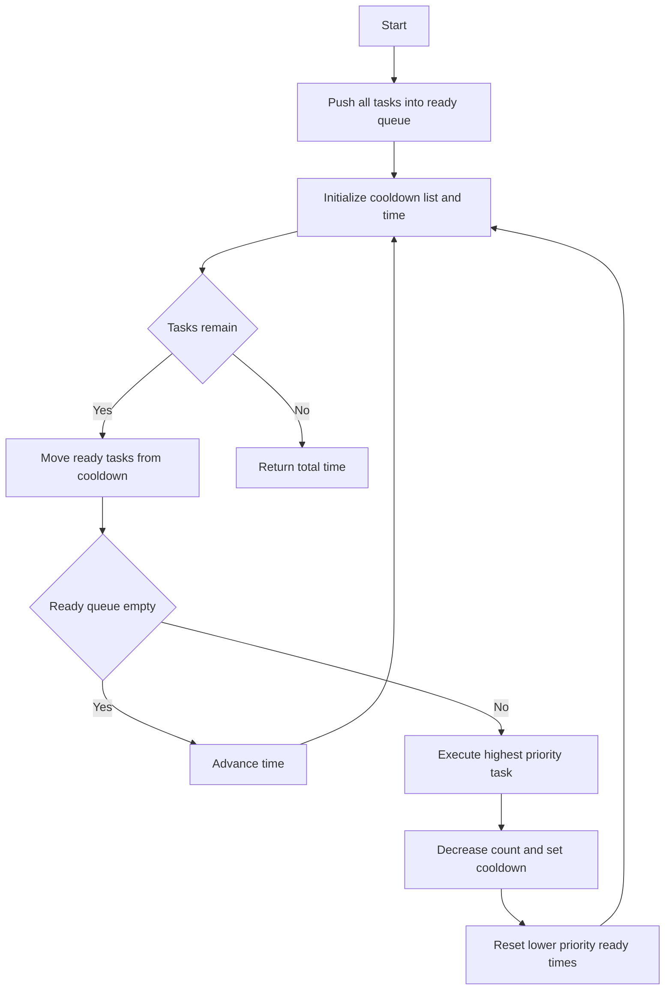

# GRD-012: Workshop Task Cooldown with Priority Interrupts

## 📋 Problem Summary

You need to schedule tasks with specific counts and priority levels.
- **Cooldown:** After executing task X, you must wait `k` slots before executing X again.
- **Priority Interrupt:** If you execute a higher-priority task, it "resets" the cooldown timer for all lower-priority tasks currently waiting. They must wait an *additional* `k` slots from the current time.
- **Goal:** Minimize total time slots (including idle time).

## 🌍 Real-World Scenario

**Scenario Title:** Kitchen Appliance Usage

Imagine a shared kitchen in a dorm.
- **Tasks:** Using the Blender (A), Microwave (B), Toaster (C).
- **Cooldown:** After using an appliance, it needs `k` minutes to cool down before it can be used again.
- **Priority:** The Blender is loud and annoying (High Priority). The Microwave is quiet (Low Priority).
- **Interrupt:** If someone turns on the loud Blender, it disrupts the "cooling down" peace of the room. The Microwave, which was cooling down, gets "stressed" by the noise and its internal safety timer resets—it needs to wait another full `k` minutes after the Blender stops before it's safe to use.

You want to finish all cooking tasks as quickly as possible, managing these sensitive appliances.

**Why This Problem Matters:**

- **Real-time Systems:** High-priority interrupts often delay or reset the state of lower-priority background processes.
- **Resource Contention:** Managing shared resources where "heavy" operations penalize waiting "light" operations.


## Detailed Explanation

### Flow Diagram: The Reset Mechanism

High priority tasks cut the line, and everyone behind them waits again.

<!-- mermaid -->



Tasks: A (Priority 2, Count 2), B (Priority 1, Count 2). `k=2`.

**Without Interrupt Logic (Standard Task Scheduler):**
A _ _ A
B _ _ B
Merged: A B _ A B (Time 5)

**With Priority Interrupt:**
1. **Time 1:** Execute A (P2).
   - A enters cooldown. Ready at `1 + 2 + 1 = 4`.
2. **Time 2:** Execute B (P1).
   - B enters cooldown. Ready at `2 + 2 + 1 = 5`.
3. **Time 3:** Idle. (A ready at 4, B ready at 5).
4. **Time 4:** Execute A (P2).
   - **INTERRUPT!** A (P2) > B (P1).
   - B was waiting (ready at 5). Now B is reset.
   - B must wait `k=2` slots from *now* (Time 4). New Ready Time for B = `4 + 2 + 1 = 7`.
   - A enters cooldown. Ready at `4 + 2 + 1 = 7`.
5. **Time 5:** Idle.
6. **Time 6:** Idle.
7. **Time 7:** Execute B.
   - Done.

Total Time: 7.
## ✅ Input/Output Clarifications (Read This Before Coding)

- **Ready Time:** If a task executes at `T`, and cooldown is `k`, it is ready at `T + k + 1`.
- **Reset Rule:** If task `H` executes at `T`, any task `L` in the cooldown queue with `P_L < P_H` has its ready time updated to `max(current_ready, T + k + 1)`.
- **Idle:** If no task is ready, we wait (Time++).

## Naive Approach

### Intuition

Simulate time step by step. At each step, check all tasks. Pick the best available one.

### Algorithm

1. `time = 1`.
2. While tasks remain:
   - Find all ready tasks.
   - Pick one (highest priority, then max count).
   - If none, `time++`.
   - If picked, update its count and cooldown.
   - **Scan** all other cooling tasks. If `P_other < P_current`, update their ready time.
   - `time++`.

### Time Complexity

- **O(TotalSlots * N)**: In each slot, we scan all tasks.

### Limitations

- If `k` is large, idle times can be huge. We might need to jump time.
- But since interrupts happen *when tasks execute*, we can't easily jump over idle periods if multiple tasks become ready at different times. However, if *no* tasks are ready, we can jump to the earliest ready time.

## Optimal Approach

### Key Insight

We need to efficiently manage two sets of tasks:
1. **Ready Queue:** Tasks available to run now. Prioritize by (Priority DESC, Count DESC).
2. **Cooldown Queue:** Tasks waiting. Ordered by Ready Time.

When we execute a task:
- It moves to Cooldown Queue.
- We check if it causes interrupts.
- Since interrupts only affect *lower* priority tasks, and we always pick the *highest* available priority from the Ready Queue, we need to be careful.
- **Greedy Strategy:** Always pick the highest priority available task? Or the one with most remaining count?
- The problem says "When a higher-priority task is scheduled...". This implies we *decide* the schedule.
- However, usually in such problems, the strategy is fixed: **Always pick the available task that is most "urgent"**.
- Urgency criteria:
  2. **Count:** Tie-breaker.

Let's assume the standard greedy choice: **Among ready tasks, pick highest Priority. Tie-break with highest Count.**

### Algorithm

1. **Ready Queue (Max-Heap):** Stores `(Priority, Count, Name)`.
2. **Cooldown List:** Stores `(ReadyTime, Priority, Count, Name)`.
3. `time = 0`.
4. Loop while `total_tasks > 0`:
   - `time++`.
   - **Check Cooldowns:** Move tasks from Cooldown List to Ready Queue if `ReadyTime <= time`.
   - **Select Task:**
     - If Ready Queue empty: `Idle`.
     - Else: Pop best task `T_curr`.
       - Decrement count.
       - If count > 0, add to Cooldown List with `ReadyTime = time + k + 1`.
       - **Apply Interrupts:**
         - Iterate through Cooldown List.
         - For each task `T_wait`, if `T_wait.Priority < T_curr.Priority`:
           - `T_wait.ReadyTime = max(T_wait.ReadyTime, time + k + 1)`.
           - (Note: This might push it further back).

### Time Complexity

- **O(TotalSlots * N)**: In worst case, we scan the cooldown list (size N) every step.
- Since TotalSlots can be large, is there a faster way?
- With `N <= 26`, scanning is fast. Total tasks `10^5`. `O(10^5 x 26)` is fine (`~= 2.6 x 10^6`).

### Space Complexity

- **O(N)**: Storing tasks.


## Implementations

### Java
```java
import java.util.*;

class Solution {
    static class Task implements Comparable<Task> {
        char name;
        int count;
        int priority;
        int readyTime;

        public Task(char name, int count, int priority) {
            this.name = name;
            this.count = count;
            this.priority = priority;
            this.readyTime = 0;
        }

        @Override
        public int compareTo(Task other) {
            if (this.priority != other.priority) {
                return Integer.compare(other.priority, this.priority); // High priority first
            }
            return Integer.compare(other.count, this.count); // High count first
        }
    }

    public int minSlots(List<Task> inputTasks, int k) {
        PriorityQueue<Task> readyQueue = new PriorityQueue<>();
        List<Task> cooldownList = new ArrayList<>();
        
        for (Task t : inputTasks) {
            readyQueue.offer(t);
        }
        
        int time = 0;
        int tasksRemaining = 0;
        for (Task t : inputTasks) tasksRemaining += t.count;
        
        while (tasksRemaining > 0) {
            time++;
            
            // 1. Move ready tasks from cooldown to readyQueue
            // We need to use an iterator to remove safely
            Iterator<Task> it = cooldownList.iterator();
            while (it.hasNext()) {
                Task t = it.next();
                if (t.readyTime <= time) {
                    readyQueue.offer(t);
                    it.remove();
                }
            }
            
            if (readyQueue.isEmpty()) {
                // IDLE
                continue;
            }
            
            // 2. Pick best task
            Task current = readyQueue.poll();
            current.count--;
            tasksRemaining--;
            
            // 3. Apply Interrupts to Cooldown List
            for (Task t : cooldownList) {
                if (t.priority < current.priority) {
                    t.readyTime = Math.max(t.readyTime, time + k + 1);
                }
            }
            
            // 4. Add current back to cooldown if needed
            if (current.count > 0) {
                current.readyTime = time + k + 1;
                cooldownList.add(current);
            }
        }
        
        return time;
    }
}

class Task {
    char name;
    int count;
    int priority;
    
    Task(char name, int count, int priority) {
        this.name = name;
        this.count = count;
        this.priority = priority;
    }
}

class Main {
    public static void main(String[] args) {
        Scanner sc = new Scanner(System.in);
        if (!sc.hasNextInt()) return;
        int n = sc.nextInt();
        int k = sc.nextInt();

        List<Solution.Task> tasks = new ArrayList<>();
        for (int i = 0; i < n; i++) {
            char name = sc.next().charAt(0);
            int count = sc.nextInt();
            int priority = sc.nextInt();
            tasks.add(new Solution.Task(name, count, priority));
        }

        Solution solution = new Solution();
        System.out.println(solution.minSlots(tasks, k));
        sc.close();
    }
}
```

### Python
```python
import heapq
import sys

class Task:
    def __init__(self, name, count, priority):
        self.name = name
        self.count = count
        self.priority = priority
        self.ready_time = 0
        
    # For heap: High priority first, then High count
    def __lt__(self, other):
        if self.priority != other.priority:
            return self.priority > other.priority
        return self.count > other.count

def min_slots(tasks_data: list, k: int) -> int:
    ready_queue = []
    for name, count, priority in tasks_data:
        heapq.heappush(ready_queue, Task(name, count, priority))
        
    cooldown_list = []
    time = 0
    total_tasks = sum(t[1] for t in tasks_data)
    
    while total_tasks > 0:
        time += 1
        
        # Move ready tasks
        # We must iterate a copy or build a new list because we modify cooldown_list
        next_cooldown = []
        for t in cooldown_list:
            if t.ready_time <= time:
                heapq.heappush(ready_queue, t)
            else:
                next_cooldown.append(t)
        cooldown_list = next_cooldown
        
        if not ready_queue:
            continue
            
        current = heapq.heappop(ready_queue)
        current.count -= 1
        total_tasks -= 1
        
        # Apply Interrupts
        for t in cooldown_list:
            if t.priority < current.priority:
                t.ready_time = max(t.ready_time, time + k + 1)
                
        if current.count > 0:
            current.ready_time = time + k + 1
            cooldown_list.append(current)
            
    return time

def main():
    input = sys.stdin.read
    data = input().split()
    if not data:
        return
        
    iterator = iter(data)
    n = int(next(iterator))
    k = int(next(iterator))
    
    tasks = []
    for _ in range(n):
        name = next(iterator)
        count = int(next(iterator))
        priority = int(next(iterator))
        tasks.append((name, count, priority))

    result = min_slots(tasks, k)
    print(result)

if __name__ == "__main__":
    main()
```

### C++
```cpp
#include <iostream>
#include <vector>
#include <queue>
#include <algorithm>

using namespace std;

struct Task {
    char name;
    int count;
    int priority;
    int readyTime;
    
    // Priority Queue needs operator<
    // We want High Priority first, then High Count
    bool operator<(const Task& other) const {
        if (priority != other.priority) return priority < other.priority;
        return count < other.count;
    }
};

class Solution {
public:
    int minSlots(vector<Task>& inputTasks, int k) {
        priority_queue<Task> readyQueue;
        for(auto t : inputTasks) {
            t.readyTime = 0;
            readyQueue.push(t);
        }
        
        vector<Task> cooldownList;
        int time = 0;
        int tasksRemaining = 0;
        for(auto t : inputTasks) tasksRemaining += t.count;
        
        while(tasksRemaining > 0) {
            time++;
            
            // Move ready tasks
            vector<Task> nextCooldown;
            for(auto& t : cooldownList) {
                if(t.readyTime <= time) {
                    readyQueue.push(t);
                } else {
                    nextCooldown.push_back(t);
                }
            }
            cooldownList = nextCooldown;
            
            if(readyQueue.empty()) {
                continue;
            }
            
            Task current = readyQueue.top();
            readyQueue.pop();
            
            current.count--;
            tasksRemaining--;
            
            // Apply Interrupts
            for(auto& t : cooldownList) {
                if(t.priority < current.priority) {
                    t.readyTime = max(t.readyTime, time + k + 1);
                }
            }
            
            if(current.count > 0) {
                current.readyTime = time + k + 1;
                cooldownList.push_back(current);
            }
        }
        
        return time;
    }
};

int main() {
    ios::sync_with_stdio(false);
    cin.tie(nullptr);

    int n, k;
    if (!(cin >> n >> k)) return 0;

    vector<Task> tasks(n);
    for (int i = 0; i < n; i++) {
        cin >> tasks[i].name >> tasks[i].count >> tasks[i].priority;
    }

    Solution solution;
    cout << solution.minSlots(tasks, k) << "\n";

    return 0;
}
```

### JavaScript
```javascript
const readline = require("readline");

class Task {
  constructor(name, count, priority) {
    this.name = name;
    this.count = count;
    this.priority = priority;
    this.readyTime = 0;
  }
}

class MaxHeap {
  constructor() {
    this.heap = [];
  }
  push(val) {
    this.heap.push(val);
    this._siftUp();
  }
  pop() {
    if (this.size() === 0) return null;
    if (this.size() === 1) return this.heap.pop();
    const max = this.heap[0];
    this.heap[0] = this.heap.pop();
    this._siftDown();
    return max;
  }
  size() {
    return this.heap.length;
  }
  _compare(a, b) {
    if (a.priority !== b.priority) return a.priority - b.priority;
    return a.count - b.count;
  }
  _siftUp() {
    let idx = this.heap.length - 1;
    while (idx > 0) {
      const parentIdx = Math.floor((idx - 1) / 2);
      if (this._compare(this.heap[idx], this.heap[parentIdx]) <= 0) break;
      [this.heap[idx], this.heap[parentIdx]] = [this.heap[parentIdx], this.heap[idx]];
      idx = parentIdx;
    }
  }
  _siftDown() {
    let idx = 0;
    while (idx < this.heap.length) {
      let maxChildIdx = null;
      const left = 2 * idx + 1;
      const right = 2 * idx + 2;
      if (left < this.heap.length) maxChildIdx = left;
      if (right < this.heap.length && this._compare(this.heap[right], this.heap[left]) > 0) {
        maxChildIdx = right;
      }
      if (maxChildIdx === null || this._compare(this.heap[idx], this.heap[maxChildIdx]) >= 0) break;
      [this.heap[idx], this.heap[maxChildIdx]] = [this.heap[maxChildIdx], this.heap[idx]];
      idx = maxChildIdx;
    }
  }
}

class Solution {
  minSlots(tasksData, k) {
    const readyQueue = new MaxHeap();
    for (const t of tasksData) {
      readyQueue.push(new Task(t.name, t.count, t.priority));
    }
    
    let cooldownList = [];
    let time = 0;
    let tasksRemaining = tasksData.reduce((acc, t) => acc + t.count, 0);
    
    while (tasksRemaining > 0) {
      time++;
      
      const nextCooldown = [];
      for (const t of cooldownList) {
        if (t.readyTime <= time) {
          readyQueue.push(t);
        } else {
          nextCooldown.push(t);
        }
      }
      cooldownList = nextCooldown;
      
      if (readyQueue.size() === 0) {
        continue;
      }
      
      const current = readyQueue.pop();
      current.count--;
      tasksRemaining--;
      
      for (const t of cooldownList) {
        if (t.priority < current.priority) {
          t.readyTime = Math.max(t.readyTime, time + k + 1);
        }
      }
      
      if (current.count > 0) {
        current.readyTime = time + k + 1;
        cooldownList.push(current);
      }
    }
    
    return time;
  }
}

const rl = readline.createInterface({
  input: process.stdin,
  output: process.stdout,
});

let data = [];
rl.on("line", (line) => data.push(line.trim()));
rl.on("close", () => {
  if (data.length === 0) return;
  
  let ptr = 0;
  const [n, k] = data[ptr++].split(" ").map(Number);
  
  const tasks = [];
  for (let i = 0; i < n; i++) {
    const parts = data[ptr++].split(" ");
    const name = parts[0];
    const count = parseInt(parts[1]);
    const priority = parseInt(parts[2]);
    tasks.push({ name, count, priority });
  }

  const solution = new Solution();
  console.log(solution.minSlots(tasks, k));
});
```

## 🧪 Test Case Walkthrough (Dry Run)

**Input:**
```
2 1
A 3 2
B 2 1
```
Tasks: A(3, P2), B(2, P1). k=1.

**Time 1:**
- Ready: [A, B]. Pick A (P2).
- A count 2. Cooldown A (Ready 1+1+1=3).
- Cooldown List: [A(3)].
- Interrupts: None.

**Time 2:**
- Ready: [B]. Pick B (P1).
- B count 1. Cooldown B (Ready 2+1+1=4).
- Cooldown List: [A(3), B(4)].
- Interrupts: None (B is P1, A is P2. P2 > P1, so B doesn't interrupt A).

**Time 3:**
- A ready (3 <= 3). Ready: [A].
- Pick A (P2).
- A count 1. Cooldown A (Ready 3+1+1=5).
- Cooldown List: [B(4), A(5)].
- **Interrupts:** A(P2) runs. B(P1) is in cooldown.
  - B.readyTime = max(4, 3+1+1=5). B delayed to 5.
- Cooldown List: [B(5), A(5)].

**Time 4:**
- Ready: []. Idle.

**Time 5:**
- A ready (5<=5), B ready (5<=5). Ready: [A, B].
- Pick A (P2).
- A count 0. Done.
- Cooldown List: [B(5)].
- **Interrupts:** A(P2) runs. B(P1) is in ready queue? No, B was moved to Ready Queue *before* A ran.
  - At start of Time 5, both A and B move to Ready Queue.
  - Ready Queue: [A, B].
  - Pick A.
  - B is in Ready Queue, NOT Cooldown List. So B is NOT interrupted.
  - Correct. Interrupts only affect tasks *waiting in cooldown*.

**Time 6:**
- Ready: [B]. Pick B.
- B count 0. Done.

Total Time: 6.

## ✅ Proof of Correctness

### Invariant
At each step, we pick the highest priority available task. This is a greedy strategy.
With interrupts, we must ensure we correctly delay lower priority tasks.
The state consists of the Ready Queue and Cooldown List.
Since `N` is small (26), simulation is efficient and correct.

## 💡 Interview Extensions

- **Extension 1:** What if `k` is very large?
  - *Answer:* Use event-driven simulation (jump to next `min(ReadyTime)`).
- **Extension 2:** What if priorities are dynamic?
  - *Answer:* Re-heapify.

### Common Mistakes to Avoid

1. **Interrupting Ready Tasks**
   - ❌ Wrong: Applying penalty to tasks in the Ready Queue.
   - ✅ Correct: Only tasks *in cooldown* are affected.

2. **Incorrect Reset Time**
   - ❌ Wrong: `Time + k`.
   - ✅ Correct: `Time + k + 1` (since we need `k` *slots* between).

3. **Starvation**
   - ❌ Wrong: Low priority tasks never running.
   - ✅ Correct: They run when high priority are cooling.

## Related Concepts

- **Operating Systems:** Priority Scheduling with Preemption/Interrupts.
