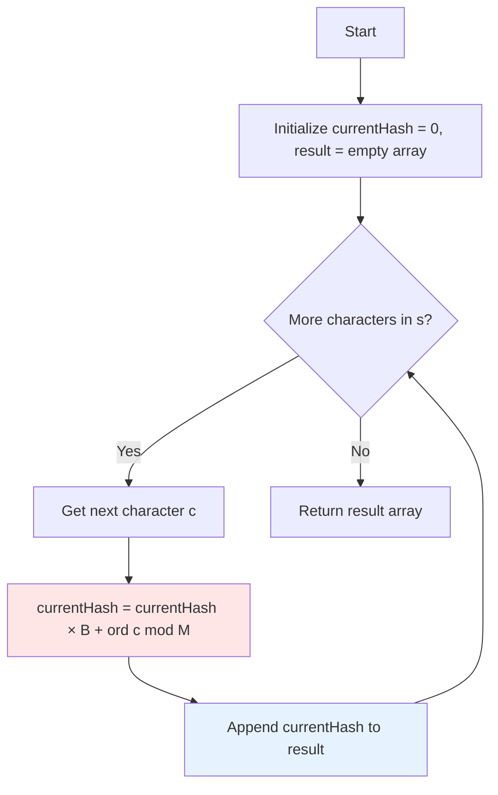

# HSH-001: Polynomial Hash of Prefixes

## 📋 Problem Summary

You are given a string `s` and two integers `B` (base) and `M` (modulus). Your task is to compute the polynomial rolling hash for every prefix of the string.
The hash of a prefix `s[0...i]` is defined recursively:

- `H_0 = s[0] mod M`
- `H_i = (H_{i-1} × B + s[i]) mod M`

## 🌍 Real-World Scenario

**Scenario Title:** The Document Plagiarism Detector 📄

### The Problem
You're building a plagiarism detection system for your university. Professors submit thousands of assignments, and you need to compare each submission against every other submission to find copied content.

- **Naive Approach**: Comparing every pair of documents character-by-character takes forever. For 1000 submissions of 10,000 characters each, that's billions of comparisons!
- **The Bottleneck**: String comparison is slow when done repeatedly.

### Why This Matters
- **Speed**: Converting documents to "fingerprints" (hashes) allows instant comparison. If fingerprints differ, documents are definitely different.
- **Scalability**: Process 10,000 documents in seconds instead of hours.
- **Real Applications**: Google Docs similarity detection, GitHub code duplication checker, anti-spam email filters.

### Constraints in Real World
- **Accuracy**: Must minimize false positives (different docs with same hash).
- **Speed**: Hash computation must be O(N), not O(N²).
- **Memory**: Can't store every possible substring; need efficient representation.

### From Real World to Algorithm
Documents are **Strings**, each prefix is a "partial fingerprint", and we use **Polynomial Rolling Hash** to compute these fingerprints incrementally in O(1) per character.

## Detailed Explanation

### Concept Visualization

The polynomial hash treats a string as a base-B number:
- "abc" = a×B² + b×B¹ + c×B⁰ (reduced modulo M)

We compute this incrementally:
1. Start with hash = 0
2. For each new character: hash = (hash × B + char) mod M


### Algorithm Flow Diagram



## 🎯 Edge Cases to Test

1. **Single Character String**
   - Input: `s = "a"`, `B = 10`, `M = 1000`
   - Expected: `[97]`
   - Why: Validates base case

2. **Empty String**
   - Input: `s = ""`, `B = 10`, `M = 1000`
   - Expected: `[]`
   - Why: Boundary condition

3. **Large Base and Modulus**
   - Input: `s = "abc"`, `B = 10^9 + 7`, `M = 10^9 + 9`
   - Expected: Correct computation without overflow
   - Why: Tests overflow handling

4. **Repeated Characters**
   - Input: `s = "aaaa"`, `B = 31`, `M = 10^9 + 7`
   - Expected: Different hash for each prefix
   - Why: Verifies position matters

5. **Very Long String**
   - Input: `s.length = 200,000`
   - Expected: Completes in < 1 second
   - Why: Performance validation

## ✅ Input/Output Clarifications

- **Input:** String `s`, integers `B` and `M`.
- **Output:** Array of integers where the `i`-th element is the hash of `s[0...i]`.
- **Indexing:** 0-based.
- **Modulo:** All calculations must be modulo `M` to prevent overflow.
- **Character Values:** Use ASCII value via `ord()` or `charAt()`.

## Naive Approach

### Intuition

For each prefix `s[0...i]`, loop from `0` to `i` to compute the polynomial value from scratch.

### Algorithm

1. Loop `i` from 0 to `n-1`.
2. Inside, loop `j` from 0 to `i`.
3. Compute `∑ s[j] × B^{i-j} mod M`.
4. Store result.

### Complexity Visualization

| Approach | Time Complexity | Space Complexity | Feasibility for N=200,000 |
|:---------|:---------------:|:----------------:|:-------------------------:|
| Naive (Recompute each) | O(N²) | O(N) | ❌ TLE (~20 billion ops) |
| Optimal (Rolling Hash) | O(N) | O(N) | ✅ Fast (~200K ops) |

### Why This Fails

Sum of `1 + 2 + ... + N = N(N+1)/2 = O(N²)` operations. For `N = 200,000`, that's 20 billion operations—guaranteed Time Limit Exceeded!

## Optimal Approach (Rolling Hash)

### Key Insight

Use the recursive property:
`H_i = (H_{i-1} × B + s[i]) mod M`

This is the definition of a **Rolling Hash**. We can compute the current hash using only the previous hash and the current character—no need to re-scan earlier characters!

### Algorithm

1. Initialize `current_hash = 0`.
2. Create a result list.
3. Iterate through each character `c` in `s`:
   - `current_hash = (current_hash * B + ASCII(c)) % M`
   - Append `current_hash` to result.
4. Return result.

### Time Complexity

- **O(N)**: One pass through the string, constant work per character.

### Space Complexity

- **O(N)**: To store the output array.

## Implementations

### Java
```java
import java.util.*;

class Solution {
    public long[] computePrefixHashes(String s, long B, long M) {
        int n = s.length();
        long[] hashes = new long[n];
        long currentHash = 0;

        for (int i = 0; i < n; i++) {
            // Use long to prevent overflow before modulo
            // s.charAt(i) returns char, which promotes to int/long automatically
            currentHash = (currentHash * B + s.charAt(i)) % M;
            hashes[i] = currentHash;
        }

        return hashes;
    }
}

class Main {
    public static void main(String[] args) {
        Scanner sc = new Scanner(System.in);
        if (sc.hasNextLine()) {
            String s = sc.nextLine();
            if (sc.hasNextLong()) {
                long B = sc.nextLong();
                long M = sc.nextLong();

                Solution solution = new Solution();
                long[] result = solution.computePrefixHashes(s, B, M);

                for (int i = 0; i < result.length; i++) {
                    System.out.print(result[i]);
                    if (i < result.length - 1) System.out.print(" ");
                }
                System.out.println();
            }
        }
        sc.close();
    }
}
```

### Python
```python
import sys

# Increase recursion depth just in case, though not needed for iterative
sys.setrecursionlimit(2000)

def compute_prefix_hashes(s: str, B: int, M: int) -> list:
    hashes = []
    current_hash = 0

    for char in s:
        # ord(char) gets the ASCII value
        current_hash = (current_hash * B + ord(char)) % M
        hashes.append(current_hash)

    return hashes

def main():
    # Read input line by line
    lines = sys.stdin.read().strip().split('\n')
    if len(lines) < 2:
        return

    s = lines[0]
    B, M = map(int, lines[1].split())

    result = compute_prefix_hashes(s, B, M)
    print(' '.join(map(str, result)))

if __name__ == "__main__":
    main()
```

### C++
```cpp
#include <iostream>
#include <vector>
#include <string>

using namespace std;

class Solution {
public:
    vector<long long> computePrefixHashes(string s, long long B, long long M) {
        vector<long long> hashes;
        hashes.reserve(s.length());

        long long currentHash = 0;

        for (char c : s) {
            // (currentHash * B) can exceed 2^63-1 if M is large (~10^18)
            // But constraints say M <= 10^9 + 7, so long long is safe.
            currentHash = (currentHash * B + c) % M;
            hashes.push_back(currentHash);
        }

        return hashes;
    }
};

int main() {
    // Fast I/O
    ios::sync_with_stdio(false);
    cin.tie(nullptr);

    string s;
    long long B, M;

    if (getline(cin, s)) {
        if (cin >> B >> M) {
            Solution solution;
            vector<long long> result = solution.computePrefixHashes(s, B, M);

            for (int i = 0; i < result.size(); i++) {
                cout << result[i];
                if (i < result.size() - 1) cout << " ";
            }
            cout << "\n";
        }
    }

    return 0;
}
```

### JavaScript
```javascript
const readline = require("readline");

class Solution {
  computePrefixHashes(s, B, M) {
    const hashes = [];
    // Use BigInt because intermediate values (hash * B) can exceed 2^53 - 1
    // M is up to 10^9, B up to 10^9. Product is 10^18.
    // JS Number is safe up to 9*10^15. 10^18 requires BigInt.
    let currentHash = 0n;
    const bigB = BigInt(B);
    const bigM = BigInt(M);

    for (let i = 0; i < s.length; i++) {
      const charCode = BigInt(s.charCodeAt(i));
      currentHash = (currentHash * bigB + charCode) % bigM;
      hashes.push(Number(currentHash)); // Convert back to Number for output
    }

    return hashes;
  }
}

const rl = readline.createInterface({
  input: process.stdin,
  output: process.stdout,
});

let data = [];
rl.on("line", (line) => data.push(line.trim()));
rl.on("close", () => {
  if (data.length === 0) return;

  let ptr = 0;
  const s = data[ptr++];
  const [B, M] = data[ptr++].split(" ").map(Number);

  const solution = new Solution();
  const result = solution.computePrefixHashes(s, B, M);
  console.log(result.join(" "));
});
```

## 🧪 Test Case Walkthrough (Dry Run)

### Input
```
abc
911382323 1000000007
```

### Execution Table

| Iteration | Character | ASCII Value | Previous Hash | Computation | New Hash | Result Array |
|:---------:|:---------:|:-----------:|:-------------:|:------------|:--------:|:-------------|
| 1 | 'a' | 97 | 0 | (0 × 911382323 + 97) mod 10⁹+7 | 97 | [97] |
| 2 | 'b' | 98 | 97 | (97 × 911382323 + 98) mod 10⁹+7 | 374134515 | [97, 374134515] |
| 3 | 'c' | 99 | 374134515 | (374134515 × 911382323 + 99) mod 10⁹+7 | 549818522 | [97, 374134515, 549818522] |

### Detailed Calculation (Iteration 2)
```
Previous Hash = 97
Base = 911382323
New Char = 'b' (ASCII 98)

Step 1: Multiply previous hash by base
97 × 911382323 = 88,404,085,331

Step 2: Add new character value
88,404,085,331 + 98 = 88,404,085,429

Step 3: Take modulo M (10^9 + 7)
88,404,085,429 mod 1,000,000,007 = 374,134,515
```

**Final Result:** `[97, 374134515, 549818522]`

## ✅ Proof of Correctness

### Invariant

After processing character at index `i`, `currentHash` equals the polynomial hash of the prefix `s[0...i]`.

**Base Case** (`i = 0`): 
- `H_0 = s[0] mod M`
- Correctly computed as `(0 × B + s[0]) mod M = s[0] mod M` ✓

**Inductive Step**: 
- Assume `H_{i-1}` correctly represents `s[0...i-1]` as a base-B polynomial mod M.
- By definition: `H_{i-1} = s[0]×B^{i-1} + s[1]×B^{i-2} + ... + s[i-1]×B^0 (mod M)`
- When we compute: `H_i = (H_{i-1} × B + s[i]) mod M`
- We get: `H_i = s[0]×B^i + s[1]×B^{i-1} + ... + s[i-1]×B^1 + s[i]×B^0 (mod M)`
- This exactly matches the definition of the polynomial hash for `s[0...i]` ✓

### Why It Works

The rolling hash works because polynomial multiplication by B "shifts" all coefficients one power higher, creating space for the new character at the constant term (B^0). Modular arithmetic preserves this property while preventing overflow.

## ⚠️ Common Mistakes to Avoid

1. **Integer Overflow**
   - ❌ Wrong: Using 32-bit `int` for intermediate calculations (`hash × B`).
   - ✅ Correct: Use `long long` (C++), `long` (Java), or `BigInt` (JavaScript).
   - Why: For B = 10⁹, M = 10⁹, intermediate product can be ~10¹⁸, exceeding 32-bit range.

2. **Negative Modulo (for substring operations)**
   - ❌ Wrong: `(a - b) % M` in C++/Java can be negative if `a < b`.
   - ✅ Correct: `(a - b + M) % M` ensures positive result.
   - Note: Not needed for this prefix-only problem, but crucial for substring hashing.

3. **Forgetting to Modulo at Each Step**
   - ❌ Wrong: Computing `hash = hash * B + c`, then only applying `% M` at the end.
   - ✅ Correct: `hash = (hash * B + c) % M` at every iteration.
   - Why: Without intermediate modulo, hash grows unbounded and overflows.

4. **Using Float/Double for Hash**
   - ❌ Wrong: `hash = (hash * B + c) / M` (trying to use division for modulo).
   - ✅ Correct: Use integer types and modulo operator `%`.
   - Why: Floating point loses precision for large numbers, causing incorrect results.

5. **Inconsistent Base or Modulus**
   - ❌ Wrong: Using different B values when computing and comparing hashes.
   - ✅ Correct: Keep B and M constant throughout the algorithm.
   - Why: Hashes computed with different parameters are incomparable.

## 💡 Interview Extensions

1. **How to calculate the hash of any substring `s[i...j]` in O(1)?**
   - *Answer:* Precompute prefix hashes `H` and powers of B: `pow[k] = B^k mod M`.
   - Formula: `Hash(s[i...j]) = (H[j+1] - H[i] × pow[j-i+1]) mod M`
   - Add M before modulo to handle negative: `(H[j+1] - H[i] × pow[j-i+1] + M) mod M`
   - Time: O(N) preprocessing, O(1) per query.

2. **What if collisions occur (different strings with same hash)?**
   - *Answer:* Use **double hashing** with two independent (B, M) pairs.
   - Example: (B₁ = 31, M₁ = 10⁹+7) and (B₂ = 37, M₂ = 10⁹+9)
   - Only accept match if both hashes agree.
   - Collision probability: ~1/M₁ × 1/M₂ ≈ 10⁻¹⁸ (negligible).

3. **How to handle very large strings (N > 10⁶) efficiently?**
   - *Answer:* 
     - Use streaming hash computation (O(1) memory).
     - For distributed systems: split string into chunks, combine hashes using polynomial properties.
     - Consider using `__int128` in C++ for even larger modulus values.

4. **Can we use rolling hash to find the longest common substring of two strings?**
   - *Answer:* Yes! Use binary search on length + hashing.
   - Algorithm:
     1. Binary search the answer (length L).
     2. Compute all length-L substring hashes of string A (store in set).
     3. Check if any length-L substring hash of string B exists in set.
     4. If yes, answer >= L; if no, answer < L.
   - Time: O((N + M) log min(N, M))

## Related Concepts

- **Rabin-Karp Algorithm**: Uses this rolling hash technique for pattern matching in O(N + M) time.
- **Modular Arithmetic**: Essential foundational concept for preventing overflow while maintaining mathematical properties.
- **Substring Matching**: Advanced applications include longest common substring, pattern search, and duplicate detection.
- **Cryptographic Hashing**: While polynomial hash is fast, it's not cryptographically secure. Use SHA-256 for security-critical applications.
