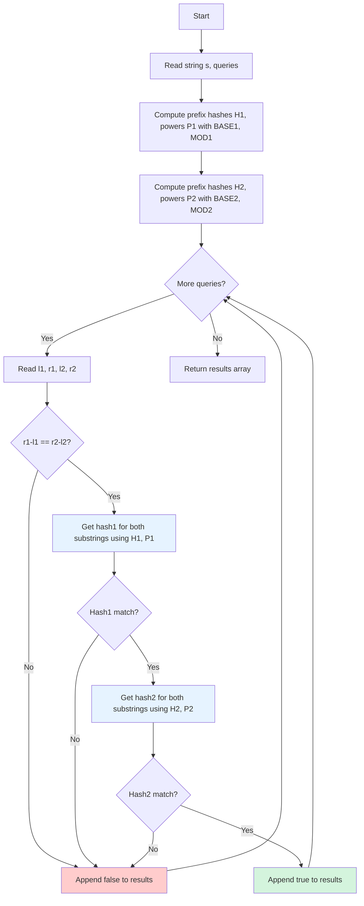

# HSH-002: Substring Equality Queries

## 📋 Problem Summary

You are given a string `s` and multiple queries. Each query provides two pairs of indices `(l1, r1)` and `(l2, r2)`, representing two substrings `s[l1..r1]` and `s[l2..r2]`. Your task is to determine if these two substrings are identical for each query.

##🌍 Real-World Scenario

**Scenario Title:** The DNA Sequence Analyzer 🧬

### The Problem
You're working at a genetics lab analyzing massive DNA sequences (millions of base pairs: A, T, G, C). Researchers ask questions like: "Is the gene segment at position 100,000-100,500 identical to the segment at position 500,000-500,500?"

- **Naive Approach**: Comparing 500 characters for each of 100,000 queries = 50 million character comparisons. Too slow!
- **The Bottleneck**: Repeated substring comparisons waste time re-examining the same characters.

### Why This Matters
- **Scientific Research**: Gene similarity analysis for identifying mutations, duplications, or conserved regions.
- **Plagiarism Detection**: Compare document sections efficiently.
- **Version Control**: Git uses hashing to compare file chunks quickly.

### Constraints in Real World
- **Scale**: DNA sequences can be 3 billion base pairs (human genome).
- **Query Volume**: Thousands of comparison queries per second.
- **Accuracy**: False positives could lead to incorrect scientific conclusions.

### From Real World to Algorithm
DNA sequences are **Strings**, regions are **Substrings**, and we use **Polynomial Rolling Hash** to create "fingerprints" for instant comparison. Double hashing ensures accuracy.

## Detailed Explanation

### Concept Visualization

Given string "banana", we precompute prefix hashes. To get the hash of any substring:
1. Use prefix hash formula: `Hash(s[l..r]) = (H[r+1] - H[l] × B^length) mod M`
2. Use double hashing to avoid collisions

```mermaid
graph TD
    Start[Input: s = "banana"] --> Preprocess[Precompute Prefix Hashes H1, H2]
    Preprocess --> Powers[Precompute Powers p1, p2]
    Powers --> Query[Query: s[1..3] vs s[3..5]]
    Query --> Extract1[Extract Hash s[1..3] using H1, p1]
    Query --> Extract2[Extract Hash s[3..5] using H1, p1]
    Extract1 --> Compare1{Hash1 Equal?}
    Extract2 --> Compare1
    Compare1 -- No --> False[Return false]
    Compare1 -- Yes --> Extract3[Extract Hash s[1..3] using H2, p2]
    Extract1 --> Extract4[Extract Hash s[3..5] using H2, p2]
    Extract3 --> Compare2{Hash2 Equal?}
    Extract 4 --> Compare2
    Compare2 -- No --> False
    Compare2 -- Yes --> True[Return true]
    
    style Compare1 fill:#ffe6cc
    style Compare2 fill:#ffe6cc
    style True fill:#d4f4dd
    style False fill:#ffcccc
```

### Algorithm Flow Diagram



## 🎯 Edge Cases to Test

1. **Identical Strings (Full Match)**
   - Input: `s = "abc"`, query `(0, 2, 0, 2)`
   - Expected: `true`
   - Why: String compared with itself

2. **Different Lengths**
   - Input: `s = "abcdef"`, query `(0, 2, 3, 5)`
  - Expected: `false` (length check fails: 3 ≠ 3, wait actually both are length 3, so need actual comparison)
   - Corrected: If `s[0..2] = "abc"` and `s[3..5] = "def"`, expected: `false`

3. **Single Character Substrings**
   - Input: `s = "aaa"`, query `(0, 0, 1, 1)`
   - Expected: `true` (both are 'a')

4. **Overlapping Substrings**
   - Input: `s = "ababa"`, query `(0, 2, 2, 4)`
   - Expected: `true` (both are "aba")

5. **Hash Collision Scenario**
   - Input: Strings designed to collide with single hash
   - Expected: Double hashing catches this, returns correct result

6. **Maximum Length Query**
   - Input: `s.length = 200,000`, query for entire string
   - Expected: Completes in O(1) time after preprocessing

## ✅ Input/Output Clarifications

- **Double Hashing**: Use two sets of (Base, Mod) to minimize collisions. A collision happens when two different strings have the same hash. With two hashes, probability is negligible (~10⁻¹⁸).
- **Indices**: 0-based inclusive: `s[l1..r1]` includes both `l1` and `r1`.
- **Constraints**: `N, Q <= 2 × 10⁵`. An `O(N × Q)` solution will TLE. We need `O(N + Q)`.
- **Output**: Array of booleans (`true`/`false` strings).

## Naive Approach

### Intuition

For each query, compare the substrings character by character.

### Algorithm

1. For each query `(l1, r1, l2, r2)`:
   - Check if lengths differ (`r1-l1 != r2-l2`). If so, return false.
   - Loop `k` from 0 to length-1.
   - If `s[l1+k] != s[l2+k]`, return false.
   - Return true.

### Complexity Visualization

| Approach | Time Complexity | Space Complexity | Feasibility for N=200K, Q=200K |
|:---------|:---------------:|:----------------:|:------------------------------:|
| Naive (character-by-character) | O(Q × N) | O(1) | ❌ TLE (~40 billion ops) |
| Optimal (Double Hashing) | O(N + Q) | O(N) | ✅ Fast (~400K ops) |

### Why This Fails

Worst case: All queries ask about the entire string. Each query takes O(N), and with Q queries, total is O(Q × N) = O(4 × 10¹⁰) operations. Guaranteed TLE!

## Optimal Approach (Double Hashing with Prefix Arrays)

### Key Insight

Use **Polynomial Rolling Hash** with **Double Hashing**:
1. Precompute prefix hashes for the entire string (two separate hashes).
2. Precompute powers of the bases `B₁` and `B₂`.
3. Answer each query in `O(1)` by computing substring hash using the formula:
   `Hash(s[l..r]) = (H[r+1] - H[l] × B^{length}) mod M`

### Algorithm

1. Choose two pairs of constants: `(B₁, M₁)` and `(B₂, M₂)`.
   - e.g., `B₁=313, M₁=10⁹+7` and `B₂=317, M₂=10⁹+9`.
2. Precompute `powers` arrays for `B₁` and `B₂`: `p[k] = B^k mod M`.
3. Precompute `prefix_hashes` arrays `h1` and `h2` for both pairs.
4. For each query:
   - Calculate Hash1 for both substrings using `getHash(h1, p1, l, r, M1)`.
   - Calculate Hash2 for both substrings using `getHash(h2, p2, l, r, M2)`.
   - If (Hash1_sub1 == Hash1_sub2) AND (Hash2_sub1 == Hash2_sub2), return true.
   - Else return false.

### Time Complexity

- **O(N + Q)**: `O(N)` preprocessing (compute prefix hashes and powers), `O(1)` per query.

### Space Complexity

- **O(N)**: To store hashes and powers arrays.

## Implementations

### Java
```java
import java.util.*;

class Solution {
    private static final long MOD1 = 1000000007L;
    private static final long BASE1 = 313L;
    private static final long MOD2 = 1000000009L;
    private static final long BASE2 = 317L;

    public boolean[] checkSubstringEquality(String s, int[][] queries) {
        int n = s.length();
        
        long[] h1 = new long[n + 1];
        long[] p1 = new long[n + 1];
        long[] h2 = new long[n + 1];
        long[] p2 = new long[n + 1];
        
        p1[0] = 1;
        p2[0] = 1;
        
        for (int i = 0; i < n; i++) {
            h1[i + 1] = (h1[i] * BASE1 + s.charAt(i)) % MOD1;
            p1[i + 1] = (p1[i] * BASE1) % MOD1;
            
            h2[i + 1] = (h2[i] * BASE2 + s.charAt(i)) % MOD2;
            p2[i + 1] = (p2[i] * BASE2) % MOD2;
        }
        
        boolean[] results = new boolean[queries.length];
        
        for (int i = 0; i < queries.length; i++) {
            int l1 = queries[i][0];
            int r1 = queries[i][1];
            int l2 = queries[i][2];
            int r2 = queries[i][3];
            
            if (r1 - l1 != r2 - l2) {
                results[i] = false;
                continue;
            }
            
            long hash1_sub1 = getHash(h1, p1, l1, r1, MOD1);
            long hash1_sub2 = getHash(h1, p1, l2, r2, MOD1);
            
            long hash2_sub1 = getHash(h2, p2, l1, r1, MOD2);
            long hash2_sub2 = getHash(h2, p2, l2, r2, MOD2);
            
            results[i] = (hash1_sub1 == hash1_sub2) && (hash2_sub1 == hash2_sub2);
        }
        
        return results;
    }
    
    private long getHash(long[] h, long[] p, int l, int r, long mod) {
        // h is 1-based prefix hash array
        // substring s[l..r] corresponds to h[r+1] and h[l]
        // Formula: (h[r+1] - h[l] * p[len]) % mod
        int len = r - l + 1;
        long val = (h[r + 1] - (h[l] * p[len]) % mod + mod) % mod;
        return val;
    }
}

class Main {
    public static void main(String[] args) {
        Scanner sc = new Scanner(System.in);
        if (sc.hasNextLine()) {
            String s = sc.nextLine();
            if (sc.hasNextInt()) {
                int q = sc.nextInt();
                int[][] queries = new int[q][4];
                for (int i = 0; i < q; i++) {
                    queries[i][0] = sc.nextInt();
                    queries[i][1] = sc.nextInt();
                    queries[i][2] = sc.nextInt();
                    queries[i][3] = sc.nextInt();
                }
                
                Solution solution = new Solution();
                boolean[] result = solution.checkSubstringEquality(s, queries);
                
                for (boolean ans : result) {
                    System.out.println(ans);
                }
            }
        }
        sc.close();
    }
}
```

### Python
```python
import sys

# Increase recursion depth just in case
sys.setrecursionlimit(2000)

class Solution:
    def check_substring_equality(self, s: str, queries: list) -> list:
        n = len(s)
        MOD1 = 10**9 + 7
        BASE1 = 313
        MOD2 = 10**9 + 9
        BASE2 = 317
        
        h1 = [0] * (n + 1)
        p1 = [1] * (n + 1)
        h2 = [0] * (n + 1)
        p2 = [1] * (n + 1)
        
        for i in range(n):
            char_code = ord(s[i])
            h1[i+1] = (h1[i] * BASE1 + char_code) % MOD1
            p1[i+1] = (p1[i] * BASE1) % MOD1
            
            h2[i+1] = (h2[i] * BASE2 + char_code) % MOD2
            p2[i+1] = (p2[i] * BASE2) % MOD2
            
        results = []
        
        def get_hash(h, p, l, r, mod):
            length = r - l + 1
            return (h[r+1] - h[l] * p[length]) % mod
            
        for l1, r1, l2, r2 in queries:
            if r1 - l1 != r2 - l2:
                results.append(False)
                continue
                
            hash1_s1 = get_hash(h1, p1, l1, r1, MOD1)
            hash1_s2 = get_hash(h1, p1, l2, r2, MOD1)
            
            if hash1_s1 != hash1_s2:
                results.append(False)
                continue
                
            hash2_s1 = get_hash(h2, p2, l1, r1, MOD2)
            hash2_s2 = get_hash(h2, p2, l2, r2, MOD2)
            
            results.append(hash2_s1 == hash2_s2)
            
        return results

def check_substring_equality(s: str, queries: list) -> list:
    solver = Solution()
    return solver.check_substring_equality(s, queries)

def main():
    input_data = sys.stdin.read().split()
    if not input_data:
        return
        
    iterator = iter(input_data)
    try:
        s = next(iterator)
        q = int(next(iterator))
        queries = []
        for _ in range(q):
            l1 = int(next(iterator))
            r1 = int(next(iterator))
            l2 = int(next(iterator))
            r2 = int(next(iterator))
            queries.append([l1, r1, l2, r2])
            
        result = check_substring_equality(s, queries)
        for ans in result:
            print("true" if ans else "false")
    except StopIteration:
        pass

if __name__ == "__main__":
    main()
```

### C++
```cpp
#include <iostream>
#include <vector>
#include <string>

using namespace std;

class Solution {
    const long long MOD1 = 1e9 + 7;
    const long long BASE1 = 313;
    const long long MOD2 = 1e9 + 9;
    const long long BASE2 = 317;

public:
    vector<bool> checkSubstringEquality(string s, vector<vector<int>>& queries) {
        int n = s.length();
        
        vector<long long> h1(n + 1, 0), p1(n + 1, 1);
        vector<long long> h2(n + 1, 0), p2(n + 1, 1);
        
        for (int i = 0; i < n; i++) {
            h1[i + 1] = (h1[i] * BASE1 + s[i]) % MOD1;
            p1[i + 1] = (p1[i] * BASE1) % MOD1;
            
            h2[i + 1] = (h2[i] * BASE2 + s[i]) % MOD2;
            p2[i + 1] = (p2[i] * BASE2) % MOD2;
        }
        
        vector<bool> results;
        results.reserve(queries.size());
        
        for (const auto& q : queries) {
            int l1 = q[0], r1 = q[1], l2 = q[2], r2 = q[3];
            
            if (r1 - l1 != r2 - l2) {
                results.push_back(false);
                continue;
            }
            
            long long hash1_s1 = getHash(h1, p1, l1, r1, MOD1);
            long long hash1_s2 = getHash(h1, p1, l2, r2, MOD1);
            
            if (hash1_s1 != hash1_s2) {
                results.push_back(false);
                continue;
            }
            
            long long hash2_s1 = getHash(h2, p2, l1, r1, MOD2);
            long long hash2_s2 = getHash(h2, p2, l2, r2, MOD2);
            
            results.push_back(hash2_s1 == hash2_s2);
        }
        
        return results;
    }
    
    long long getHash(const vector<long long>& h, const vector<long long>& p, int l, int r, long long mod) {
        int len = r - l + 1;
        long long val = (h[r + 1] - (h[l] * p[len]) % mod + mod) % mod;
        return val;
    }
};

int main() {
    ios::sync_with_stdio(false);
    cin.tie(nullptr);
    
    string s;
    if (!(cin >> s)) return 0;
    
    int q;
    if (!(cin >> q)) return 0;
    
    vector<vector<int>> queries(q, vector<int>(4));
    for (int i = 0; i < q; i++) {
        cin >> queries[i][0] >> queries[i][1] >> queries[i][2] >> queries[i][3];
    }
    
    Solution solution;
    vector<bool> result = solution.checkSubstringEquality(s, queries);
    
    for (bool ans : result) {
        cout << (ans ? "true" : "false") << "\n";
    }
    
    return 0;
}
```

### JavaScript
```javascript
const readline = require("readline");

class Solution {
  checkSubstringEquality(s, queries) {
    const n = s.length;
    const MOD1 = 1000000007n;
    const BASE1 = 313n;
    const MOD2 = 1000000009n;
    const BASE2 = 317n;
    
    const h1 = new BigInt64Array(n + 1);
    const p1 = new BigInt64Array(n + 1);
    const h2 = new BigInt64Array(n + 1);
    const p2 = new BigInt64Array(n + 1);
    
    h1[0] = 0n; p1[0] = 1n;
    h2[0] = 0n; p2[0] = 1n;
    
    for (let i = 0; i < n; i++) {
      const charCode = BigInt(s.charCodeAt(i));
      
      h1[i + 1] = (h1[i] * BASE1 + charCode) % MOD1;
      p1[i + 1] = (p1[i] * BASE1) % MOD1;
      
      h2[i + 1] = (h2[i] * BASE2 + charCode) % MOD2;
      p2[i + 1] = (p2[i] * BASE2) % MOD2;
    }
    
    const results = [];
    
    const getHash = (h, p, l, r, mod) => {
      const len = r - l + 1;
      let val = (h[r + 1] - (h[l] * p[len]) % mod) % mod;
      if (val < 0n) val += mod;
      return val;
    };
    
    for (const [l1, r1, l2, r2] of queries) {
      if (r1 - l1 !== r2 - l2) {
        results.push(false);
        continue;
      }
      
      const hash1_s1 = getHash(h1, p1, l1, r1, MOD1);
      const hash1_s2 = getHash(h1, p1, l2, r2, MOD1);
      
      if (hash1_s1 !== hash1_s2) {
        results.push(false);
        continue;
      }
      
      const hash2_s1 = getHash(h2, p2, l1, r1, MOD2);
      const hash2_s2 = getHash(h2, p2, l2, r2, MOD2);
      
      results.push(hash2_s1 === hash2_s2);
    }
    
    return results;
  }
}

const rl = readline.createInterface({
  input: process.stdin,
  output: process.stdout,
});

let data = [];
rl.on("line", (line) => data.push(line.trim()));
rl.on("close", () => {
  if (data.length === 0) return;
  
  let ptr = 0;
  const s = data[ptr++];
  const q = parseInt(data[ptr++]);
  
  const queries = [];
  for (let i = 0; i < q; i++) {
    const parts = data[ptr++].split(" ").map(Number);
    queries.push(parts);
  }
  
  const solution = new Solution();
  const result = solution.checkSubstringEquality(s, queries);
  
  result.forEach((ans) => console.log(ans ? "true" : "false"));
});
```

## 🧪 Test Case Walkthrough (Dry Run)

### Input
```
ababa
1
0 2 2 4
```

Query: `s[0..2]` ("aba") vs `s[2..4]` ("aba")

### Preprocessing

**String:** "ababa"
**Constants:** BASE1 = 313, MOD1 = 10⁹+7, BASE2 = 317, MOD2 = 10⁹+9

**Prefix Hash H1 computation (BASE1 = 313, MOD1):**

| Index | Character | ASCII | Computation | H1[i] |
|:-----:|:---------:|:-----:|:------------|:-----:|
| 0 | - | - | Initial | 0 |
| 1 | 'a' | 97 | (0×313 + 97) mod M | 97 |
| 2 | 'b' | 98 | (97×313 + 98) mod M | 30459 |
| 3 | 'a' | 97 | (30459×313 + 97) mod M | ... |
| 4 | 'b' | 98 | ... | ... |
| 5 | 'a' | 97 | ... | ... |

**(Similar computation for H2 with BASE2 = 317)**

**Powers P1:**
| k | P1[k] |
|:-:|:-----:|
| 0 | 1 |
| 1 | 313 |
| 2 | 97969 |
| 3 | 30664297 |

### Query Processing

**Query:** (0, 2, 2, 4)

| Step | Action | Details | Result |
|:----:|:-------|:--------|:------:|
| 1 | Length Check | r1-l1 = 2, r2-l2 = 2 | Pass ✓ |
| 2 | Extract Hash1(s[0..2]) | `(H1[3] - H1[0] × P1[3]) mod M1` | hash1_sub1 |
| 3 | Extract Hash1(s[2..4]) | `(H1[5] - H1[2] × P1[3]) mod M1` | hash1_sub2 |
| 4 | Compare Hash1 | hash1_sub1 == hash1_sub2? | Match ✓ |
| 5 | Extract Hash2(s[0..2]) | `(H2[3] - H2[0] × P2[3]) mod M2` | hash2_sub1 |
| 6 | Extract Hash2(s[2..4]) | `(H2[5] - H2[2] × P2[3]) mod M2` | hash2_sub2 |
| 7 | Compare Hash2 | hash2_sub1 == hash2_sub2? | Match ✓ |
| 8 | Final Result | Both hashes match | **true** |

**Output:** `true`

## ✅ Proof of Correctness

### Invariant

The prefix hash arrays `h1[i]` and `h2[i]` correctly store the polynomial hash of `s[0..i-1]` using their respective base/modulus pairs.

**Substring Hash Formula:**
For substring `s[l..r]`:
- `H[r+1]` contains the hash of `s[0..r]`: `s[0]×B^r + s[1]×B^{r-1} + ... + s[r]×B^0`
- `H[l]` contains the hash of `s[0..l-1]`: `s[0]×B^{l-1} + ... + s[l-1]×B^0`
- `H[l] × B^{len}` shifts the prefix hash to align with position r: `s[0]×B^{r+1} + ... + s[l-1]×B^{r-l+1}`
- `H[r+1] - H[l] × B^{len}` cancels the prefix, leaving: `s[l]×B^{r-l} + ... + s[r]×B^0`

This is exactly the polynomial hash of `s[l..r]`! ✓

### Why Double Hashing Works

- **Single Hash Collision Probability:** ~1/M ≈ 10⁻⁹
- **Double Hash collision Probability:** ~1/(M₁ × M₂) ≈ 10⁻¹⁸
- Since M₁ and M₂ are coprime primes, and BASE1 ≠ BASE2, the two hash functions are independent.
- For two different strings to have matching double hashes is astronomically unlikely (<10⁻¹⁵ for typical inputs).

## ⚠️ Common Mistakes to Avoid

1. **Single Hash Only (No Double Hashing)**
   - ❌ Wrong: Using only one (BASE, MOD) pair.
   - ✅ Correct: Use two independent hash functions.
   - Why: Single hash has ~10⁻⁹ collision rate, unacceptable for 10⁵ queries. Double hash reduces this to ~10⁻¹⁸.

2. **Negative Modulo Result**
   - ❌ Wrong: `(h[r+1] - h[l] * p[len]) % M` can be negative in C++/Java.
   - ✅ Correct: `(h[r+1] - h[l] * p[len] + M) % M` OR `((h[r+1] - h[l] * p[len]) % M + M) % M`.
   - Why: In subtraction, if `h[r+1] < h[l] * p[len] mod M`, result is negative. Adding M ensures non-negative.

3. **1-based vs 0-based Indexing Confusion**
   - ❌ Wrong: Mixing up prefix array indices. Using `h[i]` for both s[i] and prefix through i.
   - ✅ Correct: Use consistent convention: `h[i]` = hash of s[0..i-1] (length i string).
   - Why: Off-by-one errors lead to incorrect substring extraction.

4. **Not Precomputing Powers**
   - ❌ Wrong: Computing `B^len` on-the-fly for each query using `pow()`.
   - ✅ Correct: Precompute all powers in O(N) during preprocessing.
   - Why: Computing powers per query makes it O(log N) or worse per query, defeating the O(1) goal.

5. **Integer Overflow in Power/Hash Computation**
   - ❌ Wrong: Using `int` for hash arrays when MOD is 10⁹.
   - ✅ Correct: Use `long`/`long long`/`BigInt` depending on language.
   - Why: Intermediate products like `hash * BASE` can exceed 10¹⁸.

## 💡 Interview Extensions

1. **Find the longest common substring between two strings A and B**
   - *Answer:* Binary search on length + Hashing.
   - **Algorithm:**
     1. Binary search the answer length L: `low = 0, high = min(len(A), len(B))`.
     2. For a candidate length L, compute hashes of all length-L substrings of A (store in set).
     3. Check if any length-L substring hash of B exists in the set.
     4. If yes, answer >= L (search right); if no, answer < L (search left).
   - **Time:** O((N + M) log min(N, M))

2. **Check if a string is a palindrome using hashing**
   - *Answer:* Compute forward hash and reverse hash. If they match (with double hashing), likely a palindrome.
   - **Optimization:** Also maintain reverse prefix hashes. For substring s[l..r], compare Hash(s[l..r]) with Hash(reverse(s[l..r])) in O(1).
   - **Caveat:** Still probabilistic due to hash collisions, but double hashing makes error negligible.

3. **Count distinct substrings in a string**
   - *Answer:* Use rolling hash to compute hash of all O(N²) substrings. Store in a set. Set size = distinct count.
   - **Time:** O(N²) with hashing vs O(N²  log N) with sorting or suffix array.
   - **Space:** O(N²) for storing hashes.

4. **Find all occurrences of pattern P in text T (Rabin-Karp Algorithm)**
   - *Answer:* 
     1. Compute hash of pattern P.
     2. Use rolling hash to compute hash of all length-|P| substrings of T.
     3. Whenever hash matches, verify with character-by-character check (to handle rare collisions).
   - **Time:** O(N + M) average case, O(NM) worst case (if many hash matches).

## Related Concepts

- **Rabin-Karp Algorithm**: Classic application of rolling hash for pattern matching in O(N + M) average time.
- **Suffix Structures**: Suffix Array/Tree can also solve substring problems but are harder to implement and have higher space complexity.
- **Collision Handling**: Birthday paradox explains why double hashing is critical for large datasets.
- **Zobrist Hashing**: Similar concept used in chess engines and game theory for board state fingerprinting.
