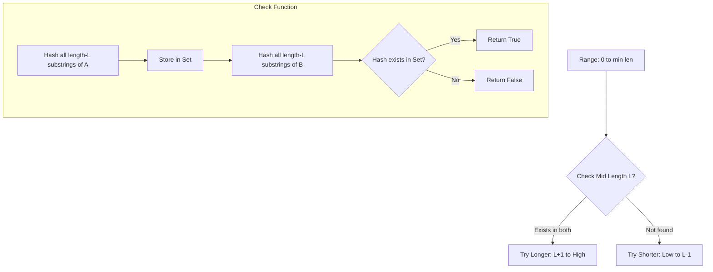
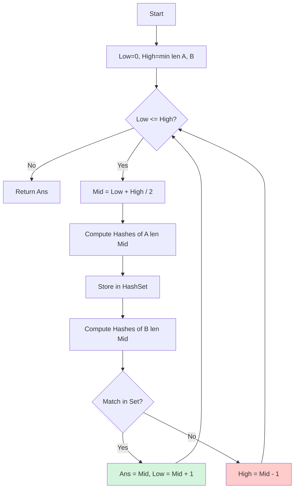

# HSH-003: Longest Common Substring of Two Strings

## 📋 Problem Summary

You are given two strings, `a` and `b`. Your task is to find the length of the longest substring that appears in both `a` and `b`. A substring is a contiguous sequence of characters.

## 🌍 Real-World Scenario

**Scenario Title:** The Code Plagiarism Detective 🕵️‍♂️

### The Problem
You are a professor teaching a coding class. Two students, "Alice" and "Bob", submit their assignments. You suspect they shared code.
- If they share small common phrases like `int i = 0;`, that's normal.
- But if they share a massive contiguous block of 500 lines of code, identical character-for-character, that's highly suspicious.
- **Goal:** Find the *longest* contiguous block of text present in both submissions to quantify the similarity.

### Why This Matters
- **Plagiarism Detection:** Used in tools like MOSS (Measure Of Software Similarity) to detect academic dishonesty.
- **Data Deduplication:** Cloud storage systems find common chunks of data between files to save space (store the chunk once, reference it multiple times).
- **Bioinformatics:** Finding the longest DNA sequence shared between two distinct species to identify common ancestors or conserved genes.

### Constraints in Real World
- **Speed:** Assignments are long ($10^5$ characters). Comparing every substring ($O(N^2)$) takes too long (10 billion ops).
- **False Positives:** We need an efficient way to check equality without actually comparing strings character-by-character repeatedly.

### From Real World to Algorithm
We treat the files as strings `A` and `B`. Finding the Longest Common Substring efficiently requires checking if a common substring of length `L` exists. If so, we try `L+1`. If not, we try `L-1`. This monotonicity suggests **Binary Search on Answer** combined with **Rolling Hash**.

## Detailed Explanation

### Concept Visualization

We rely on the property: "If a common substring of length 4 exists, a common substring of length 3 MUST also exist."



### Algorithm Flow Diagram



## 🎯 Edge Cases to Test

1. **No Common Substring**
   - Input: `a="abc", b="xyz"`
   - Expected: `0`
   - Why: Ensures algorithm handles completely disjoint strings.

2. **Complete Overlap**
   - Input: `a="abc", b="abc"`
   - Expected: `3`
   - Why: Max possible answer.

3. **One String Empty**
   - Input: `a="", b="abc"`
   - Expected: `0`
   - Why: Boundary condition for binary search range.

4. **Multiple Common Substrings of Same Length**
   - Input: `a="abcxyz", b="abcpqrxyz"`
   - Expected: `3` (matches "abc" or "xyz")
   - Why: Ensures finding *any* match is sufficient.

5. **A shorter than B**
   - Input: `a="hi", b="hello"`
   - Expected: `1` ("h")
   - Why: Binary search upper bound must be min(len(a), len(b)).

## ✅ Input/Output Clarifications

- **Input:** Two strings `a` and `b`.
- **Output:** A single integer (max length).
- **Constraints:** $N, M \le 10^5$.
- **Hashing:** Recommend **Double Hashing** or a large prime modulus to avoid collisions in competitive settings.

## Naive Approach

### Intuition
Use Dynamic Programming. Let `dp[i][j]` be the length of the common suffix ending at `a[i]` and `b[j]`.
If `a[i] == b[j]`, then `dp[i][j] = dp[i-1][j-1] + 1`, else 0.
The answer is the maximum value in the DP table.

### Complexity Visualization

| Approach | Time Complexity | Space Complexity | Feasibility for N=100,000 |
|:---------|:---------------:|:----------------:|:-------------------------:|
| Naive DP (LCS Table) | O(N×M) | O(N×M) | ❌ TLE/MLE (10¹⁰ ops, 40GB RAM) |
| Binary Search + Rolling Hash | O((N+M) log N) | O(N) | ✅ Fast (~2×10⁶ ops) |

### Why This Fails
O(N×M) is quadratic. For $N=10^5$, $N^2 = 10^{10}$, which is far beyond the typical $10^8$ operations per second limit.

## Optimal Approach (Binary Search + Rolling Hash)

### Key Insight
1. **Binary Search**: Instead of checking every length, we binary search for the answer. If a common substring of length `k` exists, we try a longer length. If not, we try shorter.
2. **Rolling Hash**: To check if a common substring of length `k` exists in O(N+M) time:
   - Compute rolling hashes of all length-`k` substrings of A and store in a HashSet.
   - Compute rolling hashes of all length-`k` substrings of B and check if they exist in the Set.

### Algorithm
1. `low = 0`, `high = min(|A|, |B|)`
2. While `low <= high`:
   - `mid = (low + high) / 2`
   - If `check(mid)` is true: `ans = mid`, `low = mid + 1`
   - Else: `high = mid - 1`
3. **Check(len)**:
   - Rolling hash A (len `mid`), insert to Set.
   - Rolling hash B (len `mid`), query Set.
   - If match found, return True.

### Time Complexity
- **O((N + M) log (min(N, M)))**: Binary search takes `log(min(N, M))` steps. Each step takes `O(N + M)` for hashing.

### Space Complexity
- **O(N)**: To store hashes of string A in the set.

## Implementations

### Java
```java
import java.util.*;

class Solution {
    private static final long MOD = 1_000_000_007L;
    private static final long BASE = 31L;

    public int longestCommonSubstring(String a, String b) {
        int low = 0, high = Math.min(a.length(), b.length());
        int ans = 0;

        while (low <= high) {
            int mid = low + (high - low) / 2;
            if (mid == 0) {
                low = mid + 1;
                continue;
            }
            if (check(a, b, mid)) {
                ans = mid;
                low = mid + 1;
            } else {
                high = mid - 1;
            }
        }
        return ans;
    }

    private boolean check(String a, String b, int len) {
        Set<Long> hashesA = new HashSet<>();

        long currentHash = 0;
        long power = 1;

        // Precompute BASE^(len-1)
        for (int i = 0; i < len; i++) {
            if (i > 0) power = (power * BASE) % MOD;
            currentHash = (currentHash * BASE + a.charAt(i)) % MOD;
        }
        hashesA.add(currentHash);

        for (int i = len; i < a.length(); i++) {
            // Remove leading char: (H - s[i-len] * B^(len-1)) % MOD
            long remove = (a.charAt(i - len) * power) % MOD;
            currentHash = (currentHash - remove + MOD) % MOD;
            // Add trailing char
            currentHash = (currentHash * BASE + a.charAt(i)) % MOD;
            hashesA.add(currentHash);
        }

        // Check B
        currentHash = 0;
        for (int i = 0; i < len; i++) {
            currentHash = (currentHash * BASE + b.charAt(i)) % MOD;
        }
        if (hashesA.contains(currentHash)) return true;

        for (int i = len; i < b.length(); i++) {
            long remove = (b.charAt(i - len) * power) % MOD;
            currentHash = (currentHash - remove + MOD) % MOD;
            currentHash = (currentHash * BASE + b.charAt(i)) % MOD;
            if (hashesA.contains(currentHash)) return true;
        }

        return false;
    }
}

class Main {
    public static void main(String[] args) {
        Scanner sc = new Scanner(System.in);
        if (sc.hasNextLine()) {
            String a = sc.nextLine();
            String b = sc.nextLine();
            Solution solution = new Solution();
            System.out.println(solution.longestCommonSubstring(a, b));
        }
        sc.close();
    }
}
```

### Python
```python
import sys

class Solution:
    def longest_common_substring(self, a: str, b: str) -> int:
        MOD = 10**9 + 7
        BASE = 31

        def check(length):
            if length == 0: return True

            # Compute hashes for A
            hashes_a = set()
            current_hash = 0
            power = pow(BASE, length - 1, MOD)

            for i in range(length):
                current_hash = (current_hash * BASE + ord(a[i])) % MOD
            hashes_a.add(current_hash)

            for i in range(length, len(a)):
                remove = (ord(a[i - length]) * power) % MOD
                current_hash = (current_hash - remove + MOD) % MOD
                current_hash = (current_hash * BASE + ord(a[i])) % MOD
                hashes_a.add(current_hash)

            # Check B
            current_hash = 0
            for i in range(length):
                current_hash = (current_hash * BASE + ord(b[i])) % MOD
            if current_hash in hashes_a:
                return True

            for i in range(length, len(b)):
                remove = (ord(b[i - length]) * power) % MOD
                current_hash = (current_hash - remove + MOD) % MOD
                current_hash = (current_hash * BASE + ord(b[i])) % MOD
                if current_hash in hashes_a:
                    return True

            return False

        low, high = 0, min(len(a), len(b))
        ans = 0

        while low <= high:
            mid = (low + high) // 2
            if mid == 0:
                low = mid + 1
                continue
            if check(mid):
                ans = mid
                low = mid + 1
            else:
                high = mid - 1

        return ans

def longest_common_substring(a: str, b: str) -> int:
    solver = Solution()
    return solver.longest_common_substring(a, b)

def main():
    lines = sys.stdin.read().strip().split('\n')
    if len(lines) < 2:
        return

    a = lines[0] if len(lines) > 0 else ""
    b = lines[1] if len(lines) > 1 else ""
    print(longest_common_substring(a, b))

if __name__ == "__main__":
    main()
```

### C++
```cpp
#include <iostream>
#include <string>
#include <unordered_set>
#include <vector>
#include <algorithm>

using namespace std;

class Solution {
    const long long MOD = 1e9 + 7;
    const long long BASE = 31;

public:
    int longestCommonSubstring(string a, string b) {
        int low = 0, high = min(a.length(), b.length());
        int ans = 0;

        while (low <= high) {
            int mid = low + (high - low) / 2;
            if (mid == 0) {
                low = mid + 1;
                continue;
            }
            if (check(a, b, mid)) {
                ans = mid;
                low = mid + 1;
            } else {
                high = mid - 1;
            }
        }
        return ans;
    }

    bool check(const string& a, const string& b, int len) {
        unordered_set<long long> hashesA;
        long long currentHash = 0;
        long long power = 1;

        // Precompute BASE^(len-1)
        for (int i = 0; i < len - 1; i++) {
            power = (power * BASE) % MOD;
        }

        // Hash A
        for (int i = 0; i < len; i++) {
            currentHash = (currentHash * BASE + a[i]) % MOD;
        }
        hashesA.insert(currentHash);

        for (int i = len; i < a.length(); i++) {
            long long remove = (a[i - len] * power) % MOD;
            currentHash = (currentHash - remove + MOD) % MOD;
            currentHash = (currentHash * BASE + a[i]) % MOD;
            hashesA.insert(currentHash);
        }

        // Check B
        currentHash = 0;
        for (int i = 0; i < len; i++) {
            currentHash = (currentHash * BASE + b[i]) % MOD;
        }
        if (hashesA.count(currentHash)) return true;

        for (int i = len; i < b.length(); i++) {
            long long remove = (b[i - len] * power) % MOD;
            currentHash = (currentHash - remove + MOD) % MOD;
            currentHash = (currentHash * BASE + b[i]) % MOD;
            if (hashesA.count(currentHash)) return true;
        }

        return false;
    }
};

int main() {
    ios::sync_with_stdio(false);
    cin.tie(nullptr);

    string a, b;
    if (getline(cin, a) && getline(cin, b)) {
        Solution solution;
        cout << solution.longestCommonSubstring(a, b) << "\n";
    }

    return 0;
}
```

### JavaScript
```javascript
const readline = require("readline");

class Solution {
  longestCommonSubstring(a, b) {
    const MOD = 1000000007n;
    const BASE = 31n;

    const check = (len) => {
      if (len === 0) return true;

      const hashesA = new Set();
      let currentHash = 0n;
      let power = 1n;

      // Compute BASE^(len-1)
      for (let i = 0; i < len - 1; i++) {
        power = (power * BASE) % MOD;
      }

      // Hash A
      for (let i = 0; i < len; i++) {
        const code = BigInt(a.charCodeAt(i));
        currentHash = (currentHash * BASE + code) % MOD;
      }
      hashesA.add(currentHash);

      for (let i = len; i < a.length; i++) {
        const removeCode = BigInt(a.charCodeAt(i - len));
        const addCode = BigInt(a.charCodeAt(i));

        let remove = (removeCode * power) % MOD;
        currentHash = (currentHash - remove + MOD) % MOD;
        currentHash = (currentHash * BASE + addCode) % MOD;
        hashesA.add(currentHash);
      }

      // Check B
      currentHash = 0n;
      for (let i = 0; i < len; i++) {
        const code = BigInt(b.charCodeAt(i));
        currentHash = (currentHash * BASE + code) % MOD;
      }
      if (hashesA.has(currentHash)) return true;

      for (let i = len; i < b.length; i++) {
        const removeCode = BigInt(b.charCodeAt(i - len));
        const addCode = BigInt(b.charCodeAt(i));

        let remove = (removeCode * power) % MOD;
        currentHash = (currentHash - remove + MOD) % MOD;
        currentHash = (currentHash * BASE + addCode) % MOD;
        if (hashesA.has(currentHash)) return true;
      }

      return false;
    };

    let low = 0,
      high = Math.min(a.length, b.length);
    let ans = 0;

    while (low <= high) {
      const mid = Math.floor((low + high) / 2);
      if (mid === 0) {
        low = mid + 1;
        continue;
      }
      if (check(mid)) {
        ans = mid;
        low = mid + 1;
      } else {
        high = mid - 1;
      }
    }

    return ans;
  }
}

const rl = readline.createInterface({
  input: process.stdin,
  output: process.stdout,
});

let data = [];
rl.on("line", (line) => data.push(line.trim()));
rl.on("close", () => {
  if (data.length < 2) return;
  const a = data[0];
  const b = data[1];

  const solution = new Solution();
  console.log(solution.longestCommonSubstring(a, b));
});
```

## 🧪 Test Case Walkthrough (Dry Run)

### Input
```
abcde
cdef
```
Lengths: A=5, B=4. Range: `[0, 4]`.

### Execution Table

| Step | Low | High | Mid | `check(mid)` Action | Result | New Bound |
|:----:|:---:|:----:|:---:|:--------------------|:------:|:---------:|
| 1 | 0 | 4 | 2 | Hash substrings len 2 | | |
| 1a | | | | A: {"ab", "bc", "cd", "de"} | Set{"ab","bc",...} | |
| 1b | | | | B: "cd" → Found! | True | Low = 3, Ans = 2 |
| 2 | 3 | 4 | 3 | Hash substrings len 3 | | |
| 2a | | | | A: {"abc", "bcd", "cde"} | Set{"abc",...} | |
| 2b | | | | B: "cde" → Found! | True | Low = 4, Ans = 3 |
| 3 | 4 | 4 | 4 | Hash substrings len 4 | | |
| 3a | | | | A: {"abcd", "bcde"} | Set{...} | |
| 3b | | | | B: "cdef" → Not Found | False | High = 3 |
| End | 4 | 3 | | Exit Loop | | Return 3 |

**Detailed `check(3)`:**
- A's substrings length 3:
  - "abc" → Hash(abc)
  - "bcd" → Hash(bcd)
  - "cde" → Hash(cde)
- B's substrings length 3:
  - "cde" → Hash matches one in A! Return True.

**Final Output:** `3`

## ✅ Proof of Correctness

### Invariant
1.  **Binary Search Invariant:** The answer lies in the range `[0, high] + {ans}`. If `check(mid)` is true, we know answer $\ge mid$, so we search `[mid+1, high]`. If false, answer $< mid$, so we search `[low, mid-1]`.
2.  **Rolling Hash Correctness:** The formula $H_{new} = ((H_{old} - s_{remove} \cdot B^{L-1}) \cdot B + s_{add}) \pmod M$ correctly updates the polynomial hash in O(1).
    - $H_{old} = c_1 B^{L-1} + \dots + c_L B^0$
    - $H_{old} - c_1 B^{L-1} = c_2 B^{L-1} + \dots + c_L B^0$ (Remove leading term)
    - $(\dots) \cdot B = c_2 B^L + \dots + c_L B^1$ (Shift)
    - $+ s_{add} = c_2 B^L + \dots + c_L B^1 + c_{new} B^0$ (Add new term)
    - This matches the polynomial definition for the new window.

## ⚠️ Common Mistakes to Avoid

1.  **Recomputing Powers**:
    - ❌ Wrong: Calculating `pow(BASE, len-1)` inside the O(N) loop makes `check()` O(N log L), total complexity O(N log² N).
    - ✅ Correct: Precompute `power` once per `check()` call.

2.  **Hash Collisions**:
    - ❌ Wrong: Assuming 10^9+7 is collision-free for 10^5 substrings.
    - ✅ Correct: Use double hashing or check actual substring equality upon hash match (though checking is O(L), making worst case O(N*L)). For competitive programming, double hashing is safest O(N).

3.  **Empty String Handling**:
    - ❌ Wrong: `high = a.length()` when `b` is empty leads to checking non-existent lengths.
    - ✅ Correct: `high = min(a.length(), b.length())`.

4.  **Infinite Loop in Binary Search**:
    - ❌ Wrong: `low = mid` without `+1`.
    - ✅ Correct: Standard binary search template: `ans = mid; low = mid + 1`.

5.  **Negative Modulo**:
    - ❌ Wrong: `(curr - remove) % MOD`
    - ✅ Correct: `(curr - remove + MOD) % MOD` to handle negative results from subtraction.

## 💡 Interview Extensions

1.  **Find the actual Longest Common Substring (not just length)**
    - *Answer:* Instead of a Set of Hashes, use a Map `{Hash -> StartingIndex}`. When a match is found in `check()`, retrieve the index and substring: `a.substring(start, start + len)`.

2.  **Longest Common Substring of K Strings**
    - *Answer:* Binary Search on length. In `check(len)`, compute hashes for all K strings. Use a Map `{Hash -> Count}`. Increment count for unique hashes per string. If any hash has count == K, return True.

3.  **Memory Optimization**
    - *Answer:* If strict memory limits exist, using a Set for all O(N) hashes might be too much. We can use a **Suffix Array** with LCP array to solve this in O((N+M) log (N+M) or O(N+M)) with strictly linear space, avoiding hash collisions entirely.

4.  **Cyclic Shift Common Substring**
    - *Answer:* If we want to find LCS where one string can be cyclically shifted, concatenate the string to itself (`B + B`) and run the standard LCS algorithm against `A`.
