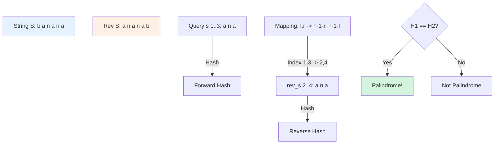
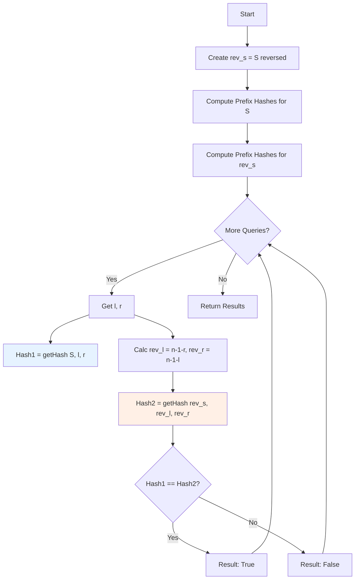

# HSH-004: Palindrome Substring Queries

## 📋 Problem Summary

You are given a string `s` and multiple queries. Each query consists of a range `[l, r]`. You need to determine if the substring `s[l...r]` is a palindrome (reads the same forwards and backwards).

## 🌍 Real-World Scenario

**Scenario Title:** The DNA Mirror Hunter 🧬

### The Problem
In genetics, "palindromic sequences" in DNA are extremely important. For example, restriction enzymes (molecular scissors) often cut DNA at specific palindromic sites like `GAATTC` (which reads `CTTAAG` on the complementary strand, effectively a palindrome in the biological sense).
- **Challenge**: You have a genome sequence of 100 million base pairs.
- **Goal**: You have 100,000 specific regions of interest. For each, check if it's a palindrome.

### Why This Matters
- **Bioinformatics**: Identifying binding sites for proteins and enzymes.
- **Data Compression**: Palindromes can be compressed efficiently.
- **Text Analysis**: Finding symmetrical patterns in signals or text.

### Constraints in Real World
- **Latency**: Each check must be instant ($O(1)$) after initial processing. We can't afford to scan the substring character-by-character for every query.

### From Real World to Algorithm
We treat the genome as a string `S`. A substring is a palindrome if `S[l...r] == Reverse(S[l...r])`. To check this instantly, we can hash `S` and `Reverse(S)` and compare hashes.

## Detailed Explanation

### Concept Visualization

To check if `s[l...r]` is a palindrome, we compare it to its reverse.
Instead of reversing the substring on the fly (slow), we use a precomputed **Reverse String** `rev_s`.
The reverse of `s[l...r]` exists as a substring in `rev_s`.



### Algorithm Flow Diagram



## 🎯 Edge Cases to Test

1.  **Single Character**
    -   Input: `s="a"`, query `0 0`
    -   Expected: `true` (Always a palindrome)
2.  **Whole String Palindrome**
    -   Input: `s="racecar"`, query `0 6`
    -   Expected: `true`
3.  **Whole String Not Palindrome**
    -   Input: `s="banana"`, query `0 5`
    -   Expected: `false`
4.  **Even Length Palindrome**
    -   Input: `s="abba"`, query `0 3`
    -   Expected: `true`
5.  **Empty Range** (if allowed by constraints, usually $l \le r$)
    -   Input: `s="abc"`, query `1 0`
    -   Expected: `true` (Empty string is palindrome)

## ✅ Input/Output Clarifications

-   **Input:** String `s`, and a list of queries `[l, r]`.
-   **Output:** List of booleans.
-   **Indices:** 0-based inclusive.
-   **Mapping:** Be careful! `s[l]` corresponds to `rev_s[n-1-l]`. The range `[l, r]` in `s` corresponds to `[n-1-r, n-1-l]` in `rev_s`.

## Naive Approach

### Intuition
For each query, extract the substring `s[l...r]`. Use two pointers (one at start, one at end) to check if it reads the same forwards and backwards.

### Algorithm
1.  For each query `(l, r)`:
    -   While `l < r`:
        -   If `s[l] != s[r]`, return `false`.
        -   `l++`, `r--`.
    -   Return `true`.

### Complexity Visualization

| Approach | Time Complexity | Space Complexity | Feasibility for N=200K, Q=200K |
| :--- | :---: | :---: | :---: |
| Naive (Two Pointers) | O(Q × N) | O(1) | ❌ TLE (~10¹⁰ ops) |
| Optimal (Hashing) | O(N + Q) | O(N) | ✅ Fast (~4×10⁵ ops) |

### Why This Fails
Checking a substring takes linear time $O(L)$. If we have many queries asking about long substrings, the total time explodes to $O(N \times Q)$.

## Optimal Approach (Rolling Hash on Reverse String)

### Key Insight
A string is a palindrome if it matches its reverse.
We can check string equality in $O(1)$ using rolling hashes.
Therefore, if we have the hash of `s[l...r]` and the hash of `Reverse(s[l...r])`, we can check if they are equal in $O(1)$.
We obtain the hash of the "reverse substring" by querying the precomputed hashes of the "reversed full string".

### Algorithm
1.  Create `rev_s` by reversing `s`.
2.  Precompute prefix hashes for `s` (Forward Hash Array `H_fwd`).
3.  Precompute prefix hashes for `rev_s` (Reverse Hash Array `H_rev`).
4.  For each query `(l, r)`:
    -   Extract `hash1` from `H_fwd` for range `[l, r]`.
    -   Calculate corresponding range in `rev_s`: start `n-1-r`, end `n-1-l`.
    -   Extract `hash2` from `H_rev` for range `[n-1-r, n-1-l]`.
    -   Return `hash1 == hash2`.

### Time Complexity
-   **O(N + Q)**: $O(N)$ for precomputing hashes, $O(1)$ for each query.

### Space Complexity
-   **O(N)**: To store `H_fwd`, `H_rev`, and powers.

## Implementations

### Java
```java
import java.util.*;

class Solution {
    private static final long MOD = 1_000_000_007L;
    private static final long BASE = 313L;
    
    public boolean[] checkPalindromes(String s, int[][] queries) {
        int n = s.length();
        long[] hForward = new long[n + 1];
        long[] hReverse = new long[n + 1];
        long[] power = new long[n + 1];
        
        power[0] = 1;
        String revS = new StringBuilder(s).reverse().toString();
        
        for (int i = 0; i < n; i++) {
            hForward[i + 1] = (hForward[i] * BASE + s.charAt(i)) % MOD;
            hReverse[i + 1] = (hReverse[i] * BASE + revS.charAt(i)) % MOD;
            power[i + 1] = (power[i] * BASE) % MOD;
        }
        
        boolean[] results = new boolean[queries.length];
        for (int i = 0; i < queries.length; i++) {
            int l = queries[i][0];
            int r = queries[i][1];
            
            long fwdHash = getHash(hForward, power, l, r);
            
            // Map indices to reversed string
            // s[l...r] corresponds to revS[n-1-r ... n-1-l]
            int revL = n - 1 - r;
            int revR = n - 1 - l;
            long revHash = getHash(hReverse, power, revL, revR);
            
            results[i] = (fwdHash == revHash);
        }
        return results;
    }
    
    private long getHash(long[] h, long[] p, int l, int r) {
        int len = r - l + 1;
        long val = (h[r + 1] - (h[l] * p[len]) % MOD + MOD) % MOD;
        return val;
    }
}

class Main {
    public static void main(String[] args) {
        Scanner sc = new Scanner(System.in);
        if (sc.hasNextLine()) {
            String s = sc.nextLine();
            if (sc.hasNextInt()) {
                int q = sc.nextInt();
                int[][] queries = new int[q][2];
                for (int i = 0; i < q; i++) {
                    queries[i][0] = sc.nextInt();
                    queries[i][1] = sc.nextInt();
                }
                Solution solution = new Solution();
                boolean[] result = solution.checkPalindromes(s, queries);
                for (boolean ans : result) {
                    System.out.println(ans);
                }
            }
        }
        sc.close();
    }
}
```

### Python
```python
import sys

# Increase recursion depth just in case
sys.setrecursionlimit(2000)

class Solution:
    def check_palindromes(self, s: str, queries: list) -> list:
        n = len(s)
        MOD = 10**9 + 7
        BASE = 313
        
        h_fwd = [0] * (n + 1)
        h_rev = [0] * (n + 1)
        power = [1] * (n + 1)
        
        rev_s = s[::-1]
        
        for i in range(n):
            h_fwd[i+1] = (h_fwd[i] * BASE + ord(s[i])) % MOD
            h_rev[i+1] = (h_rev[i] * BASE + ord(rev_s[i])) % MOD
            power[i+1] = (power[i] * BASE) % MOD
            
        def get_hash(h, l, r):
            length = r - l + 1
            return (h[r+1] - h[l] * power[length]) % MOD
            
        results = []
        for l, r in queries:
            fwd_hash = get_hash(h_fwd, l, r)
            
            rev_l = n - 1 - r
            rev_r = n - 1 - l
            rev_hash = get_hash(h_rev, rev_l, rev_r)
            
            results.append(fwd_hash == rev_hash)
            
        return results

def check_palindromes(s: str, queries: list) -> list:
    solver = Solution()
    return solver.check_palindromes(s, queries)

def main():
    input_data = sys.stdin.read().split()
    if not input_data:
        return
        
    iterator = iter(input_data)
    try:
        s = next(iterator)
        q = int(next(iterator))
        queries = []
        for _ in range(q):
            l = int(next(iterator))
            r = int(next(iterator))
            queries.append([l, r])
            
        result = check_palindromes(s, queries)
        for ans in result:
            print("true" if ans else "false")
    except StopIteration:
        pass

if __name__ == "__main__":
    main()
```

### C++
```cpp
#include <iostream>
#include <vector>
#include <string>
#include <algorithm>

using namespace std;

class Solution {
    const long long MOD = 1e9 + 7;
    const long long BASE = 313;

public:
    vector<bool> checkPalindromes(string s, vector<pair<int,int>>& queries) {
        int n = s.length();
        string revS = s;
        reverse(revS.begin(), revS.end());
        
        vector<long long> hFwd(n + 1, 0), hRev(n + 1, 0), power(n + 1, 1);
        
        for (int i = 0; i < n; i++) {
            hFwd[i + 1] = (hFwd[i] * BASE + s[i]) % MOD;
            hRev[i + 1] = (hRev[i] * BASE + revS[i]) % MOD;
            power[i + 1] = (power[i] * BASE) % MOD;
        }
        
        vector<bool> results;
        results.reserve(queries.size());
        
        for (const auto& q : queries) {
            int l = q.first;
            int r = q.second;
            
            long long fwdHash = getHash(hFwd, power, l, r);
            
            int revL = n - 1 - r;
            int revR = n - 1 - l;
            long long revHash = getHash(hRev, power, revL, revR);
            
            results.push_back(fwdHash == revHash);
        }
        
        return results;
    }
    
    long long getHash(const vector<long long>& h, const vector<long long>& p, int l, int r) {
        int len = r - l + 1;
        long long val = (h[r + 1] - (h[l] * p[len]) % MOD + MOD) % MOD;
        return val;
    }
};

int main() {
    ios::sync_with_stdio(false);
    cin.tie(nullptr);
    
    string s;
    if (!(cin >> s)) return 0;
    
    int q;
    if (!(cin >> q)) return 0;
    
    vector<pair<int,int>> queries(q);
    for (int i = 0; i < q; i++) {
        cin >> queries[i].first >> queries[i].second;
    }
    
    Solution solution;
    vector<bool> result = solution.checkPalindromes(s, queries);
    
    for (bool ans : result) {
        cout << (ans ? "true" : "false") << "\n";
    }
    
    return 0;
}
```

### JavaScript
```javascript
const readline = require("readline");

class Solution {
  checkPalindromes(s, queries) {
    const n = s.length;
    const MOD = 1000000007n;
    const BASE = 313n;
    
    const hFwd = new BigInt64Array(n + 1);
    const hRev = new BigInt64Array(n + 1);
    const power = new BigInt64Array(n + 1);
    
    power[0] = 1n;
    const revS = s.split('').reverse().join('');
    
    for (let i = 0; i < n; i++) {
      const codeFwd = BigInt(s.charCodeAt(i));
      const codeRev = BigInt(revS.charCodeAt(i));
      
      hFwd[i + 1] = (hFwd[i] * BASE + codeFwd) % MOD;
      hRev[i + 1] = (hRev[i] * BASE + codeRev) % MOD;
      power[i + 1] = (power[i] * BASE) % MOD;
    }
    
    const getHash = (h, p, l, r) => {
      const len = r - l + 1;
      let val = (h[r + 1] - (h[l] * p[len]) % MOD) % MOD;
      if (val < 0n) val += MOD;
      return val;
    };
    
    const results = [];
    for (const [l, r] of queries) {
      const fwdHash = getHash(hFwd, power, l, r);
      
      const revL = n - 1 - r;
      const revR = n - 1 - l;
      const revHash = getHash(hRev, power, revL, revR);
      
      results.push(fwdHash === revHash);
    }
    
    return results;
  }
}

const rl = readline.createInterface({
  input: process.stdin,
  output: process.stdout,
});

let data = [];
rl.on("line", (line) => data.push(line.trim()));
rl.on("close", () => {
  if (data.length === 0) return;
  
  let ptr = 0;
  const s = data[ptr++];
  const q = parseInt(data[ptr++]);
  
  const queries = [];
  for (let i = 0; i < q; i++) {
    const [l, r] = data[ptr++].split(" ").map(Number);
    queries.push([l, r]);
  }
  
  const solution = new Solution();
  const result = solution.checkPalindromes(s, queries);
  
  result.forEach((ans) => console.log(ans ? "true" : "false"));
});
```

## 🧪 Test Case Walkthrough (Dry Run)

### Input
```
banana
1
1 3
```
String: `banana`, Query: `1 3` ("ana")

### Variables
- `s` = "banana" (Len 6)
- `rev_s` = "ananab"
- `l=1`, `r=3`

### Mappings
- `rev_r` (in `s` coords) → `n - 1 - r` (in `rev_s` coords)
- `rev_l` = `6 - 1 - 3` = `2`
- `rev_r` = `6 - 1 - 1` = `4`
- Range in `rev_s`: `[2, 4]`

### Execution Table

| String | Index: | 0 | 1 | 2 | 3 | 4 | 5 |
| :--- | :--- | :--- | :--- | :--- | :--- | :--- | :--- |
| **`s`** | **Char:** | b | **a** | **n** | **a** | n | a |
| **`rev_s`** | **Char:** | a | n | **a** | **n** | **a** | b |

Query requests `s[1...3]` ("ana").
Algorithm checks `rev_s[2...4]` ("ana").

| Step | Action | Computation | Result |
| :--- | :--- | :--- | :--- |
| 1 | Calc Forward Hash | `Hash(s[1...3])` ("ana") | `H1` |
| 2 | Map Coordinates | `l=1`→`r'=4`, `r=3`→`l'=2` | Range `[2, 4]` |
| 3 | Calc Reverse Hash | `Hash(rev_s[2...4])` ("ana") | `H2` |
| 4 | Compare | `H1 == H2` | `True` |

**Output:** `true`

## ✅ Proof of Correctness

### Invariant
A substring $S[l \dots r]$ is a palindrome if and only if it reads the same forwards and backwards.
This is equivalent to saying $S[l \dots r] == \text{Reverse}(S)[mapped\_l \dots mapped\_r]$ where the mapped indices correspond to the same characters in the reversed string.

The mapping logic:
- The character at index $i$ in $S$ moves to index $N-1-i$ in $\text{Reverse}(S)$.
- Therefore, the substring starting at $l$ and ending at $r$ in $S$ corresponds to the substring starting at $N-1-r$ and ending at $N-1-l$ in $\text{Reverse}(S)$.
- By comparing the rolling hashes of these two substrings, we verify their equality with high probability.

## ⚠️ Common Mistakes to Avoid

1.  **Wrong Reverse Mapping Indices**
    -   ❌ Wrong: Checking `rev_s[l...r]`.
    -   ✅ Correct: Checking `rev_s[n-1-r ... n-1-l]`. The start and end indices must swap and be inverted relative to `N`.
2.  **Using `int` for Hashes**
    -   ❌ Wrong: `int hash`.
    -   ✅ Correct: `long long` or `BigInt`. Hashes easily exceed $2^{31}$.
3.  **Forgetting Modulo on Subtraction**
    -   ❌ Wrong: `(h[r] - h[l]*p[len]) % M`. Result can be negative.
    -   ✅ Correct: `(h[r] - h[l]*p[len] % M + M) % M`.
4.  **Inefficient Reversal**
    -   ❌ Wrong: Reversing the substring inside the query loop ($O(L)$).
    -   ✅ Correct: Precomputing the reversed full string and its hashes ($O(N)$ once).

## 💡 Interview Extensions

1.  **Count Palindromic Substrings**
    -   *Extension:* How many palindromic substrings exist?
    -   *Answer:* Use **Manacher's Algorithm** for $O(N)$. Hashing would be $O(N \log N)$ with binary search or $O(N^2)$ brute force.
2.  **Longest Palindromic Substring**
    -   *Extension:* Find the longest palindrome.
    -   *Answer:* Binary Search on Length + Rolling Hash check ($O(N \log N)$). Or Manacher's ($O(N)$).
3.  **Update Queries**
    -   *Extension:* What if we change a character and then ask queries?
    -   *Answer:* Use **Segment Tree** with Rolling Hashes. Each node stores the hash of its range. Updates are $O(\log N)$, queries $O(\log N)$.
4.  **Check for Anagrams instead of Palindromes**
    -   *Extension:* Can we check if `s[l...r]` is an anagram of `s[x...y]`?
    -   *Answer:* Yes, but Rolling Hash relies on order. use **Prefix Sums of frequency counts** (26 arrays) or **Zobrist Hashing** (assign random value to each char, sum them).
