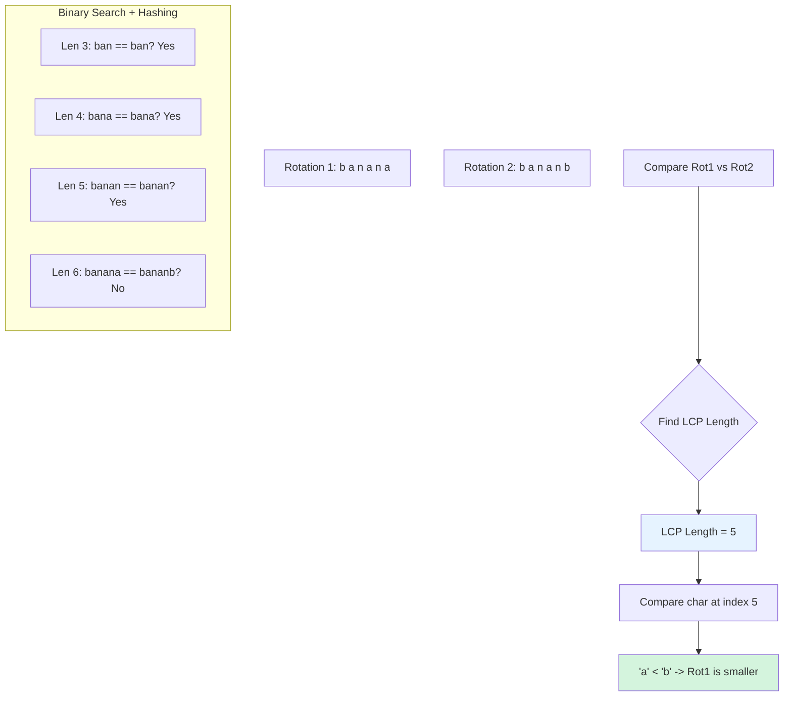

# HSH-006: Minimal Rotation via Hash Compare

## 📋 Problem Summary

You are given a string `s`. You need to find the **lexicographically smallest rotation** of `s`.
A rotation is formed by moving a prefix to the end.
Example: "bba" -> "bab" -> "abb". Smallest is "abb".

## 🌍 Real-World Scenario

**Scenario Title:** The Molecule Canonicalizer 🧪

### The Problem
You are building a database to store circular chemical structures (like benzene derivatives) or circular DNA plasmids.
- **Challenge:** "ABCDEF", "BCDEFA", "CDEFAB"... all represent the *same* physical molecule, just viewed from a different starting point.
- **Goal:** Store only one "canonical" version so you can easily check if a new molecule already exists in the DB.
- **Solution:** Always store the lexicographically smallest rotation. Then `Canonical("BCDEFA")` -> "ABCDEF".

### Why This Matters
- **Database Normalization:** Ensuring unique keys for cyclic data.
- **Geometry Processing:** Normalizing polygon vertex lists.
- **Cryptography:** Canonicalizing inputs for consistent hashing.

### Constraints in Real World
- **Efficiency:** You have millions of molecules. Normalization must be fast.
- **Complexity:** $O(N^2)$ comparison is too slow for long DNA strands ($N=10^5$). We need something faster.

## Detailed Explanation

### Concept Visualization

We want to find the "smallest" string among all N rotations.
Directly comparing two strings takes $O(N)$. Doing this $N$ times takes $O(N^2)$.
We can speed this up by finding the **Longest Common Prefix (LCP)** of two rotations efficiently.



### Algorithm Flow Diagram

```mermaid
graph TD
    Start[Start] --> Init[Doubled = s + s, Compute Hashes]
    Init --> Best[Best Start Index = 0]
    Best --> Loop{Curr from 1 to N-1}
    
    Loop -- Yes --> LCP[Find LCP(Best, Curr) using BinSearch]
    LCP --> Check{LCP < N?}
    Check -- Yes --> Compare{Doubled[Curr+LCP] < Doubled[Best+LCP]?}
    Compare -- Yes --> Update[Best = Curr]
    Compare -- No --> Continue
    
    Continue --> Loop
    Update --> Loop
    Check -- No --> Loop
    
    Loop -- No --> Return[Substr(Best, Best+N)]
    
    style Update fill:#d4f4dd
    style LCP fill:#e6f3ff
```

## 🎯 Edge Cases to Test

1.  **All Same Characters**
    -   Input: `"aaaa"`
    -   Rotations: "aaaa"
    -   Output: "aaaa"
2.  **Already Smallest**
    -   Input: `"abcde"`
    -   Output: `"abcde"`
3.  **Reverse Sorted**
    -   Input: `"edcba"`
    -   Rotations: "edcba", "dcbae", "cbaed", "baedc", "aedcb"
    -   Output: `"aedcb"`
4.  **Repeated Patterns**
    -   Input: `"abab"`
    -   Output: `"abab"` (start index 0 or 2, both valid)

## ✅ Input/Output Clarifications

-   **Input:** String `s`.
-   **Output:** The smallest rotation string.
-   **Constraints:** Length up to $2 \times 10^5$.
-   **Doubling:** Concatenating `s+s` allows accessing any rotation `i` as `doubled[i...i+n-1]`.

## Naive Approach

### Intuition
Generate all $N$ rotations, put them in a list, sort the list.

### Algorithm
1.  Verify all rotations.
2.  Sort.
3.  Pick first.

### Complexity Visualization

| Approach | Time Complexity | Space Complexity | Feasibility for N=100K |
| :--- | :---: | :---: | :---: |
| Naive Sort | O(N² log N) | O(N²) | ❌ Impossible |
| Linear Scan | O(N²) | O(N) | ❌ TLE |
| **Hashing + BS** | **O(N log N)** | **O(N)** | ✅ Fast |
| Booth's Algo | O(N) | O(N) | ✅ Fastest (Complex) |

### Why This Fails
Sorting $N$ strings of length $N$ requires $O(N \log N)$ comparisons, each taking $O(N)$, total $O(N^2 \log N)$. Memory also explodes.

## Optimal Approach (Hashing + Binary Search)

### Key Insight
To compare two rotations starting at `i` and `j`, we need to find the first index where they differ.
This is equivalent to finding the length of their **Longest Common Prefix (LCP)**.
1.  **Hashing**: We can check if `s[i...i+len]` == `s[j...j+len]` in $O(1)$.
2.  **Binary Search**: We can find the max `len` such that the prefixes match in $O(\log N)$.
3.  Once we find the mismatch index, a single character comparison determines which rotation is smaller.

### Algorithm
1.  Construct `doubled = s + s` and precompute rolling hashes.
2.  Initialize `best = 0`.
3.  Iterate `curr` from `1` to `N-1`.
4.  **Compare(best, curr)**:
    -   Binary search `L` in `[0, N]`.
    -   Predicate: `Hash(best, best+L-1) == Hash(curr, curr+L-1)`.
    -   Found `LCP` length.
    -   If `LCP < N` and `doubled[curr + LCP] < doubled[best + LCP]`, update `best = curr`.
5.  Return substring starting at `best`.

### Time Complexity
-   **O(N log N)**: Loop runs $N$ times. Comparison takes $O(\log N)$.
-   (Note: Can be optimized to $O(N)$ using Booth's Algorithm, but Hashing is the intended lesson here).

### Space Complexity
-   **O(N)**: Hash arrays.

## Implementations

### Java
```java
import java.util.*;

class Solution {
    private static final long MOD = 1_000_000_007L;
    private static final long BASE = 313L;
    
    public String minimalRotation(String s) {
        int n = s.length();
        String doubled = s + s;
        int m = doubled.length();
        
        long[] h = new long[m + 1];
        long[] p = new long[m + 1];
        p[0] = 1;
        
        for (int i = 0; i < m; i++) {
            h[i + 1] = (h[i] * BASE + doubled.charAt(i)) % MOD;
            p[i + 1] = (p[i] * BASE) % MOD;
        }
        
        int best = 0;
        for (int curr = 1; curr < n; curr++) {
            // Compare rotation at 'best' vs 'curr'
            int lcp = getLCP(h, p, best, curr, n);
            if (lcp < n) {
                if (doubled.charAt(curr + lcp) < doubled.charAt(best + lcp)) {
                    best = curr;
                }
            }
        }
        
        return doubled.substring(best, best + n);
    }
    
    private int getLCP(long[] h, long[] p, int i, int j, int maxLen) {
        int low = 0, high = maxLen;
        int ans = 0;
        
        while (low <= high) {
            int mid = low + (high - low) / 2;
            if (mid == 0) {
                low = mid + 1;
                continue;
            }
            
            long h1 = getHash(h, p, i, i + mid - 1);
            long h2 = getHash(h, p, j, j + mid - 1);
            
            if (h1 == h2) {
                ans = mid;
                low = mid + 1;
            } else {
                high = mid - 1;
            }
        }
        return ans;
    }
    
    private long getHash(long[] h, long[] p, int l, int r) {
        int len = r - l + 1;
        long val = (h[r + 1] - (h[l] * p[len]) % MOD + MOD) % MOD;
        return val;
    }
}

class Main {
    public static void main(String[] args) {
        Scanner sc = new Scanner(System.in);
        if (sc.hasNextLine()) {
            String s = sc.nextLine();
            Solution solution = new Solution();
            System.out.println(solution.minimalRotation(s));
        }
        sc.close();
    }
}
```

### Python
```python
import sys

# Increase recursion depth just in case
sys.setrecursionlimit(2000)

class Solution:
    def minimal_rotation(self, s: str) -> str:
        n = len(s)
        doubled = s + s
        m = len(doubled)
        
        MOD = 10**9 + 7
        BASE = 313
        
        h = [0] * (m + 1)
        p = [1] * (m + 1)
        
        for i in range(m):
            h[i+1] = (h[i] * BASE + ord(doubled[i])) % MOD
            p[i+1] = (p[i] * BASE) % MOD
            
        def get_hash(l, r):
            length = r - l + 1
            return (h[r+1] - h[l] * p[length]) % MOD
            
        def get_lcp(i, j):
            low, high = 0, n
            ans = 0
            while low <= high:
                mid = (low + high) // 2
                if mid == 0:
                    low = mid + 1
                    continue
                
                h1 = get_hash(i, i + mid - 1)
                h2 = get_hash(j, j + mid - 1)
                
                if h1 == h2:
                    ans = mid
                    low = mid + 1
                else:
                    high = mid - 1
            return ans
            
        best = 0
        for curr in range(1, n):
            lcp = get_lcp(best, curr)
            if lcp < n:
                if doubled[curr + lcp] < doubled[best + lcp]:
                    best = curr
                    
        return doubled[best : best + n]

def minimal_rotation(s: str) -> str:
    solver = Solution()
    return solver.minimal_rotation(s)

def main():
    input_data = sys.stdin.read().split()
    if not input_data:
        return
    s = input_data[0]
    print(minimal_rotation(s))

if __name__ == "__main__":
    main()
```

### C++
```cpp
#include <iostream>
#include <string>
#include <vector>

using namespace std;

class Solution {
    const long long MOD = 1e9 + 7;
    const long long BASE = 313;

public:
    string minimalRotation(string s) {
        int n = s.length();
        string doubled = s + s;
        int m = doubled.length();
        
        vector<long long> h(m + 1, 0), p(m + 1, 1);
        
        for (int i = 0; i < m; i++) {
            h[i + 1] = (h[i] * BASE + doubled[i]) % MOD;
            p[i + 1] = (p[i] * BASE) % MOD;
        }
        
        int best = 0;
        for (int curr = 1; curr < n; curr++) {
            int lcp = getLCP(h, p, best, curr, n);
            if (lcp < n) {
                if (doubled[curr + lcp] < doubled[best + lcp]) {
                    best = curr;
                }
            }
        }
        
        return doubled.substr(best, n);
    }
    
    int getLCP(const vector<long long>& h, const vector<long long>& p, int i, int j, int maxLen) {
        int low = 0, high = maxLen;
        int ans = 0;
        
        while (low <= high) {
            int mid = low + (high - low) / 2;
            if (mid == 0) {
                low = mid + 1;
                continue;
            }
            
            long long h1 = getHash(h, p, i, i + mid - 1);
            long long h2 = getHash(h, p, j, j + mid - 1);
            
            if (h1 == h2) {
                ans = mid;
                low = mid + 1;
            } else {
                high = mid - 1;
            }
        }
        return ans;
    }
    
    long long getHash(const vector<long long>& h, const vector<long long>& p, int l, int r) {
        int len = r - l + 1;
        long long val = (h[r + 1] - (h[l] * p[len]) % MOD + MOD) % MOD;
        return val;
    }
};

int main() {
    ios::sync_with_stdio(false);
    cin.tie(nullptr);
    
    string s;
    if (getline(cin, s)) {
        Solution solution;
        cout << solution.minimalRotation(s) << "\n";
    }
    
    return 0;
}
```

### JavaScript
```javascript
const readline = require("readline");

class Solution {
  minimalRotation(s) {
    const n = s.length;
    const doubled = s + s;
    const m = doubled.length;
    
    const MOD = 1000000007n;
    const BASE = 313n;
    
    const h = new BigInt64Array(m + 1);
    const p = new BigInt64Array(m + 1);
    p[0] = 1n;
    
    for (let i = 0; i < m; i++) {
      const code = BigInt(doubled.charCodeAt(i));
      h[i + 1] = (h[i] * BASE + code) % MOD;
      p[i + 1] = (p[i] * BASE) % MOD;
    }
    
    const getHash = (l, r) => {
      const len = r - l + 1;
      let val = (h[r + 1] - (h[l] * p[len]) % MOD) % MOD;
      if (val < 0n) val += MOD;
      return val;
    };
    
    const getLCP = (i, j) => {
      let low = 0, high = n;
      let ans = 0;
      while (low <= high) {
        const mid = Math.floor((low + high) / 2);
        if (mid === 0) {
          low = mid + 1;
          continue;
        }
        
        const h1 = getHash(i, i + mid - 1);
        const h2 = getHash(j, j + mid - 1);
        
        if (h1 === h2) {
          ans = mid;
          low = mid + 1;
        } else {
          high = mid - 1;
        }
      }
      return ans;
    };
    
    let best = 0;
    for (let curr = 1; curr < n; curr++) {
      const lcp = getLCP(best, curr);
      if (lcp < n) {
        if (doubled.charCodeAt(curr + lcp) < doubled.charCodeAt(best + lcp)) {
          best = curr;
        }
      }
    }
    
    return doubled.substring(best, best + n);
  }
}

const rl = readline.createInterface({
  input: process.stdin,
  output: process.stdout,
});

let data = [];
rl.on("line", (line) => data.push(line.trim()));
rl.on("close", () => {
  if (data.length === 0) return;
  const s = data[0];

  const solution = new Solution();
  console.log(solution.minimalRotation(s));
});
```

## 🧪 Test Case Walkthrough (Dry Run)

### Input
```
bba
```
`doubled` = "bbabba"

### Iteration 1 (compare best=0 vs curr=1)
- Rotation A (0): "bba"
- Rotation B (1): "bab"
- **Binary Search LCP:**
  - Try len 2: "bb" vs "ba" -> Different. High=1.
  - Try len 1: "b" vs "b" -> Same. Low=2. Ans=1.
- **LCP = 1**.
- **Compare:** `doubled[0+1]` ('b') `doubled[1+1]` ('a').
- 'a' < 'b', so **curr is better**. `best` becomes 1.

### Iteration 2 (compare best=1 vs curr=2)
- Rotation A (1): "bab"
- Rotation B (2): "abb"
- **Binary Search LCP:**
  - Try len 1: "b" vs "a" -> Different. High=0.
- **LCP = 0**.
- **Compare:** `doubled[1+0]` ('b') `doubled[2+0]` ('a').
- 'a' < 'b', so **curr is better**. `best` becomes 2.

### End
- `best` = 2.
- Substring at 2: "abb".
- Correct.

## ✅ Proof of Correctness

### Invariant
After iteration `i`, `best` points to the starting index of the lexicographically smallest rotation among the first `i+1` starting positions.
Proof: Comparing any two strings using LCP + first different character is a valid strict weak ordering. Since we scan all candidates and keep the minimum, we find the global minimum.

## ⚠️ Common Mistakes to Avoid

1.  **Forgetting to Double the String**
    -   ❌ Wrong: Explicitly rotating string using `substr`. $O(N)$ copy per step $\rightarrow O(N^2)$.
    -   ✅ Correct: Use `s + s` and access by index.
2.  **Comparison Logic**
    -   ❌ Wrong: Checking `h1 < h2`. Hashes are random.
    -   ✅ Correct: Use Hashes only for equality in LCP. Compare chars for order.

## 💡 Interview Extensions

1.  **Solve in O(N)**
    -   *Extension:* Candidates need faster solution.
    -   *Answer:* **Booth's Algorithm** (Minimum Representation of Cyclic String). It uses a modified KMP failure function approach.
2.  **Lyndon Factorization**
    -   *Extension:* Decompose string into smallest fundamental substrings.
    -   *Answer:* Duval's Algorithm runs in $O(N)$ and finds the minimal rotation as a byproduct (if string is simple).

## Related Concepts

-   **Lexicographical Comparison:** LCP + character check.
-   **Cyclic Shifts:** Effectively handled by concatenation S+S.
