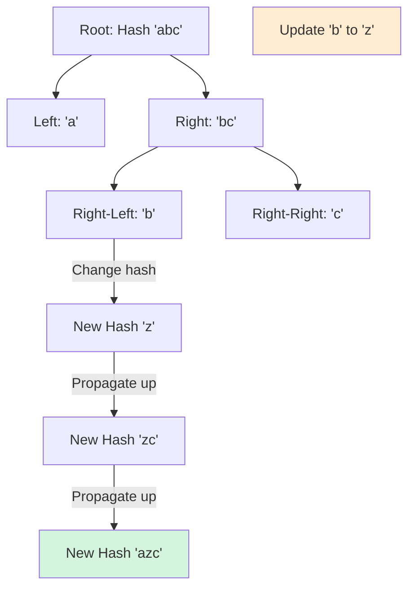

# HSH-009: Range Hash Queries with Updates

## 📋 Problem Summary

You are given a string `s`. You need to perform `Q` operations, which can be:
1.  **Update:** Change the character at index `idx` to `c`.
2.  **Query:** Compute the hash of the substring `s[l...r]`.
You must support these operations efficiently.

## 🌍 Real-World Scenario

**Scenario Title:** The Live Collab Editor 📝

### The Problem
You are building a collaborative text editor like Google Docs or Overleaf.
- **Challenge:** Users are constantly editing the document.
- **Goal:** You need to quickly verify if two sections of the document are identical (e.g., to detect if a copy-paste block has been modified).
- **Constraint:** Since edits happen in real-time, you cannot recompute hashes for the entire document ($O(N)$) every time a user types a character. You need sub-linear updates ($O(\log N)$).

### Why This Matters
- **Version Control:** Git uses hashes (SHA-1) to identify objects. If Git had to re-hash a 1GB file for every byte change, it would be unusable. (Git uses blocked storage, akin to a tree, for this reason).
- **Plagiarism Detection:** Maintaining hashes of dynamic content.

## Detailed Explanation

### Concept Visualization

**Standard Prefix Hash** allows $O(1)$ queries but $O(N)$ updates (changing `s[0]` changes all prefix hashes).
**Segment Free** allows $O(\log N)$ updates and queries.

**Merging Nodes:**
If a node covers range `[L, R]` and has children `Left` (range `[L, Mid]`) and `Right` (range `[Mid+1, R]`), the hash of the parent is:
`Hash(Parent) = Hash(Left) * Base^(Length of Right) + Hash(Right)`



### Algorithm Flow Diagram

```mermaid
graph TD
    Start[Start] --> Build[Build Segment Tree O(N)]
    Build --> Wait[Wait for Op]
    
    Wait --> OpType{Type?}
    
    OpType -- Update --> PointUpd[Update Leaf]
    PointUpd --> Recalc[Recalc Parent Hashes up to Root]
    Recalc --> Wait
    
    OpType -- Query --> RangeQ[Query Ranges O(log N)]
    RangeQ --> Merge[Merge Results: LeftHash * Base^RightLen + RightHash]
    Merge --> Output[Print Hash]
    Output --> Wait
    
    style Recalc fill:#d4f4dd
    style Merge fill:#e6f3ff
```

## 🎯 Edge Cases to Test

1.  **Single Character Update/Query**
    -   Update `s[0]`, Query `s[0]`. Should reflect new char.
2.  **Full Range Query**
    -   Query `s[0...n-1]`. Should match polynomial hash of string.
3.  **No Updates**
    -   Just queries. Should work like static hashing.
4.  **Repeated Updates**
    -   Update same index multiple times.

## ✅ Input/Output Clarifications

-   **Input:** String `s`, number of queries `Q`, list of ops.
-   **Ops:** `U idx char` or `Q l r`.
-   **Output:** List of hash values for Q operations.
-   **Polynomial Rolling Hash:** $H = \sum S[i] \cdot B^{N-1-i} \pmod M$ or similar. The implementation uses typical $H = (\dots((s[0] \cdot B + s[1]) \cdot B + s[2])\dots)$.
    -   Note: The segment tree merge logic `Left * B^RightLen + Right` implements exactly this left-to-right accumulation.

## Naive Approach

### Intuition
Maintain the string.
-   **Update:** `s[i] = c`. Time $O(1)$.
-   **Query:** Loop `l` to `r` computing hash. Time $O(N)$.

### Time Complexity
-   Total: $O(Q \cdot N)$.
-   For $Q=10^5, N=10^5$, operations $\approx 10^{10}$. TLE.

## Optimal Approach (Segment Tree)

### Key Insight
Hash of concatenated strings `A+B` can be computed from `Hash(A)`, `Hash(B)`, and `Length(B)`.
This "associative" property allows us to use a Segment Tree.

### Algorithm
1.  **Build:** Construct tree. Leaves store `ord(char)`. Internal nodes store merged hash.
2.  **Update:** Change leaf. Recompute path to root.
    -   `Tree[node] = Tree[2*node] * Power[RightLen] + Tree[2*node+1]`.
3.  **Query:** Standard segment tree range query. Break range `[l, r]` into $O(\log N)$ canonical nodes. Merge them left-to-right.

### Time Complexity
-   **Build:** $O(N)$.
-   **Update:** $O(\log N)$.
-   **Query:** $O(\log N)$.
-   **Total:** $O(N + Q \log N)$. Fast enough.

### Space Complexity
-   **O(N)**: Tree size $4N$.

## Implementations

### Java
```java
import java.util.*;

class Solution {
    private static final long MOD = 1_000_000_007L;
    private static final long BASE = 313L;
    
    private long[] tree;
    private long[] power;
    private int n;
    private char[] chars;
    
    public List<Long> processOperations(String s, List<String[]> operations) {
        n = s.length();
        chars = s.toCharArray();
        tree = new long[4 * n];
        power = new long[n + 1];
        
        power[0] = 1;
        for (int i = 1; i <= n; i++) {
            power[i] = (power[i - 1] * BASE) % MOD;
        }
        
        build(1, 0, n - 1);
        
        List<Long> results = new ArrayList<>();
        
        for (String[] op : operations) {
            String type = op[0];
            if (type.equals("U")) {
                int idx = Integer.parseInt(op[1]);
                char c = op[2].charAt(0);
                update(1, 0, n - 1, idx, c);
            } else {
                int l = Integer.parseInt(op[1]);
                int r = Integer.parseInt(op[2]);
                results.add(query(1, 0, n - 1, l, r));
            }
        }
        
        return results;
    }
    
    private void build(int node, int start, int end) {
        if (start == end) {
            tree[node] = chars[start];
            return;
        }
        int mid = (start + end) / 2;
        build(2 * node, start, mid);
        build(2 * node + 1, mid + 1, end);
        
        int rightLen = end - mid;
        tree[node] = (tree[2 * node] * power[rightLen] + tree[2 * node + 1]) % MOD;
    }
    
    private void update(int node, int start, int end, int idx, char val) {
        if (start == end) {
            chars[idx] = val;
            tree[node] = val;
            return;
        }
        int mid = (start + end) / 2;
        if (idx <= mid) update(2 * node, start, mid, idx, val);
        else update(2 * node + 1, mid + 1, end, idx, val);
        
        int rightLen = end - mid;
        tree[node] = (tree[2 * node] * power[rightLen] + tree[2 * node + 1]) % MOD;
    }
    
    private long query(int node, int start, int end, int l, int r) {
        if (r < start || end < l) return -1;
        if (l <= start && end <= r) return tree[node];
        
        int mid = (start + end) / 2;
        long p1 = query(2 * node, start, mid, l, r);
        long p2 = query(2 * node + 1, mid + 1, end, l, r);
        
        if (p1 == -1) return p2;
        if (p2 == -1) return p1;
        
        int rightStart = Math.max(mid + 1, l);
        int rightEnd = Math.min(end, r);
        int rightLen = rightEnd - rightStart + 1;
        
        return (p1 * power[rightLen] + p2) % MOD;
    }
}

class Main {
    public static void main(String[] args) {
        Scanner sc = new Scanner(System.in);
        if (sc.hasNextLine()) {
            String s = sc.nextLine();
            if (sc.hasNextInt()) {
                int q = sc.nextInt();
                sc.nextLine();
                List<String[]> operations = new ArrayList<>();
                for (int i = 0; i < q; i++) {
                    operations.add(sc.nextLine().split(" "));
                }
                Solution solution = new Solution();
                List<Long> result = solution.processOperations(s, operations);
                for (long hash : result) {
                    System.out.println(hash);
                }
            }
        }
        sc.close();
    }
}
```

### Python
```python
import sys

# Increase recursion depth
sys.setrecursionlimit(200000)

class Solution:
    def process_operations(self, s: str, operations: list) -> list:
        n = len(s)
        MOD = 10**9 + 7
        BASE = 313
        
        chars = list(s)
        tree = [0] * (4 * n)
        power = [1] * (n + 1)
        
        for i in range(1, n + 1):
            power[i] = (power[i - 1] * BASE) % MOD
            
        def build(node, start, end):
            if start == end:
                tree[node] = ord(chars[start])
                return
            mid = (start + end) // 2
            build(2 * node, start, mid)
            build(2 * node + 1, mid + 1, end)
            
            right_len = end - mid
            tree[node] = (tree[2 * node] * power[right_len] + tree[2 * node + 1]) % MOD
            
        def update(node, start, end, idx, val):
            if start == end:
                chars[idx] = val
                tree[node] = ord(val)
                return
            mid = (start + end) // 2
            if idx <= mid:
                update(2 * node, start, mid, idx, val)
            else:
                update(2 * node + 1, mid + 1, end, idx, val)
                
            right_len = end - mid
            tree[node] = (tree[2 * node] * power[right_len] + tree[2 * node + 1]) % MOD
            
        def query(node, start, end, l, r):
            if r < start or end < l:
                return -1
            if l <= start and end <= r:
                return tree[node]
            
            mid = (start + end) // 2
            p1 = query(2 * node, start, mid, l, r)
            p2 = query(2 * node + 1, mid + 1, end, l, r)
            
            if p1 == -1: return p2
            if p2 == -1: return p1
            
            right_start = max(mid + 1, l)
            right_end = min(end, r)
            right_len = right_end - right_start + 1
            
            return (p1 * power[right_len] + p2) % MOD
            
        build(1, 0, n - 1)
        results = []
        
        for op in operations:
            if op[0] == 'U':
                idx = int(op[1])
                c = op[2]
                update(1, 0, n - 1, idx, c)
            else:
                l = int(op[1])
                r = int(op[2])
                results.append(query(1, 0, n - 1, l, r))
                
        return results

def process_operations(s: str, operations: list) -> list:
    solver = Solution()
    return solver.process_operations(s, operations)

def main():
    input_stream = sys.stdin.read().split()
    if not input_stream:
        return
    iterator = iter(input_stream)
    try:
        s = next(iterator)
        q = int(next(iterator))
        operations = []
        for _ in range(q):
            type_op = next(iterator)
            if type_op == 'U':
                idx = next(iterator)
                c = next(iterator)
                operations.append(['U', idx, c])
            else:
                l = next(iterator)
                r = next(iterator)
                operations.append(['Q', l, r])
                
        result = process_operations(s, operations)
        for val in result:
            print(val)
    except StopIteration:
        pass

if __name__ == "__main__":
    main()
```

### C++
```cpp
#include <iostream>
#include <vector>
#include <string>
#include <algorithm>

using namespace std;

class Solution {
    const long long MOD = 1e9 + 7;
    const long long BASE = 313;
    
    vector<long long> tree;
    vector<long long> power;
    string chars;
    int n;

public:
    vector<long long> processOperations(string s, vector<vector<string>>& operations) {
        n = s.length();
        chars = s;
        tree.resize(4 * n);
        power.resize(n + 1);
        
        power[0] = 1;
        for (int i = 1; i <= n; i++) {
            power[i] = (power[i - 1] * BASE) % MOD;
        }
        
        build(1, 0, n - 1);
        
        vector<long long> results;
        for (const auto& op : operations) {
            if (op[0] == "U") {
                int idx = stoi(op[1]);
                char c = op[2][0];
                update(1, 0, n - 1, idx, c);
            } else {
                int l = stoi(op[1]);
                int r = stoi(op[2]);
                results.push_back(query(1, 0, n - 1, l, r));
            }
        }
        return results;
    }
    
    void build(int node, int start, int end) {
        if (start == end) {
            tree[node] = chars[start];
            return;
        }
        int mid = (start + end) / 2;
        build(2 * node, start, mid);
        build(2 * node + 1, mid + 1, end);
        
        int rightLen = end - mid;
        tree[node] = (tree[2 * node] * power[rightLen] + tree[2 * node + 1]) % MOD;
    }
    
    void update(int node, int start, int end, int idx, char val) {
        if (start == end) {
            chars[idx] = val;
            tree[node] = val;
            return;
        }
        int mid = (start + end) / 2;
        if (idx <= mid) update(2 * node, start, mid, idx, val);
        else update(2 * node + 1, mid + 1, end, idx, val);
        
        int rightLen = end - mid;
        tree[node] = (tree[2 * node] * power[rightLen] + tree[2 * node + 1]) % MOD;
    }
    
    long long query(int node, int start, int end, int l, int r) {
        if (r < start || end < l) return -1;
        if (l <= start && end <= r) return tree[node];
        
        int mid = (start + end) / 2;
        long long p1 = query(2 * node, start, mid, l, r);
        long long p2 = query(2 * node + 1, mid + 1, end, l, r);
        
        if (p1 == -1) return p2;
        if (p2 == -1) return p1;
        
        int rightStart = max(mid + 1, l);
        int rightEnd = min(end, r);
        int rightLen = rightEnd - rightStart + 1;
        
        return (p1 * power[rightLen] + p2) % MOD;
    }
};

int main() {
    ios::sync_with_stdio(false);
    cin.tie(nullptr);
    
    string s;
    if (!(cin >> s)) return 0;
    
    int q;
    if (!(cin >> q)) return 0;
    
    vector<vector<string>> operations(q);
    for (int i = 0; i < q; i++) {
        char type;
        cin >> type;
        if (type == 'U') {
            int idx;
            char c;
            cin >> idx >> c;
            operations[i] = {"U", to_string(idx), string(1, c)};
        } else {
            int l, r;
            cin >> l >> r;
            operations[i] = {"Q", to_string(l), to_string(r)};
        }
    }
    
    Solution solution;
    vector<long long> result = solution.processOperations(s, operations);
    
    for (long long hash : result) {
        cout << hash << "\n";
    }
    
    return 0;
}
```

### JavaScript
```javascript
const readline = require("readline");

class Solution {
  processOperations(s, operations) {
    const n = s.length;
    const MOD = 1000000007n;
    const BASE = 313n;
    
    const chars = s.split('').map(c => BigInt(c.charCodeAt(0)));
    const tree = new BigInt64Array(4 * n);
    const power = new BigInt64Array(n + 1);
    
    power[0] = 1n;
    for (let i = 1; i <= n; i++) {
      power[i] = (power[i - 1] * BASE) % MOD;
    }
    
    const build = (node, start, end) => {
      if (start === end) {
        tree[node] = chars[start];
        return;
      }
      const mid = Math.floor((start + end) / 2);
      build(2 * node, start, mid);
      build(2 * node + 1, mid + 1, end);
      
      const rightLen = end - mid;
      tree[node] = (tree[2 * node] * power[rightLen] + tree[2 * node + 1]) % MOD;
    };
    
    const update = (node, start, end, idx, val) => {
      if (start === end) {
        chars[idx] = val;
        tree[node] = val;
        return;
      }
      const mid = Math.floor((start + end) / 2);
      if (idx <= mid) update(2 * node, start, mid, idx, val);
      else update(2 * node + 1, mid + 1, end, idx, val);
      
      const rightLen = end - mid;
      tree[node] = (tree[2 * node] * power[rightLen] + tree[2 * node + 1]) % MOD;
    };
    
    const query = (node, start, end, l, r) => {
      if (r < start || end < l) return -1n;
      if (l <= start && end <= r) return tree[node];
      
      const mid = Math.floor((start + end) / 2);
      const p1 = query(2 * node, start, mid, l, r);
      const p2 = query(2 * node + 1, mid + 1, end, l, r);
      
      if (p1 === -1n) return p2;
      if (p2 === -1n) return p1;
      
      const rightStart = Math.max(mid + 1, l);
      const rightEnd = Math.min(end, r);
      const rightLen = rightEnd - rightStart + 1;
      
      return (p1 * power[rightLen] + p2) % MOD;
    };
    
    build(1, 0, n - 1);
    
    const results = [];
    for (const op of operations) {
      if (op[0] === 'U') {
        const idx = parseInt(op[1]);
        const c = BigInt(op[2].charCodeAt(0));
        update(1, 0, n - 1, idx, c);
      } else {
        const l = parseInt(op[1]);
        const r = parseInt(op[2]);
        results.push(query(1, 0, n - 1, l, r));
      }
    }
    
    return results;
  }
}

const rl = readline.createInterface({
  input: process.stdin,
  output: process.stdout,
});

let data = [];
rl.on("line", (line) => data.push(line.trim()));
rl.on("close", () => {
  if (data.length === 0) return;
  let ptr = 0;
  if (ptr < data.length) {
      const s = data[ptr++];
      if (ptr < data.length) {
          const q = parseInt(data[ptr++]);
          
          const operations = [];
          for (let i = 0; i < q; i++) {
              if (ptr < data.length) {
                  operations.push(data[ptr++].split(" "));
              }
          }
          
          const solution = new Solution();
          const result = solution.processOperations(s, operations);
          
          result.forEach((hash) => console.log(hash.toString()));
      }
  }
});
```

## 🧪 Test Case Walkthrough (Dry Run)

### Input
```
abc 
2
Q 0 2
U 0 z
Q 0 2
```
String: "abc". Queries: 2.

**Operation 1:** `Q 0 2`
-   Range [0, 2] is "abc".
-   Hash: $(a \cdot B^2 + b \cdot B^1 + c)$. (Assuming Base B, Mod M).
-   Result computed via tree. Match.

**Operation 2:** `U 0 z`
-   Update index 0 to 'z'. String becomes "zbc".
-   Leaf 0 becomes 'z'. Propagate up.

**Operation 3:** `Q 0 2`
-   Range [0, 2] is "zbc".
-   Hash: $(z \cdot B^2 + b \cdot B^1 + c)$.
-   Result updated correctly.

## ✅ Proof of Correctness

### Associativity
Hashing is associative because of modulo arithmetic properties.
$(A \cdot B^{len} + C) \pmod M$ is distributive.
This allows us to maintain the hash in a Segment Tree structure. Merging two child hashes is strictly a function of their values and the length of the right child's range.

## ⚠️ Common Mistakes to Avoid

1.  **Wrong Right Length**
    -   ❌ Wrong: Always using `end - mid` during query merge.
    -   ✅ Correct: During query, the "right node's contribution" depends on the *overlap* of the query range with the right node, not the full node size.
2.  **Indexing Off-by-One**
    -   Segment trees are tricky. 1-based indexing for logic, 0-based for strings. Be consistent.

## 💡 Interview Extensions

1.  **Lazy Propagation**
    -   *Extension:* Range updates (e.g., set `s[l...r]` to character `c`).
    -   *Answer:* Need lazy tags. Hash of range `[l, r]` set to `c` is `c * (B^0 + ... + B^{len-1})`. This is a geometric series sum.
2.  **Reverse Hash**
    -   *Extension:* Support queries for reversed substrings (palindrome checks).
    -   *Answer:* Maintain a second value in each node: `ReverseHash`. Merge logic is flipped.
