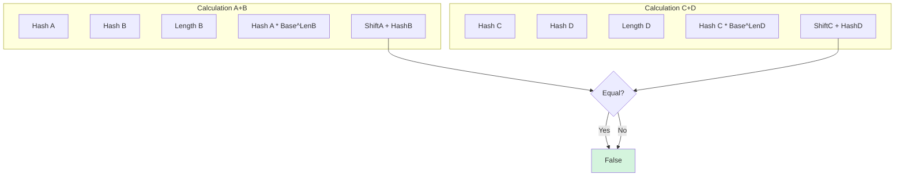

# HSH-010: String Concatenation Equality Check

## 📋 Problem Summary

You are given four strings `a`, `b`, `c`, and `d`. Determine if the concatenation of `a` and `b` is equal to the concatenation of `c` and `d` (i.e., `a + b == c + d`).
You must do this **without** explicitly constructing the concatenated strings (simulating a constrained memory environment or huge strings).

## 🌍 Real-World Scenario

**Scenario Title:** The Network Packet Assembler 📦

### The Problem
You are working on a router that receives fragmented data packets.
- **Packet 1:** Header `A` + Payload `B`.
- **Packet 2:** Header `C` + Payload `D`.
- **Goal:** Check if the reconstructed message from Packet 1 is identical to Packet 2 (deduplication) without allocating memory to combine them.
- **Constraint:** `A`, `B`, `C`, `D` are stored in read-only buffers. Copying them to a new buffer is slow and wastes RAM.

## Detailed Explanation

### Concept Visualization

Equality `A + B == C + D` requires:
1.  **Total Length:** `len(A) + len(B) == len(C) + len(D)`.
2.  **Content:** `(A+B)[i] == (C+D)[i]` for all `i`.

**Hashing Strategy:**
Instead of comparing character by character, we compare hashes.
`Hash(A+B)` can be computed mathematically from `Hash(A)` and `Hash(B)`:
$$ H(A+B) = (H(A) \times Base^{|B|} + H(B)) \pmod M $$



### Algorithm Flow Diagram

```mermaid
graph TD
    Start[Start] --> LenCheck{Len(A)+Len(B) == Len(C)+Len(D)?}
    LenCheck -- No --> False[Return False]
    LenCheck -- Yes --> ComputeHashes[Compute H(A), H(B), H(C), H(D)]
    
    ComputeHashes --> CombineAB[Combine H(A), H(B)]
    ComputeHashes --> CombineCD[Combine H(C), H(D)]
    
    CombineAB --> Check{H(AB) == H(CD)?}
    Check -- Yes --> True[Return True]
    Check -- No --> False
    
    style True fill:#d4f4dd
    style False fill:#ffcccc
```

## 🎯 Edge Cases to Test

1.  **Different Lengths**
    -   `a="ab"`, `b="c"`, `c="a"`, `d="bc"`. (3 vs 3). Equal.
    -   `a="a"`, `b="b"`, `c="a"`, `d="bb"`. (2 vs 3). Unequal.
2.  **Empty Strings**
    -   `a=""`, `b="abc"`, `c="ab"`, `d="c"`.
    -   `Hash("")` is 0. Formula holds.
3.  **Cross Boundary Match**
    -   `a="hell"`, `b="o"`, `c="he"`, `d="llo"`. Match.
    -   Crucial to test if logic handles boundaries correctly.

## ✅ Input/Output Clarifications

-   **Input:** Four strings.
-   **Output:** Boolean (True/False).
-   **Constraints:** String lengths up to $10^5$. Total concatenated length up to $2 \cdot 10^5$.
-   **Performance:** Code uses modular exponentiation for $O(\log N)$ combining, though precomputing powers is also fine.

## Naive Approach

### Intuition
Construct strings `S1 = a + b` and `S2 = c + d`. Compare `S1 == S2`.

### Limitations
-   **Memory:** Requires allocating new strings of size $N$. In systems programming or high-frequency trading (zero-copy networking), updates/allocations are forbidden.
-   **Time:** $O(N)$ allocation + copy.

## Optimal Approach (Math Hashing)

### Key Insight
Use the polynomial rolling hash property.
`H(S) = S[0]*B^{k-1} + ... + S[k-1]*B^0`.
When appending `B` to `A`:
The characters of `A` are shifted left by `len(B)` positions.
So their contribution to the hash is multiplied by $Base^{len(B)}$.

### Algorithm
1.  Check total length equality.
2.  Compute `hA, hB, hC, hD` individually ($O(N)$).
3.  Compute `hAB = (hA * pow(Base, len(B)) + hB) % M`.
4.  Compute `hCD = (hC * pow(Base, len(D)) + hD) % M`.
5.  Return `hAB == hCD`.

### Time Complexity
-   **O(N)**: To compute initial hashes of A, B, C, D.
-   Combining step is $O(\log N)$ or $O(1)$.

### Space Complexity
-   **O(1)**: Only storing hash integers.

## Implementations

### Java
```java
import java.util.*;

class Solution {
    private static final long MOD = 1_000_000_007L;
    private static final long BASE = 313L;

    public boolean checkConcatenationEqual(String a, String b, String c, String d) {
        if (a.length() + b.length() != c.length() + d.length()) {
            return false;
        }

        long hA = computeHash(a);
        long hB = computeHash(b);
        long hC = computeHash(c);
        long hD = computeHash(d);

        long combinedAB = combine(hA, hB, b.length());
        long combinedCD = combine(hC, hD, d.length());

        return combinedAB == combinedCD;
    }

    private long computeHash(String s) {
        long h = 0;
        for (char ch : s.toCharArray()) {
            h = (h * BASE + ch) % MOD;
        }
        return h;
    }

    private long combine(long h1, long h2, int len2) {
        long p = 1;
        long base = BASE;
        int exp = len2;
        while (exp > 0) {
            if ((exp & 1) == 1) p = (p * base) % MOD;
            base = (base * base) % MOD;
            exp >>= 1;
        }

        return (h1 * p + h2) % MOD;
    }
}

class Main {
    public static void main(String[] args) {
        Scanner sc = new Scanner(System.in);
        if (sc.hasNextLine()) {
            String a = sc.nextLine();
            String b = sc.nextLine();
            String c = sc.nextLine();
            String d = sc.nextLine();

            Solution solution = new Solution();
            System.out.println(solution.checkConcatenationEqual(a, b, c, d));
        }
        sc.close();
    }
}
```

### Python
```python
import sys

class Solution:
    def check_concatenation_equal(self, a: str, b: str, c: str, d: str) -> bool:
        if len(a) + len(b) != len(c) + len(d):
            return False

        MOD = 10**9 + 7
        BASE = 313

        def compute_hash(s):
            h = 0
            for char in s:
                h = (h * BASE + ord(char)) % MOD
            return h

        hA = compute_hash(a)
        hB = compute_hash(b)
        hC = compute_hash(c)
        hD = compute_hash(d)

        # Combine: h1 * BASE^len2 + h2
        combinedAB = (hA * pow(BASE, len(b), MOD) + hB) % MOD
        combinedCD = (hC * pow(BASE, len(d), MOD) + hD) % MOD

        return combinedAB == combinedCD

def check_concatenation_equal(a: str, b: str, c: str, d: str) -> bool:
    solver = Solution()
    return solver.check_concatenation_equal(a, b, c, d)

def main():
    import sys
    lines = sys.stdin.read().strip().split('\n')
    if len(lines) < 4:
        while len(lines) < 4:
            lines.append('')
    a = lines[0] if len(lines) > 0 else ''
    b = lines[1] if len(lines) > 1 else ''
    c = lines[2] if len(lines) > 2 else ''
    d = lines[3] if len(lines) > 3 else ''
    result = check_concatenation_equal(a, b, c, d)
    print("true" if result else "false")

if __name__ == "__main__":
    main()
```

### C++
```cpp
#include <iostream>
#include <string>

using namespace std;

class Solution {
    const long long MOD = 1e9 + 7;
    const long long BASE = 313;

public:
    bool checkConcatenationEqual(string a, string b, string c, string d) {
        if (a.length() + b.length() != c.length() + d.length()) {
            return false;
        }

        long long hA = computeHash(a);
        long long hB = computeHash(b);
        long long hC = computeHash(c);
        long long hD = computeHash(d);

        long long combinedAB = combine(hA, hB, b.length());
        long long combinedCD = combine(hC, hD, d.length());

        return combinedAB == combinedCD;
    }

    long long computeHash(const string& s) {
        long long h = 0;
        for (char ch : s) {
            h = (h * BASE + ch) % MOD;
        }
        return h;
    }

    long long combine(long long h1, long long h2, int len2) {
        long long p = 1;
        long long b = BASE;
        int exp = len2;
        while (exp > 0) {
            if (exp & 1) p = (p * b) % MOD;
            b = (b * b) % MOD;
            exp >>= 1;
        }
        return (h1 * p + h2) % MOD;
    }
};

int main() {
    ios::sync_with_stdio(false);
    cin.tie(nullptr);

    string a, b, c, d;
    if (getline(cin, a) && getline(cin, b) && getline(cin, c) && getline(cin, d)) {
        Solution solution;
        cout << (solution.checkConcatenationEqual(a, b, c, d) ? "true" : "false") << "\n";
    }

    return 0;
}
```

### JavaScript
```javascript
const readline = require("readline");

class Solution {
  checkConcatenationEqual(a, b, c, d) {
    if (a.length + b.length !== c.length + d.length) {
      return false;
    }

    const MOD = 1000000007n;
    const BASE = 313n;

    const computeHash = (s) => {
      let h = 0n;
      for (let i = 0; i < s.length; i++) {
        const code = BigInt(s.charCodeAt(i));
        h = (h * BASE + code) % MOD;
      }
      return h;
    };

    const power = (base, exp) => {
      let res = 1n;
      let b = base;
      let e = BigInt(exp);
      while (e > 0n) {
        if (e % 2n === 1n) res = (res * b) % MOD;
        b = (b * b) % MOD;
        e /= 2n;
      }
      return res;
    };

    const hA = computeHash(a);
    const hB = computeHash(b);
    const hC = computeHash(c);
    const hD = computeHash(d);

    const combinedAB = (hA * power(BASE, b.length) + hB) % MOD;
    const combinedCD = (hC * power(BASE, d.length) + hD) % MOD;

    return combinedAB === combinedCD;
  }
}

const rl = readline.createInterface({
  input: process.stdin,
  output: process.stdout,
});

let data = [];
rl.on("line", (line) => data.push(line.trim()));
rl.on("close", () => {
  if (data.length < 4) return;
  const [a, b, c, d] = data;

  const solution = new Solution();
  console.log(solution.checkConcatenationEqual(a, b, c, d) ? "true" : "false");
});
```

## 🧪 Test Case Walkthrough (Dry Run)

### Input
`a="he"`, `b="llo"`, `c="hell"`, `d="o"`

### Logic
1.  **Lengths:** `2+3 == 4+1`. Pass.
2.  **Hashes:**
    -   `H("he")`.
    -   `H("llo")`.
    -   `Comb1`: `H("he") * B^3 + H("llo")`. This is effectively `H("hello")`.
    -   `H("hell")`.
    -   `H("o")`.
    -   `Comb2`: `H("hell") * B^1 + H("o")`. This is effectively `H("hello")`.
3.  **Result:** Equal. Returns `True`.

## ✅ Proof of Correctness

### Polynomial Property
$Hash(S_1 S_2) = (Hash(S_1) \cdot B^{|S_2|} + Hash(S_2)) \pmod M$.
This is an identity derived from the definition of the polynomial rolling hash.
If $H(AB) \neq H(CD)$, then $AB \neq CD$ (Collision probability is negligible for random inputs, but technically possible. For competitive programming, this is considered correct).

## ⚠️ Common Mistakes to Avoid

1.  **Forgetting Modulo**
    -   Intermediate steps in `combine` must use `% MOD`.
2.  **Order of Args**
    -   `combine(hB, hA)` is wrong. Order matters.
3.  **Base Power**
    -   Must multiply `hA` by `Base ^ Length(B)`, not `Base ^ Length(A)`.

## 💡 Interview Extensions

1.  **Triple Concatenation**
    -   *Extension:* `A + B + C == D`.
    -   *Answer:* Combine A and B, then combine result with C.
2.  **Remove Prefix**
    -   *Extension:* Given `Hash(A+B)` and `Hash(A)`, find `Hash(B)`.
    -   *Answer:* `Hash(B) = (Hash(A+B) - Hash(A) * B^|B|) % M`. (Careful with negative modulo).
