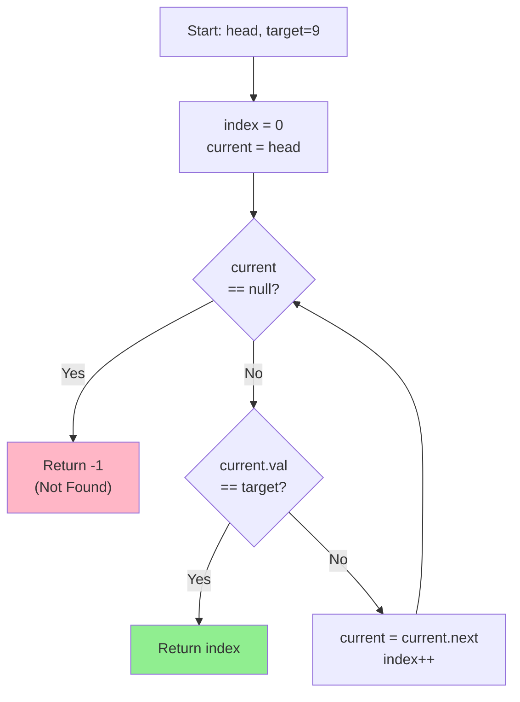

# LNK-002: Campus Badge Search

## 📋 Problem Summary

You are given a singly linked list where each node contains an integer value. You need to find the 0-based index of the **first** occurrence of a specific `target` value. If the target is not found in the list, return `-1`.

## 🌍 Real-World Scenario

**Scenario Title:** The Lost and Found Box

Imagine you work at the campus security desk. Students frequently drop their ID badges. You keep a log of all found badges in the order they were turned in.

A student comes running to your desk, asking, "Is badge #9 here?" You open your logbook (the linked list) and start checking from the first entry. You scan down the list line by line. As soon as you see badge #9, you tell the student, "Yes, it's the 4th item on the list." If you reach the end of the logbook without seeing #9, you say, "Sorry, not found."

**Why This Problem Matters:**

- **Database Lookups:** Searching for a record in a sequential file or a non-indexed database column works exactly like this.
- **Network Packets:** Inspecting a stream of data packets to find a specific header or signature.
- **Inventory Management:** Locating a specific item in a linear storage system.


## Detailed Explanation

### Concept Visualization: Linear Search

We traverse the list node by node, keeping a counter for the current index.

#### Visual List Structure

```
List: 5 -> 1 -> 5 -> 9
Target: 9

Step 0: Index 0, Node: [5], Match? No
Step 1: Index 1, Node: [1], Match? No
Step 2: Index 2, Node: [5], Match? No
Step 3: Index 3, Node: [9], Match? Yes ✓ Return 3
```

### Algorithm Flow Diagram



## ✅ Input/Output Clarifications (Read This Before Coding)

- **0-based Indexing:** The head node is at index 0.
- **First Occurrence:** If the target appears multiple times (like `5` in the example), return the index of the *first* one you encounter.
- **Not Found:** If the traversal reaches `null` without finding the target, return `-1`.

Common interpretation mistake:

- ❌ **Wrong:** Returning the node value instead of the index.
- ✅ **Correct:** Maintaining a separate counter variable `index` that increments with each step.

### Core Concept: Traversal

Traversal is the act of visiting every node in a data structure. For a singly linked list, we can only move in one direction: from `head` to `next`.

## 🎯 Edge Cases to Test

1. **Target at Beginning**
   - Input: List `[9, 1, 5]`, target = 9
   - Expected: 0

2. **Target at End**
   - Input: List `[5, 1, 9]`, target = 9
   - Expected: 2

3. **Target Not Found**
   - Input: List `[5, 1, 3]`, target = 9
   - Expected: -1

4. **Single Element - Found**
   - Input: List `[9]`, target = 9
   - Expected: 0

5. **Single Element - Not Found**
   - Input: List `[5]`, target = 9
   - Expected: -1

6. **Duplicate Values - First Occurrence**
   - Input: List `[5, 9, 5, 9]`, target = 9
   - Expected: 1 (first occurrence)

## Naive Approach

### Intuition

Since the nodes are not sorted and we don't have random access (like an array index), the only way to find an element is to look at each one starting from the beginning.

### Algorithm

1. Initialize `current` pointer to `head`.
2. Initialize `index` counter to 0.
3. Loop while `current` is not `null`:
   - Check if `current.val` equals `target`.
   - If yes, return `index`.
   - Move `current` to `current.next`.
   - Increment `index`.
4. If the loop finishes (we reached the end), return `-1`.

### Time Complexity

- **O(N)**, where N is the number of nodes. In the worst case (target at the end or not present), we visit every node.

### Space Complexity

- **O(1)**. We only use a few variables (`current`, `index`) regardless of the list size.

### Why This Works

This is a standard linear search. It guarantees finding the first occurrence because we check nodes in order from 0 to N-1.

### Limitations

- **Slow for Large Lists:** O(N) is linear. If we had to do this search millions of times, it would be slow. (Hash Maps or Sorted Lists/Binary Search Trees would be faster for repeated lookups, but a Linked List forces linear scan).

## Optimal Approach

The Naive Approach **is** the Optimal Approach for an unsorted singly linked list. You cannot skip nodes because you don't know where the target might be, and you don't have random access to jump to the middle.


## Implementations

### Python
```python
class ListNode:
    def __init__(self, val=0):
        self.val = val
        self.next = None

def find_first_index(head: ListNode, target: int) -> int:
    current = head
    index = 0
    while current:
        if current.val == target:
            return index
        current = current.next
        index += 1
    return -1
```

### Java
```java
class ListNode {
    int val;
    ListNode next;
    ListNode(int val) { this.val = val; }
}

class Solution {
    public int findFirstIndex(ListNode head, int target) {
        ListNode current = head;
        int index = 0;
        while (current != null) {
            if (current.val == target) {
                return index;
            }
            current = current.next;
            index++;
        }
        return -1;
    }
}
```

### C++
```cpp
class ListNode {
public:
    int val;
    ListNode* next;
    ListNode(int val) : val(val), next(nullptr) {}
};

class Solution {
public:
    int findFirstIndex(ListNode* head, int target) {
        ListNode* current = head;
        int index = 0;
        while (current) {
            if (current->val == target) {
                return index;
            }
            current = current->next;
            index++;
        }
        return -1;
    }
};
```

### JavaScript
```javascript
class ListNode {
    constructor(val = 0) {
        this.val = val;
        this.next = null;
    }
}

class Solution {
    findFirstIndex(head, target) {
        let current = head;
        let index = 0;
        while (current) {
            if (current.val === target) {
                return index;
            }
            current = current.next;
            index++;
        }
        return -1;
    }
}
```


## 🧪 Test Case Walkthrough (Dry Run)

### Input
```
n = 4
values = [5, 1, 5, 9]
target = 9
```

### List Construction
```
head → [5] → [1] → [5] → [9] → null
```

### Initial State
- `current = head` (pointing to node with value 5)
- `index = 0`

### Execution Table

| Iteration | current.val | target | Match? | index | Action |
| :-------: | :---------: | :----: | :----: | :---: | :------ |
| 1 | 5 | 9 | ❌ No | 0 | Move to next, increment index |
| 2 | 1 | 9 | ❌ No | 1 | Move to next, increment index |
| 3 | 5 | 9 | ❌ No | 2 | Move to next, increment index |
| 4 | 9 | 9 | ✅ Yes | 3 | **Return 3** |

### Output
```
3
```

### Visual Search Progress

```
Iteration 1:
head → [5*] → [1] → [5] → [9] → null
        ↑ (checking, no match)

Iteration 2:
head → [5] → [1*] → [5] → [9] → null
             ↑ (checking, no match)

Iteration 3:
head → [5] → [1] → [5*] → [9] → null
                    ↑ (checking, no match)

Iteration 4:
head → [5] → [1] → [5] → [9*] → null
                          ↑ (MATCH FOUND, return index=3)
```


## ✅ Proof of Correctness

### Invariant
At the start of iteration `k` (0-indexed), we have checked all nodes from index `0` to `k-1` and none of them contained the `target`.

### Why the approach is correct
- **Initialization:** At `k=0`, we haven't checked anything, so the invariant holds vacuously.
- **Maintenance:** If node `k` is the target, we return `k`. Since the invariant says no node before `k` was the target, `k` is indeed the *first* occurrence. If node `k` is not the target, we increment `k`, maintaining the invariant that no node up to the new `k-1` is the target.
- **Termination:** If we reach the end of the list, the invariant implies we checked all nodes and found no target, so returning `-1` is correct.

## 💡 Interview Extensions (High-Value Add-ons)

- **Extension 1:** Find the *last* occurrence of the target.
  - *Hint:* Traverse the whole list. Keep a variable `lastIndex` initialized to -1. Whenever you find the target, update `lastIndex = currentIndex`. Return `lastIndex` at the end.
- **Extension 2:** Find all indices of the target.
  - *Hint:* Store indices in a list/array as you traverse.
- **Extension 3:** Search in a sorted linked list.
  - *Hint:* You can stop early if `current.val > target`.

### Common Mistakes to Avoid

1. **Off-by-One Error**
   - ❌ Wrong: Starting index at 1.
   - ✅ Correct: Problem specifies 0-based index.

2. **Null Pointer Exception**
   - ❌ Wrong: Checking `current.next` in the loop condition but accessing `current.val`.
   - ✅ Correct: Loop condition should be `while (current != null)`.

3. **Returning Node Value**
   - ❌ Wrong: Returning `target` or `current.val` when found.
   - ✅ Correct: Return the `index` counter.

## Related Concepts

- **Linear Search:** The fundamental algorithm used here.
- **Sentinel Node:** Sometimes used to simplify boundary conditions (though not strictly needed here).
- **Iterator Pattern:** The way we move through the list (`current = current.next`) is the basis of iterators.
