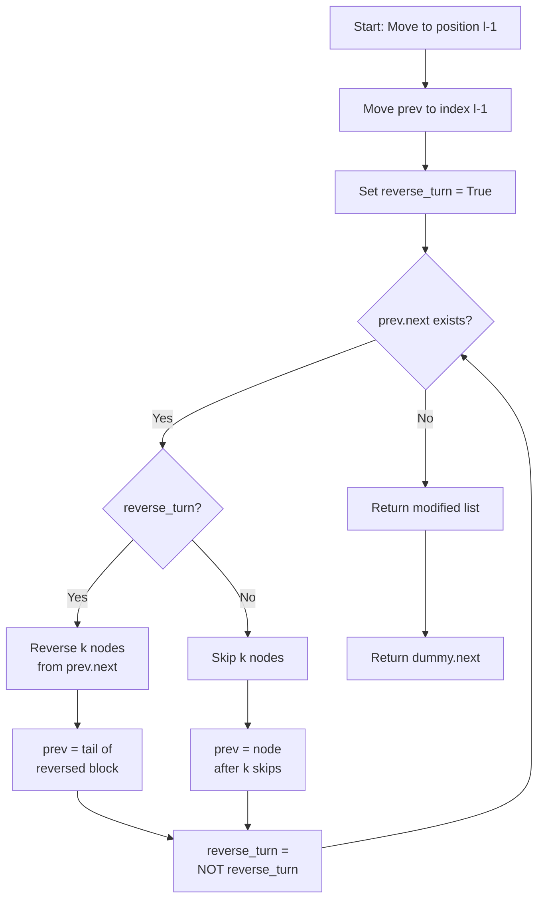

# LNK-005: Shuttle Route Alternating Reverse

## 📋 Problem Summary

You are given a linked list representing a sequence of stops. Starting from a specific position `l` (1-indexed), you need to modify the list by reversing every other block of `k` nodes.

The pattern is:
1. **Reverse** the next `k` nodes.
2. **Skip** the next `k` nodes.
3. Repeat.

If the last block has fewer than `k` nodes and it falls on a "reverse" turn, reverse it.

## 🌍 Real-World Scenario

**Scenario Title:** The Shuttle Bus Re-routing

A campus shuttle bus follows a long route with many stops. To optimize fuel efficiency during rush hour, the transportation department decides to change the direction of travel for specific segments of the route.

Starting from the "Downtown Hub" (stop `l`), they want to reverse the order of stops for every `k` stops (e.g., stops 1-3 reverse, stops 4-6 stay same, stops 7-9 reverse). This creates a "zig-zag" flow that better matches passenger demand patterns.

**Why This Problem Matters:**

- **Data Transformation:** Processing streams of data where blocks need to be permuted or encrypted in alternating patterns.
- **DNA Sequencing:** In bioinformatics, certain enzymes can flip segments of DNA strands.
- **Memory Layout:** Reordering data structures to optimize cache locality for specific access patterns.


## Detailed Explanation

### ASCII Diagram: Alternating Reversal

Let `l=2`, `k=2`.
List: `1 -> 2 -> 3 -> 4 -> 5 -> 6 -> 7`

1. **Move to `l`:** Skip node 1. Current is at 2.
2. **Reverse Block 1 (size 2):** Nodes `[2, 3]` become `[3, 2]`.
   List: `1 -> 3 -> 2 -> 4 -> 5 -> 6 -> 7`
3. **Skip Block 2 (size 2):** Skip nodes `[4, 5]`.
   List unchanged.
4. **Reverse Block 3 (size 2):** Nodes `[6, 7]` become `[7, 6]`.
   List: `1 -> 3 -> 2 -> 4 -> 5 -> 7 -> 6`

### ✅ Input/Output Clarifications (Read This Before Coding)

- **1-based Indexing:** The `l` parameter is 1-based. If `l=1`, start processing from the head.
- **Partial Blocks:** If you have 3 nodes left and `k=5`, and it's a "reverse" turn, you reverse all 3.
- **Skip Logic:** If you have 3 nodes left and `k=5`, and it's a "skip" turn, you just skip them (do nothing).

Common interpretation mistake:

- ❌ **Wrong:** Reversing *every* block of k.
- ✅ **Correct:** Reversing *alternating* blocks. Reverse, Skip, Reverse, Skip...

### Core Concept: Block Reversal

To reverse a sublist from `start` to `end`, we need the node *before* `start` to link it to `end`, and we need to link `start` to the node *after* `end`.

### Algorithm Flow Diagram



## 🎯 Edge Cases to Test

1. **k=1 (No reversal)**
   - Input: `1 2 3 4 5`, `l=1`, `k=1`
   - Expected: No blocks to reverse (each block has < 2 nodes)
   - Output: `1 2 3 4 5`

2. **l at End**
   - Input: `1 2 3 4 5`, `l=5`, `k=2`
   - Expected: Start at last node, not enough for a pair
   - Output: `1 2 3 4 5`

3. **Perfect Blocks**
   - Input: `1 2 3 4 5 6`, `l=1`, `k=2`
   - Expected: Reverse (1,2), skip (3,4), reverse (5,6)
   - Output: `2 1 3 4 6 5`

4. **Partial Last Block (Reverse)**
   - Input: `1 2 3 4 5`, `l=1`, `k=2`
   - Expected: Reverse (1,2), skip (3,4), reverse only [5] (partial)
   - Output: `2 1 3 4 5`

5. **Partial Last Block (Skip)**
   - Input: `1 2 3 4 5`, `l=1`, `k=2`, but stop on skip
   - Expected: Reverse (1,2), skip partial (3,4), no more blocks
   - Output: `2 1 3 4 5`

6. **Large k**
   - Input: `1 2 3 4 5`, `l=1`, `k=10`
   - Expected: Reverse all 5 nodes
   - Output: `5 4 3 2 1`

## Naive Approach

### Intuition

We can extract the values into an array, perform the reversals using array indexing (which is easy), and then reconstruct the linked list.

### Algorithm

1. Traverse list, store values in `ArrayList`.
2. Iterate from index `l-1` with step `2*k`.
3. For each step, reverse the subarray from `i` to `min(i+k, n)`.
4. Rebuild linked list from the modified array.

### Time Complexity

- **O(N)**.

### Space Complexity

- **O(N)** to store the array. This is not ideal for linked list problems where O(1) space is expected.

## Optimal Approach

### Key Insight

Perform the reversals in-place by manipulating pointers. We need a helper function or logic to reverse `k` nodes and return the new tail of that segment.

### Algorithm

1. Create a `dummy` node pointing to `head`.
2. Move a pointer `prev` `l-1` times so it sits just before the start of the modification zone.
3. Loop while there are nodes remaining:
   - **Reverse Phase:**
     - Identify the start of the block (`cur = prev.next`).
     - Reverse `k` nodes (or fewer if end of list).
     - Connect `prev` to the new head of the reversed block.
     - Connect the new tail of the reversed block to the rest of the list.
     - Move `prev` to the new tail.
   - **Skip Phase:**
     - Move `prev` forward `k` times (or until end of list).
     - If we reach end of list, stop.

### Time Complexity

- **O(N)**. We visit each node a constant number of times.

### Space Complexity

- **O(1)**.


## Implementations

### Python
```python
import sys

class ListNode:
    def __init__(self, val=0):
        self.val = val
        self.next = None

def alternating_reverse(head: ListNode, l: int, k: int) -> ListNode:
    if not head or k <= 1:
        return head

    dummy = ListNode(0)
    dummy.next = head
    prev = dummy

    # Move to start position l
    for _ in range(l - 1):
        if not prev.next:
            return head
        prev = prev.next

    reverse_turn = True

    while prev.next:
        if reverse_turn:
            # Reverse next k nodes
            tail = prev.next
            curr = tail.next
            count = 1
            while curr and count < k:
                temp = curr.next
                curr.next = prev.next
                prev.next = curr
                tail.next = temp
                curr = temp
                count += 1
            prev = tail  # Move prev to end of reversed block
        else:
            # Skip k nodes
            count = 0
            while prev.next and count < k:
                prev = prev.next
                count += 1

        reverse_turn = not reverse_turn

    return dummy.next
```

### Java
```java
class ListNode {
    int val;
    ListNode next;
    ListNode(int val) { this.val = val; }
}

class Solution {
    public ListNode alternatingReverse(ListNode head, int l, int k) {
        if (head == null || k <= 1) {
            return head;
        }

        ListNode dummy = new ListNode(0);
        dummy.next = head;
        ListNode prev = dummy;

        // Move to start position l
        for (int i = 0; i < l - 1; i++) {
            if (prev.next == null) {
                return head;
            }
            prev = prev.next;
        }

        boolean reverseTurn = true;

        while (prev.next != null) {
            if (reverseTurn) {
                // Reverse next k nodes
                ListNode tail = prev.next;
                ListNode curr = tail.next;
                int count = 1;
                while (curr != null && count < k) {
                    ListNode temp = curr.next;
                    curr.next = prev.next;
                    prev.next = curr;
                    tail.next = temp;
                    curr = temp;
                    count++;
                }
                prev = tail;  // Move prev to end of reversed block
            } else {
                // Skip k nodes
                int count = 0;
                while (prev.next != null && count < k) {
                    prev = prev.next;
                    count++;
                }
            }

            reverseTurn = !reverseTurn;
        }

        return dummy.next;
    }
}
```

### C++
```cpp
class ListNode {
public:
    int val;
    ListNode* next;
    ListNode(int val) : val(val), next(nullptr) {}
};

class Solution {
public:
    ListNode* alternatingReverse(ListNode* head, int l, int k) {
        if (!head || k <= 1) {
            return head;
        }

        ListNode* dummy = new ListNode(0);
        dummy->next = head;
        ListNode* prev = dummy;

        // Move to start position l
        for (int i = 0; i < l - 1; i++) {
            if (!prev->next) {
                return head;
            }
            prev = prev->next;
        }

        bool reverseTurn = true;

        while (prev->next) {
            if (reverseTurn) {
                // Reverse next k nodes
                ListNode* tail = prev->next;
                ListNode* curr = tail->next;
                int count = 1;
                while (curr && count < k) {
                    ListNode* temp = curr->next;
                    curr->next = prev->next;
                    prev->next = curr;
                    tail->next = temp;
                    curr = temp;
                    count++;
                }
                prev = tail;  // Move prev to end of reversed block
            } else {
                // Skip k nodes
                int count = 0;
                while (prev->next && count < k) {
                    prev = prev->next;
                    count++;
                }
            }

            reverseTurn = !reverseTurn;
        }

        ListNode* result = dummy->next;
        delete dummy;
        return result;
    }
};
```

### JavaScript
```javascript
class ListNode {
    constructor(val = 0) {
        this.val = val;
        this.next = null;
    }
}

class Solution {
    alternatingReverse(head, l, k) {
        if (!head || k <= 1) {
            return head;
        }

        const dummy = new ListNode(0);
        dummy.next = head;
        let prev = dummy;

        // Move to start position l
        for (let i = 0; i < l - 1; i++) {
            if (!prev.next) {
                return head;
            }
            prev = prev.next;
        }

        let reverseTurn = true;

        while (prev.next) {
            if (reverseTurn) {
                // Reverse next k nodes
                const tail = prev.next;
                let curr = tail.next;
                let count = 1;
                while (curr && count < k) {
                    const temp = curr.next;
                    curr.next = prev.next;
                    prev.next = curr;
                    tail.next = temp;
                    curr = temp;
                    count++;
                }
                prev = tail;  // Move prev to end of reversed block
            } else {
                // Skip k nodes
                let count = 0;
                while (prev.next && count < k) {
                    prev = prev.next;
                    count++;
                }
            }

            reverseTurn = !reverseTurn;
        }

        return dummy.next;
    }
}
```


## 🧪 Test Case Walkthrough (Dry Run)

Input: `1 2 3 4 5 6 7`, `l=2`, `k=2`

**Initialization:**
- `dummy -> 1 -> 2 -> 3 -> 4 -> 5 -> 6 -> 7`
- Move `prev` to `l-1` (node 1).
- `reverse = true`

**Iteration 1 (Reverse):**
- `tail` = 2, `curr` = 3.
- Move 3 to front of block (after 1).
- List: `1 -> 3 -> 2 -> 4 ...`
- `count` reaches 2.
- Move `prev` to `tail` (2).
- `reverse = false`.

**Iteration 2 (Skip):**
- Skip 2 nodes (4, 5).
- `prev` moves to 5.
- `reverse = true`.

**Iteration 3 (Reverse):**
- `tail` = 6, `curr` = 7.
- Move 7 to front of block (after 5).
- List: `... 5 -> 7 -> 6`.
- `count` reaches 2.
- Move `prev` to `tail` (6).
- `reverse = false`.

**End:** `prev.next` is null. Return head.

### Execution Table

| Phase | Mode | Block Nodes | Operation | Result |
|:-----:|:----:|:-----------:|:---------:|:-------|
| 1 | Reverse | (2,3) | Reverse nodes 2,3 | 1 -> 3 -> 2 -> 4 -> 5 -> 6 -> 7 |
| 2 | Skip | (4,5) | Skip nodes 4,5 | (no change) |
| 3 | Reverse | (6,7) | Reverse nodes 6,7 | 1 -> 3 -> 2 -> 4 -> 5 -> 7 -> 6 |

### Visual State Diagram

**Initial State:**
```
dummy -> [1 | •] -> [2 | •] -> [3 | •] -> [4 | •] -> [5 | •] -> [6 | •] -> [7 | null]
```

**After Phase 1 (Reverse block starting at 2):**
```
dummy -> [1 | •] -> [3 | •] -> [2 | •] -> [4 | •] -> [5 | •] -> [6 | •] -> [7 | null]
                     (reversed: 3-2)
```

**After Phase 2 (Skip block 4-5):**
```
dummy -> [1 | •] -> [3 | •] -> [2 | •] -> [4 | •] -> [5 | •] -> [6 | •] -> [7 | null]
                                           (skipped)
```

**After Phase 3 (Reverse block 6-7):**
```
dummy -> [1 | •] -> [3 | •] -> [2 | •] -> [4 | •] -> [5 | •] -> [7 | •] -> [6 | null]
                                                                   (reversed: 7-6)
```

### Complexity Analysis Table

| Metric | Complexity | Notes |
|:-------|:----------:|:------|
| **Time Complexity** | O(N) | Visit each node at most once |
| **Space Complexity** | O(1) | In-place reversal, no extra space |
| **Auxiliary Space** | O(1) | Only pointer variables (prev, curr, tail) |


## ✅ Proof of Correctness

### Invariant
After processing a block (reverse or skip), `prev` always points to the last node of that processed block, which serves as the anchor for the next block operation.

### Why the approach is correct
- The standard linked list reversal algorithm (`curr.next = prev.next; prev.next = curr; ...`) is used, which is O(K) for K nodes.
- By toggling the `reverse` boolean, we strictly adhere to the alternating pattern.
- The logic handles partial blocks naturally: the `while` loop condition `curr != null` ensures we stop if the list ends mid-block.

## 💡 Interview Extensions (High-Value Add-ons)

- **Extension 1:** Reverse Nodes in k-Group 
  - *Diff:* If last block < k, *don't* reverse it.
- **Extension 2:** Reverse even positions only.
  - *Hint:* Extract evens, reverse, merge back.
- **Extension 3:** Palindrome check.
  - *Hint:* Reverse second half and compare.

### Common Mistakes to Avoid

1. **Lost Head**
   - ❌ Wrong: Not using a dummy node. If `l=1`, the head changes.
   - ✅ Correct: Always use `dummy` when head might change.

2. **Pointer Confusion**
   - ❌ Wrong: Losing track of the connection to the rest of the list.
   - ✅ Correct: `tail.next = temp` ensures the rest of the list stays attached.

3. **Off-by-One**
   - ❌ Wrong: Moving `prev` too far or not far enough for `l`.
   - ✅ Correct: Loop `l-1` times.

## Related Concepts

- **In-place Reversal:** A fundamental linked list skill.
- **Dummy Node:** Simplifies head operations.
- **Modular Arithmetic:** Conceptually similar to `i % 2k < k`.
