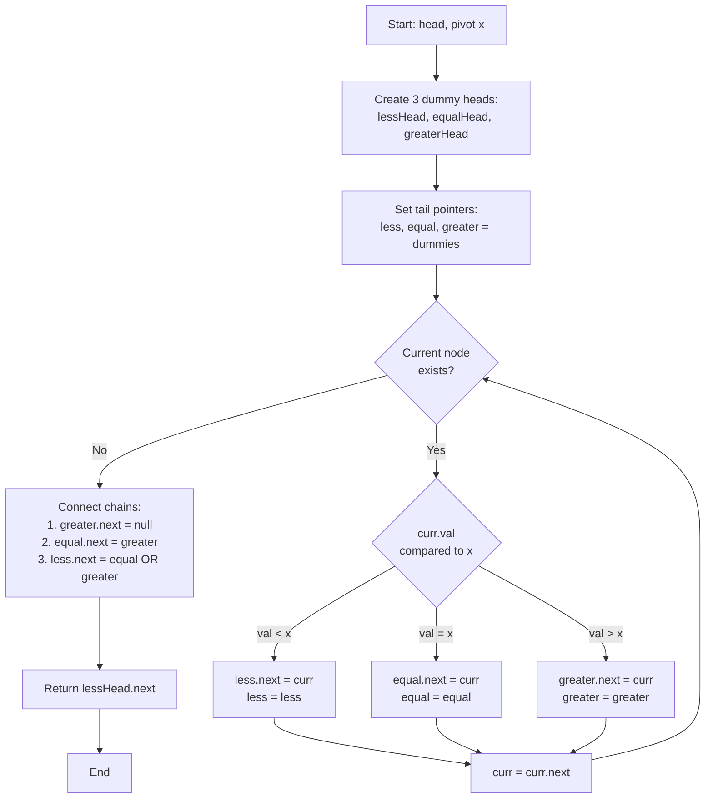

# LNK-010: Shuttle ID Stable Partition

## 📋 Problem Summary

You are given a linked list and a pivot value `x`. You need to reorder the list so that:
1. All nodes with values **less than** `x` come first.
2. All nodes with values **equal to** `x` come next.
3. All nodes with values **greater than** `x` come last.
4. The relative order of nodes within each group must be preserved (stable partition).

## 🌍 Real-World Scenario

**Scenario Title:** The Shuttle Boarding Queue

Passengers are waiting for a shuttle bus. Each passenger has a boarding group number on their ticket. The shuttle company announces a new boarding policy based on Group `x`:
- **Priority Boarding:** Anyone with a group number smaller than `x` boards first.
- **Standard Boarding:** Anyone in group `x` boards next.
- **Late Boarding:** Anyone with a group number larger than `x` boards last.

Crucially, within each category, passengers must board in the order they arrived in the queue (stability). You cannot shuffle people around arbitrarily; that would be unfair!

**Why This Problem Matters:**

- **QuickSort:** This is essentially the partitioning step of the QuickSort algorithm (specifically the 3-way partition or Dutch National Flag problem), but adapted for a stable linked list.
- **Database Indexing:** Grouping records by a key range while maintaining insertion order.
- **Event Processing:** Separating events into "Past", "Present", and "Future" buckets based on a timestamp `x`.


## Detailed Explanation

### ASCII Diagram: Three-Way Partition

List: `5 -> 1 -> 4 -> 2 -> 5`
Pivot `x = 4`

We maintain three chains: `Less`, `Equal`, `Greater`.

1. **Process 5 (> 4):** Add to Greater. `G: 5`
2. **Process 1 (< 4):** Add to Less. `L: 1`
3. **Process 4 (= 4):** Add to Equal. `E: 4`
4. **Process 2 (< 4):** Add to Less. `L: 1 -> 2`
5. **Process 5 (> 4):** Add to Greater. `G: 5 -> 5`

**Concatenate:**
`Less` -> `Equal` -> `Greater`
`1 -> 2` -> `4` -> `5 -> 5`

Result: `1 -> 2 -> 4 -> 5 -> 5`

### ✅ Input/Output Clarifications (Read This Before Coding)

- **Pivot Existence:** The value `x` might not exist in the list. The logic still holds (empty `Equal` list).
- **Stability:** If the input has two `5`s, the first `5` must appear before the second `5` in the output.
- **Memory:** Do not create new nodes. Re-link existing ones.

Common interpretation mistake:

- ❌ **Wrong:** Using a generic sort (like Merge Sort). This is O(N log N).
- ✅ **Correct:** Partitioning is O(N). You just need to bucket them.

### Core Concept: Multiple Dummy Heads

Using three dummy heads (`lessHead`, `equalHead`, `greaterHead`) makes the code clean. You don't have to worry about null checks for the first element of each group.

## Naive Approach

### Intuition

Create three ArrayLists. Iterate the list, adding values to the respective list. Create a new Linked List from the arrays.

### Algorithm

1. `less = []`, `equal = []`, `greater = []`
2. For val in list:
   - if val < x: add to less
   - if val == x: add to equal
   - if val > x: add to greater
3. Reconstruct list.

### Time Complexity

- **O(N)**.

### Space Complexity

- **O(N)** (new nodes/arrays).

## Optimal Approach

### Key Insight

Re-link nodes in a single pass using 3 pointers.

### Algorithm

1. Initialize 3 dummy heads and 3 tail pointers (`lt`, `et`, `gt`).
2. Iterate through the list with `curr`:
   - If `curr.val < x`: append to `lt`, advance `lt`.
   - If `curr.val == x`: append to `et`, advance `et`.
   - If `curr.val > x`: append to `gt`, advance `gt`.
3. **Connect the chains:**
   - `lt.next` points to `equalHead.next`.
   - `et.next` points to `greaterHead.next`.
   - `gt.next` points to `null` (terminate list).
4. **Handle empty middle lists:**
   - If `equal` list is empty, `lt` should point to `greaterHead.next`.
   - Logic: `lt.next = (equalHead.next != null) ? equalHead.next : greaterHead.next`.
   - `et.next = greaterHead.next`.

### Time Complexity

- **O(N)**.

### Space Complexity

- **O(1)**.


## 🎯 Edge Cases to Test

1. **All Elements Less Than Pivot**
   - Input: `1 2 3 4 5`, `x=10`
   - Expected: No reordering needed
   - Output: `1 2 3 4 5`

2. **All Elements Greater Than Pivot**
   - Input: `10 20 30 40 50`, `x=5`
   - Expected: No reordering needed
   - Output: `10 20 30 40 50`

3. **Pivot Not in List**
   - Input: `1 3 5 7 9`, `x=4`
   - Expected: Elements < 4 first, then elements > 4
   - Output: `1 3 5 7 9`

4. **All Elements Equal to Pivot**
   - Input: `5 5 5 5`, `x=5`
   - Expected: All in equal group, no reordering
   - Output: `5 5 5 5`

5. **Single Element**
   - Input: `7`, `x=5`
   - Expected: Single element (> 5)
   - Output: `7`

6. **Empty List (null)**
   - Input: `null`, `x=5`
   - Expected: Return null
   - Output: `null`

## Implementations

### Python
```python
import sys

class ListNode:
    def __init__(self, val=0):
        self.val = val
        self.next = None

def stable_partition(head: ListNode, x: int) -> ListNode:
    less_head = ListNode(0)
    equal_head = ListNode(0)
    greater_head = ListNode(0)

    less = less_head
    equal = equal_head
    greater = greater_head

    curr = head
    while curr:
        if curr.val < x:
            less.next = curr
            less = less.next
        elif curr.val == x:
            equal.next = curr
            equal = equal.next
        else:
            greater.next = curr
            greater = greater.next
        curr = curr.next

    # Connect
    greater.next = None
    equal.next = greater_head.next
    less.next = equal_head.next if equal_head.next else greater_head.next

    return less_head.next
```

### Java
```java
class ListNode {
    int val;
    ListNode next;
    ListNode(int val) { this.val = val; }
}

class Solution {
    public ListNode stablePartition(ListNode head, int x) {
        ListNode lessHead = new ListNode(0);
        ListNode equalHead = new ListNode(0);
        ListNode greaterHead = new ListNode(0);

        ListNode less = lessHead;
        ListNode equal = equalHead;
        ListNode greater = greaterHead;

        ListNode curr = head;
        while (curr != null) {
            if (curr.val < x) {
                less.next = curr;
                less = less.next;
            } else if (curr.val == x) {
                equal.next = curr;
                equal = equal.next;
            } else {
                greater.next = curr;
                greater = greater.next;
            }
            curr = curr.next;
        }

        greater.next = null;
        equal.next = greaterHead.next;
        less.next = (equalHead.next != null) ? equalHead.next : greaterHead.next;

        return lessHead.next;
    }
}
```

### C++
```cpp
class ListNode {
public:
    int val;
    ListNode* next;
    ListNode(int val) : val(val), next(nullptr) {}
};

class Solution {
public:
    ListNode* stablePartition(ListNode* head, int x) {
        ListNode* lessHead = new ListNode(0);
        ListNode* equalHead = new ListNode(0);
        ListNode* greaterHead = new ListNode(0);

        ListNode* less = lessHead;
        ListNode* equal = equalHead;
        ListNode* greater = greaterHead;

        ListNode* curr = head;
        while (curr) {
            if (curr->val < x) {
                less->next = curr;
                less = less->next;
            } else if (curr->val == x) {
                equal->next = curr;
                equal = equal->next;
            } else {
                greater->next = curr;
                greater = greater->next;
            }
            curr = curr->next;
        }

        greater->next = nullptr;
        equal->next = greaterHead->next;
        less->next = (equalHead->next) ? equalHead->next : greaterHead->next;

        ListNode* result = lessHead->next;
        delete lessHead;
        delete equalHead;
        delete greaterHead;
        return result;
    }
};
```

### JavaScript
```javascript
class ListNode {
    constructor(val = 0) {
        this.val = val;
        this.next = null;
    }
}

class Solution {
    stablePartition(head, x) {
        const lessHead = new ListNode(0);
        const equalHead = new ListNode(0);
        const greaterHead = new ListNode(0);

        let less = lessHead;
        let equal = equalHead;
        let greater = greaterHead;

        let curr = head;
        while (curr) {
            if (curr.val < x) {
                less.next = curr;
                less = less.next;
            } else if (curr.val === x) {
                equal.next = curr;
                equal = equal.next;
            } else {
                greater.next = curr;
                greater = greater.next;
            }
            curr = curr.next;
        }

        greater.next = null;
        equal.next = greaterHead.next;
        less.next = equalHead.next ? equalHead.next : greaterHead.next;

        return lessHead.next;
    }
}
```


## Complexity Analysis Table

| Metric | Complexity | Notes |
|:-------|:----------:|:------|
| **Time Complexity** | O(N) | Single pass through the list to partition elements |
| **Space Complexity** | O(1) | Only using pointers (3 dummy heads and tail pointers) |
| **Auxiliary Space** | O(1) | No additional data structures needed |

## 🧪 Test Case Walkthrough (Dry Run)

### Test Case 1: Mixed Values

**Input:** `5 1 4 2 5`, `x=4`

| Step | Current | Less Chain | Equal Chain | Greater Chain | Action |
|:----:|:--------:|:----------:|:-----------:|:-------------:|:------:|
| 1 | 5 | empty | empty | [5] | 5 > 4, add to greater |
| 2 | 1 | [1] | empty | [5] | 1 < 4, add to less |
| 3 | 4 | [1] | [4] | [5] | 4 = 4, add to equal |
| 4 | 2 | [1,2] | [4] | [5] | 2 < 4, add to less |
| 5 | 5 | [1,2] | [4] | [5,5] | 5 > 4, add to greater |

**Connection Phase:**
- greater.next = None (prevent cycle)
- equal.next = greaterHead.next → [4] -> [5, 5]
- less.next = equalHead.next → [1, 2] -> [4, 5, 5]

**Result:** `1 -> 2 -> 4 -> 5 -> 5`

### Test Case 2: All Elements Less Than Pivot

**Input:** `1 2 3`, `x=10`

| Step | Current | Less Chain | Equal Chain | Greater Chain |
|:----:|:--------:|:----------:|:-----------:|:-------------:|
| 1 | 1 | [1] | empty | empty |
| 2 | 2 | [1,2] | empty | empty |
| 3 | 3 | [1,2,3] | empty | empty |

**Connection:**
- greater.next = None
- equal.next = None (equal is dummy, so equalHead.next is None)
- less.next = None → Result: less chain only

**Result:** `1 -> 2 -> 3`

### Test Case 3: Pivot Not in List

**Input:** `1 5 9`, `x=3`

| Step | Current | Less Chain | Equal Chain | Greater Chain |
|:----:|:--------:|:----------:|:-----------:|:-------------:|
| 1 | 1 | [1] | empty | empty |
| 2 | 5 | [1] | empty | [5] |
| 3 | 9 | [1] | empty | [5,9] |

**Connection:**
- less.next points to greater chain

**Result:** `1 -> 5 -> 9`

## Mermaid Flowchart: Stable Partition Algorithm




## ✅ Proof of Correctness

### Invariant
At step `i`, the `less`, `equal`, and `greater` lists contain all elements from the first `i` input nodes that match their respective criteria, in their original relative order.

### Why the approach is correct
- We process input sequentially, ensuring stability.
- We partition based on the three conditions strictly.
- We handle empty lists correctly during connection logic.

## 💡 Interview Extensions (High-Value Add-ons)

- **Extension 1:** Partition around a value `x` such that nodes `< x` are on left and `>= x` on right 
  - *Hint:* Just merge `equal` and `greater` logic.
- **Extension 2:** Sort the list (QuickSort).
  - *Hint:* Recursively partition. This is the partition step!
- **Extension 3:** In-place without dummies?
  - *Hint:* Much harder to handle null heads. Dummies are preferred.

### Common Mistakes to Avoid

1. **Empty Middle List**
   - ❌ Wrong: `less.next = equalHead.next` blindly. If `equal` is empty, `less` points to null, losing the `greater` list.
   - ✅ Correct: Check if `equalHead.next` exists. If not, point to `greaterHead.next`.

2. **Cycle at End**
   - ❌ Wrong: Forgetting `greater.next = null`.
   - ✅ Correct: The last node of the original list might have been moved to `less`, so `greater`'s last node still points to it, creating a cycle.

## Related Concepts

- **Dutch National Flag Problem:** The array equivalent (0, 1, 2 sorting).
- **Stable Sort:** Preserving order of equal elements.
