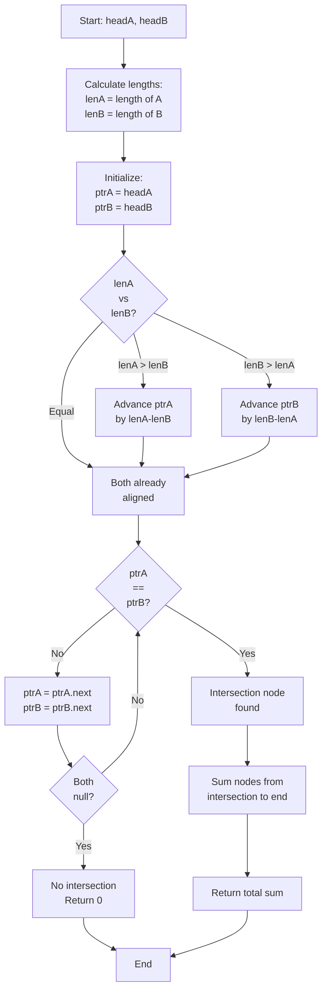

# LNK-011: Exam Seating Intersection Sum

## 📋 Problem Summary

You are given two singly linked lists, List A and List B. They might intersect at some node and share all subsequent nodes (forming a 'Y' shape). Your task is to:
1. Determine if they intersect.
2. If they do, calculate the sum of values of all nodes in the shared suffix (starting from the intersection node to the end).
3. If they don't intersect, return 0.

## 🌍 Real-World Scenario

**Scenario Title:** The Merging Exam Lines

Students from two different exam halls (Hall A and Hall B) are leaving the building.
- Hall A students walk down Corridor A.
- Hall B students walk down Corridor B.
- At some point, Corridor B merges into Corridor A, and from there, everyone walks down the same final path to the exit.

You want to calculate the "total age" (sum of values) of all students who are walking in the shared path after the merge point.

**Why This Problem Matters:**

- **Git Branches:** Two branches of development history merging into a common timeline.
- **River Systems:** Tributaries joining a main river; calculating water volume in the main channel.
- **Memory Sharing:** In immutable data structures (like in functional programming), two lists might share a common tail to save memory.


## Detailed Explanation

### ASCII Diagram: Intersection

List A: `1 -> 2 -> 3 -> 4`
List B: `9 -> 3 -> 4` (Connects to 3 in A)

Visualizing the 'Y' shape:
```
A: 1 -> 2
         \
          3 -> 4 -> null
         /
B:      9
```
Intersection Node: `3`.
Shared Suffix: `3 -> 4`.
Sum: `3 + 4 = 7`.

### ✅ Input/Output Clarifications (Read This Before Coding)

- **Reference Equality:** Intersection is defined by reference (memory address), not value. Two nodes with value `3` are distinct unless they are literally the same object.
- **No Intersection:** If the lists never merge, return 0.
- **Suffix Sum:** Include the intersection node itself in the sum.

Common interpretation mistake:

- ❌ **Wrong:** Summing values from the start of both lists.
- ✅ **Correct:** Only summing the shared tail.

### Core Concept: Length Alignment

If List A has length 5 and List B has length 3, the intersection cannot happen at A's first 2 nodes. We can skip the first `5-3=2` nodes of A to align the starting positions.

## Naive Approach

### Intuition

For every node in List A, traverse List B to see if it matches.

### Algorithm

1. Loop `currA` through List A.
2. Inside, loop `currB` through List B.
3. If `currA == currB`, we found intersection. Calculate sum and return.

### Time Complexity

- **O(N * M)**. Too slow.

### Space Complexity

- **O(1)**.

## Optimal Approach

### Key Insight

Align the starts. Calculate length of A (`lenA`) and B (`lenB`). Advance the pointer of the longer list by `abs(lenA - lenB)`. Then move both pointers forward together. They will meet at the intersection.

### Algorithm

1. Calculate `lenA` and `lenB`.
2. Reset pointers `ptrA = headA`, `ptrB = headB`.
3. If `lenA > lenB`, advance `ptrA` by `lenA - lenB`.
4. If `lenB > lenA`, advance `ptrB` by `lenB - lenA`.
5. While `ptrA != ptrB`:
   - `ptrA = ptrA.next`
   - `ptrB = ptrB.next`
   - If either becomes null, return 0 (no intersection).
6. Now `ptrA` is the intersection node (or null).
7. Traverse from `ptrA` to end, summing values.
8. Return sum.

### Time Complexity

- **O(N + M)**. We traverse each list a constant number of times.

### Space Complexity

- **O(1)**.


## 🎯 Edge Cases to Test

1. **No Intersection**
   - A: `1 2 3`, B: `4 5 6`
   - Expected: Lists never merge
   - Output: 0

2. **Intersection at Head**
   - A: `1 2 3`, B: `9` (B connects to head of A)
   - Expected: Sum of entire A
   - Output: 1 + 2 + 3 = 6

3. **Different Lengths, Intersection at Middle**
   - A: `1 2 3 4 5`, B: `9 10 3 4 5` (B connects to A's node 3)
   - Expected: Sum from intersection onward
   - Output: 3 + 4 + 5 = 12

4. **Identical Lists (Same Nodes)**
   - A: `1 2 3`, B: `1 2 3` (same objects)
   - Expected: Sum of entire list
   - Output: 1 + 2 + 3 = 6

5. **Single Node Each**
   - A: `5`, B: `5` (different node objects)
   - Expected: No intersection (different objects)
   - Output: 0

6. **B Much Longer**
   - A: `1 2 3`, B: `10 20 30 40 50 2 3` (B connects to A's node 2)
   - Expected: Sum from intersection (2 + 3)
   - Output: 5

## Implementations

### Python
```python
import sys

class ListNode:
    def __init__(self, val=0):
        self.val = val
        self.next = None

def get_length(head):
    length = 0
    while head:
        length += 1
        head = head.next
    return length

def intersection_sum(headA: ListNode, headB: ListNode) -> int:
    lenA = get_length(headA)
    lenB = get_length(headB)

    ptrA = headA
    ptrB = headB

    # Align: advance the longer list's pointer
    while lenA > lenB:
        ptrA = ptrA.next
        lenA -= 1
    while lenB > lenA:
        ptrB = ptrB.next
        lenB -= 1

    # Find intersection by moving both together
    while ptrA != ptrB:
        ptrA = ptrA.next
        ptrB = ptrB.next

    if not ptrA:
        return 0

    # Sum from intersection to end
    total_sum = 0
    while ptrA:
        total_sum += ptrA.val
        ptrA = ptrA.next

    return total_sum
```

### Java
```java
class ListNode {
    int val;
    ListNode next;
    ListNode(int val) { this.val = val; }
}

class Solution {
    private int getLength(ListNode head) {
        int length = 0;
        while (head != null) {
            length++;
            head = head.next;
        }
        return length;
    }

    public int intersectionSum(ListNode headA, ListNode headB) {
        int lenA = getLength(headA);
        int lenB = getLength(headB);

        ListNode ptrA = headA;
        ListNode ptrB = headB;

        // Align pointers
        while (lenA > lenB) {
            ptrA = ptrA.next;
            lenA--;
        }
        while (lenB > lenA) {
            ptrB = ptrB.next;
            lenB--;
        }

        // Find intersection
        while (ptrA != ptrB) {
            ptrA = ptrA.next;
            ptrB = ptrB.next;
        }

        if (ptrA == null) {
            return 0;
        }

        // Sum the suffix
        int totalSum = 0;
        while (ptrA != null) {
            totalSum += ptrA.val;
            ptrA = ptrA.next;
        }

        return totalSum;
    }
}
```

### C++
```cpp
class ListNode {
public:
    int val;
    ListNode* next;
    ListNode(int val) : val(val), next(nullptr) {}
};

class Solution {
private:
    int getLength(ListNode* head) {
        int length = 0;
        while (head) {
            length++;
            head = head->next;
        }
        return length;
    }

public:
    int intersectionSum(ListNode* headA, ListNode* headB) {
        int lenA = getLength(headA);
        int lenB = getLength(headB);

        ListNode* ptrA = headA;
        ListNode* ptrB = headB;

        // Align pointers
        while (lenA > lenB) {
            ptrA = ptrA->next;
            lenA--;
        }
        while (lenB > lenA) {
            ptrB = ptrB->next;
            lenB--;
        }

        // Find intersection
        while (ptrA != ptrB) {
            ptrA = ptrA->next;
            ptrB = ptrB->next;
        }

        if (!ptrA) {
            return 0;
        }

        // Sum the suffix
        int totalSum = 0;
        while (ptrA) {
            totalSum += ptrA->val;
            ptrA = ptrA->next;
        }

        return totalSum;
    }
};
```

### JavaScript
```javascript
class ListNode {
    constructor(val = 0) {
        this.val = val;
        this.next = null;
    }
}

class Solution {
    getLength(head) {
        let length = 0;
        while (head) {
            length++;
            head = head.next;
        }
        return length;
    }

    intersectionSum(headA, headB) {
        const lenA = this.getLength(headA);
        const lenB = this.getLength(headB);

        let ptrA = headA;
        let ptrB = headB;

        // Align pointers
        while (lenA > lenB) {
            ptrA = ptrA.next;
            lenA--;
        }
        while (lenB > lenA) {
            ptrB = ptrB.next;
            lenB--;
        }

        // Find intersection
        while (ptrA !== ptrB) {
            ptrA = ptrA.next;
            ptrB = ptrB.next;
        }

        if (!ptrA) {
            return 0;
        }

        // Sum the suffix
        let totalSum = 0;
        while (ptrA) {
            totalSum += ptrA.val;
            ptrA = ptrA.next;
        }

        return totalSum;
    }
}
```


## Complexity Analysis Table

| Metric | Complexity | Notes |
|:-------|:----------:|:------|
| **Time Complexity** | O(N + M) | Length calculation: O(N+M), alignment O(max(N,M)), intersection search O(max(N,M)), sum O(shared) |
| **Space Complexity** | O(1) | Only using pointer variables (ptrA, ptrB, lengths) |
| **Auxiliary Space** | O(1) | No additional data structures needed |

## 🧪 Test Case Walkthrough (Dry Run)

### Test Case 1: Intersection at Middle

**Input:** A=`1->2->3->4`, B=`9->3->4` (B merges to A at node 3)

**Step 1: Length Calculation**
- lenA = 4 (1 -> 2 -> 3 -> 4 -> null)
- lenB = 3 (9 -> 3 -> 4 -> null)

**Step 2: Alignment**
| Operation | ptrA | ptrB | Status |
|:---------:|:----:|:----:|:------:|
| Initial | 1 | 9 | lenA > lenB, advance ptrA |
| After align | 2 | 9 | Both equidistant from intersection |

**Step 3: Search for Intersection**
| Iteration | ptrA | ptrB | Check | Action |
|:---------:|:----:|:----:|:-----:|:------:|
| 1 | 2 | 9 | 2 != 9 | Advance both |
| 2 | 3 | 3 | 3 == 3 | **Intersection found!** |

**Step 4: Sum Suffix**
| Node | Value | Running Sum |
|:----:|:-----:|:-----------:|
| 3 | 3 | 3 |
| 4 | 4 | 7 |
| null | - | - |

**Result:** 7

### Test Case 2: No Intersection

**Input:** A=`1->2->3`, B=`4->5->6`

**Step 1: Length Calculation**
- lenA = 3, lenB = 3

**Step 2: Alignment**
- Both already aligned, no advancement needed

**Step 3: Search**
| Iteration | ptrA | ptrB | Check | Action |
|:---------:|:----:|:----:|:-----:|:------:|
| 1 | 1 | 4 | 1 != 4 | Advance both |
| 2 | 2 | 5 | 2 != 5 | Advance both |
| 3 | 3 | 6 | 3 != 6 | Advance both |
| 4 | null | null | Both null | **No intersection** |

**Result:** 0

### Test Case 3: Intersection at Head of A

**Input:** A=`1->2->3`, B=`9->1->2->3` (B merges at head of A)

**Step 1: Length Calculation**
- lenA = 3, lenB = 4

**Step 2: Alignment**
| Operation | ptrA | ptrB | Status |
|:---------:|:----:|:----:|:------:|
| Initial | 1 | 9 | lenB > lenA, advance ptrB |
| After align | 1 | 1 | Both at same node |

**Step 3: Search**
| Iteration | ptrA | ptrB | Check | Action |
|:---------:|:----:|:----:|:-----:|:------:|
| 1 | 1 | 1 | 1 == 1 | **Already at intersection!** |

**Step 4: Sum**
- 1 + 2 + 3 = 6

**Result:** 6

## Mermaid Flowchart: Intersection Finding Algorithm




## ✅ Proof of Correctness

### Invariant
After alignment, `ptrA` and `ptrB` are equidistant from the end of the list.

### Why the approach is correct
- Since they share the suffix, the distance from intersection to end is identical.
- By aligning starts, we ensure that if they meet, they meet at the *first* common node.
- If they reach null without meeting, there is no intersection.

## 💡 Interview Extensions (High-Value Add-ons)

- **Extension 1:** What if list has cycles?
  - *Hint:* Much harder. Need to detect cycles first, then check if cycles are same.
- **Extension 2:** Find intersection without length calculation (Two Pointers trick).
  - *Hint:* `ptrA` traverses A then B. `ptrB` traverses B then A. They meet at intersection or null.
- **Extension 3:** Minimize memory access.
  - *Hint:* Length calculation is cache-friendly (sequential access).

### Common Mistakes to Avoid

1. **Value Comparison**
   - ❌ Wrong: `ptrA.val == ptrB.val`.
   - ✅ Correct: `ptrA == ptrB` (reference check).

2. **Off-by-one**
   - ❌ Wrong: Advancing `lenA - lenB - 1`.
   - ✅ Correct: Advance exactly the difference.

3. **Null Pointer**
   - ❌ Wrong: Accessing `ptrA.next` when `ptrA` is null.
   - ✅ Correct: Loop condition `ptrA != null`.

## Related Concepts

- **Two Pointers:** Aligning start positions.
- **Reference vs Value:** Crucial in linked lists.
