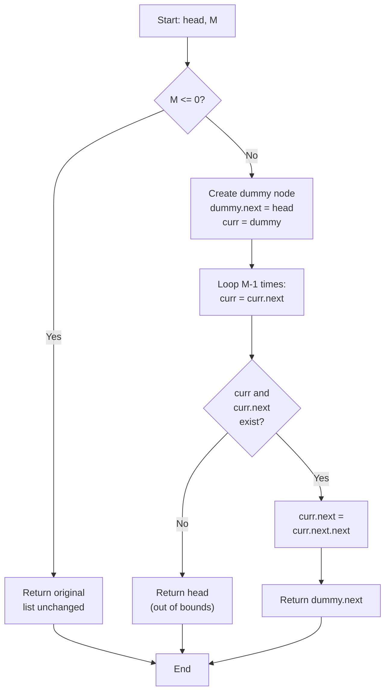

# LNK-012: Hostel Number Remove Mth from Start

## 📋 Problem Summary

You are given a linked list representing a sequence of items. You need to remove the **M-th** node from the beginning (1-based index).
- If `M=1`, remove the head.
- If `M` is greater than the list length, do nothing.
- Return the head of the modified list.

## 🌍 Real-World Scenario

**Scenario Title:** The Hostel Room Renovation

A hostel has a long corridor with rooms numbered sequentially. The management decides to convert one specific room into a utility closet.
- "Remove the 3rd room from the list of available rooms."
- The corridor structure (linked list) remains, but the pointer from Room 2 now skips Room 3 and points directly to Room 4.

**Why This Problem Matters:**

- **Task Cancellation:** Removing the M-th task from a processing queue.
- **Playlist Management:** "Remove the 5th song from the queue."
- **Data Cleaning:** Dropping a specific record (e.g., the header or a corrupted row) from a stream.


## Detailed Explanation

### ASCII Diagram: Deletion

List: `9 -> 8 -> 7 -> 6`
`M = 2` (Remove 2nd node, value 8)

1. **Start:** Dummy -> 9 -> 8 -> 7 -> 6
2. **Move to M-1:** Move 1 step. Pointer at 9.
3. **Relink:** `9.next = 9.next.next` (Skip 8).
   `9 -> 7`
4. **Result:** `9 -> 7 -> 6`

### ✅ Input/Output Clarifications (Read This Before Coding)

- **1-based Indexing:** `M=1` means the first node.
- **Out of Bounds:** If `M > length`, return original list.
- **Edge Case:** `M=1` requires updating the head.

Common interpretation mistake:

- ❌ **Wrong:** Confusing "M-th from start" with "M-th from end" 
- ✅ **Correct:** This is simpler. Count from the start.

### Core Concept: Dummy Node

Using a `dummy` node pointing to `head` allows us to handle `M=1` (removing head) using the exact same logic as removing any other node. We stop at the `(M-1)`-th node relative to the dummy.

## Naive Approach

### Intuition

Handle `M=1` separately. Then loop `M-2` times to find the predecessor.

### Algorithm

1. If `M=1`, return `head.next`.
2. `prev = head`.
3. Loop `M-2` times: `prev = prev.next`.
4. If `prev` or `prev.next` is null, return head (out of bounds).
5. `prev.next = prev.next.next`.

### Time Complexity

- **O(M)**.

### Space Complexity

- **O(1)**.

## Optimal Approach

### Key Insight

Use a dummy node to unify logic. The predecessor of the M-th node is the (M-1)-th node. If we start at dummy (index 0), we move `M-1` steps to get to the predecessor.

### Algorithm

1. Create `dummy` node, `dummy.next = head`.
2. `curr = dummy`.
3. Loop `M-1` times:
   - `curr = curr.next`
   - If `curr` becomes null, `M` is out of bounds. Return `dummy.next`.
4. Check if `curr.next` exists (the node to remove).
   - If yes, `curr.next = curr.next.next`.
5. Return `dummy.next`.

### Time Complexity

- **O(M)**. We only traverse up to the removal point.

### Space Complexity

- **O(1)**.


## 🎯 Edge Cases to Test

1. **Remove Head (M=1)**
   - Input: `1 2 3 4 5`, M=1
   - Expected: Head node removed
   - Output: `2 3 4 5`

2. **Remove Last Node**
   - Input: `1 2 3 4 5`, M=5
   - Expected: Last node removed
   - Output: `1 2 3 4`

3. **M Exceeds List Length**
   - Input: `1 2 3`, M=10
   - Expected: No removal (out of bounds)
   - Output: `1 2 3`

4. **Single Element, Remove It**
   - Input: `7`, M=1
   - Expected: List becomes empty
   - Output: `null` or empty list

5. **Two Elements, Remove First**
   - Input: `10 20`, M=1
   - Expected: Head removed
   - Output: `20`

6. **Two Elements, Remove Second**
   - Input: `10 20`, M=2
   - Expected: Tail removed
   - Output: `10`

## Implementations

### Python
```python
import sys

class ListNode:
    def __init__(self, val=0):
        self.val = val
        self.next = None

def remove_mth(head: ListNode, M: int) -> ListNode:
    if M <= 0:
        return head

    # Create dummy node to handle head removal uniformly
    dummy = ListNode(0)
    dummy.next = head
    curr = dummy

    # Move to the node before the M-th node
    for _ in range(M - 1):
        if not curr:
            return head
        curr = curr.next

    # Remove the M-th node
    if curr and curr.next:
        curr.next = curr.next.next

    return dummy.next
```

### Java
```java
class ListNode {
    int val;
    ListNode next;
    ListNode(int val) { this.val = val; }
}

class Solution {
    public ListNode removeMth(ListNode head, int M) {
        if (M <= 0) {
            return head;
        }

        ListNode dummy = new ListNode(0);
        dummy.next = head;
        ListNode curr = dummy;

        // Move to the node before the M-th node
        for (int i = 0; i < M - 1; i++) {
            if (curr == null) {
                return head;
            }
            curr = curr.next;
        }

        // Remove the M-th node
        if (curr != null && curr.next != null) {
            curr.next = curr.next.next;
        }

        return dummy.next;
    }
}
```

### C++
```cpp
class ListNode {
public:
    int val;
    ListNode* next;
    ListNode(int val) : val(val), next(nullptr) {}
};

class Solution {
public:
    ListNode* removeMth(ListNode* head, int M) {
        if (M <= 0) {
            return head;
        }

        ListNode* dummy = new ListNode(0);
        dummy->next = head;
        ListNode* curr = dummy;

        // Move to the node before the M-th node
        for (int i = 0; i < M - 1; i++) {
            if (!curr) {
                return head;
            }
            curr = curr->next;
        }

        // Remove the M-th node
        if (curr && curr->next) {
            curr->next = curr->next->next;
        }

        ListNode* result = dummy->next;
        delete dummy;
        return result;
    }
};
```

### JavaScript
```javascript
class ListNode {
    constructor(val = 0) {
        this.val = val;
        this.next = null;
    }
}

class Solution {
    removeMth(head, M) {
        if (M <= 0) {
            return head;
        }

        const dummy = new ListNode(0);
        dummy.next = head;
        let curr = dummy;

        // Move to the node before the M-th node
        for (let i = 0; i < M - 1; i++) {
            if (!curr) {
                return head;
            }
            curr = curr.next;
        }

        // Remove the M-th node
        if (curr && curr.next) {
            curr.next = curr.next.next;
        }

        return dummy.next;
    }
}
```


## Complexity Analysis Table

| Metric | Complexity | Notes |
|:-------|:----------:|:------|
| **Time Complexity** | O(M) | We only traverse up to the M-th node (M-1 steps to find predecessor) |
| **Space Complexity** | O(1) | Only using pointer variables (dummy, curr) |
| **Auxiliary Space** | O(1) | No additional data structures needed |

## 🧪 Test Case Walkthrough (Dry Run)

### Test Case 1: Remove Middle Node

**Input:** `9 8 7 6`, M=2

**Step 1: Initialize**
```
dummy -> 9 -> 8 -> 7 -> 6 -> null
^
curr
M=2 (target: node 8)
```

**Step 2: Loop M-1=1 times to find predecessor**
| Iteration | curr | curr.val | Action |
|:---------:|:----:|:--------:|:------:|
| Before | dummy | 0 | Starting position |
| 1 | 9 | 9 | Move curr to node 9 (predecessor of node 8) |

**Step 3: Remove node**
- curr.next = 8
- curr.next.next = 7
- Set curr.next = curr.next.next → 9.next = 7

**Step 4: Result**
```
9 -> 7 -> 6 -> null
```

**Result:** `9 -> 7 -> 6`

### Test Case 2: Remove Head (M=1)

**Input:** `1 2 3`, M=1

**Step 1: Initialize**
```
dummy -> 1 -> 2 -> 3 -> null
^
curr
M=1 (target: node 1)
```

**Step 2: Loop M-1=0 times**
- No iterations, curr remains at dummy

**Step 3: Remove node**
- curr = dummy
- curr.next = 1
- curr.next.next = 2
- Set dummy.next = 2

**Step 4: Return dummy.next**
```
2 -> 3 -> null
```

**Result:** `2 -> 3`

### Test Case 3: M Exceeds List Length

**Input:** `1 2 3`, M=10

**Step 1: Initialize**
```
dummy -> 1 -> 2 -> 3 -> null
^
curr
M=10 (target out of bounds)
```

**Step 2: Loop M-1=9 times**
| Iteration | curr | Check | Action |
|:---------:|:----:|:-----:|:------:|
| 1 | 1 | curr != null | Move to node 2 |
| 2 | 2 | curr != null | Move to node 3 |
| 3 | 3 | curr != null | Move to null |
| 4-9 | null | curr == null | Exit early |

**Step 3: Check removal condition**
- curr = null
- Condition `if curr and curr.next` fails
- No removal performed

**Step 4: Return dummy.next**
```
1 -> 2 -> 3 -> null
```

**Result:** `1 -> 2 -> 3` (unchanged)

### Test Case 4: Remove Last Node

**Input:** `10 20 30`, M=3

**Step 1: Loop M-1=2 times**
| Iteration | curr | curr.val |
|:---------:|:----:|:--------:|
| 1 | 10 | 10 |
| 2 | 20 | 20 |

**Step 2: Remove**
- curr.next = 30
- curr.next.next = null
- Set curr.next = null

**Result:** `10 -> 20`

## Mermaid Flowchart: Remove M-th Node Algorithm




## ✅ Proof of Correctness

### Invariant
The loop correctly positions `curr` at the node immediately preceding the target node to be removed.

### Why the approach is correct
- **Dummy Node:** Handles the case where the head itself needs to be removed (predecessor is dummy).
- **Bounds Check:** If loop completes and `curr` or `curr.next` is null, we safely do nothing.

## 💡 Interview Extensions (High-Value Add-ons)

- **Extension 1:** Remove M-th from End.
  - *Hint:* Two pointers (fast/slow) with gap M.
- **Extension 2:** Remove node given only access to that node (no head).
  - *Hint:* Copy value from next node, delete next node. (Cannot delete tail).
- **Extension 3:** Remove all occurrences of value V.
  - *Hint:* Loop through entire list.

### Common Mistakes to Avoid

1. **Null Pointer Exception**
   - ❌ Wrong: `curr.next.next` without checking `curr.next`.
   - ✅ Correct: Always check existence before dereferencing.

2. **Off-by-one**
   - ❌ Wrong: Looping `M` times lands you ON the node to delete (cannot delete without prev).
   - ✅ Correct: Loop `M-1` times to land on PREV.

## Related Concepts

- **Dummy Head:** Essential for simplifying head operations.
- **Pointer Manipulation:** The core of linked lists.
