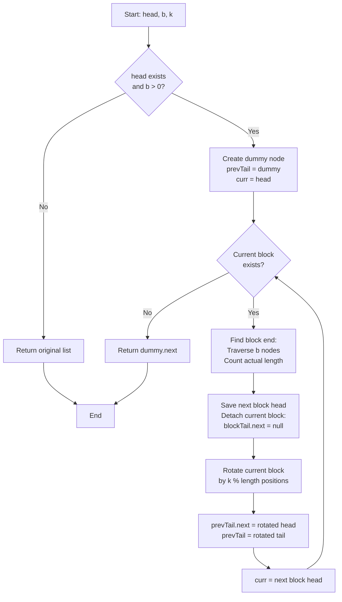

# LNK-013: Shuttle Ticket Rotate by Blocks

## 📋 Problem Summary

You are given a linked list. You need to divide it into consecutive blocks of size `b`. For each block, rotate its nodes to the right by `k` positions.
- If the last block has fewer than `b` nodes, rotate it by `k` relative to its actual size.
- Concatenate the rotated blocks to form the final list.

## 🌍 Real-World Scenario

**Scenario Title:** The Shift Scheduler

A factory has `N` workers standing in a line. They are divided into teams of size `b`. Every week, the manager rotates the roles within each team by `k` positions to ensure everyone learns every job.
- Team 1: Workers 1-3. Rotate by 1 -> Worker 3 moves to front.
- Team 2: Workers 4-6. Rotate by 1 -> Worker 6 moves to front.
- Team 3: Workers 7-8 (incomplete team). Rotate by 1 -> Worker 8 moves to front.

You need to generate the new lineup order.

**Why This Problem Matters:**

- **Cryptography:** Block ciphers often involve permuting or rotating bits within fixed-size blocks.
- **UI Carousels:** Multiple independent carousels on a page rotating their content.
- **Data Batching:** Processing batches of data where the processing order within each batch is cyclic.


## Detailed Explanation

### ASCII Diagram: Block Rotation

List: `1 -> 2 -> 3 -> 4 -> 5 -> 6`
`b = 3`, `k = 1`

**Block 1:** `1 -> 2 -> 3`
- Size = 3.
- Rotate Right by `1 % 3 = 1`.
- Result: `3 -> 1 -> 2`.

**Block 2:** `4 -> 5 -> 6`
- Size = 3.
- Rotate Right by `1 % 3 = 1`.
- Result: `6 -> 4 -> 5`.

**Concatenate:**
`3 -> 1 -> 2` -> `6 -> 4 -> 5`

### ✅ Input/Output Clarifications (Read This Before Coding)

- **Independent Rotations:** Rotating block 1 does not affect block 2.
- **Last Block:** If `N=5, b=3`, the second block has size 2. Rotate it by `k % 2`.
- **Large K:** `k` can be very large, so always use modulo arithmetic.

Common interpretation mistake:

- ❌ **Wrong:** Rotating the entire list first, then splitting.
- ✅ **Correct:** Split first, then rotate each piece.

### Core Concept: Isolate and Rotate

To solve this cleanly, write a helper function `rotate(head, length, k)` that rotates a standalone list. Then, iterate through the main list, cutting out chunks of size `b`, rotating them, and stitching them back together.

## Naive Approach

### Intuition

Convert list to array. Process chunks in array. Convert back.

### Algorithm

1. List -> ArrayList.
2. For `i = 0` to `n` step `b`:
   - Extract sublist `[i, min(i+b, n))`.
   - Rotate sublist.
   - Append to result.
3. Array -> List.

### Time Complexity

- **O(N)**.

### Space Complexity

- **O(N)**.

## Optimal Approach

### Key Insight

In-place manipulation. Maintain a `tail` pointer for the *previous* block to link to the *current* rotated block.

### Algorithm

1. `dummy` points to head. `prevTail = dummy`.
2. Loop while `head` exists:
   - **Identify Block:** Traverse `b` nodes to find the end of the current block. Count actual length `len`.
   - **Detach:** Save `nextBlockHead`. Break the link after the current block.
   - **Rotate:** Perform standard linked list rotation on the current block (size `len`, shift `k`).
   - **Attach:**
     - `prevTail.next = newBlockHead`
     - `prevTail = newBlockTail`
   - **Advance:** `head = nextBlockHead`.

### Time Complexity

- **O(N)**. We visit each node a constant number of times.

### Space Complexity

- **O(1)**.


## 🎯 Edge Cases to Test

1. **Single Block, Complete**
   - Input: `1 2 3`, b=3, k=1
   - Expected: Single block rotates
   - Output: `3 1 2`

2. **Multiple Blocks, Equal Size**
   - Input: `1 2 3 4 5 6`, b=3, k=1
   - Expected: Each 3-node block rotates right by 1
   - Output: `3 1 2 6 4 5`

3. **Last Block Incomplete**
   - Input: `1 2 3 4 5`, b=3, k=1
   - Expected: First block (1,2,3), second block (4,5)
   - Output: `3 1 2 5 4`

4. **K=0 (No Rotation)**
   - Input: `1 2 3 4 5 6`, b=2, k=0
   - Expected: No change
   - Output: `1 2 3 4 5 6`

5. **K Greater Than Block Size**
   - Input: `1 2 3 4 5 6`, b=2, k=5
   - Expected: Use k % block_size
   - Output: `2 1 4 3 6 5` (k=5, block_size=2, 5%2=1)

6. **Single Element List**
   - Input: `7`, b=3, k=2
   - Expected: Single element, no rotation needed
   - Output: `7`

## Implementations

### Python
```python
import sys

class ListNode:
    def __init__(self, val=0):
        self.val = val
        self.next = None

def rotate_list(head: ListNode, length: int, k: int):
    if length <= 1 or k % length == 0:
        tail = head
        while tail.next:
            tail = tail.next
        return head, tail

    k = k % length
    moves = length - k

    new_tail = head
    for _ in range(moves - 1):
        new_tail = new_tail.next

    new_head = new_tail.next
    new_tail.next = None

    temp = new_head
    while temp.next:
        temp = temp.next
    temp.next = head

    return new_head, new_tail

def rotate_blocks(head: ListNode, b: int, k: int) -> ListNode:
    if not head or b <= 0:
        return head

    dummy = ListNode(0)
    prev_tail = dummy
    curr = head

    while curr:
        block_head = curr
        block_tail = curr
        length = 1

        # Find block end
        for _ in range(b - 1):
            if not block_tail.next:
                break
            block_tail = block_tail.next
            length += 1

        next_block_head = block_tail.next
        block_tail.next = None  # Detach

        # Rotate
        new_head, new_tail = rotate_list(block_head, length, k)

        # Attach
        prev_tail.next = new_head
        prev_tail = new_tail

        curr = next_block_head

    return dummy.next
```

### Java
```java
class ListNode {
    int val;
    ListNode next;
    ListNode(int val) { this.val = val; }
}

class Solution {
    static class RotateResult {
        ListNode head;
        ListNode tail;
        RotateResult(ListNode head, ListNode tail) {
            this.head = head;
            this.tail = tail;
        }
    }

    private RotateResult rotateList(ListNode head, int length, int k) {
        if (length <= 1 || k % length == 0) {
            ListNode tail = head;
            while (tail.next != null) {
                tail = tail.next;
            }
            return new RotateResult(head, tail);
        }

        k = k % length;
        int moves = length - k;

        ListNode newTail = head;
        for (int i = 0; i < moves - 1; i++) {
            newTail = newTail.next;
        }

        ListNode newHead = newTail.next;
        newTail.next = null;

        ListNode temp = newHead;
        while (temp.next != null) {
            temp = temp.next;
        }
        temp.next = head;

        return new RotateResult(newHead, newTail);
    }

    public ListNode rotateBlocks(ListNode head, int b, int k) {
        if (head == null || b <= 0) {
            return head;
        }

        ListNode dummy = new ListNode(0);
        ListNode prevTail = dummy;
        ListNode curr = head;

        while (curr != null) {
            ListNode blockHead = curr;
            ListNode blockTail = curr;
            int length = 1;

            // Find block end
            for (int i = 0; i < b - 1; i++) {
                if (blockTail.next == null) {
                    break;
                }
                blockTail = blockTail.next;
                length++;
            }

            ListNode nextBlockHead = blockTail.next;
            blockTail.next = null;  // Detach

            // Rotate
            RotateResult result = rotateList(blockHead, length, k);

            // Attach
            prevTail.next = result.head;
            prevTail = result.tail;

            curr = nextBlockHead;
        }

        return dummy.next;
    }
}
```

### C++
```cpp
class ListNode {
public:
    int val;
    ListNode* next;
    ListNode(int val) : val(val), next(nullptr) {}
};

class Solution {
public:
    pair<ListNode*, ListNode*> rotateList(ListNode* head, int length, int k) {
        if (length <= 1 || k % length == 0) {
            ListNode* tail = head;
            while (tail->next) {
                tail = tail->next;
            }
            return {head, tail};
        }

        k = k % length;
        int moves = length - k;

        ListNode* newTail = head;
        for (int i = 0; i < moves - 1; i++) {
            newTail = newTail->next;
        }

        ListNode* newHead = newTail->next;
        newTail->next = nullptr;

        ListNode* temp = newHead;
        while (temp->next) {
            temp = temp->next;
        }
        temp->next = head;

        return {newHead, newTail};
    }

    ListNode* rotateBlocks(ListNode* head, int b, int k) {
        if (!head || b <= 0) {
            return head;
        }

        ListNode* dummy = new ListNode(0);
        ListNode* prevTail = dummy;
        ListNode* curr = head;

        while (curr) {
            ListNode* blockHead = curr;
            ListNode* blockTail = curr;
            int length = 1;

            // Find block end
            for (int i = 0; i < b - 1; i++) {
                if (!blockTail->next) {
                    break;
                }
                blockTail = blockTail->next;
                length++;
            }

            ListNode* nextBlockHead = blockTail->next;
            blockTail->next = nullptr;  // Detach

            // Rotate
            auto [newHead, newTail] = rotateList(blockHead, length, k);

            // Attach
            prevTail->next = newHead;
            prevTail = newTail;

            curr = nextBlockHead;
        }

        ListNode* result = dummy->next;
        delete dummy;
        return result;
    }
};
```

### JavaScript
```javascript
class ListNode {
    constructor(val = 0) {
        this.val = val;
        this.next = null;
    }
}

class Solution {
    rotateList(head, length, k) {
        if (length <= 1 || k % length === 0) {
            let tail = head;
            while (tail.next) {
                tail = tail.next;
            }
            return [head, tail];
        }

        k = k % length;
        const moves = length - k;

        let newTail = head;
        for (let i = 0; i < moves - 1; i++) {
            newTail = newTail.next;
        }

        const newHead = newTail.next;
        newTail.next = null;

        let temp = newHead;
        while (temp.next) {
            temp = temp.next;
        }
        temp.next = head;

        return [newHead, newTail];
    }

    rotateBlocks(head, b, k) {
        if (!head || b <= 0) {
            return head;
        }

        const dummy = new ListNode(0);
        let prevTail = dummy;
        let curr = head;

        while (curr) {
            let blockHead = curr;
            let blockTail = curr;
            let length = 1;

            // Find block end
            for (let i = 0; i < b - 1; i++) {
                if (!blockTail.next) {
                    break;
                }
                blockTail = blockTail.next;
                length++;
            }

            const nextBlockHead = blockTail.next;
            blockTail.next = null;  // Detach

            // Rotate
            const [newHead, newTail] = this.rotateList(blockHead, length, k);

            // Attach
            prevTail.next = newHead;
            prevTail = newTail;

            curr = nextBlockHead;
        }

        return dummy.next;
    }
}
```


## Complexity Analysis Table

| Metric | Complexity | Notes |
|:-------|:----------:|:------|
| **Time Complexity** | O(N) | We visit each node exactly twice (once for block identification, once for rotation) |
| **Space Complexity** | O(1) | Only using pointers (dummy, prev_tail, curr, block pointers) |
| **Auxiliary Space** | O(1) | No additional data structures needed |

## 🧪 Test Case Walkthrough (Dry Run)

### Test Case 1: Multiple Equal-Sized Blocks

**Input:** `1 2 3 4 5 6`, b=3, k=1

**Block 1 Processing:**
```
Initial: dummy -> 1 -> 2 -> 3 -> 4 -> 5 -> 6 -> null
Block head: 1, Identify 3 nodes: 1, 2, 3
Length: 3
Detach: blockTail.next = null (break between 3 and 4)

Rotation (1->2->3 by 1 position right):
- moves = 3 - 1 = 2
- newTail at position 2: 1 -> 2
- newHead = newTail.next = 3
- Link: Find tail of 3 (which is 3), set 3.next = 1 -> 3 -> 1 -> 2 -> null

Result: 3 -> 1 -> 2
```

**Block 2 Processing:**
```
Remaining: 4 -> 5 -> 6 -> null
Block head: 4, Identify 3 nodes: 4, 5, 6
Length: 3
Detach: blockTail.next = null

Rotation (4->5->6 by 1 position right):
Result: 6 -> 4 -> 5
```

**Final Connection:**
```
dummy -> 3 -> 1 -> 2 -> 6 -> 4 -> 5 -> null
Return: 3 -> 1 -> 2 -> 6 -> 4 -> 5
```

**Result:** `3 1 2 6 4 5`

### Test Case 2: Incomplete Last Block

**Input:** `1 2 3 4 5`, b=3, k=1

**Block 1:**
- Nodes: 1, 2, 3 (full block of size 3)
- Rotate right by 1: `3 -> 1 -> 2`

**Block 2:**
- Nodes: 4, 5 (incomplete block of size 2)
- Rotate right by k=1: 1 % 2 = 1
- `moves = 2 - 1 = 1`
- newTail at 4: points to 5
- newHead = 5
- Link: 5.next = 4 → `5 -> 4`

**Result:** `3 1 2 5 4`

### Test Case 3: K Greater Than Block Size

**Input:** `1 2 3 4 5 6`, b=2, k=5

**Block 1:**
- Nodes: 1, 2 (size 2)
- k % 2 = 5 % 2 = 1
- Rotate right by 1: `2 -> 1`

**Block 2:**
- Nodes: 3, 4 (size 2)
- Rotate right by 1: `4 -> 3`

**Block 3:**
- Nodes: 5, 6 (size 2)
- Rotate right by 1: `6 -> 5`

**Result:** `2 1 4 3 6 5`

## Mermaid Flowchart: Rotate Blocks Algorithm




## ✅ Proof of Correctness

### Invariant
The list processed so far consists of fully rotated blocks in their correct relative order. `prevTail` always points to the last node of the processed portion.

### Why the approach is correct
- **Isolation:** Detaching blocks prevents rotation logic from messing up the rest of the list.
- **Modularity:** Using a standard `rotateList` function ensures correctness for edge cases (k=0, k>len).
- **Connectivity:** We explicitly track `prevTail` to stitch the result back together.

## 💡 Interview Extensions (High-Value Add-ons)

- **Extension 1:** Rotate Left instead of Right.
  - *Hint:* `Rotate Left(k)` is same as `Rotate Right(len - k)`.
- **Extension 2:** Reverse blocks instead of rotate.
  - *Hint:* This is "Reverse Nodes in k-Group".
- **Extension 3:** Variable block sizes (given as an array).
  - *Hint:* Pass `sizes[i]` to the loop instead of constant `b`.

### Common Mistakes to Avoid

1. **Tail Linking**
   - ❌ Wrong: Forgetting to link the new tail of a rotated block to the *next* block (though our loop handles this by linking `prevTail` to `newHead` in the next iteration).
   - ✅ Correct: Our approach links `prevTail.next = newHead`.

2. **Modulo Arithmetic**
   - ❌ Wrong: `k % b` (using block size constant).
   - ✅ Correct: `k % len` (using actual length, which might be smaller for the last block).

## Related Concepts

- **List Rotation:** Standard problem.
- **Block Processing:** Breaking problems into chunks.
- **In-place Manipulation:** Avoiding extra arrays.
