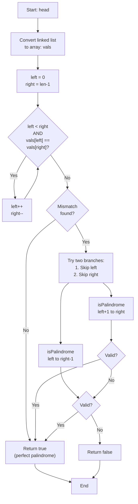

# LNK-014: Robotics Palindrome with One Skip

## 📋 Problem Summary

You are given a linked list. Determine if it can become a palindrome by removing **at most one** node.
- If it's already a palindrome, return `true`.
- If removing one node makes it a palindrome, return `true`.
- Otherwise, return `false`.

## 🌍 Real-World Scenario

**Scenario Title:** The DNA Sequence Validator

A robotic sensor reads a DNA sequence from a biological sample. DNA strands often contain palindromic sequences (like `GAATTC` for EcoRI restriction sites). However, due to minor mutations or reading errors, a single extra base pair might be inserted.
- Sequence: `A -> G -> C -> T -> T -> C -> G -> A` (Perfect Palindrome)
- Mutation: `A -> G -> X -> C -> T -> T -> C -> G -> A` (One 'X' inserted)

The robot needs to validate if the sequence is a "near-palindrome" (valid palindrome with at most one error) to accept the sample.

**Why This Problem Matters:**

- **Spell Checkers:** Detecting words that are one typo away from a valid palindrome.
- **Data Transmission:** Error detection where a single bit flip or insertion can be ignored.
- **Computer Vision:** Recognizing symmetric shapes that have a minor defect or noise.


## Detailed Explanation

### ASCII Diagram: Two Pointers with Skip

List: `1 -> 2 -> 3 -> 4 -> 2 -> 1`

1. **Convert to Array:** `[1, 2, 3, 4, 2, 1]`
2. **Pointers:** `L=0` (1), `R=5` (1). Match!
3. **Move:** `L=1` (2), `R=4` (2). Match!
4. **Move:** `L=2` (3), `R=3` (4). **Mismatch!**

**Branch 1 (Skip Left):**
- Remove index 2 (val 3).
- Check subarray `[4]` (indices 3 to 3).
- Palindrome? Yes. **Return True.**

**Branch 2 (Skip Right):**
- Remove index 3 (val 4).
- Check subarray `[3]` (indices 2 to 2).
- Palindrome? Yes.

Since at least one branch works, the answer is `true`.

### ✅ Input/Output Clarifications (Read This Before Coding)

- **At Most One:** 0 deletions is fine.
- **Empty List:** Is a palindrome.
- **Single Node:** Is a palindrome.

Common interpretation mistake:

- ❌ **Wrong:** Trying to modify the linked list in-place and restore it.
- ✅ **Correct:** Converting to an ArrayList/Vector is O(N) space but makes the logic trivial (random access). Given the constraints and difficulty, this is the expected approach.

### Core Concept: Greedy Match

We match from outside in. The moment we find a mismatch, we have exactly two choices: delete the left character or delete the right character. We don't need to try deleting characters elsewhere because the outer layers already matched.

## Naive Approach

### Intuition

For every node `i`, remove it, check if remaining list is palindrome.

### Algorithm

1. Loop `i` from 0 to `n`.
2. Create copy of list without node `i`.
3. Check if copy is palindrome.
4. If yes, return true.

### Time Complexity

- **O(N^2)**.

### Space Complexity

- **O(N)**.

## Optimal Approach

### Key Insight

Use Two Pointers on an array representation.

### Algorithm

1. Traverse list and store values in an array `vals`.
2. Initialize `left = 0`, `right = n - 1`.
3. While `left < right`:
   - If `vals[left] == vals[right]`:
     - `left++`, `right--`
   - Else:
     - Check if `vals[left+1...right]` is a palindrome OR
     - Check if `vals[left...right-1]` is a palindrome.
     - Return result of check.
4. Return `true` (if loop finishes without returning).

### Time Complexity

- **O(N)**.

### Space Complexity

- **O(N)** for the array. (O(1) space is possible by reversing the second half of the linked list, but it's much more complex and destructive).


## 🎯 Edge Cases to Test

1. **Already a Palindrome**
   - Input: `1 2 3 2 1`
   - Expected: True (no deletion needed)
   - Output: `true`

2. **Delete Left Character Makes Palindrome**
   - Input: `1 5 2`
   - Expected: Remove 1 → [5, 2], but 5 != 2. Remove 5 → [1, 2], but 1 != 2. False
   - Output: `false`

3. **Single Element**
   - Input: `7`
   - Expected: True (trivial palindrome)
   - Output: `true`

4. **Two Elements, Same**
   - Input: `5 5`
   - Expected: True (already palindrome)
   - Output: `true`

5. **Two Elements, Different**
   - Input: `1 2`
   - Expected: True (remove either makes single element palindrome)
   - Output: `true`

6. **Mismatch Fixed by Skipping Left**
   - Input: `1 2 3 2 1` (add extra) - `9 1 2 3 2 1`
   - Expected: True (skip 9)
   - Output: `true`

## Implementations

### Python
```python
import sys

class ListNode:
    def __init__(self, val=0):
        self.val = val
        self.next = None

def is_palindrome(vals, left, right):
    while left < right:
        if vals[left] != vals[right]:
            return False
        left += 1
        right -= 1
    return True

def can_be_palindrome(head: ListNode) -> bool:
    vals = []
    curr = head
    while curr:
        vals.append(curr.val)
        curr = curr.next

    left, right = 0, len(vals) - 1
    while left < right:
        if vals[left] != vals[right]:
            # Try skipping left or right
            return is_palindrome(vals, left + 1, right) or \
                   is_palindrome(vals, left, right - 1)
        left += 1
        right -= 1

    return True
```

### Java
```java
class ListNode {
    int val;
    ListNode next;
    ListNode(int val) { this.val = val; }
}

class Solution {
    private boolean isPalindrome(int[] vals, int left, int right) {
        while (left < right) {
            if (vals[left] != vals[right]) {
                return false;
            }
            left++;
            right--;
        }
        return true;
    }

    public boolean canBePalindrome(ListNode head) {
        java.util.List<Integer> list = new java.util.ArrayList<>();
        ListNode curr = head;
        while (curr != null) {
            list.add(curr.val);
            curr = curr.next;
        }

        int[] vals = new int[list.size()];
        for (int i = 0; i < list.size(); i++) {
            vals[i] = list.get(i);
        }

        int left = 0, right = vals.length - 1;
        while (left < right) {
            if (vals[left] != vals[right]) {
                return isPalindrome(vals, left + 1, right) ||
                       isPalindrome(vals, left, right - 1);
            }
            left++;
            right--;
        }

        return true;
    }
}
```

### C++
```cpp
class ListNode {
public:
    int val;
    ListNode* next;
    ListNode(int val) : val(val), next(nullptr) {}
};

class Solution {
private:
    bool isPalindrome(vector<int>& vals, int left, int right) {
        while (left < right) {
            if (vals[left] != vals[right]) {
                return false;
            }
            left++;
            right--;
        }
        return true;
    }

public:
    bool canBePalindrome(ListNode* head) {
        vector<int> vals;
        ListNode* curr = head;
        while (curr) {
            vals.push_back(curr->val);
            curr = curr->next;
        }

        int left = 0, right = vals.size() - 1;
        while (left < right) {
            if (vals[left] != vals[right]) {
                return isPalindrome(vals, left + 1, right) ||
                       isPalindrome(vals, left, right - 1);
            }
            left++;
            right--;
        }

        return true;
    }
};
```

### JavaScript
```javascript
class ListNode {
    constructor(val = 0) {
        this.val = val;
        this.next = null;
    }
}

class Solution {
    isPalindrome(vals, left, right) {
        while (left < right) {
            if (vals[left] !== vals[right]) {
                return false;
            }
            left++;
            right--;
        }
        return true;
    }

    canBePalindrome(head) {
        const vals = [];
        let curr = head;
        while (curr) {
            vals.push(curr.val);
            curr = curr.next;
        }

        let left = 0, right = vals.length - 1;
        while (left < right) {
            if (vals[left] !== vals[right]) {
                return this.isPalindrome(vals, left + 1, right) ||
                       this.isPalindrome(vals, left, right - 1);
            }
            left++;
            right--;
        }

        return true;
    }
}
```


## Complexity Analysis Table

| Metric | Complexity | Notes |
|:-------|:----------:|:------|
| **Time Complexity** | O(N) | Convert list to array: O(N), palindrome checks: O(N) worst case, overall O(N) |
| **Space Complexity** | O(N) | Array storage for node values |
| **Auxiliary Space** | O(N) | Array of length N |

## 🧪 Test Case Walkthrough (Dry Run)

### Test Case 1: Already a Palindrome

**Input:** `1 2 3 2 1`

**Step 1: Convert to Array**
```
vals = [1, 2, 3, 2, 1]
```

**Step 2: Two-Pointer Check**
| Iteration | left | right | vals[left] | vals[right] | Check | Action |
|:---------:|:----:|:-----:|:----------:|:-----------:|:-----:|:------:|
| 1 | 0 | 4 | 1 | 1 | Match | Move inward |
| 2 | 1 | 3 | 2 | 2 | Match | Move inward |
| 3 | 2 | 2 | - | - | left >= right | Exit loop |

**Result:** `true` (no deletion needed)

### Test Case 2: Can Be Palindrome by Skipping

**Input:** `9 1 2 3 2 1`

**Step 1: Convert to Array**
```
vals = [9, 1, 2, 3, 2, 1]
```

**Step 2: Two-Pointer Check**
| Iteration | left | right | vals[left] | vals[right] | Check | Action |
|:---------:|:----:|:-----:|:----------:|:-----------:|:-----:|:------:|
| 1 | 0 | 5 | 9 | 1 | Mismatch! | Branch |

**Step 3: Try Skipping**

**Option A: Skip Left (left+1=1, right=5)**
```
Check [1, 2, 3, 2, 1] from indices 1 to 5
isPalindrome(vals, 1, 5):
- vals[1]=1 vs vals[5]=1: Match
- vals[2]=2 vs vals[4]=2: Match
- vals[3]=3 vs vals[3]=3: Same index, exit
Result: true
```

**Result:** `true` (skip the 9)

### Test Case 3: Cannot Be Palindrome

**Input:** `1 5 2`

**Step 1: Convert to Array**
```
vals = [1, 5, 2]
```

**Step 2: Two-Pointer Check**
| Iteration | left | right | vals[left] | vals[right] | Check | Action |
|:---------:|:----:|:-----:|:----------:|:-----------:|:-----:|:------:|
| 1 | 0 | 2 | 1 | 2 | Mismatch! | Branch |

**Step 3: Try Skipping**

**Option A: Skip Left (indices 1 to 2)**
```
isPalindrome(vals, 1, 2):
- vals[1]=5 vs vals[2]=2: Mismatch
Result: false
```

**Option B: Skip Right (indices 0 to 1)**
```
isPalindrome(vals, 0, 1):
- vals[0]=1 vs vals[1]=5: Mismatch
Result: false
```

**Result:** `false` (no single deletion works)

### Test Case 4: Two Different Elements

**Input:** `1 2`

**Step 1: Convert to Array**
```
vals = [1, 2]
```

**Step 2: Two-Pointer Check**
| Iteration | left | right | vals[left] | vals[right] | Check | Action |
|:---------:|:----:|:-----:|:----------:|:-----------:|:-----:|:------:|
| 1 | 0 | 1 | 1 | 2 | Mismatch! | Branch |

**Step 3: Try Skipping**

**Option A: Skip Left (left+1=1, right=1)**
```
isPalindrome(vals, 1, 1):
- left >= right: Exit immediately
Result: true (single element is palindrome)
```

**Result:** `true` (remove first element)

## Mermaid Flowchart: Palindrome with One Skip Algorithm




## ✅ Proof of Correctness

### Invariant
If a palindrome exists with at most one deletion, the mismatch MUST occur at the first pair of indices `(L, R)` where `vals[L] != vals[R]`.

### Why the approach is correct
- We match greedily from the outside.
- When we hit a mismatch, the "bad" character must be either `vals[L]` or `vals[R]`.
- We try both possibilities. If either results in a valid inner palindrome, we are good.

## 💡 Interview Extensions (High-Value Add-ons)

- **Extension 1:** Solve in O(1) space.
  - *Hint:* Find middle, reverse second half. Compare. If mismatch, skip one node and compare rest. Complex pointer management.
- **Extension 2:** Longest Palindromic Subsequence.
  - *Hint:* Dynamic Programming (O(N^2)).
- **Extension 3:** K deletions allowed.
  - *Hint:* Recursion with memoization or DP.

### Common Mistakes to Avoid

1. **Skipping Both**
   - ❌ Wrong: Skipping both L and R at the same time.
   - ✅ Correct: You can only delete ONE node total.

2. **Edge Cases**
   - ❌ Wrong: Failing on empty list or single node.
   - ✅ Correct: Loop `left < right` handles these naturally.

