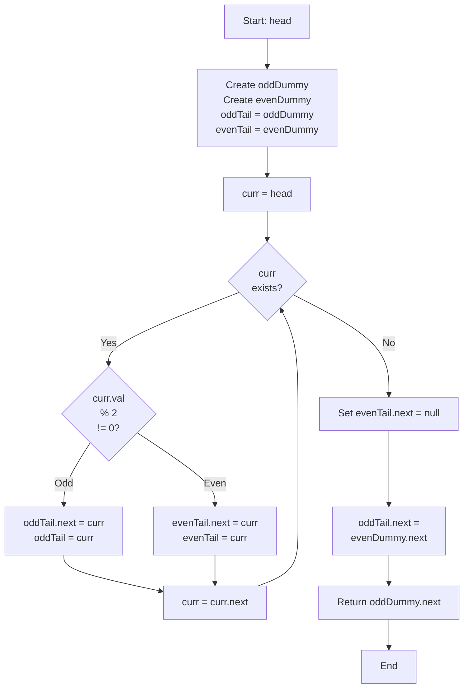

# LNK-015: Workshop Odd Even Grouping Stable

## 📋 Problem Summary

You are given a linked list. You need to reorder it such that:
1. All nodes with **odd values** appear first.
2. All nodes with **even values** appear second.
3. The relative order of nodes within the odd group and within the even group must remain unchanged (stable).

## 🌍 Real-World Scenario

**Scenario Title:** The Workshop Team Split

A workshop facilitator wants to split participants into two large teams for a debate: "Team Odd" and "Team Even" based on the number on their badge.
- Participants are currently standing in a single line.
- The facilitator asks all "Odds" to step to the left and all "Evens" to step to the right.
- Then, the "Odd" line is placed in front of the "Even" line to enter the hall.
- Crucially, if Alice (Odd) was standing before Bob (Odd) in the original line, she must still be before him in the new team line.

**Why This Problem Matters:**

- **Data Partitioning:** Separating data into two categories (e.g., active vs. inactive users) for batch processing.
- **Radix Sort:** This is a single pass of a binary Radix Sort (sorting by the least significant bit).
- **Network Traffic:** Prioritizing certain packets (Odds) over others (Evens) while maintaining sequence order.


## Detailed Explanation

### ASCII Diagram: Partitioning

List: `2 -> 5 -> 4 -> 7`

1. **Initialize:** `OddHead`, `EvenHead`.
2. **Process 2 (Even):** Add to Even. `E: 2`
3. **Process 5 (Odd):** Add to Odd. `O: 5`
4. **Process 4 (Even):** Add to Even. `E: 2 -> 4`
5. **Process 7 (Odd):** Add to Odd. `O: 5 -> 7`

**Concatenate:**
`Odd` -> `Even`
`5 -> 7` -> `2 -> 4`

Result: `5 -> 7 -> 2 -> 4`

### ✅ Input/Output Clarifications (Read This Before Coding)

- **Parity of Value:** We are checking `val % 2`, NOT the index (odd/even positions).
- **Stability:** Order must be preserved.
- **Empty Groups:** If there are no odd numbers, the list starts with evens.

Common interpretation mistake:

- ❌ **Wrong:** Odd/Even *indices*. 
- ✅ **Correct:** Odd/Even *values*.

### Core Concept: Two Dummy Heads

Using `oddDummy` and `evenDummy` eliminates the need to handle the "first node" logic separately. We just append to the respective tails.

## Naive Approach

### Intuition

Create two ArrayLists. Iterate list. Add values to lists. Rebuild list.

### Algorithm

1. `odds = []`, `evens = []`
2. Loop through list:
   - If `val % 2 != 0`: `odds.add(val)`
   - Else: `evens.add(val)`
3. Create new nodes from `odds` then `evens`.

### Time Complexity

- **O(N)**.

### Space Complexity

- **O(N)**.

## Optimal Approach

### Key Insight

Re-link existing nodes in a single pass.

### Algorithm

1. `oddDummy`, `evenDummy`.
2. `oddTail = oddDummy`, `evenTail = evenDummy`.
3. Iterate `curr` through list:
   - If `curr.val % 2 != 0`:
     - `oddTail.next = curr`
     - `oddTail = curr`
   - Else:
     - `evenTail.next = curr`
     - `evenTail = curr`
4. **Terminate:** `evenTail.next = null` (Important! Prevents cycles).
5. **Connect:** `oddTail.next = evenDummy.next`.
6. Return `oddDummy.next`.

### Time Complexity

- **O(N)**.

### Space Complexity

- **O(1)**.


## 🎯 Edge Cases to Test

1. **All Odd Values**
   - Input: `1 3 5 7`
   - Expected: No even values, all odds group only
   - Output: `1 3 5 7`

2. **All Even Values**
   - Input: `2 4 6 8`
   - Expected: No odd values, all evens group only
   - Output: `2 4 6 8`

3. **Single Element (Odd)**
   - Input: `5`
   - Expected: Single odd element
   - Output: `5`

4. **Single Element (Even)**
   - Input: `4`
   - Expected: Single even element
   - Output: `4`

5. **Alternating Odd and Even**
   - Input: `1 2 3 4 5 6`
   - Expected: Odds first (1, 3, 5), then evens (2, 4, 6)
   - Output: `1 3 5 2 4 6`

6. **Empty List**
   - Input: `null`
   - Expected: Return null
   - Output: `null`

## Implementations

### Python
```python
import sys

class ListNode:
    def __init__(self, val=0):
        self.val = val
        self.next = None

def group_odd_even_stable(head: ListNode) -> ListNode:
    odd_dummy = ListNode(0)
    even_dummy = ListNode(0)
    odd_tail = odd_dummy
    even_tail = even_dummy

    curr = head
    while curr:
        if curr.val % 2 != 0:  # Odd
            odd_tail.next = curr
            odd_tail = odd_tail.next
        else:  # Even
            even_tail.next = curr
            even_tail = even_tail.next
        curr = curr.next

    # Important: Terminate the even list to prevent cycles
    even_tail.next = None
    odd_tail.next = even_dummy.next

    return odd_dummy.next
```

### Java
```java
class ListNode {
    int val;
    ListNode next;
    ListNode(int val) { this.val = val; }
}

class Solution {
    public ListNode groupOddEvenStable(ListNode head) {
        ListNode oddDummy = new ListNode(0);
        ListNode evenDummy = new ListNode(0);
        ListNode oddTail = oddDummy;
        ListNode evenTail = evenDummy;

        ListNode curr = head;
        while (curr != null) {
            if (curr.val % 2 != 0) {  // Odd
                oddTail.next = curr;
                oddTail = oddTail.next;
            } else {  // Even
                evenTail.next = curr;
                evenTail = evenTail.next;
            }
            curr = curr.next;
        }

        // Prevent cycles
        evenTail.next = null;
        oddTail.next = evenDummy.next;

        return oddDummy.next;
    }
}
```

### C++
```cpp
class ListNode {
public:
    int val;
    ListNode* next;
    ListNode(int val) : val(val), next(nullptr) {}
};

class Solution {
public:
    ListNode* groupOddEvenStable(ListNode* head) {
        ListNode* oddDummy = new ListNode(0);
        ListNode* evenDummy = new ListNode(0);
        ListNode* oddTail = oddDummy;
        ListNode* evenTail = evenDummy;

        ListNode* curr = head;
        while (curr) {
            if (curr->val % 2 != 0) {  // Odd
                oddTail->next = curr;
                oddTail = oddTail->next;
            } else {  // Even
                evenTail->next = curr;
                evenTail = evenTail->next;
            }
            curr = curr->next;
        }

        // Prevent cycles
        evenTail->next = nullptr;
        oddTail->next = evenDummy->next;

        ListNode* result = oddDummy->next;
        delete oddDummy;
        delete evenDummy;
        return result;
    }
};
```

### JavaScript
```javascript
class ListNode {
    constructor(val = 0) {
        this.val = val;
        this.next = null;
    }
}

class Solution {
    groupOddEvenStable(head) {
        const oddDummy = new ListNode(0);
        const evenDummy = new ListNode(0);
        let oddTail = oddDummy;
        let evenTail = evenDummy;

        let curr = head;
        while (curr) {
            if (curr.val % 2 !== 0) {  // Odd
                oddTail.next = curr;
                oddTail = oddTail.next;
            } else {  // Even
                evenTail.next = curr;
                evenTail = evenTail.next;
            }
            curr = curr.next;
        }

        // Prevent cycles
        evenTail.next = null;
        oddTail.next = evenDummy.next;

        return oddDummy.next;
    }
}
```


## Complexity Analysis Table

| Metric | Complexity | Notes |
|:-------|:----------:|:------|
| **Time Complexity** | O(N) | Single pass through the list, processing each node once |
| **Space Complexity** | O(1) | Only using pointers (2 dummy heads and 2 tail pointers) |
| **Auxiliary Space** | O(1) | No additional data structures needed |

## 🧪 Test Case Walkthrough (Dry Run)

### Test Case 1: Mixed Odd and Even

**Input:** `2 5 4 7`

**Step 1: Initialize**
```
oddDummy -> (empty)
evenDummy -> (empty)
oddTail = oddDummy
evenTail = evenDummy
```

**Step 2: Process Each Node**
| Step | Current | Value | Parity | Odd Chain | Even Chain | Action |
|:----:|:-------:|:-----:|:------:|:---------:|:----------:|:------:|
| 1 | 2 | 2 | Even | empty | [2] | Add to even |
| 2 | 5 | 5 | Odd | [5] | [2] | Add to odd |
| 3 | 4 | 4 | Even | [5] | [2,4] | Add to even |
| 4 | 7 | 7 | Odd | [5,7] | [2,4] | Add to odd |

**Step 3: Terminate and Connect**
- Set evenTail.next = null (break cycle) → 4.next = null
- Set oddTail.next = evenDummy.next → 7.next = 2
- Return oddDummy.next = 5

**Final Structure:**
```
Odd chain: 5 -> 7 -> null
Even chain: 2 -> 4 -> null
Result: 5 -> 7 -> 2 -> 4 -> null
```

**Result:** `5 7 2 4`

### Test Case 2: All Odd Values

**Input:** `1 3 5`

**Step 1: Initialize**
```
oddDummy -> (empty)
evenDummy -> (empty)
```

**Step 2: Process Each Node**
| Step | Current | Value | Parity | Odd Chain | Even Chain |
|:----:|:-------:|:-----:|:------:|:---------:|:----------:|
| 1 | 1 | 1 | Odd | [1] | empty |
| 2 | 3 | 3 | Odd | [1,3] | empty |
| 3 | 5 | 5 | Odd | [1,3,5] | empty |

**Step 3: Connect**
- evenDummy.next = null (never used)
- evenTail.next = null
- oddTail.next = null (evenDummy.next is null)

**Result:** `1 3 5`

### Test Case 3: Alternating Odd-Even

**Input:** `1 2 3 4 5 6`

**Processing:**
| Node | Value | Parity | Chain |
|:----:|:-----:|:------:|:-----:|
| 1 | Odd | odd |  |
| 2 | Even | even |  |
| 3 | Odd | odd |  |
| 4 | Even | even |  |
| 5 | Odd | odd |  |
| 6 | Even | even |  |

**Final Structure:**
```
Odd: 1 -> 3 -> 5 -> (null)
Even: 2 -> 4 -> 6 -> (null)
Result: 1 -> 3 -> 5 -> 2 -> 4 -> 6
```

**Result:** `1 3 5 2 4 6`

## Mermaid Flowchart: Odd-Even Grouping Algorithm




## ✅ Proof of Correctness

### Invariant
`oddTail` points to the last processed odd node, `evenTail` points to the last processed even node. Order is preserved because we append to tail.

### Why the approach is correct
- We process sequentially.
- We separate into two disjoint sets.
- We concatenate them in the correct order (Odd then Even).

## 💡 Interview Extensions (High-Value Add-ons)

- **Extension 1:** Group by index parity (Odd positions then Even positions).
- **Extension 2:** Sort 0s, 1s, 2s.
  - *Hint:* 3 dummy heads.
- **Extension 3:** Partition around pivot X.
  - *Hint:* Same logic, condition `val < X`.

### Common Mistakes to Avoid

1. **Cycle Creation**
   - ❌ Wrong: Forgetting `evenTail.next = null`. The last even node might point to an odd node from the original list, creating a cycle.
   - ✅ Correct: Always terminate the second list.

2. **Connecting Lists**
   - ❌ Wrong: `oddTail.next = evenTail`.
   - ✅ Correct: `oddTail.next = evenDummy.next`.

## Related Concepts

- **Stable Partition:** The general form of this problem.
- **Dummy Node:** Simplifies list construction.
