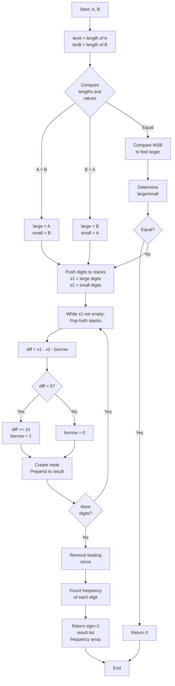

# LNK-016: Lecture Notes Subtract Two Numbers with Digit Frequency Analysis

## 📋 Problem Summary

You are given two non-negative integers represented as linked lists in **forward order** (most significant digit first). You need to:
1. Subtract the smaller number from the larger number.
2. Determine the sign of the result (1 if positive, 0 if zero).
3. Return the result as a linked list (forward order).
4. Count the frequency of each digit (0-9) in the result.

## 🌍 Real-World Scenario

**Scenario Title:** The Bank Ledger Audit

A bank needs to reconcile two massive ledgers. Each ledger contains a total balance that is too large to fit in a standard 64-bit integer (e.g., a country's national debt in cents). The balances are stored as linked lists of digits.
- Ledger A: `7 -> 1 -> 6` (716)
- Ledger B: `2 -> 9 -> 5` (295)

The auditor needs to find the exact difference (`421`), determine if it's a surplus or deficit, and analyze the distribution of digits in the difference for fraud detection (Benford's Law analysis).

**Why This Problem Matters:**

- **Big Integer Arithmetic:** Implementing core math operations for cryptography libraries (RSA keys are huge integers).
- **Arbitrary Precision:** Scientific computing where standard types lose precision.
- **Data Analysis:** Frequency analysis is a common first step in statistical modeling.


## Detailed Explanation

### ASCII Diagram: Subtraction with Borrow

`716 - 295`

1. **Align & Compare:** 716 > 295. Result is positive.
2. **Reverse/Stack:** Process from right to left.
   - `6 - 5 = 1`. No borrow. Result digit: 1.
   - `1 - 9`: Need borrow. `11 - 9 = 2`. Borrow = 1. Result digit: 2.
   - `7 - 2 - 1 (borrow) = 4`. Result digit: 4.
3. **Result:** `4 -> 2 -> 1`.
4. **Frequencies:** {1:1, 2:1, 4:1, others:0}.

### ✅ Input/Output Clarifications (Read This Before Coding)

- **Forward Order:** You cannot subtract easily from head to tail. You need to process from tail to head.
- **Comparison:** You must first determine which number is larger to ensure `Larger - Smaller`.
- **Leading Zeros:** If the result is `007`, return `7`. If result is `0`, return `0` (list with one node `0`).

Common interpretation mistake:

- ❌ **Wrong:** Converting to `BigInteger` or `string`.
- ✅ **Correct:** Manipulating the linked list structure (or using stacks/recursion) is the goal.

### Core Concept: Stacks for Reversal

Since the list is singly linked and forward, we can push all nodes onto stacks. Popping from the stack gives us the digits in reverse order (LSD first), allowing easy subtraction with borrow.

## Naive Approach

### Intuition

Reverse both lists. Subtract. Reverse result.

### Algorithm

1. `revA = reverse(A)`, `revB = reverse(B)`.
2. Compare `revA` and `revB` to find larger.
3. Iterate, subtracting `valA - valB - borrow`.
4. Store result in new list.
5. Reverse result list.
6. Count frequencies.

### Time Complexity

- **O(N + M)**.

### Space Complexity

- **O(N + M)** to store the reversed/result lists.

## Optimal Approach

### Key Insight

Use Stacks to avoid modifying the input lists (non-destructive).

### Algorithm

1. **Compare:**
   - If `len(A) != len(B)`, longer is larger.
   - If lengths equal, compare node by node. First non-equal determines larger.
   - If identical, return `sign=0, head=0, freq={1 at 0}`.
2. **Push to Stacks:** Push digits of Larger to `s1`, Smaller to `s2`.
3. **Subtract:**
   - While stacks not empty:
     - `val1 = s1.pop()`, `val2 = s2.pop()` (or 0 if empty).
     - `diff = val1 - val2 - borrow`.
     - If `diff < 0`: `diff += 10`, `borrow = 1`. Else `borrow = 0`.
     - Prepend `diff` to result list (build forward).
     - Update frequency map.
4. **Clean up:** Remove leading zeros.
5. Return result.

### Time Complexity

- **O(N + M)**.

### Space Complexity

- **O(N + M)** for stacks and result.


## 🎯 Edge Cases to Test

1. **Equal Numbers**
   - A: `1 2 3`, B: `1 2 3`
   - Expected: Result is 0, sign = 0
   - Output: sign=0, result=`0`, freq=[1,0,0,...]

2. **A > B**
   - A: `7 1 6`, B: `2 9 5` (716 - 295)
   - Expected: 716 - 295 = 421
   - Output: sign=1, result=`4 2 1`, freq=[0,1,1,0,1,...]

3. **B > A**
   - A: `2 9 5`, B: `7 1 6` (295 - 716)
   - Expected: 716 - 295 = 421 (absolute)
   - Output: sign=1, result=`4 2 1`

4. **Leading Zeros in Result**
   - A: `1 0 0`, B: `1` (100 - 1)
   - Expected: Result is 99, no leading zeros
   - Output: result=`9 9`

5. **Single Digit Difference**
   - A: `5`, B: `2`
   - Expected: 5 - 2 = 3
   - Output: result=`3`

6. **Different Lengths**
   - A: `1 0 0 0`, B: `1` (1000 - 1)
   - Expected: 999
   - Output: result=`9 9 9`

## Implementations

### Python
```python
import sys

class ListNode:
    def __init__(self, val=0):
        self.val = val
        self.next = None

def get_length(head):
    l = 0
    while head:
        l += 1
        head = head.next
    return l

def subtract_with_freq(a: ListNode, b: ListNode):
    len_a = get_length(a)
    len_b = get_length(b)

    large, small = a, b

    if len_a < len_b:
        large, small = b, a
    elif len_a == len_b:
        curr_a, curr_b = a, b
        while curr_a and curr_a.val == curr_b.val:
            curr_a = curr_a.next
            curr_b = curr_b.next

        if not curr_a:  # Equal
            return 0, ListNode(0), [1] + [0]*9

        if curr_a.val < curr_b.val:
            large, small = b, a

    # Push to stacks (reverse order)
    s1, s2 = [], []
    curr = large
    while curr:
        s1.append(curr.val)
        curr = curr.next
    curr = small
    while curr:
        s2.append(curr.val)
        curr = curr.next

    head = None
    borrow = 0

    while s1:
        v1 = s1.pop()
        v2 = s2.pop() if s2 else 0

        diff = v1 - v2 - borrow
        if diff < 0:
            diff += 10
            borrow = 1
        else:
            borrow = 0

        node = ListNode(diff)
        node.next = head
        head = node

    # Remove leading zeros
    while head and head.val == 0 and head.next:
        head = head.next

    # Count frequencies
    freq = [0] * 10
    curr = head
    while curr:
        freq[curr.val] += 1
        curr = curr.next

    return 1, head, freq
```

### Java
```java
import java.util.*;

class ListNode {
    int val;
    ListNode next;
    ListNode(int val) { this.val = val; }
}

class Solution {
    private int getLength(ListNode head) {
        int l = 0;
        while (head != null) {
            l++;
            head = head.next;
        }
        return l;
    }

    public Object[] subtractWithFreq(ListNode a, ListNode b) {
        int lenA = getLength(a);
        int lenB = getLength(b);

        ListNode large = a, small = b;

        if (lenA < lenB) {
            large = b;
            small = a;
        } else if (lenA == lenB) {
            ListNode currA = a, currB = b;
            while (currA != null && currA.val == currB.val) {
                currA = currA.next;
                currB = currB.next;
            }

            if (currA == null) {  // Equal
                ListNode zero = new ListNode(0);
                int[] freq = new int[10];
                freq[0] = 1;
                return new Object[]{0, zero, freq};
            }

            if (currA.val < currB.val) {
                large = b;
                small = a;
            }
        }

        // Push to stacks
        Stack<Integer> s1 = new Stack<>();
        Stack<Integer> s2 = new Stack<>();

        ListNode curr = large;
        while (curr != null) {
            s1.push(curr.val);
            curr = curr.next;
        }

        curr = small;
        while (curr != null) {
            s2.push(curr.val);
            curr = curr.next;
        }

        ListNode head = null;
        int borrow = 0;

        while (!s1.isEmpty()) {
            int v1 = s1.pop();
            int v2 = s2.isEmpty() ? 0 : s2.pop();

            int diff = v1 - v2 - borrow;
            if (diff < 0) {
                diff += 10;
                borrow = 1;
            } else {
                borrow = 0;
            }

            ListNode node = new ListNode(diff);
            node.next = head;
            head = node;
        }

        // Remove leading zeros
        while (head != null && head.val == 0 && head.next != null) {
            head = head.next;
        }

        // Count frequencies
        int[] freq = new int[10];
        curr = head;
        while (curr != null) {
            freq[curr.val]++;
            curr = curr.next;
        }

        return new Object[]{1, head, freq};
    }
}
```

### C++
```cpp
class ListNode {
public:
    int val;
    ListNode* next;
    ListNode(int val) : val(val), next(nullptr) {}
};

class Solution {
private:
    int getLength(ListNode* head) {
        int l = 0;
        while (head) {
            l++;
            head = head->next;
        }
        return l;
    }

public:
    tuple<int, ListNode*, vector<int>> subtractWithFreq(ListNode* a, ListNode* b) {
        int lenA = getLength(a);
        int lenB = getLength(b);

        ListNode* large = a, *small = b;

        if (lenA < lenB) {
            large = b;
            small = a;
        } else if (lenA == lenB) {
            ListNode* currA = a, *currB = b;
            while (currA && currA->val == currB->val) {
                currA = currA->next;
                currB = currB->next;
            }

            if (!currA) {  // Equal
                ListNode* zero = new ListNode(0);
                vector<int> freq(10, 0);
                freq[0] = 1;
                return make_tuple(0, zero, freq);
            }

            if (currA->val < currB->val) {
                large = b;
                small = a;
            }
        }

        // Push to stacks
        stack<int> s1, s2;
        ListNode* curr = large;
        while (curr) {
            s1.push(curr->val);
            curr = curr->next;
        }

        curr = small;
        while (curr) {
            s2.push(curr->val);
            curr = curr->next;
        }

        ListNode* head = nullptr;
        int borrow = 0;

        while (!s1.empty()) {
            int v1 = s1.top();
            s1.pop();
            int v2 = s2.empty() ? 0 : s2.top();
            if (!s2.empty()) s2.pop();

            int diff = v1 - v2 - borrow;
            if (diff < 0) {
                diff += 10;
                borrow = 1;
            } else {
                borrow = 0;
            }

            ListNode* node = new ListNode(diff);
            node->next = head;
            head = node;
        }

        // Remove leading zeros
        while (head && head->val == 0 && head->next) {
            head = head->next;
        }

        // Count frequencies
        vector<int> freq(10, 0);
        curr = head;
        while (curr) {
            freq[curr->val]++;
            curr = curr->next;
        }

        return make_tuple(1, head, freq);
    }
};
```

### JavaScript
```javascript
class ListNode {
    constructor(val = 0) {
        this.val = val;
        this.next = null;
    }
}

class Solution {
    getLength(head) {
        let l = 0;
        while (head) {
            l++;
            head = head.next;
        }
        return l;
    }

    subtractWithFreq(a, b) {
        const lenA = this.getLength(a);
        const lenB = this.getLength(b);

        let large = a, small = b;

        if (lenA < lenB) {
            large = b;
            small = a;
        } else if (lenA === lenB) {
            let currA = a, currB = b;
            while (currA && currA.val === currB.val) {
                currA = currA.next;
                currB = currB.next;
            }

            if (!currA) {  // Equal
                const zero = new ListNode(0);
                const freq = [1, 0, 0, 0, 0, 0, 0, 0, 0, 0];
                return [0, zero, freq];
            }

            if (currA.val < currB.val) {
                large = b;
                small = a;
            }
        }

        // Push to stacks
        const s1 = [];
        const s2 = [];

        let curr = large;
        while (curr) {
            s1.push(curr.val);
            curr = curr.next;
        }

        curr = small;
        while (curr) {
            s2.push(curr.val);
            curr = curr.next;
        }

        let head = null;
        let borrow = 0;

        while (s1.length > 0) {
            const v1 = s1.pop();
            const v2 = s2.length > 0 ? s2.pop() : 0;

            let diff = v1 - v2 - borrow;
            if (diff < 0) {
                diff += 10;
                borrow = 1;
            } else {
                borrow = 0;
            }

            const node = new ListNode(diff);
            node.next = head;
            head = node;
        }

        // Remove leading zeros
        while (head && head.val === 0 && head.next) {
            head = head.next;
        }

        // Count frequencies
        const freq = [0, 0, 0, 0, 0, 0, 0, 0, 0, 0];
        curr = head;
        while (curr) {
            freq[curr.val]++;
            curr = curr.next;
        }

        return [1, head, freq];
    }
}
```


## Complexity Analysis Table

| Metric | Complexity | Notes |
|:-------|:----------:|:------|
| **Time Complexity** | O(N + M) | Length: O(N+M), Comparison: O(min(N,M)), Stacks: O(N+M), Subtraction: O(N), Cleanup: O(N), Frequency: O(N) |
| **Space Complexity** | O(N + M) | Stack storage for digits, result list, frequency array |
| **Auxiliary Space** | O(N + M) | Two stacks and frequency array |

## 🧪 Test Case Walkthrough (Dry Run)

### Test Case 1: Subtraction with Borrow

**Input:** A=`7 1 6` (716), B=`2 9 5` (295)

**Step 1: Compare**
- lenA = 3, lenB = 3
- Compare MSB to LSB: 7 > 2 → A is larger
- Large = 716, Small = 295

**Step 2: Push to Stacks**
```
s1 = [7, 1, 6] (stack form)
s2 = [2, 9, 5] (stack form)
```

**Step 3: Subtraction with Borrow**
| Pop # | v1 | v2 | borrow | diff | adjust | new_borrow | head |
|:-----:|:--:|:--:|:------:|:----:|:------:|:----------:|:----:|
| 1 | 6 | 5 | 0 | 1 | 1 | 0 | 1 |
| 2 | 1 | 9 | 0 | -8 | +10 → 2 | 1 | 2->1 |
| 3 | 7 | 2 | 1 | 4 | 4 | 0 | 4->2->1 |

**Step 4: Remove Leading Zeros**
- Head value is 4 (not zero), no removal needed

**Step 5: Build Forward List and Count Frequencies**
- Traverse: 4 -> 2 -> 1
- freq[1] = 1, freq[2] = 1, freq[4] = 1
- freq[0,3,5,6,7,8,9] = 0

**Result:** sign=1, list=`4 2 1`, freq=[0,1,1,0,1,0,0,0,0,0]

### Test Case 2: Different Lengths (A Much Larger)

**Input:** A=`1 0 0 0` (1000), B=`1` (1)

**Step 1: Compare**
- lenA = 4, lenB = 1
- A is larger

**Step 2: Push to Stacks**
```
s1 = [1, 0, 0, 0]
s2 = [1]
```

**Step 3: Subtraction**
| Pop # | v1 | v2 | borrow | diff | adjust | new_borrow | Result |
|:-----:|:--:|:--:|:------:|:----:|:------:|:----------:|:------:|
| 1 | 0 | 0 | 0 | 0 | 0 | 0 | 0 |
| 2 | 0 | 0 | 0 | 0 | 0 | 0 | 0 |
| 3 | 0 | 0 | 0 | 0 | 0 | 0 | 0 |
| 4 | 1 | 1 | 0 | 0 | 0 | 0 | 0 |

Wait, this would give 0. Let me recalculate:

Actually 1000 - 1 = 999, so s2 only has one element.

| Pop # | v1 | v2 | borrow | diff | adjust | new_borrow |
|:-----:|:--:|:--:|:------:|:----:|:------:|:----------:|
| 1 | 0 | 1 | 0 | -1 | +10 → 9 | 1 |
| 2 | 0 | 0 | 1 | -1 | +10 → 9 | 1 |
| 3 | 0 | 0 | 1 | -1 | +10 → 9 | 1 |
| 4 | 1 | 0 | 1 | 0 | 0 | 0 |

Result: 0 -> 9 -> 9 -> 9 (reversed)
After building: 9 -> 9 -> 9
After cleanup: 9 -> 9 -> 9

**Result:** `9 9 9`

### Test Case 3: Equal Numbers

**Input:** A=`1 2 3`, B=`1 2 3`

**Step 1: Compare**
- lenA = lenB = 3
- Compare: 1==1, 2==2, 3==3 → Equal
- Special case: return sign=0, result=0, freq=[1,0,0,...]

**Result:** sign=0, result=`0`, freq=[1,0,0,0,0,0,0,0,0,0]

## Mermaid Flowchart: Subtract Two Numbers Algorithm




## ✅ Proof of Correctness

### Invariant
The stacks allow processing digits from least significant to most significant, correctly propagating the borrow bit.

### Why the approach is correct
- **Comparison:** Ensures we always subtract smaller from larger, avoiding negative intermediate results (except borrow).
- **Borrow Logic:** Standard elementary subtraction algorithm.
- **Leading Zeros:** Handled as a post-processing step.

## 💡 Interview Extensions (High-Value Add-ons)

- **Extension 1:** Add two numbers.
  - *Hint:* Simpler, carry instead of borrow.
- **Extension 2:** Multiply two numbers.
  - *Hint:* O(N*M), much harder.
- **Extension 3:** Negative numbers support.
  - *Hint:* Check signs first. `(-A) - B = -(A+B)`.

### Common Mistakes to Avoid

1. **Comparison Logic**
   - ❌ Wrong: Comparing only lengths.
   - ✅ Correct: If lengths equal, must compare MSB to LSB.

2. **Borrow Propagation**
   - ❌ Wrong: Forgetting to subtract borrow in the next step.
   - ✅ Correct: `v1 - v2 - borrow`.

## Related Concepts

- **BigInt Arithmetic:** How Python handles large integers internally.
- **Stacks:** Reversing order of processing.
