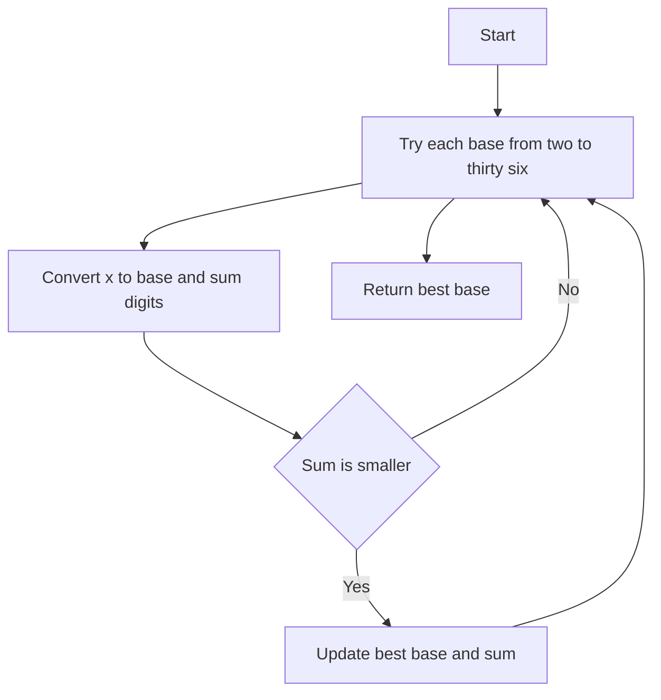

# NUM-004: Minimal Base Representation

## 📋 Problem Summary

Given an integer `x`, find the base `b` (`2 <= b <= 36`) that minimizes the sum of digits of `x` in that base.
- Input: Integer `x`.
- Output: The optimal base `b` and the minimal digit sum.
- Tie-breaking: If multiple bases yield the same sum, choose the smallest base.

## 🌍 Real-World Scenario

**Scenario Title:** The Efficient Data Encoder

In data transmission, you often want to encode numbers in a way that minimizes the "weight" or "cost" of the signal.
- Suppose transmitting a digit `d` costs `d` units of energy (e.g., amplitude modulation).
- You want to represent a large number `x` in a base `b` such that the total energy required to transmit its digits is minimized.
- However, the receiver hardware only supports bases up to 36 (digits 0-9 and A-Z).
- Your task is to find the optimal base configuration for each packet to save battery life on IoT devices.

**Why This Problem Matters:**

- **Information Theory:** Representing data efficiently.
- **Hardware Design:** Choosing radices for arithmetic units (e.g., binary vs. ternary logic).
- **Numerology:** Digital roots and properties of numbers in different bases.


## Detailed Explanation

### ASCII Diagram: Base Conversion

Let `x = 31`.

**Base 2:**
`31 = 11111_2`
Sum = `1+1+1+1+1 = 5`.

**Base 3:**
`31 = 1011_3` (`1 * 27 + 0 * 9 + 1 * 3 + 1 * 1 = 31`)
Sum = `1+0+1+1 = 3`.

**Base 5:**
`31 = 111_5` (`1 * 25 + 1 * 5 + 1 * 1 = 31`)
Sum = `1+1+1 = 3`.

**Base 10:**
`31 = 31_10`
Sum = `3+1 = 4`.

**Base 30:**
`31 = 11_30` (`1 * 30 + 1 = 31`)
Sum = `1+1 = 2`.

For `x=31`, the minimal digit sum is 2, achieved at base 30. The algorithm iterates through all bases from 2 to 36 to find the minimum.

<!-- mermaid -->


### ✅ Input/Output Clarifications (Read This Before Coding)

- **Constraints:** `x <= 10^12`.
- **Base Range:** `2 <= b <= 36`.
- **Digit Sum:** Sum of values of digits. E.g., in base 16, 'A' counts as 10.

### Core Concept: Base Conversion

To find the sum of digits of `x` in base `b`:
1. Initialize `sum = 0`, `temp = x`.
2. While `temp > 0`:
   - `sum += temp % b`
   - `temp //= b`
3. Return `sum`.

## Naive Approach

### Intuition

Iterate through all bases from 2 to 36.

### Algorithm

1. Initialize `minSum = infinity`, `bestBase = -1`.
2. For `b` from 2 to 36:
   - Calculate `currentSum` for `x` in base `b`.
   - If `currentSum < minSum`:
     - `minSum = currentSum`
     - `bestBase = b`
3. Return `bestBase, minSum`.

Note: Since we iterate from the smallest base, ties automatically favor the smaller base.

### Time Complexity

- **O(36 \cdot \log_2 x)**.
- With `x=10^12`, `log_2 x ~= 40`.
- Total operations `~= 36 x 40 ~= 1440`. Extremely fast.

### Space Complexity

- **O(1)**.

## Optimal Approach

### Key Insight

Since the number of bases is very small (35), the "naive" approach IS the optimal approach. There's no need for anything fancier.

### Algorithm

Same as above.

### Time Complexity

- **O(\log x)**.

### Space Complexity

- **O(1)**.


## Implementations

### Java
```java
import java.util.*;

class Solution {
    private long getDigitSum(long x, int b) {
        long sum = 0;
        while (x > 0) {
            sum += x % b;
            x /= b;
        }
        return sum;
    }

    public long[] minimalBase(long x) {
        long minSum = Long.MAX_VALUE;
        long bestBase = 2;
        
        for (int b = 2; b <= 36; b++) {
            long currentSum = getDigitSum(x, b);
            if (currentSum < minSum) {
                minSum = currentSum;
                bestBase = b;
            }
        }
        
        return new long[]{bestBase, minSum};
    }
}

class Main {
    public static void main(String[] args) {
        Scanner sc = new Scanner(System.in);
        if (sc.hasNextLong()) {
            long x = sc.nextLong();
            Solution solution = new Solution();
            long[] res = solution.minimalBase(x);
            System.out.println(res[0] + " " + res[1]);
        }
        sc.close();
    }
}
```

### Python
```python
import sys

def get_digit_sum(x: int, b: int) -> int:
    total = 0
    while x > 0:
        total += x % b
        x //= b
    return total

def minimal_base(x: int):
    min_sum = float('inf')
    best_base = 2
    
    for b in range(2, 37):
        current_sum = get_digit_sum(x, b)
        if current_sum < min_sum:
            min_sum = current_sum
            best_base = b
            
    return best_base, min_sum

def main():
    input = sys.stdin.read
    data = input().split()
    if not data:
        return
    x = int(data[0])
    b, s = minimal_base(x)
    print(f"{b} {s}")

if __name__ == "__main__":
    main()
```

### C++
```cpp
#include <iostream>
#include <vector>
#include <algorithm>
#include <climits>

using namespace std;

class Solution {
    long long getDigitSum(long long x, int b) {
        long long sum = 0;
        while (x > 0) {
            sum += x % b;
            x /= b;
        }
        return sum;
    }

public:
    pair<long long, long long> minimalBase(long long x) {
        long long minSum = LLONG_MAX;
        long long bestBase = 2;
        
        for (int b = 2; b <= 36; b++) {
            long long currentSum = getDigitSum(x, b);
            if (currentSum < minSum) {
                minSum = currentSum;
                bestBase = b;
            }
        }
        
        return {bestBase, minSum};
    }
};

int main() {
    ios::sync_with_stdio(false);
    cin.tie(nullptr);

    long long x;
    if (cin >> x) {
        Solution solution;
        auto res = solution.minimalBase(x);
        cout << res.first << " " << res.second << "\n";
    }
    return 0;
}
```

### JavaScript
```javascript
const readline = require("readline");

function getDigitSum(x, b) {
  let sum = 0;
  let temp = x;
  while (temp > 0) {
    sum += temp % b;
    temp = Math.floor(temp / b);
  }
  return sum;
}

function minimalBase(x) {
  let minSum = Infinity;
  let bestBase = 2;
  
  for (let b = 2; b <= 36; b++) {
    const currentSum = getDigitSum(x, b);
    if (currentSum < minSum) {
      minSum = currentSum;
      bestBase = b;
    }
  }
  
  return [bestBase, minSum];
}

const rl = readline.createInterface({
  input: process.stdin,
  output: process.stdout,
});

let data = [];
rl.on("line", (line) => data.push(line.trim()));
rl.on("close", () => {
  if (data.length === 0) return;
  const x = parseInt(data[0], 10);
  const res = minimalBase(x);
  console.log(res[0] + " " + res[1]);
});
```

## 🧪 Test Case Walkthrough (Dry Run)

Input: `x = 10`.
1. **b=2:** `10 = 1010_2`. Sum = 2. `minSum=2, bestBase=2`.
2. **b=3:** `10 = 101_3`. Sum = 2. `currentSum == minSum`, no update.
3. **b=4:** `10 = 22_4`. Sum = 4.
4. ...
5. **b=9:** `10 = 11_9`. Sum = 2.
6. **b=11:** `10 = A_11` (digit 10). Sum = 10.
7. Result: `2 2`.

Input: `x = 31`.
1. **b=2:** `11111_2 -> 5`. `min=5, base=2`.
2. **b=3:** `1011_3 -> 3`. `min=3, base=3`.
3. ...
4. **b=5:** `111_5 -> 3`. No update.
5. ...
6. **b=30:** `11_30 -> 2`. `min=2, base=30`.
7. Result: `30 2`.

## ✅ Proof of Correctness

### Invariant
We exhaustively check every valid base.
The digit sum calculation is mathematically correct.

### Why the approach is correct
Since the search space is small and constant (35 bases), brute force is optimal.

## 💡 Interview Extensions (High-Value Add-ons)

- **Extension 1:** Unbounded Base.
  - *Question:* What if `b` can be up to `x`?
  - *Answer:* For large `b > sqrtx`, `x` has at most 2 digits. `x = a * b + c`. We want to minimize `a+c`. This becomes an optimization problem.
- **Extension 2:** Negative Bases.
  - *Question:* How to handle base -2?
  - *Answer:* Digits are still `0, 1`, but positions have alternating signs.
- **Extension 3:** Base Conversion String.
  - *Question:* Return the string representation.
  - *Answer:* Map digits 0-35 to 0-9, A-Z.

### Common Mistakes to Avoid

1. **Loop Bounds**
   - ❌ Wrong: `b < 36`.
   - ✅ Correct: `b <= 36`.
2. **Tie-Breaking**
   - ❌ Wrong: `currentSum <= minSum`.
   - ✅ Correct: `currentSum < minSum` ensures we keep the smallest base for ties.

## Related Concepts

- **Radix Sort:** Uses base properties.
- **Digital Root:** Recursive digit sum.
