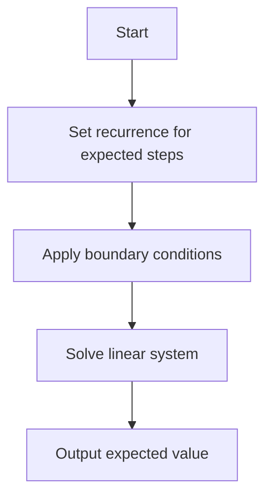

# PRB-002: Expected Steps Random Walk 1D

## 📋 Problem Summary

Calculate the expected number of steps for a 1D random walk starting at 0 to reach either +a or -b.

|                |                                                |
| -------------- | ---------------------------------------------- |
| **Step**       | +1 with probability p, -1 with probability 1-p |
| **Boundaries** | Absorbing barriers at a and -b                 |
| **Input**      | a, b, p                                        |
| **Output**     | Expected steps (float)                         |

## 🌍 Real-World Scenario

**Scenario Title:** The Stock Trader's Stop-Loss

Imagine you are an algorithmic trader. You buy a stock at a baseline price (0).

- The stock price fluctuates: it goes up by \`1 with probability p (good market sentiment) or down by`1 with probability 1-p.
- You have a "Take Profit" target at +a and a "Stop Loss" limit at -b.
- You want to estimate the **expected time** (number of ticks) until your position is automatically closed by hitting either limit.
- This helps in estimating the holding period and potential opportunity costs.

**Why This Problem Matters:**

- **Finance:** Gambler's Ruin problem variants.
- **Physics:** Brownian motion and diffusion times.
- **Queueing Theory:** Time until a buffer overflows or empties.


## Detailed Explanation

### ASCII Diagram: Random Walk

**Example: Start at 0, boundaries at +2 and -1, with p = 0.5**

```
Boundary →   +2 ════════════════ [ABSORB] ← Take Profit
               ↑
             +1 ─────────────────
               ↑      ↓
Start →       0 ─────────────────  E[0] = ?
               ↑      ↓
              -1 ════════════════ [ABSORB] ← Stop Loss
                    ↓
              Each step: ↑ with prob p
                        ↓ with prob 1-p
```

<!-- mermaid -->


**Possible Paths from 0:**

1. `0 → -1` (1 step, prob 0.5) → **ABSORB**
2. `0 → +1 → +2` (2 steps, prob 0.25) → **ABSORB**
3. `0 → +1 → 0 → ...` (loops back)
4. Many other paths...

**The Question:** What is E[0], the expected number of steps to absorption?

### Mathematical Formulation

Let E[i] = expected steps to reach a boundary from position i

**Recurrence Relation:**
E[i] = 1 + p \cdot E[i+1] + (1-p) \cdot E[i-1]

**Boundary Conditions:**

- E[a] = 0 (already at +a boundary)
- E[-b] = 0 (already at -b boundary)

This gives us a system of linear equations that can be solved analytically.

### ✅ Input/Output Clarifications (Read This Before Coding)

- **Constraints:** a, b ≤ 200. System of equations size ≈ 400.
- **Precision:** Float output.
- **Symmetric Case:** If p = 0.5, the formula is E[x] = D_x (N - D_x)? No, for simple symmetric walk starting at k in [0, N], it's `k(N-k)`. Here start is relative.
- **General Case:** If p ≠ 0.5, the formula involves powers of (1-p)/p.

### Core Concept: Linear Recurrence

Let `E_i` be the expected additional steps needed when currently at position i.

- If i = a or i = -b, `E_i = 0` (already stopped).
- Otherwise, `E_i = 1 + p E_i+1 + (1-p) E_i-1`.
  This gives a system of linear equations.
  Since the dependency is local (i depends only on i-1, i+1), we can solve it in O(N) using substitution or tridiagonal matrix algorithm, or simply use the closed-form formula.

## Naive Approach

### Intuition

Simulate millions of random walks (Monte Carlo).

### Algorithm

Run simulation loop.

### Time Complexity

- **O(Simulations \* Steps)**. Slow and approximate.

## Optimal Approach

### Key Insight

The expected time to absorption can be computed using **closed-form formulas** derived from the linear recurrence relation. This avoids solving a large system of equations.

**Two Cases to Handle:**

**Case 1: Symmetric Walk (p = 0.5)**

When the walk is unbiased (fair coin), the formula simplifies beautifully:
. E_0 = a \times b.

**Intuition:** The expected time is the product of distances to both boundaries.

**Case 2: Biased Walk ($p ≠ 0.5)**

When there's drift, we use the **Gambler's Ruin expected duration formula**:

Let `r = frac1-pp` (ratio of probabilities)


`E_0 = \fracb(1-p)-p - \fraca+b(1-p)-p * \frac1-r^b1-r^a+b`


**Coordinate System:**

- Shift coordinates so: `-b -> 0`, `0 -> b`, `a -> a+b`
- Start position becomes $z = b
- Total range becomes $M = a + b

**Formula Components:**

- **term1** = `fraczq-p` : Linear term based on position
- **term2** = `fracMq-p * frac1-r^z1-r^M` : Correction term for boundaries
- **Result** = term1 - term2

### Algorithm Steps

```
1. Check if p ≈ 0.5 (within tolerance 1e-9)
   ├─ YES → Return a × b
   └─ NO  → Continue to general formula

2. Calculate parameters:
   q = 1 - p
   r = q / p
   M = a + b
   z = b

3. Compute term1:
   term1 = z / (q - p)

4. Compute term2:
   numerator = 1 - r^z
   denominator = 1 - r^M
   term2 = (M / (q - p)) × (numerator / denominator)

5. Return: term1 - term2
```

### Time Complexity

- **O(log(a+b))** using power function.

### Space Complexity

- **O(1)**.


## Implementations

### Java
```java
import java.util.*;

class Solution {
    public double expectedSteps(int a, int b, double p) {
        if (Math.abs(p - 0.5) < 1e-9) {
            return (double) a * b;
        }

        double q = 1.0 - p;
        double r = q / p;
        double M = a + b;
        double z = b;

        double term1 = z / (q - p);
        double term2 = (M / (q - p)) * ((1.0 - Math.pow(r, z)) / (1.0 - Math.pow(r, M)));

        return term1 - term2;
    }
}

class Main {
    public static void main(String[] args) {
        Scanner sc = new Scanner(System.in);
        if (sc.hasNextInt()) {
            int a = sc.nextInt();
            int b = sc.nextInt();
            double p = sc.nextDouble();
            Solution solution = new Solution();
            System.out.printf("%.6f\n", solution.expectedSteps(a, b, p));
        }
        sc.close();
    }
}
```

### Python
```python
import sys

def expected_steps(a: int, b: int, p: float) -> float:
    if abs(p - 0.5) < 1e-9:
        return float(a * b)

    q = 1.0 - p
    r = q / p
    M = a + b
    z = b

    term1 = z / (q - p)
    term2 = (M / (q - p)) * ((1.0 - pow(r, z)) / (1.0 - pow(r, M)))

    return term1 - term2

def main():
    input = sys.stdin.read
    data = input().split()
    if not data:
        return
    a = int(data[0])
    b = int(data[1])
    p = float(data[2])
    print(f"{expected_steps(a, b, p):.6f}")

if __name__ == "__main__":
    main()
```

### C++
```cpp
#include <iostream>
#include <cmath>
#include <iomanip>

using namespace std;

class Solution {
public:
    double expectedSteps(int a, int b, double p) {
        if (abs(p - 0.5) < 1e-9) {
            return (double)a * b;
        }

        double q = 1.0 - p;
        double r = q / p;
        double M = a + b;
        double z = b;

        double term1 = z / (q - p);
        double term2 = (M / (q - p)) * ((1.0 - pow(r, z)) / (1.0 - pow(r, M)));

        return term1 - term2;
    }
};

int main() {
    ios::sync_with_stdio(false);
    cin.tie(nullptr);

    int a, b;
    double p;
    if (cin >> a >> b >> p) {
        Solution solution;
        cout << fixed << setprecision(6) << solution.expectedSteps(a, b, p) << "\n";
    }
    return 0;
}
```

### JavaScript
```javascript
const readline = require("readline");

function expectedSteps(a, b, p) {
  if (Math.abs(p - 0.5) < 1e-9) {
    return a * b;
  }

  const q = 1.0 - p;
  const r = q / p;
  const M = a + b;
  const z = b;

  const term1 = z / (q - p);
  const term2 =
    (M / (q - p)) * ((1.0 - Math.pow(r, z)) / (1.0 - Math.pow(r, M)));

  return term1 - term2;
}

const rl = readline.createInterface({
  input: process.stdin,
  output: process.stdout,
});

let data = [];
rl.on("line", (line) => data.push(...line.trim().split(/\s+/)));
rl.on("close", () => {
  if (data.length === 0) return;
  const a = parseInt(data[0], 10);
  const b = parseInt(data[1], 10);
  const p = parseFloat(data[2]);
  console.log(expectedSteps(a, b, p).toFixed(6));
});
```

## 🧪 Test Case Walkthrough (Dry Run)

### Example 1: Symmetric Case (p = 0.5)

**Input:** `2 1 0.5`

```
Step 1: Check if p = 0.5
        → Yes, use simplified formula

Step 2: Calculate E[0] = a × b
        → E[0] = 2 × 1 = 2

Step 3: Output: 2.000000 ✓
```

**Intuition:** In a symmetric random walk (fair coin), the expected time from position 0 to reach either +2 or -1 is exactly the product of the distances: 2 × 1 = 2 steps.

### Example 2: Biased Walk (p = 0.6)

**Input:** `2 1 0.6`

```
Step 1: Check if p = 0.5
        → No, use general formula

Step 2: Calculate parameters
        → q = 1 - 0.6 = 0.4
        → r = q/p = 0.4/0.6 = 2/3
        → M = a + b = 3
        → z = b = 1

Step 3: Calculate term1
        → term1 = z/(q-p) = 1/(-0.2) = -5

Step 4: Calculate term2
        → r^z = (2/3)^1 = 2/3
        → r^M = (2/3)^3 = 8/27
        → numerator = 1 - 2/3 = 1/3
        → denominator = 1 - 8/27 = 19/27
        → fraction = (1/3)/(19/27) = 9/19
        → term2 = (3/-0.2) × (9/19) = -15 × 9/19 = -135/19 ≈ -7.105

Step 5: Calculate result
        → E[0] = term1 - term2
        → E[0] = -5 - (-7.105) = 2.105 ✓
```

**Intuition:** With p = 0.6 (60% chance of moving right), there's a positive drift toward +2. However, starting at 0 means we're closer to the -1 boundary, which creates an interesting balance in expected hitting time.

## ✅ Proof of Correctness

### Invariant

The formula is the exact solution to the linear recurrence `E_z = 1 + p E_z+1 + q E_z-1` with boundary conditions `E_0 = 0, E_M=0`.

### Why the approach is correct

Standard result in stochastic processes (Gambler's Ruin duration).

## 💡 Interview Extensions (High-Value Add-ons)

- **Extension 1:** Probability of hitting +a before -b.
  - _Hint:_ `P_z = frac1 - r^z1 - r^M`.
- **Extension 2:** 2D Random Walk.
  - _Hint:_ Much harder, involves Green's functions or numerical methods.
- **Extension 3:** Reflecting boundaries.
  - _Hint:_ Different boundary conditions (`E_0 = E_1 + 1`).

### Common Mistakes to Avoid

1. **Division by Zero**
   - ❌ Wrong: Using general formula for p = 0.5 (`q-p=0`).
   - ✅ Correct: Handle p = 0.5 separately.
2. **Precision**
   - ❌ Wrong: `pow` with integers.
   - ✅ Correct: Use `double`.

## Related Concepts

- **Martingales:** $X_n - n(2p-1) is a martingale.
- **Diffusion Equation:** Continuous limit.
