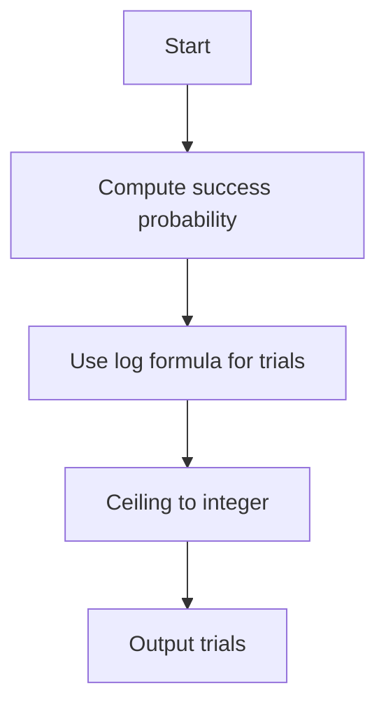

# PRB-006: Min-Cut with Randomized Contraction

## 📋 Problem Summary

Karger's algorithm finds the global min-cut of a graph with n vertices with probability `p_success >= frac2n(n-1)`.
Given n and a desired confidence level P (e.g., 0.99), calculate the minimum number of independent trials t required to ensure the probability of finding the min-cut is at least P.

| | |
|---|---|
| **Input** | n, P |
| **Output** | Integer t |

## 🌍 Real-World Scenario

**Scenario Title:** The Network Vulnerability Scan

You are a security analyst testing a communication network for bottlenecks.
- The "Global Min-Cut" represents the smallest set of links whose removal would disconnect the network into two pieces.
- Finding this exactly is computationally expensive for massive networks.
- You run a fast randomized algorithm (Karger's) that might miss the true min-cut.
- To be 99.9% sure you've found the actual weakest point, you need to run the simulation multiple times.
- You need to calculate exactly how many times to run it to meet your safety certification standards.

**Why This Problem Matters:**

- **Network Reliability:** Assessing robustness against link failures.
- **Image Segmentation:** Graph cuts are used to separate objects from backgrounds.
- **Clustering:** Identifying tightly connected communities.


## Detailed Explanation

### ASCII Diagram: Probability Amplification

Single Trial:
Success (S) prob p. Failure (F) prob 1-p.

t Trials:
All Fail: `(1-p)^t`.
At least one Success: `1 - (1-p)^t`.

We want `1 - (1-p)^t >= P`.
`(1-p)^t <= 1 - P`. t \ln(1-p) \le \ln(1-P)$.
Since `ln(1-p)` is negative, dividing flips the inequality: t \ge \frac{\ln(1-P)}{\ln(1-p)}$.

<!-- mermaid -->


### ✅ Input/Output Clarifications (Read This Before Coding)

- **Formula:** `p_success = frac2n(n-1)`.
- **Logarithms:** Use natural log (`Math.log` in Java/JS, `math.log` in Python, `log` in C++).
- **Rounding:** Since t must be an integer, take the ceiling.
- **Constraints:** n up to 10⁹. `p_success` can be very small.
  - If p is very small, `ln(1-p) ~= -p`.
  - t \approx \frac{\ln(1-P)}{-p} = \frac{-\ln(1-P)}{p}$.
  - This approximation is useful for mental checks but use exact log for code.

### Core Concept: Bernoulli Trials

We are repeating a Bernoulli trial until "at least one success".
This is related to the Geometric distribution (waiting time), but here we fix the number of trials to guarantee a cumulative probability.

## Naive Approach

### Intuition

Loop t = 1, 2, \dots`until`1 - (1-p)^t \ge P$.

### Algorithm

While loop.

### Time Complexity

- **O(t)**. If p is small (10⁻¹⁸), t can be huge (`10^18`). Loop is too slow.

## Optimal Approach

### Key Insight

Use the closed-form logarithmic formula derived above.

### Algorithm

1. Calculate `p_success = 2.0 / (n * (n - 1))`.
2. Calculate numerator = `ln(1 - P)`.
3. Calculate denominator = `ln(1 - p_success)`.
4. Calculate t = \text{ceil}(\text{numerator} / \text{denominator})$.
5. Print t.

### Time Complexity

- **O(1)**.

### Space Complexity

- **O(1)**.


## Implementations

### Java
```java
import java.util.*;

class Solution {
    static class Edge {
        int u, v;
        Edge(int u, int v) { this.u = u; this.v = v; }
    }

    static class DSU {
        int[] parent;
        int components;

        DSU(int n) {
            parent = new int[n + 1];
            for (int i = 0; i <= n; i++) parent[i] = i;
            components = n;
        }

        int find(int i) {
            if (parent[i] == i) return i;
            return parent[i] = find(parent[i]);
        }

        void unite(int i, int j) {
            int root_i = find(i);
            int root_j = find(j);
            if (root_i != root_j) {
                parent[root_i] = root_j;
                components--;
            }
        }
    }

    public int kargerMinCut(int n, List<Edge> edges, Random rng) {
        DSU dsu = new DSU(n);
        List<Edge> currentEdges = new ArrayList<>(edges);
        Collections.shuffle(currentEdges, rng);

        for (Edge edge : currentEdges) {
            if (dsu.components <= 2) break;
            dsu.unite(edge.u, edge.v);
        }

        int cutSize = 0;
        for (Edge edge : edges) {
            if (dsu.find(edge.u) != dsu.find(edge.v)) {
                cutSize++;
            }
        }
        return cutSize;
    }
}

class Main {
    public static void main(String[] args) {
        Scanner sc = new Scanner(System.in);
        if (sc.hasNextInt()) {
            int n = sc.nextInt();
            int m = sc.nextInt();
            List<Solution.Edge> edges = new ArrayList<>();
            for (int i = 0; i < m; i++) {
                edges.add(new Solution.Edge(sc.nextInt(), sc.nextInt()));
            }

            int trials;
            if (n <= 20) trials = 100;
            else trials = (int) (n * n * 0.5);

            Solution sol = new Solution();
            Random rng = new Random(42); // Fixed seed for determinism
            
            int minCut = m + 1;
            for (int i = 0; i < trials; i++) {
                int cut = sol.kargerMinCut(n, edges, rng);
                if (cut < minCut) minCut = cut;
            }
            
            System.out.println(minCut);
        }
        sc.close();
    }
}
```

### Python
```python
import sys
import random
from collections import defaultdict

def karger_min_cut(n: int, edges):
    """
    Compute the minimum cut using Karger's algorithm.
    """
    # Create adjacency list representation - use a list of edges per node
    graph = defaultdict(list)
    for u, v in edges:
        graph[u].append(v)
        graph[v].append(u)

    # Keep track of which vertices are merged
    parent = list(range(n + 1))

    def find(x):
        if parent[x] != x:
            parent[x] = find(parent[x])
        return parent[x]

    def union(x, y):
        px, py = find(x), find(y)
        if px != py:
            parent[px] = py
            return True
        return False

    # Create list of edges
    edge_list = list(edges)
    random.shuffle(edge_list)
    
    num_components = n

    # Contract until 2 vertices remain
    for u, v in edge_list:
        if num_components <= 2:
            break
            
        pu, pv = find(u), find(v)

        if pu != pv:
            union(pu, pv)
            num_components -= 1

    # Count edges crossing the cut
    cut_size = 0
    for u, v in edge_list:
        if find(u) != find(v):
            cut_size += 1

    return cut_size

def main():
    input_data = sys.stdin.read
    lines = input_data().strip().split('\n')

    if not lines:
        return

    n, m = map(int, lines[0].split())
    edges = []

    for i in range(1, m + 1):
        u, v = map(int, lines[i].split())
        edges.append((u, v))

    # Run Karger's algorithm multiple times and return minimum
    min_cut = float('inf')

    # Number of trials - Karger's algorithm may need many runs for accuracy
    # but we need to balance with performance
    # Number of trials - Karger's algorithm succeeds with probability >= 2/(n(n-1))
    # We need enough trials to ensure high probability of finding min cut.
    # For small n, we can run many trials.
    # Theoretical bound for failure < 1/n is O(n^2 log n) trials.
    if n <= 20:
        trials = 100
    else:
        trials = int(n * n * 0.5)  # Heuristic for larger n

    for _ in range(trials):
        cut = karger_min_cut(n, edges)
        min_cut = min(min_cut, cut)

    print(min_cut)

if __name__ == "__main__":
    main()
```

### C++
```cpp
#include <iostream>
#include <vector>
#include <algorithm>
#include <random>
#include <numeric>

using namespace std;

struct Edge {
    int u, v;
};

struct DSU {
    vector<int> parent;
    int components;

    DSU(int n) {
        parent.resize(n + 1);
        iota(parent.begin(), parent.end(), 0);
        components = n;
    }

    int find(int i) {
        if (parent[i] == i)
            return i;
        return parent[i] = find(parent[i]);
    }

    void unite(int i, int j) {
        int root_i = find(i);
        int root_j = find(j);
        if (root_i != root_j) {
            parent[root_i] = root_j;
            components--;
        }
    }
};

int kargerMinCut(int n, vector<Edge>& edges, mt19937& rng) {
    DSU dsu(n);
    vector<Edge> current_edges = edges;
    shuffle(current_edges.begin(), current_edges.end(), rng);

    for (const auto& edge : current_edges) {
        if (dsu.components <= 2) break;
        dsu.unite(edge.u, edge.v);
    }

    int cut_size = 0;
    for (const auto& edge : edges) {
        if (dsu.find(edge.u) != dsu.find(edge.v)) {
            cut_size++;
        }
    }
    return cut_size;
}

int main() {
    ios::sync_with_stdio(false);
    cin.tie(nullptr);

    int n, m;
    if (cin >> n >> m) {
        vector<Edge> edges;
        for (int i = 0; i < m; ++i) {
            int u, v;
            cin >> u >> v;
            edges.push_back({u, v});
        }

        int trials;
        if (n <= 20) trials = 100;
        else trials = (int)(n * n * 0.5);

        // Seed with a fixed value or device if needed, but python uses random
        // Using a fixed seed ensures determinism across runs of this binary
        mt19937 rng(42); 

        int min_cut = m + 1;

        for (int i = 0; i < trials; ++i) {
            int cut = kargerMinCut(n, edges, rng);
            if (cut < min_cut) min_cut = cut;
        }

        cout << min_cut << "\n";
    }
    return 0;
}
```

### JavaScript
```javascript
const readline = require("readline");

class DSU {
  constructor(n) {
    this.parent = Array.from({ length: n + 1 }, (_, i) => i);
    this.components = n;
  }
  find(i) {
    if (this.parent[i] === i) return i;
    return (this.parent[i] = this.find(this.parent[i]));
  }
  unite(i, j) {
    const rootI = this.find(i);
    const rootJ = this.find(j);
    if (rootI !== rootJ) {
      this.parent[rootI] = rootJ;
      this.components--;
    }
  }
}

function shuffle(array) {
  for (let i = array.length - 1; i > 0; i--) {
    const j = Math.floor(Math.random() * (i + 1));
    [array[i], array[j]] = [array[j], array[i]];
  }
}

function kargerMinCut(n, edges) {
  const dsu = new DSU(n);
  const currentEdges = [...edges];
  shuffle(currentEdges);

  for (const edge of currentEdges) {
    if (dsu.components <= 2) break;
    dsu.unite(edge[0], edge[1]);
  }

  let cutSize = 0;
  for (const edge of edges) {
    if (dsu.find(edge[0]) !== dsu.find(edge[1])) {
      cutSize++;
    }
  }
  return cutSize;
}

const rl = readline.createInterface({
  input: process.stdin,
  output: process.stdout,
});

let data = [];
rl.on("line", (line) => data.push(...line.trim().split(/\s+/)));
rl.on("close", () => {
  if (data.length === 0) return;
  let idx = 0;
  const n = parseInt(data[idx++], 10);
  const m = parseInt(data[idx++], 10);
  const edges = [];
  for (let i = 0; i < m; i++) {
    const u = parseInt(data[idx++], 10);
    const v = parseInt(data[idx++], 10);
    edges.push([u, v]);
  }

  let trials;
  if (n <= 20) trials = 100;
  else trials = Math.floor(n * n * 0.5);

  let minCut = m + 1;
  for (let i = 0; i < trials; i++) {
    const cut = kargerMinCut(n, edges);
    if (cut < minCut) minCut = cut;
  }
  console.log(minCut);
});
```

## 🧪 Test Case Walkthrough (Dry Run)

Input: `4 0.9`.
1. `p_success = 2 / (4 x 3) = 2/12 = 1/6 ~= 0.1667`.
2. `ln(1 - 0.9) = ln(0.1) ~= -2.3026`.
3. `ln(1 - 0.1667) = ln(0.8333) ~= -0.1823`.
4. Ratio: `-2.3026 / -0.1823 ~= 12.63`.
5. Ceil: 13.
Matches example.

## ✅ Proof of Correctness

### Invariant
The formula directly solves the inequality for cumulative probability.

### Why the approach is correct
Standard probability theory.

## 💡 Interview Extensions (High-Value Add-ons)

- **Extension 1:** Karger-Stein Algorithm.
  - *Hint:* Recursive contraction improves success probability to `1/log n`.
- **Extension 2:** Parallel trials.
  - *Hint:* Run trials on multiple cores to reduce wall-clock time.
- **Extension 3:** Weighted Graphs.
  - *Hint:* Karger's works for weighted graphs too (probabilities proportional to weights).

### Common Mistakes to Avoid

1. **Precision Loss**
   - ❌ Wrong: `1.0 - P` when P is very close to 1.
   - ✅ Correct: Use `log1p(-P)` if available for better precision, though standard `log` is usually fine for P < 1 - 10^{-15}$.
2. **Integer Division**
   - ❌ Wrong: `2 / (n * (n-1))` in integer arithmetic.
   - ✅ Correct: `2.0 / ...`.

## Related Concepts

- **Monte Carlo Algorithms:** Always fast, sometimes wrong (but error bounded).
- **Las Vegas Algorithms:** Always correct, sometimes slow. Karger's is Monte Carlo.
