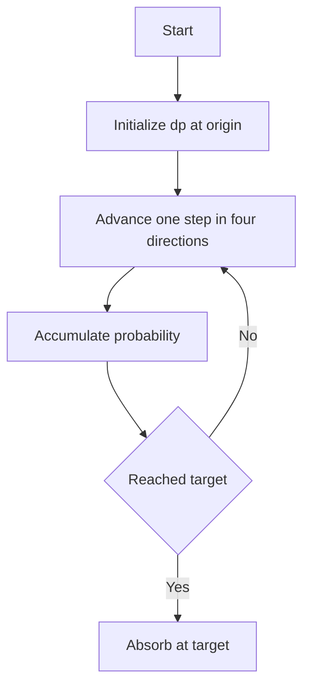

# PRB-013: Random Walk Hitting Probability 2D

## 📋 Problem Summary

Calculate the probability that a 2D symmetric random walk starting at `(0,0)` reaches a target `(a,b)` within T steps.

| | |
|---|---|
| **Moves** | N, S, E, W with prob 0.25 each |
| **Input** | a, b, T |
| **Output** | Probability (float) |

## 🌍 Real-World Scenario

**Scenario Title:** The Lost Drone

A drone loses its GPS signal at coordinates `(0,0)`.
- It enters a "search mode" where it moves randomly in a grid pattern to try and re-establish connection with a base station located at `(a,b)`.
- The drone has limited battery life, allowing only T moves.
- You need to calculate the probability that the drone flies over the base station at least once before the battery dies.
- This helps in designing emergency protocols: if the probability is too low, the drone should perhaps land immediately instead.

**Why This Problem Matters:**

- **Biology:** Animal foraging patterns (Levy flights).
- **Physics:** Diffusion of particles hitting a sensor.
- **Finance:** Asset price hitting a barrier (Barrier Options).


## Detailed Explanation

### ASCII Diagram: Grid Walk

Target `(1,1)`, T = 2. Start (0,0)$.

```
(0,1) -- (1,1) Target
  |        |
(0,0) -- (1,0)
Start
```

Paths of length 2:
1. `(0,0) -> (0,1) -> (1,1)`: Hit. Prob `1/4 x 1/4 = 1/16`.
2. `(0,0) -> (1,0) -> (1,1)`: Hit. Prob `1/4 x 1/4 = 1/16`.
3. `(0,0) -> (0,1) -> (0,2)`: Miss.
...
Total paths `4^2 = 16`.
Hits: 2. Probability `2/16 = 0.125`.

Path `(0,0) -> (0,1) -> (1,1) -> (1,2)` counts as a hit at step 2.
We need "at least once".
Equivalent to: Walk stops upon hitting `(a,b)`.

<!-- mermaid -->


### ✅ Input/Output Clarifications (Read This Before Coding)

- **Absorbing State:** Treat the target `(a,b)` as absorbing. Once reached, the walk stays there (or we just count it as a success and stop tracking).
- **Bounded Grid:** Since max steps is T, the walk cannot go beyond coordinates `[-T, T]`.
- **Constraints:** T \le 500`. Grid size roughly`1000 \times 1000$.
- **DP State:** `dp[t][x][y]` = Prob of being at `(x,y)` at time t without having hit target earlier?
  -   - If `(x,y) == (a,b)`, we make it absorbing: `dp[t+1][a][b] += dp[t][a][b] * 1.0`.
  - Or just accumulate "new hits" at each step.
- **Space Optimization:** We only need `dp[t]` and `dp[t-1]`.
- **Coordinate Shift:** Map indices to array: `x` from `-T` to T maps to `0` to `2T`. Offset by T.

### Core Concept: Dynamic Programming on Grid

Iterate t from 1 to T.
Update probabilities for all reachable `(x,y)`.
Special handling for target `(a,b)`: it acts as a sink.
Total probability = `dp[T][a][b]` (if we make it absorbing).

## Naive Approach

### Intuition

DFS/BFS simulation of all `4^T` paths.

### Algorithm

Recursion.

### Time Complexity

- **O(4^T)**. Impossible for T = 500$.

## Optimal Approach

### Key Insight

DP with coordinate bounding.
The walk can range from `-T` to T in both dimensions.
Grid size `(2T+1) x (2T+1)`.
T = 500 \implies 1000 \times 1000 = 10^6$ cells.
Total ops T \times 10^6 = 5 \cdot 10^8$.
This might be tight for 2 seconds in Python/JS, but fine for C++/Java.
However, at step t, we only need to check range `[-t, t]`.
Sum of squares `sum_t=1^T (2t)^2 ~= frac43 T^3`.
`500^3 = 1.25 * 10^8`. This is acceptable.

### Algorithm

1. Offset coordinates by T to handle negatives. Start at `(T, T)`. Target `(a+T, b+T)`.
2. `dp[x][y]` stores prob at current step.
3. Initialize `dp[T][T] = 1.0`.
4. Loop `step` from 1 to T:
   - Create `new_dp`.
   - Loop `x` from T - step`to T + step`.
   - Loop `y` from T - step`to T + step`.
   - If `(x, y) == target`: `new_dp[x][y] += dp[x][y]` (Absorbing).
   - Else if `dp[x][y] > 0`:
     - Distribute `0.25 * dp[x][y]` to neighbors.
     - Neighbors: `(x+1, y), (x-1, y), (x, y+1), (x, y-1)`.
     - If a neighbor is target, add to target in `new_dp`.
     - Else add to neighbor in `new_dp`.
   - Update `dp = new_dp`.
5. Return `dp[target_x][target_y]`.

### Time Complexity

- **O(T^3)**.

### Space Complexity

- **O(T^2)**.


## Implementations

### Java
```java
import java.util.*;

class Solution {
    public double hitProbability(int a, int b, int T) {
        // Offset to handle negative coordinates
        int offset = T;
        int size = 2 * T + 1;
        double[][] dp = new double[size][size];
        
        // Start at (0,0) -> (offset, offset)
        dp[offset][offset] = 1.0;
        
        int targetX = a + offset;
        int targetY = b + offset;
        
        // If start is target
        if (a == 0 && b == 0) return 1.0;
        
        // Directions: N, S, E, W
        int[] dx = {0, 0, 1, -1};
        int[] dy = {1, -1, 0, 0};
        
        for (int t = 1; t <= T; t++) {
            double[][] nextDp = new double[size][size];
            
            // Optimization: Only iterate reachable area
            // At step t-1, max reach is t-1
            int minVal = offset - (t - 1);
            int maxVal = offset + (t - 1);
            
            // Carry over probability already at target (absorbing)
            nextDp[targetX][targetY] = dp[targetX][targetY];
            
            for (int x = minVal; x <= maxVal; x++) {
                for (int y = minVal; y <= maxVal; y++) {
                    if (dp[x][y] == 0) continue;
                    
                    // If we are already at target, we stayed there (handled above)
                    // But                     // We must NOT distribute from target.
                    if (x == targetX && y == targetY) continue;
                    
                    double prob = dp[x][y] * 0.25;
                    for (int i = 0; i < 4; i++) {
                        int nx = x + dx[i];
                        int ny = y + dy[i];
                        nextDp[nx][ny] += prob;
                    }
                }
            }
            dp = nextDp;
        }
        
        return dp[targetX][targetY];
    }
}

class Main {
    public static void main(String[] args) {
        Scanner sc = new Scanner(System.in);
        if (sc.hasNextInt()) {
            int a = sc.nextInt();
            int b = sc.nextInt();
            int T = sc.nextInt();

            Solution solution = new Solution();
            System.out.printf("%.6f\n", solution.hitProbability(a, b, T));
        }
        sc.close();
    }
}
```

### Python
```python
import sys

def hit_probability(a: int, b: int, T: int) -> float:
    if a == 0 and b == 0:
        return 1.0

    # Use a dictionary for dynamic storage
    prob = {}
    prob[(0, 0)] = 1.0

    target = (a, b)

    dx = [0, 0, 1, -1]
    dy = [1, -1, 0, 0]

    for t in range(T):
        next_prob = {}

        for (x, y), p in prob.items():
            if (x, y) == target:
                # Already at target, stay there
                next_prob[(x, y)] = next_prob.get((x, y), 0) + p
            else:
                # Move to one of 4 neighbors with equal probability
                for i in range(4):
                    nx, ny = x + dx[i], y + dy[i]
                    next_prob[(nx, ny)] = next_prob.get((nx, ny), 0) + p * 0.25

        prob = next_prob

    return prob.get(target, 0.0)

def main():
    input = sys.stdin.read
    data = input().split()
    if not data:
        return
    a = int(data[0])
    b = int(data[1])
    T = int(data[2])
    print(f"{hit_probability(a, b, T):.6f}")

if __name__ == "__main__":
    main()
```

### C++
```cpp
#include <iostream>
#include <vector>
#include <iomanip>

using namespace std;

class Solution {
public:
    double hitProbability(int a, int b, int T) {
        if (a == 0 && b == 0) return 1.0;
        
        int offset = T;
        int size = 2 * T + 1;
        
        // Use vector of vectors
        vector<vector<double>> dp(size, vector<double>(size, 0.0));
        
        int targetX = a + offset;
        int targetY = b + offset;
        
        dp[offset][offset] = 1.0;
        
        int dx[] = {0, 0, 1, -1};
        int dy[] = {1, -1, 0, 0};
        
        for (int t = 1; t <= T; t++) {
            vector<vector<double>> nextDp(size, vector<double>(size, 0.0));
            
            nextDp[targetX][targetY] = dp[targetX][targetY];
            
            int minVal = max(0, offset - (t - 1));
            int maxVal = min(size - 1, offset + (t - 1));
            
            for (int x = minVal; x <= maxVal; x++) {
                for (int y = minVal; y <= maxVal; y++) {
                    if (dp[x][y] == 0) continue;
                    if (x == targetX && y == targetY) continue;
                    
                    double prob = dp[x][y] * 0.25;
                    for (int i = 0; i < 4; i++) {
                        int nx = x + dx[i];
                        int ny = y + dy[i];
                        nextDp[nx][ny] += prob;
                    }
                }
            }
            dp = nextDp;
        }
        
        return dp[targetX][targetY];
    }
};

int main() {
    ios::sync_with_stdio(false);
    cin.tie(nullptr);

    int a, b, T;
    if (cin >> a >> b >> T) {
        Solution solution;
        cout << fixed << setprecision(6) << solution.hitProbability(a, b, T) << "\n";
    }
    return 0;
}
```

### JavaScript
```javascript
const readline = require("readline");

function hitProbability(a, b, T) {
  if (a === 0 && b === 0) return 1.0;
  
  const offset = T;
  const size = 2 * T + 1;
  let dp = new Float64Array(size * size);
  
  const targetX = a + offset;
  const targetY = b + offset;
  
  // Helper for 2D index
  const idx = (x, y) => x * size + y;
  
  dp[idx(offset, offset)] = 1.0;
  
  const dx = [0, 0, 1, -1];
  const dy = [1, -1, 0, 0];
  
  for (let t = 1; t <= T; t++) {
    const nextDp = new Float64Array(size * size);
    
    // Carry over absorbed probability
    nextDp[idx(targetX, targetY)] = dp[idx(targetX, targetY)];
    
    const minVal = Math.max(0, offset - (t - 1));
    const maxVal = Math.min(size - 1, offset + (t - 1));
    
    for (let x = minVal; x <= maxVal; x++) {
      for (let y = minVal; y <= maxVal; y++) {
        const currIdx = idx(x, y);
        const val = dp[currIdx];
        
        if (val === 0) continue;
        if (x === targetX && y === targetY) continue;
        
        const prob = val * 0.25;
        for (let i = 0; i < 4; i++) {
          const nx = x + dx[i];
          const ny = y + dy[i];
          const nIdx = idx(nx, ny);
          nextDp[nIdx] += prob;
        }
      }
    }
    dp = nextDp;
  }
  
  return dp[idx(targetX, targetY)];
}

const rl = readline.createInterface({
  input: process.stdin,
  output: process.stdout,
});

let data = [];
rl.on("line", (line) => data.push(...line.trim().split(/\s+/)));
rl.on("close", () => {
  if (data.length === 0) return;
  const a = parseInt(data[0], 10);
  const b = parseInt(data[1], 10);
  const T = parseInt(data[2], 10);
  console.log(hitProbability(a, b, T).toFixed(6));
});
```

## 🧪 Test Case Walkthrough (Dry Run)

Input: `1 0 1`.
1. Start `dp[1][1] = 1` (offset 1). Target `(2, 1)`.
2. Step 1:
   - `(1,1)` spreads 0.25 to `(2,1), (0,1), (1,2), (1,0)`.
   - `(2,1)` is target. `nextDp[2][1] = 0.25`.
3. Result 0.25.
Matches example.

## ✅ Proof of Correctness

### Invariant
`dp[x][y]` holds the probability of being at `(x,y)` at time t without having been absorbed previously (except for the target state which accumulates).

### Why the approach is correct
Standard DP for Markov Chains on a finite grid.

## 💡 Interview Extensions (High-Value Add-ons)

- **Extension 1:** 1D Case.
  - *Hint:* Reflection Principle (Catalan numbers).
- **Extension 2:** Expected Hitting Time.
  - *Hint:* Solve linear equations (Dirichlet problem).
- **Extension 3:** Infinite T.
  - *Hint:* Polya's Recurrence Theorem (Prob = 1 in 2D).

### Common Mistakes to Avoid

1. **Double Counting**
   - ❌ Wrong: Counting paths that hit target multiple times as separate hits.
   - ✅ Correct: Make target absorbing (stop walking once hit).
2. **Bounds**
   - ❌ Wrong: Array index out of bounds for negative coordinates.
   - ✅ Correct: Use offset.

## Related Concepts

- **Brownian Motion:** Continuous limit.
- **Heat Equation:** Diffusion of probability mass.
