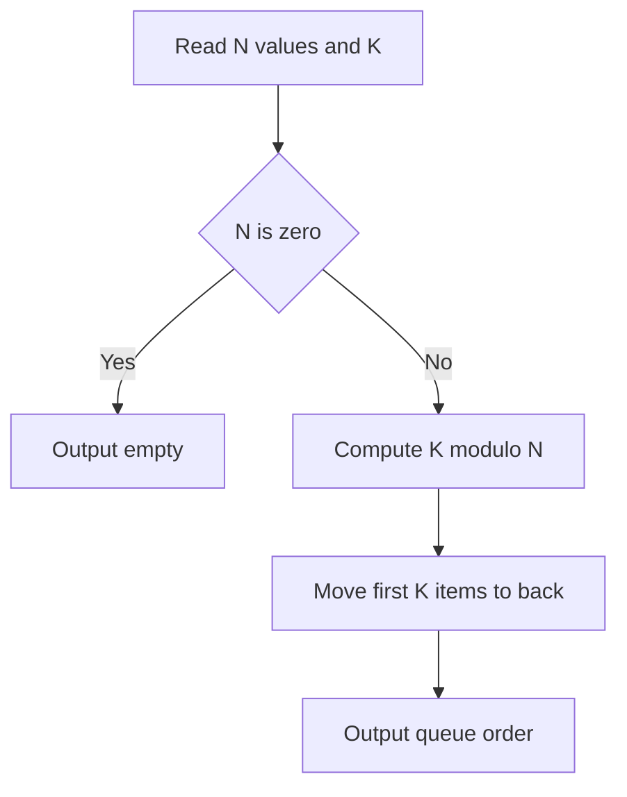

# QUE-003: Cafeteria Queue Rotation

## 📋 Problem Summary

We are given a queue of `N` students. We need to perform a "left rotation" `K` times.
- A single left rotation means taking the person at the front and moving them to the back.
- We need to output the final order of the queue.

## 🌍 Real-World Scenario

**Scenario Title:** Playlist Looping

Imagine a music playlist on "Repeat All" mode.
- You have a list of songs: `[A, B, C, D]`.
- You press "Next" 3 times.
- 1st Next: A plays and goes to back. `[B, C, D, A]`.
- 2nd Next: B plays and goes to back. `[C, D, A, B]`.
- 3rd Next: C plays and goes to back. `[D, A, B, C]`.
- The "Queue Rotation" problem asks: "What does the playlist look like after skipping `K` songs?"

**Why This Problem Matters:**

- **Load Balancing:** Round-robin scheduling often involves rotating a list of servers.
- **Cryptography:** Bitwise rotation (circular shift) is a core operation in hashing algorithms like MD5/SHA.
- **UI Carousels:** Rotating images in a slider.


## Detailed Explanation

### ASCII Diagram: Rotation Logic

Queue: `[4, 9, 1, 7]`, `K=3`.

1. **Initial:**
   Front -> `4, 9, 1, 7` <- Back

2. **Rotate 1:** Move 4 to back.
   Front -> `9, 1, 7, 4` <- Back

3. **Rotate 2:** Move 9 to back.
   Front -> `1, 7, 4, 9` <- Back

4. **Rotate 3:** Move 1 to back.
   Front -> `7, 4, 9, 1` <- Back

Result: `7 4 9 1`.

<!-- mermaid -->


### ✅ Input/Output Clarifications (Read This Before Coding)

- **Input:** `N`, array of values, `K`.
- **Output:** Space-separated values.
- **Edge Case:** `K` can be very large (`10^9`). Rotating `N` times brings us back to the start. So we only need to rotate `K +/-od N` times.
- **Edge Case:** `N=0` (empty queue).

## Naive Approach

### Intuition

Simulate the process literally using a Queue data structure.

### Algorithm

1. Load all elements into a Queue.
2. Loop `K` times:
   - `val = queue.dequeue()`
   - `queue.enqueue(val)`
3. Print queue contents.

### Limitations

- **Time Complexity:** `O(K)`. If `K = 10^9`, this will Time Limit Exceed (TLE).
- We must optimize using modulo arithmetic.

## Optimal Approach

### Key Insight

1. **Modulo Reduction:** Rotating `N` times is a no-op. Effective rotations `K_eff = K +/-od N`.
2. **Array Slicing:** The element at index `K_eff` becomes the new head. The elements from `0` to `K_eff-1` move to the back.
   - New order: `arr[K:] + arr[:K]` (Python syntax).

### Algorithm

1. If `N=0`, return empty.
2. `K = K +/-od N`.
3. Create a new array `result` of size `N`.
4. Copy `values[K...N-1]` to the start of `result`.
5. Copy `values[0...K-1]` to the end of `result`.
6. Return `result`.

### Time Complexity

- **O(N)** to copy elements.
- Independent of `K` (after modulo).

### Space Complexity

- **O(N)** for the result array.


## Implementations

### Java
```java
import java.util.*;

class Solution {
    public String processQueueOperations(List<String[]> operations) {
        Queue<Integer> q = new LinkedList<>();
        long total = 0;

        for (String[] opData : operations) {
            String cmd = opData[0];

            if (cmd.equals("ENQUEUE")) {
                q.offer(Integer.parseInt(opData[1]));
            } else if (cmd.equals("DEQUEUE")) {
                if (!q.isEmpty()) {
                    q.poll();
                }
            } else if (cmd.equals("FRONT")) {
                // Just read
            } else if (cmd.equals("REAR")) {
                // Just read
            } else if (cmd.equals("SIZE")) {
                total += q.size();
            } else if (cmd.equals("ISEMPTY")) {
                // Just read
            }
        }

        return String.valueOf(total);
    }
}

class Main {
    public static void main(String[] args) {
        Scanner sc = new Scanner(System.in);
        if (sc.hasNextInt()) {
            int m = sc.nextInt();
            List<String[]> operations = new ArrayList<>();

            for (int i = 0; i < m; i++) {
                String op = sc.next();
                if (op.equals("ENQUEUE")) {
                    String val = sc.next();
                    operations.add(new String[]{op, val});
                } else {
                    operations.add(new String[]{op});
                }
            }

            Solution solution = new Solution();
            String result = solution.processQueueOperations(operations);
            System.out.println(result);
        }
        sc.close();
    }
}
```

### Python
```python
from typing import List
from collections import deque
import sys

def process_queue_operations(operations: List[List[str]]) -> str:
    """
    Process queue operations and return the sum of all SIZE operation results
    """
    queue = deque()
    total = 0

    for op_data in operations:
        cmd = op_data[0]

        if cmd == "ENQUEUE":
            queue.append(int(op_data[1]))

        elif cmd == "DEQUEUE":
            if len(queue) > 0:
                queue.popleft()

        elif cmd == "FRONT":
            pass  # Just read

        elif cmd == "REAR":
            pass  # Just read

        elif cmd == "SIZE":
            total += len(queue)

        elif cmd == "ISEMPTY":
            pass  # Just read

    return str(total)

def main():
    input_data = sys.stdin.read().split()
    if not input_data:
        return

    iterator = iter(input_data)
    try:
        m = int(next(iterator))  # number of operations
        operations = []
        for _ in range(m):
            op = next(iterator)
            if op in ("ENQUEUE",):
                val = next(iterator)
                operations.append([op, val])
            else:
                operations.append([op])

        result = process_queue_operations(operations)
        print(result)
    except StopIteration:
        pass

if __name__ == "__main__":
    main()
```

### C++
```cpp
#include <iostream>
#include <vector>
#include <queue>
#include <string>

using namespace std;

class Solution {
public:
    string processQueueOperations(const vector<vector<string>>& operations) {
        queue<int> q;
        long long total = 0;

        for (const auto& opData : operations) {
            const string& cmd = opData[0];

            if (cmd == "ENQUEUE") {
                q.push(stoi(opData[1]));
            } else if (cmd == "DEQUEUE") {
                if (!q.empty()) {
                    q.pop();
                }
            } else if (cmd == "FRONT") {
                // Just read
            } else if (cmd == "REAR") {
                // Just read
            } else if (cmd == "SIZE") {
                total += q.size();
            } else if (cmd == "ISEMPTY") {
                // Just read
            }
        }

        return to_string(total);
    }
};

int main() {
    ios::sync_with_stdio(false);
    cin.tie(nullptr);

    int m;
    if (cin >> m) {
        vector<vector<string>> operations;
        operations.reserve(m);

        for (int i = 0; i < m; i++) {
            string op;
            cin >> op;
            if (op == "ENQUEUE") {
                string val;
                cin >> val;
                operations.push_back({op, val});
            } else {
                operations.push_back({op});
            }
        }

        Solution solution;
        string result = solution.processQueueOperations(operations);
        cout << result << "\n";
    }
    return 0;
}
```

### JavaScript
```javascript
const readline = require("readline");

class Solution {
  processQueueOperations(operations) {
    const queue = [];
    let total = 0;

    for (const opData of operations) {
      const cmd = opData[0];

      if (cmd === "ENQUEUE") {
        queue.push(parseInt(opData[1], 10));

      } else if (cmd === "DEQUEUE") {
        if (queue.length > 0) {
          queue.shift();
        }

      } else if (cmd === "FRONT") {
        // Just read
      } else if (cmd === "REAR") {
        // Just read
      } else if (cmd === "SIZE") {
        total += queue.length;

      } else if (cmd === "ISEMPTY") {
        // Just read
      }
    }

    return String(total);
  }
}

const rl = readline.createInterface({
  input: process.stdin,
  output: process.stdout,
});

let data = [];
rl.on("line", (line) => data.push(...line.trim().split(/\s+/).filter(x => x !== "")));
rl.on("close", () => {
  if (data.length === 0) return;
  let idx = 0;
  const m = parseInt(data[idx++], 10);
  const operations = [];

  for (let i = 0; i < m; i++) {
    const op = data[idx++];
    if (op === "ENQUEUE") {
      const val = data[idx++];
      operations.push([op, val]);
    } else {
      operations.push([op]);
    }
  }

  const solution = new Solution();
  const result = solution.processQueueOperations(operations);
  console.log(result);
});
```

## 🧪 Test Case Walkthrough (Dry Run)

Input: `4 9 1 7`, `k=3`
1. `N=4`.
2. `K_eff = 3 +/-od 4 = 3`.
3. New Head Index = 3. Value is `7`.
4. Part 1 (from index 3 to end): `[7]`.
5. Part 2 (from index 0 to 3): `[4, 9, 1]`.
6. Concat: `[7, 4, 9, 1]`.

Output matches example.


## ✅ Proof of Correctness

### Invariant
Rotating left by 1 is equivalent to shifting indices `i -> (i-1) +/-od N`. Rotating by `K` shifts indices by `-K +/-od N`.

### Why the approach is correct
The element at original index `K` moves to index `0`. The element at index `K+1` moves to index `1`, etc. Our slicing logic perfectly reconstructs this.

## 💡 Interview Extensions (High-Value Add-ons)

- **Extension 1:** Rotate in-place with `O(1)` extra space?
  - *Hint:* "Reversal Algorithm". Reverse `0..K-1`, reverse `K..N-1`, then reverse `0..N-1`.
- **Extension 2:** Right Rotation?
  - *Hint:* Right rotate by `K` is same as Left rotate by `N - (K +/-od N)`.

### Common Mistakes to Avoid

1. **Large K**
   - ❌ Wrong: Looping `K` times when `K=10^9`.
   - ✅ Correct: Use modulo `N`.
2. **Empty Array**
   - ❌ Wrong: `k % n` when `n=0` causes division by zero.
   - ✅ Correct: Check `n == 0` first.

## Related Concepts

- **Circular Buffer:** Naturally supports rotation by moving head pointer.
- **String Rotation:** Checking if string A is a rotation of B (check if A is substring of B+B).
