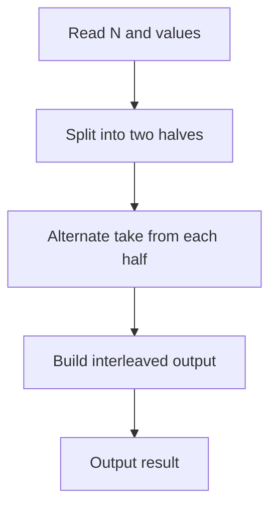

# QUE-004: Hallway Interleave

## 📋 Problem Summary

We are given a queue of even length `N`. We need to interleave the first half with the second half.
- Input: `[a1, a2, ..., an, b1, b2, ..., bn]`
- Output: `[a1, b1, a2, b2, ..., an, bn]`

## 🌍 Real-World Scenario

**Scenario Title:** Zipper Merge in Traffic

Imagine two lanes of traffic merging into one.
- Lane A has cars `[A1, A2, A3]`.
- Lane B has cars `[B1, B2, B3]`.
- To merge efficiently and fairly, drivers use the "Zipper Method".
- One car from A goes, then one from B, then A, then B.
- Result: `[A1, B1, A2, B2, A3, B3]`.
- This maximizes throughput and minimizes road rage!

**Why This Problem Matters:**

- **Audio Processing:** Interleaving left and right audio channels for stereo sound.
- **Data Transmission:** Interleaving bits for error correction (burst error protection).
- **Card Shuffling:** A perfect "riffle shuffle".


## Detailed Explanation

### ASCII Diagram: Interleaving Process

Input: `[11, 12, 13, 14]` (`N=4`).
Half size = 2.

1. **Split:**
   Half 1: `[11, 12]`
   Half 2: `[13, 14]`

2. **Merge:**
   - Take from Half 1: `11`
   - Take from Half 2: `13`
   - Take from Half 1: `12`
   - Take from Half 2: `14`

Result: `[11, 13, 12, 14]`.

<!-- mermaid -->


### ✅ Input/Output Clarifications (Read This Before Coding)

- **Input:** Even integer `N`, array of values.
- **Output:** Interleaved array.
- **Constraint:** `N` is always even.

## Naive Approach

### Intuition

Use two separate queues.

### Algorithm

1. Create `Q1` and `Q2`.
2. Enqueue first `N/2` elements to `Q1`.
3. Enqueue remaining `N/2` elements to `Q2`.
4. While queues are not empty:
   - Dequeue from `Q1`, add to result.
   - Dequeue from `Q2`, add to result.

### Limitations

- **Space Complexity:** `O(N)` for auxiliary queues.
- **Time Complexity:** `O(N)`.
- This is actually a very good approach, just uses extra space.

## Optimal Approach

### Key Insight

Since we are given the input as an array (random access), we can construct the result directly using indices without explicit queues.

### Algorithm

1. `mid = n / 2`.
2. Create `result` array of size `N`.
3. Loop `i` from 0 to `mid - 1`:
   - `result[2*i] = values[i]` (From first half)
   - `result[2*i + 1] = values[mid + i]` (From second half)
4. Return `result`.

### Time Complexity

- **O(N)**.

### Space Complexity

- **O(N)** for the result.


## Implementations

### Java
```java
import java.util.*;

class Solution {
    public int[] interleaveQueue(int[] values) {
        int n = values.length;
        int mid = n / 2;
        int[] result = new int[mid * 2];

        for (int i = 0; i < mid; i++) {
            result[2 * i] = values[i];
            result[2 * i + 1] = values[mid + i];
        }

        return result;
    }
}

class Main {
    public static void main(String[] args) {
        Scanner sc = new Scanner(System.in);
        if (sc.hasNextInt()) {
            int n = sc.nextInt();
            int[] values = new int[n];
            for (int i = 0; i < n; i++) {
                values[i] = sc.nextInt();
            }
    
            Solution solution = new Solution();
            int[] result = solution.interleaveQueue(values);
            StringBuilder sb = new StringBuilder();
            for (int i = 0; i < result.length; i++) {
                if (i > 0) sb.append(' ');
                sb.append(result[i]);
            }
            System.out.println(sb.toString());
        }
        sc.close();
    }
}
```

### Python
```python
from typing import List
import sys

def interleave_queue(values: List[int]) -> List[int]:
    n = len(values)
    mid = n // 2
    result = []
    
    for i in range(mid):
        result.append(values[i])
        result.append(values[mid + i])
        
    return result

def main():
    input_data = sys.stdin.read().split()
    if not input_data:
        return
    
    iterator = iter(input_data)
    try:
        n = int(next(iterator))
        values = [int(next(iterator)) for _ in range(n)]
        
        result = interleave_queue(values)
        if result:  # Only print if result is non-empty
            print(" ".join(map(str, result)))
    except StopIteration:
        pass

if __name__ == "__main__":
    main()
```

### C++
```cpp
#include <iostream>
#include <vector>

using namespace std;

class Solution {
public:
    vector<int> interleaveQueue(const vector<int>& values) {
        int n = values.size();
        int mid = n / 2;
        vector<int> result;

        for (int i = 0; i < mid; i++) {
            result.push_back(values[i]);
            result.push_back(values[mid + i]);
        }

        return result;
    }
};

int main() {
    ios::sync_with_stdio(false);
    cin.tie(nullptr);

    int n;
    if (cin >> n) {
        vector<int> values(n);
        for (int i = 0; i < n; i++) {
            cin >> values[i];
        }
    
        Solution solution;
        vector<int> result = solution.interleaveQueue(values);
        for (int i = 0; i < (int)result.size(); i++) {
            if (i) cout << ' ';
            cout << result[i];
        }
        cout << "\n";
    }
    return 0;
}
```

### JavaScript
```javascript
const readline = require("readline");

class Solution {
  interleaveQueue(values) {
    const n = values.length;
    const mid = Math.floor(n / 2);
    const result = [];
    
    for (let i = 0; i < mid; i++) {
      result.push(values[i]);
      result.push(values[mid + i]);
    }
    return result;
  }
}

const rl = readline.createInterface({
  input: process.stdin,
  output: process.stdout,
});

let data = [];
rl.on("line", (line) => data.push(...line.trim().split(/\s+/).filter(x => x !== "")));
rl.on("close", () => {
  if (data.length === 0) return;
  let idx = 0;
  const n = parseInt(data[idx++], 10);
  const values = [];
  for (let i = 0; i < n; i++) {
    values.push(parseInt(data[idx++], 10));
  }

  const solution = new Solution();
  const result = solution.interleaveQueue(values);
  console.log(result.join(" "));
});
```

## 🧪 Test Case Walkthrough (Dry Run)

Input: `11 12 13 14` (`N=4`)
1. `mid = 2`.
2. `i=0`:
   - `result[0] = values[0] = 11`.
   - `result[1] = values[2] = 13`.
3. `i=1`:
   - `result[2] = values[1] = 12`.
   - `result[3] = values[3] = 14`.
4. Result: `[11, 13, 12, 14]`.

Matches example.


## ✅ Proof of Correctness

### Invariant
The element at index `i` in the first half lands at `2*i`. The element at index `i` in the second half lands at `2*i + 1`.

### Why the approach is correct
This mapping `i -> 2i` and `mid+i -> 2i+1` is the definition of interleaving.

## 💡 Interview Extensions (High-Value Add-ons)

- **Extension 1:** Interleave using only a Stack and Queue?
  - *Hint:* This is a classic problem. Push first half to stack. Interleave stack and queue. Reverse stack. Interleave again. (Requires multiple passes).
- **Extension 2:** In-place Interleave?
  - *Hint:* Extremely hard. Requires cycle leader algorithm (similar to in-place matrix transpose).

### Common Mistakes to Avoid

1. **Index Out of Bounds**
   - ❌ Wrong: Loop `i` from 0 to `n`.
   - ✅ Correct: Loop `i` from 0 to `mid - 1`.
2. **Odd Length**
   - ❌ Wrong: Assuming `n` is odd.
   - ✅ Correct: Problem guarantees `n` is even.

## Related Concepts

- **Perfect Shuffle:** The mathematical name for this operation.
- **Merge Sort:** The merge step is similar (but sorted).
