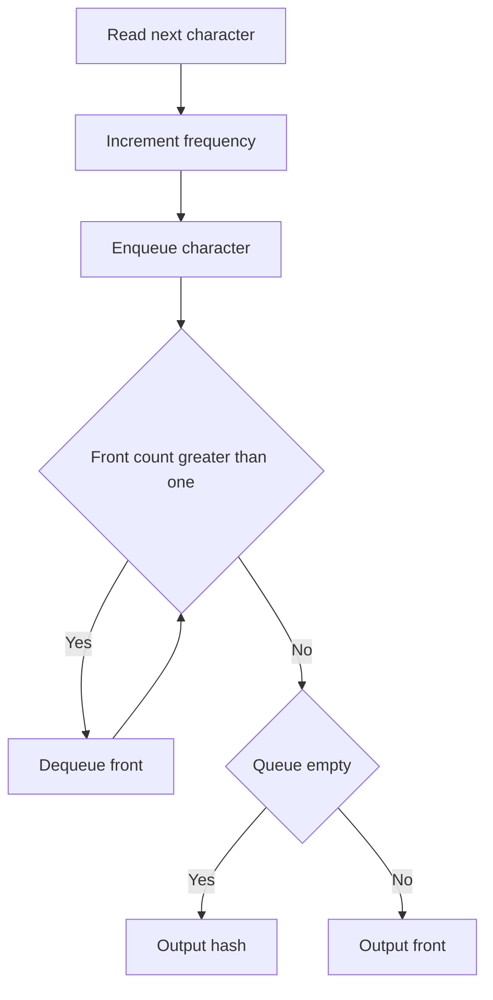

# QUE-006: Ticket Window Distinct Prefix

## 📋 Problem Summary

We process a stream of characters. After each character arrives, we must identify the **first character in the stream** that has appeared exactly once so far. If no such character exists, output `#`.

## 🌍 Real-World Scenario

**Scenario Title:** Customer Service Triage

Imagine a customer service center.
- Customers (represented by IDs 'a', 'b', 'c'...) call in.
- Some customers call repeatedly ('a', then 'b', then 'a' again).
- The manager wants to prioritize the **earliest** customer who has only called **once** (a "fresh" issue).
- If 'a' calls twice, they are no longer a "fresh" priority. The focus shifts to the next earliest unique caller.
- This system ensures that new, unique problems are addressed in the order they appeared, skipping over repeat spammers.

**Why This Problem Matters:**

- **Stream Processing:** Analyzing data in real-time without storing everything.
- **Deduplication:** Identifying unique items in a sequence.
- **Cache Eviction:** Policies based on frequency and recency.


## Detailed Explanation

### ASCII Diagram: Stream Processing

Stream: `a b a c b`

1. **'a' arrives:**
   - Count('a') = 1.
   - Queue: `[a]`.
   - Front is 'a' (count 1). Output: `a`.

2. **'b' arrives:**
   - Count('b') = 1.
   - Queue: `[a, b]`.
   - Front is 'a' (count 1). Output: `a`.

3. **'a' arrives:**
   - Count('a') = 2.
   - Queue: `[a, b, a]`.
   - Front is 'a' (count 2). Pop 'a'.
   - New Front is 'b' (count 1). Output: `b`.

4. **'c' arrives:**
   - Count('c') = 1.
   - Queue: `[b, a, c]`.
   - Front is 'b' (count 1). Output: `b`.

5. **'b' arrives:**
   - Count('b') = 2.
   - Queue: `[b, a, c, b]`.
   - Front is 'b' (count 2). Pop 'b'.
   - Next is 'a' (count 2). Pop 'a'.
   - Next is 'c' (count 1). Output: `c`.

<!-- mermaid -->


### ✅ Input/Output Clarifications (Read This Before Coding)

- **Input:** A string of lowercase letters.
- **Output:** A sequence of characters (same length as input).
- **Format:** Space-separated characters.

## Naive Approach

### Intuition

For every new character, scan the entire history to find the first unique one.

### Algorithm

1. Store history in a list.
2. Maintain frequency map.
3. For each step:
   - Update frequency.
   - Loop through history from start.
   - Return first char with freq == 1.

### Limitations

- **Time Complexity:** `O(N^2)`. For each of `N` characters, we scan up to `N` previous characters.
- With `N=100,000`, this will TLE.

## Optimal Approach

### Key Insight

We need a FIFO structure to track the order of arrival, but we need to efficiently skip "bad" (repeated) candidates at the front.
- Use a **Queue** to store characters in arrival order.
- Use a **Frequency Array/Map** to track counts.
- **Lazy Removal:** When querying the answer, check the front of the queue. If its count > 1, remove it. Repeat until the front is unique or queue is empty.

### Algorithm

1. Initialize `count` array (size 26) and a `Queue`.
2. Loop through char `c` in string:
   - Increment `count[c]`.
   - `Queue.add(c)`.
   - **While** `Queue` is not empty AND `count[Queue.front()] > 1`:
     - `Queue.poll()` (Remove invalid candidate).
   - If `Queue` is empty: Print `#`.
   - Else: Print `Queue.front()`.

### Time Complexity

- **O(N)**. Each character is added to the queue once and removed at most once. The `while` loop amortizes to `O(1)`.

### Space Complexity

- **O(N)** in worst case (all unique characters stored in queue).
- **O(1)** auxiliary space for frequency array (constant size 26).


## Implementations

### Java
```java
import java.util.*;

class Solution {
    public List<String> firstNonRepeating(String s) {
        Map<Character, Integer> count = new HashMap<>();
        Queue<Character> queue = new LinkedList<>();
        List<String> result = new ArrayList<>();

        for (char c : s.toCharArray()) {
            count.put(c, count.getOrDefault(c, 0) + 1);
            queue.offer(c);

            while (!queue.isEmpty() && count.get(queue.peek()) > 1) {
                queue.poll();
            }

            if (queue.isEmpty()) {
                result.add("#");
            } else {
                result.add(String.valueOf(queue.peek()));
            }
        }
        return result;
    }
}

class Main {
    public static void main(String[] args) {
        Scanner sc = new Scanner(System.in);
        StringBuilder sb = new StringBuilder();
        while (sc.hasNextLine()) {
            String line = sc.nextLine();
            if (!sb.isEmpty()) sb.append("\n");
            sb.append(line);
        }
        sc.close();

        String s = sb.toString();
        // Remove leading/trailing whitespace
        s = s.replaceAll("^\\s+|\\s+$", "");

        if (!s.isEmpty()) {
            Solution solution = new Solution();
            List<String> result = solution.firstNonRepeating(s);
            System.out.println(String.join(" ", result));
        }
    }
}
```

### Python
```python
from collections import deque

def first_non_repeating(s):
    """Find first non-repeating character after each prefix"""
    count = {}
    queue = deque()
    result = []
    
    for char in s:
        count[char] = count.get(char, 0) + 1
        queue.append(char)
        
        # Remove characters from front if they have count > 1
        while queue and count[queue[0]] > 1:
            queue.popleft()
        
        # Output the first non-repeating character
        if queue:
            result.append(queue[0])
        else:
            result.append('#')
    
    return result

def main():
    import sys
    s = sys.stdin.read().strip()
    result = first_non_repeating(s)
    print(' '.join(result))

if __name__ == "__main__":
    main()
```

### C++
```cpp
#include <iostream>
#include <vector>
#include <string>
#include <queue>
#include <sstream>
#include <unordered_map>

using namespace std;

class Solution {
public:
    vector<string> firstNonRepeating(const string& s) {
        unordered_map<char, int> count;
        queue<char> q;
        vector<string> result;

        for (char c : s) {
            count[c]++;
            q.push(c);

            while (!q.empty() && count[q.front()] > 1) {
                q.pop();
            }

            if (q.empty()) {
                result.push_back("#");
            } else {
                string temp(1, q.front());
                result.push_back(temp);
            }
        }
        return result;
    }
};

int main() {
    ios::sync_with_stdio(false);
    cin.tie(nullptr);

    string line;
    string s;
    while (getline(cin, line)) {
        s += line + "\n";
    }

    // Remove trailing newline if present
    if (!s.empty() && s.back() == '\n') {
        s.pop_back();
    }

    if (!s.empty()) {
        Solution solution;
        vector<string> result = solution.firstNonRepeating(s);
        for (int i = 0; i < (int)result.size(); i++) {
            if (i) cout << ' ';
            cout << result[i];
        }
        cout << "\n";
    }
    return 0;
}
```

### JavaScript
```javascript
const readline = require("readline");

class Solution {
  firstNonRepeating(s) {
    const count = new Map();
    // Using a simple array as queue. For strict O(N), use a linked-list queue or pointer.
    // Given constraints and JS engine optimizations, array.shift() might be acceptable 
    // but technically O(N). Let's use a pointer approach for O(1) dequeue.
    
    const queue = [];
    let head = 0;
    const result = [];
    
    for (const char of s) {
      count.set(char, (count.get(char) || 0) + 1);
      queue.push(char);
      
      while (head < queue.length && count.get(queue[head]) > 1) {
        head++;
      }
      
      if (head >= queue.length) {
        result.push("#");
      } else {
        result.push(queue[head]);
      }
    }
    return result;
  }
}

const rl = readline.createInterface({
  input: process.stdin,
  output: process.stdout,
});

let data = "";
rl.on("line", (line) => data += line + "\n");
rl.on("close", () => {
  // Remove trailing newline
  if (data.endsWith("\n")) {
    data = data.slice(0, -1);
  }

  if (data.length === 0) return;
  const solution = new Solution();
  const result = solution.firstNonRepeating(data);
  console.log(result.join(" "));
});
```

## 🧪 Test Case Walkthrough (Dry Run)

Input: `a b a c b`

1. `a`: Count{a:1}. Q `[a]`. Front `a` (valid). Out: `a`.
2. `b`: Count{a:1, b:1}. Q `[a, b]`. Front `a` (valid). Out: `a`.
3. `a`: Count{a:2, b:1}. Q `[a, b, a]`.
   - Check front `a`: count is 2. Pop.
   - Q `[b, a]`. Front `b` (valid). Out: `b`.
4. `c`: Count{a:2, b:1, c:1}. Q `[b, a, c]`. Front `b` (valid). Out: `b`.
5. `b`: Count{a:2, b:2, c:1}. Q `[b, a, c, b]`.
   - Check front `b`: count 2. Pop.
   - Q `[a, c, b]`.
   - Check front `a`: count 2. Pop.
   - Q `[c, b]`. Front `c` (valid). Out: `c`.

Result: `a a b b c`. Matches example.

## ✅ Proof of Correctness

### Invariant
The queue contains all characters that have appeared so far, in order. The `while` loop ensures the element at the front is always the *earliest* character with a frequency of exactly 1.

### Why the approach is correct
We lazily remove elements. An element is only removed when it is at the front AND invalid. This guarantees we find the first valid one without re-scanning.

## 💡 Interview Extensions (High-Value Add-ons)

- **Extension 1:** What if the stream is infinite?
  - *Hint:* The queue might grow indefinitely if unique characters keep arriving. We might need a cleanup policy or a different structure (Doubly Linked List + Map) to remove elements from the *middle* when they repeat, keeping the queue size proportional to *current* unique items only.
- **Extension 2:** First character with count exactly K?
  - *Hint:* Similar logic, but condition changes.

### Common Mistakes to Avoid

1. **Not Popping**
   - ❌ Wrong: Just checking `count[front] > 1` and moving to next index without removing.
   - ✅ Correct: Permanently remove invalid candidates from the front. They will never become unique again (count only increases).
2. **Resetting Count**
   - ❌ Wrong: Resetting frequency map at each step.
   - ✅ Correct: Frequency accumulates over time.

## Related Concepts

- **LRU Cache:** Uses Map + Doubly Linked List to manage order and access.
- **Sliding Window:** Processing streams of data.
