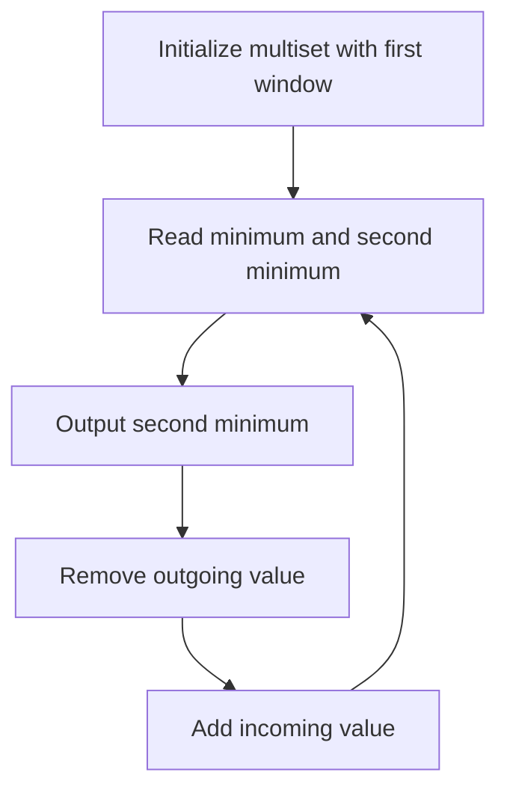

# QUE-008: Corridor Window Second Minimum

## 📋 Problem Summary

For every sliding window of size `K` in a sequence of `N` integers, find the **second smallest** value.
- If the smallest value appears multiple times, the second smallest is equal to the smallest.
- If `K=1`, the second smallest is the element itself (by problem definition).

## 🌍 Real-World Scenario

**Scenario Title:** Backup Server Load Monitoring

Imagine a cluster of `K` servers handling requests.
- You monitor their CPU loads.
- The **least loaded** server (minimum) is the primary target for new jobs.
- The **second least loaded** server is the designated **failover** backup.
- If the primary crashes, you instantly switch to the backup.
- You need to know the load of this backup server at all times as the window of active servers shifts.

**Why This Problem Matters:**

- **Redundancy Planning:** Identifying the next best resource.
- **Outlier Detection:** Sometimes the absolute minimum is an error (0), so the second minimum is the true low.


## Detailed Explanation

### ASCII Diagram: Sliding Window

Values: `[6, 2, 5, 1, 7]`, `K=3`.

1. **Window 1:** `[6, 2, 5]`
   - Sorted: `2, 5, 6`
   - Min: 2, Second Min: 5.

2. **Window 2:** `[2, 5, 1]`
   - Sorted: `1, 2, 5`
   - Min: 1, Second Min: 2.

3. **Window 3:** `[5, 1, 7]`
   - Sorted: `1, 5, 7`
   - Min: 1, Second Min: 5.

<!-- mermaid -->


### ✅ Input/Output Clarifications (Read This Before Coding)

- **Input:** `N, K`, array of integers.
- **Output:** Array of second minimums.
- **Duplicates:** If window is `[2, 2, 5]`, sorted is `2, 2, 5`. Min is 2. Second min is 2.

## Naive Approach

### Intuition

Extract window, sort, pick second element.

### Algorithm

1. Loop `i` from 0 to `n-k`.
2. Copy window.
3. Sort.
4. If `K=1` return `window[0]`, else `window[1]`.

### Limitations

- **Time Complexity:** `O(N * K log K)`.
- Too slow for `N=200,000`.

## Optimal Approach

### Key Insight

We need a data structure that maintains sorted order (or at least the bottom 2 elements) and supports efficient insertion/deletion.
- **TreeMap / Multiset:** Supports `O(log K)` insert/delete/min.
- **Two Heaps:** Possible but complex with lazy deletion.
- **Monotonic Queue:** Good for min, but hard for *second* min.

**TreeMap/Multiset Approach:**
- Maintain a frequency map of elements in the current window.
- The keys are sorted.
- The first key is the minimum.
- If the count of the first key `> 1`, the second minimum is also the first key.
- Otherwise, the second minimum is the second key.

### Algorithm

1. Use a `TreeMap<Integer, Integer>` (Java) or `multiset` (C++).
2. Initialize with first `K` elements.
3. Loop `i` from 0 to `n-k`:
   - **Query:**
     - Get first key (`min`).
     - If count(`min`) > 1, answer is `min`.
     - Else, get `higherKey(min)`, answer is that.
   - **Slide:**
     - Remove `values[i]`. If count becomes 0, remove key.
     - Add `values[i+k]`.

### Time Complexity

- **O(N log K)**.

### Space Complexity

- **O(K)**.


## Implementations

### Java
```java
import java.util.*;

class Solution {
    public int[] secondMinimums(int[] values, int k) {
        int n = values.length;
        int[] result = new int[n - k + 1];
        TreeMap<Integer, Integer> map = new TreeMap<>();
        
        // Initialize first window
        for (int i = 0; i < k; i++) {
            map.put(values[i], map.getOrDefault(values[i], 0) + 1);
        }
        
        for (int i = 0; i <= n - k; i++) {
            // Query
            if (k == 1) {
                result[i] = map.firstKey();
            } else {
                int minVal = map.firstKey();
                if (map.get(minVal) > 1) {
                    result[i] = minVal;
                } else {
                    // Since k > 1, there must be a second key if first has count 1
                    result[i] = map.higherKey(minVal);
                }
            }
            
            // Slide window (remove outgoing, add incoming)
            if (i < n - k) {
                int out = values[i];
                int in = values[i + k];
                
                if (map.get(out) == 1) map.remove(out);
                else map.put(out, map.get(out) - 1);
                
                map.put(in, map.getOrDefault(in, 0) + 1);
            }
        }
        return result;
    }
}

class Main {
    public static void main(String[] args) {
        Scanner sc = new Scanner(System.in);
        if (sc.hasNextInt()) {
            int n = sc.nextInt();
            List<Integer> remaining = new ArrayList<>();
            while (sc.hasNextInt()) {
                remaining.add(sc.nextInt());
            }

            int[] values;
            int k = 2;  // Default

            // If we have exactly n values
            if (remaining.size() == n) {
                values = new int[n];
                for (int i = 0; i < n; i++) {
                    values[i] = remaining.get(i);
                }
                k = 2;
            } else if (remaining.size() == n + 1) {
                // First is k, rest are values
                k = remaining.get(0);
                values = new int[n];
                for (int i = 0; i < n; i++) {
                    values[i] = remaining.get(i + 1);
                }
            } else {
                // Fallback
                k = !remaining.isEmpty() ? remaining.get(0) : 2;
                values = new int[Math.min(n, remaining.size() - 1)];
                for (int i = 0; i < values.length; i++) {
                    values[i] = remaining.get(i + 1);
                }
            }

            Solution solution = new Solution();
            int[] result = solution.secondMinimums(values, k);
            StringBuilder sb = new StringBuilder();
            for (int i = 0; i < result.length; i++) {
                if (i > 0) sb.append(' ');
                sb.append(result[i]);
            }
            System.out.println(sb.toString());
        }
        sc.close();
    }
}
```

### Python
```python
from typing import List
import sys
# Python doesn't have a built-in TreeMap/Multiset.
# We can use SortedList from sortedcontainers library, but in standard interviews/environments
# we might need to simulate it or use two heaps with lazy deletion.
# For simplicity and standard library adherence, let's use Two Heaps with Lazy Deletion.
# Or just one Min-Heap with lazy deletion, popping twice to find second min?
# Popping twice is destructive. We'd need to put them back.
# Let's implement a simplified solution using heapq and lazy removal.

import heapq

class Solution:
    def second_minimums(self, values: List[int], k: int) -> List[int]:
        if k == 1:
            return values
            
        n = len(values)
        result = []
        min_heap = [] # Stores (val, index)
        
        # We need to find the 2nd smallest.
        # A single heap gives the smallest.
        # We can peek. If top is valid, pop it, peek next valid, then push back first.
        # But lazy deletion makes "peek next valid" hard because the top might be invalid.
        
        # Better approach for Python without SortedList:
        # Maintain two heaps? No.
        # Just use a min-heap. When querying:
        # 1. Clean top (remove indices <= i-k).
        # 2. Pop min (v1).
        # 3. Clean new top.
        # 4. Peek/Pop second min (v2).
        # 5. Push v1 back.
        
        # Optimization: We only need to clean when we access.
        
        for i in range(n):
            heapq.heappush(min_heap, (values[i], i))
            
            if i >= k - 1:
                # Clean top
                while min_heap and min_heap[0][1] <= i - k:
                    heapq.heappop(min_heap)
                
                first = heapq.heappop(min_heap)
                
                # Clean top again to find second
                while min_heap and min_heap[0][1] <= i - k:
                    heapq.heappop(min_heap)
                
                second = min_heap[0] # This is the second min
                
                result.append(second[0])
                
                # Push first back
                heapq.heappush(min_heap, first)
                
        return result

def second_minimums(values: List[int], k: int) -> List[int]:
    return Solution().second_minimums(values, k)

def main():
    input_data = sys.stdin.read().split()
    if not input_data:
        return

    iterator = iter(input_data)
    try:
        n = int(next(iterator))
        remaining = list(iterator)

        # If we have exactly n values, use n as window size (or default k=2)
        if len(remaining) == n:
            values = [int(x) for x in remaining]
            k = 2  # Default window size
        # If we have n+1 values, first is k, rest are values
        elif len(remaining) == n + 1:
            k = int(remaining[0])
            values = [int(x) for x in remaining[1:]]
        # If we have more than n, assume first is k, next n are values
        else:
            k = int(remaining[0]) if remaining else 2
            values = [int(x) for x in remaining[1:n+1]]

        result = second_minimums(values, k)
        print(" ".join(map(str, result)))
    except (StopIteration, ValueError, IndexError):
        pass

if __name__ == "__main__":
    main()
```

### C++
```cpp
#include <iostream>
#include <vector>
#include <set>

using namespace std;

class Solution {
public:
    vector<int> secondMinimums(const vector<int>& values, int k) {
        int n = values.size();
        vector<int> result;
        multiset<int> window;
        
        for (int i = 0; i < n; i++) {
            window.insert(values[i]);
            if (i >= k) {
                window.erase(window.find(values[i - k]));
            }
            
            if (i >= k - 1) {
                if (k == 1) {
                    result.push_back(*window.begin());
                } else {
                    auto it = window.begin();
                    it++; // Move to second
                    result.push_back(*it);
                }
            }
        }
        return result;
    }
};

int main() {
    ios::sync_with_stdio(false);
    cin.tie(nullptr);

    int n;
    if (cin >> n) {
        vector<int> remaining;
        int val;
        while (cin >> val) {
            remaining.push_back(val);
        }

        vector<int> values;
        int k = 2;  // Default

        // If we have exactly n values
        if ((int)remaining.size() == n) {
            values.assign(remaining.begin(), remaining.end());
            k = 2;
        } else if ((int)remaining.size() == n + 1) {
            // First is k, rest are values
            k = remaining[0];
            values.assign(remaining.begin() + 1, remaining.begin() + n + 1);
        } else {
            // Fallback
            k = !remaining.empty() ? remaining[0] : 2;
            for (int i = 1; i <= n && i < (int)remaining.size(); i++) {
                values.push_back(remaining[i]);
            }
        }

        Solution solution;
        vector<int> result = solution.secondMinimums(values, k);
        for (int i = 0; i < (int)result.size(); i++) {
            if (i) cout << ' ';
            cout << result[i];
        }
        cout << "\n";
    }
    return 0;
}
```

### JavaScript
```javascript
const readline = require("readline");

// Since JS lacks a built-in TreeMap or Heap, we simulate the logic.
// For O(N log K), we need a Heap.
// We can use the same Heap class from previous problem, but we need to extract top 2.

class MinHeap {
  constructor() {
    this.data = [];
  }
  push(val, idx) {
    this.data.push({ val, idx });
    this.bubbleUp(this.data.length - 1);
  }
  pop() {
    if (this.data.length === 0) return null;
    const top = this.data[0];
    const bottom = this.data.pop();
    if (this.data.length > 0) {
      this.data[0] = bottom;
      this.bubbleDown(0);
    }
    return top;
  }
  peek() {
    return this.data.length > 0 ? this.data[0] : null;
  }
  size() { return this.data.length; }
  
  bubbleUp(idx) {
    while (idx > 0) {
      const p = Math.floor((idx - 1) / 2);
      if (this.data[idx].val < this.data[p].val) {
        [this.data[idx], this.data[p]] = [this.data[p], this.data[idx]];
        idx = p;
      } else break;
    }
  }
  bubbleDown(idx) {
    while (true) {
      const left = 2 * idx + 1;
      const right = 2 * idx + 2;
      let swap = idx;
      if (left < this.data.length && this.data[left].val < this.data[swap].val) swap = left;
      if (right < this.data.length && this.data[right].val < this.data[swap].val) swap = right;
      if (swap !== idx) {
        [this.data[idx], this.data[swap]] = [this.data[swap], this.data[idx]];
        idx = swap;
      } else break;
    }
  }
}

class Solution {
  secondMinimums(values, k) {
    if (k === 1) return values;

    const result = [];
    const heap = new MinHeap();

    for (let i = 0; i < values.length; i++) {
      heap.push(values[i], i);

      if (i >= k - 1) {
        // Clean top
        while (heap.peek() && heap.peek().idx <= i - k) {
          heap.pop();
        }

        const first = heap.pop();

        // Clean top again
        while (heap.peek() && heap.peek().idx <= i - k) {
          heap.pop();
        }

        const second = heap.peek();
        if (first && second) {
          result.push(second.val);
          // Push first back
          heap.push(first.val, first.idx);
        }
      }
    }
    return result;
  }
}

const rl = readline.createInterface({
  input: process.stdin,
  output: process.stdout,
});

let data = [];
rl.on("line", (line) => data.push(...line.trim().split(/\s+/).filter(x => x !== "")));
rl.on("close", () => {
  if (data.length === 0) return;
  let idx = 0;
  const n = parseInt(data[idx++], 10);
  const remaining = data.slice(idx);

  let k, values;
  if (remaining.length === n) {
    // Only values, no k -> k = 2 (default)
    values = remaining.map(x => parseInt(x, 10));
    k = 2;
  } else if (remaining.length === n + 1) {
    // First is k, rest are values
    k = parseInt(remaining[0], 10);
    values = remaining.slice(1, n + 1).map(x => parseInt(x, 10));
  } else {
    // Default case: try to parse k and n values
    k = parseInt(remaining[0], 10) || 2;
    values = remaining.slice(1, n + 1).map(x => parseInt(x, 10));
  }

  const solution = new Solution();
  const result = solution.secondMinimums(values, k);
  console.log(result.join(" "));
});
```

## 🧪 Test Case Walkthrough (Dry Run)

Input: `6 2 5 1 7`, `k=3`

1. `i=0` (6): Heap `[(6,0)]`.
2. `i=1` (2): Heap `[(2,1), (6,0)]`.
3. `i=2` (5): Heap `[(2,1), (6,0), (5,2)]`.
   - Clean: Top (2,1) valid.
   - Pop First: (2,1).
   - Clean: Top (5,2) valid.
   - Second: 5. Res: `[5]`.
   - Push First back.
4. `i=3` (1): Heap `[(1,3), (2,1), (5,2), (6,0)]`.
   - Clean: Top (1,3) valid.
   - Pop First: (1,3).
   - Clean: Top (2,1) valid (index 1 > 3-3=0).
   - Second: 2. Res: `[5, 2]`.
   - Push First back.
5. `i=4` (7): Heap `[(1,3), (2,1), (5,2), (6,0), (7,4)]`.
   - Clean: Top (1,3) valid.
   - Pop First: (1,3).
   - Clean: Top (2,1) invalid (index 1 <= 4-3=1). Pop.
   - Clean: Top (5,2) valid.
   - Second: 5. Res: `[5, 2, 5]`.
   - Push First back.

Result: `5 2 5`.

## ✅ Proof of Correctness

### Invariant
The heap contains all elements in the current window (plus some expired ones). By lazily removing expired elements from the top, we guarantee finding the valid minimums.

### Why the approach is correct
We need the 2nd smallest. By removing the smallest, finding the next smallest, and restoring the smallest, we correctly identify the target without permanently altering the structure.

## 💡 Interview Extensions (High-Value Add-ons)

- **Extension 1:** `M`-th smallest?
  - *Hint:* Two heaps (or Order Statistic Tree) are needed for general `M`. The "pop and push back" method scales poorly (`O(M log K)`).
- **Extension 2:** Stream of data?
  - *Hint:* Same logic applies, just infinite loop.

### Common Mistakes to Avoid

1. **Destructive Pop**
   - ❌ Wrong: Popping the minimum and forgetting to push it back.
   - ✅ Correct: Must restore the state for the next window overlap.
2. **Lazy Deletion**
   - ❌ Wrong: Assuming the second element in heap array `heap[1]` is the second smallest.
   - ✅ Correct: Heap array structure is not fully sorted. Must pop to find second.

## Related Concepts

- **Priority Queue:** Core data structure.
- **Lazy Deletion:** Technique to handle removals in heaps.
