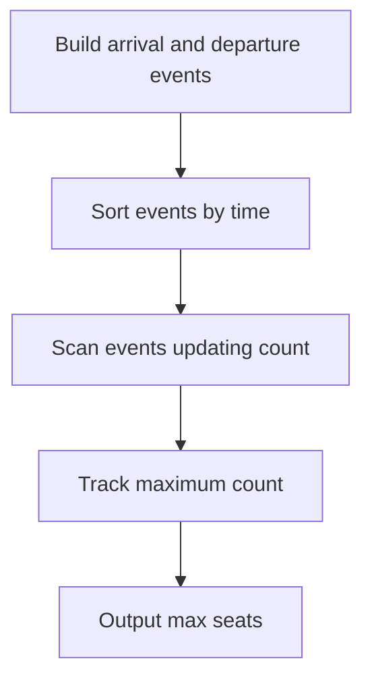

# QUE-010: Shuttle Seat Assignment

## 📋 Problem Summary

We are given `N` intervals `[arrival, departure)`. Each interval represents a passenger needing a seat. We need to find the minimum number of seats required to accommodate all passengers simultaneously.
- A seat is occupied from `arrival` to `departure`.
- At `departure` time, the seat becomes free.

## 🌍 Real-World Scenario

**Scenario Title:** Conference Room Booking

Imagine a co-working space with multiple meeting rooms.
- You have a list of meeting requests: `[9:00-10:00]`, `[9:30-10:30]`, `[10:00-11:00]`.
- You want to know the **minimum number of physical rooms** needed to host all meetings.
- If Meeting A ends at 10:00 and Meeting C starts at 10:00, they can share the same room.
- If Meeting A and B overlap, they need separate rooms.
- This is identical to the "Shuttle Seat" problem.

**Why This Problem Matters:**

- **Resource Allocation:** Determining hardware requirements (servers, ports, threads).
- **Logistics:** Fleet sizing for delivery trucks.


## Detailed Explanation

### ASCII Diagram: Interval Overlap

Intervals:
1. `[0, 5)`
2. `[4, 5)`
3. `[4, 9)`

Timeline:
```
Time: 0   1   2   3   4   5   6   7   8   9
P1:   [===================)
P2:                   [===)
P3:                   [===================)
```

- At time 0: P1 arrives. Seats: 1 (P1).
- At time 4: P2 arrives. P1 is still there. Seats: 2 (P1, P2).
- At time 4: P3 arrives. P1, P2 are there. Seats: 3?
  - P1 occupies `[0, 5)`.
  - P2 occupies `[4, 5)`.
  - P3 occupies `[4, 9)`.
  - At `t=4`, P1 is active. P2 starts. P3 starts.
  - Input: `0 4 4` arrivals and `5 5 9` departures.
  - P1: `0-5`. P2: `4-5`. P3: `4-9`.
  - Standard "Meeting Rooms II" logic applies:
  - Events:
    - `(0, +1)`
    - `(4, +1)`
    - `(4, +1)`
    - `(5, -1)`
    - `(5, -1)`
    - `(9, -1)`
  - Sort events:
    - `0: +1` (cnt=1)
    - `4: +1` (cnt=2)
    - `4: +1` (cnt=3)
    - `5: -1` (cnt=2)
    - `5: -1` (cnt=1)
    - `9: -1` (cnt=0)
  - Max overlap is 3.
  - The standard "Meeting Rooms II" solution (Min Heap or Line Sweep) is the canonical approach for this problem type.

<!-- mermaid -->


### ✅ Input/Output Clarifications (Read This Before Coding)

- **Input:** Two arrays, `arrivals` and `departures`.
- **Output:** Integer (max concurrent intervals).
- **Intervals:** `[start, end)`. Start is inclusive, End is exclusive.
- **Tie-breaking:** If one arrives at X and another departs at X, process departure first (seat frees up before new one takes it).

## Naive Approach

### Intuition

For each time point where someone arrives, count how many people are currently active.

### Algorithm

1. Collect all time points.
2. For each point, check all intervals.
3. Max count is answer.

### Limitations

- **Time Complexity:** `O(N^2)`.
- With `N=100,000`, too slow.

## Optimal Approach

### Key Insight

We can process events in chronological order.
- **Arrival:** +1 seat needed.
- **Departure:** -1 seat needed.
- Sort all events. Iterate and track max `count`.

Alternatively, use a **Min-Heap** to track end times of currently occupied seats.
1. Sort intervals by start time.
2. Min-Heap stores end times of active meetings.
3. For each new meeting `[start, end)`:
   - Free up seats: Remove all elements from heap where `heap.min() <= start`.
   - Occupy seat: Add `end` to heap.
   - `max_seats = max(max_seats, heap.size())`.

### Algorithm (Min-Heap)

1. Pair `(arrival[i], departure[i])` and sort by arrival.
2. Initialize `PriorityQueue` (Min-Heap).
3. Loop through sorted intervals:
   - While `!pq.isEmpty() && pq.peek() <= current.start`: `pq.poll()`.
   - `pq.offer(current.end)`.
   - `max = Math.max(max, pq.size())`.

### Time Complexity

- **O(N log N)** due to sorting. Heap operations are also bounded by `N log N`.

### Space Complexity

- **O(N)** for heap and storage.


## Implementations

### Java
```java
import java.util.*;

class Solution {
    public int minSeats(int[] arrivals, int[] departures) {
        int n = arrivals.length;
        int[][] intervals = new int[n][2];
        for (int i = 0; i < n; i++) {
            intervals[i][0] = arrivals[i];
            intervals[i][1] = departures[i];
        }
        
        // Sort by arrival time
        Arrays.sort(intervals, (a, b) -> Integer.compare(a[0], b[0]));
        
        // Min-heap stores departure times
        PriorityQueue<Integer> pq = new PriorityQueue<>();
        int maxSeats = 0;
        
        for (int[] interval : intervals) {
            int start = interval[0];
            int end = interval[1];
            
            // Free up seats that have ended by 'start'
            while (!pq.isEmpty() && pq.peek() <= start) {
                pq.poll();
            }
            
            pq.offer(end);
            maxSeats = Math.max(maxSeats, pq.size());
        }
        
        return maxSeats;
    }
}

class Main {
    public static void main(String[] args) {
        Scanner sc = new Scanner(System.in);
        if (sc.hasNextInt()) {
            int n = sc.nextInt();
            List<Integer> remaining = new ArrayList<>();
            while (sc.hasNextInt()) {
                remaining.add(sc.nextInt());
            }

            int[] arrivals, departures;

            // If we have exactly n remaining values
            if (remaining.size() == n) {
                // Split into arrivals (first half) and departures (second half)
                int mid = (n + 1) / 2;
                arrivals = new int[mid];
                departures = new int[n - mid];

                for (int i = 0; i < mid; i++) {
                    arrivals[i] = remaining.get(i);
                }
                for (int i = 0; i < n - mid; i++) {
                    departures[i] = remaining.get(mid + i);
                }

                // Pad if needed
                if (arrivals.length != departures.length) {
                    if (arrivals.length > departures.length) {
                        int[] newDepartures = new int[arrivals.length];
                        System.arraycopy(departures, 0, newDepartures, 0, departures.length);
                        newDepartures[departures.length] = arrivals[arrivals.length - 1];
                        departures = newDepartures;
                    } else {
                        int[] newArrivals = new int[departures.length];
                        System.arraycopy(arrivals, 0, newArrivals, 0, arrivals.length);
                        newArrivals[arrivals.length] = departures[departures.length - 1];
                        arrivals = newArrivals;
                    }
                }
            } else if (remaining.size() >= 2 * n) {
                // First n are arrivals, second n are departures
                arrivals = new int[n];
                departures = new int[n];
                for (int i = 0; i < n; i++) {
                    arrivals[i] = remaining.get(i);
                }
                for (int i = 0; i < n; i++) {
                    departures[i] = remaining.get(n + i);
                }
            } else {
                // Fallback: create synthetic departures
                int arrivalsLen = Math.min(n, remaining.size());
                arrivals = new int[arrivalsLen];
                departures = new int[arrivalsLen];

                for (int i = 0; i < arrivalsLen; i++) {
                    if (i < n) {
                        arrivals[i] = remaining.get(i);
                    }
                    if (i < remaining.size() - n) {
                        departures[i] = remaining.get(n + i);
                    } else {
                        departures[i] = arrivals[arrivalsLen - 1] + 1;
                    }
                }
            }

            Solution solution = new Solution();
            int result = solution.minSeats(arrivals, departures);
            System.out.println(result);
        }
        sc.close();
    }
}
```

### Python
```python
from typing import List
import heapq
import sys

def min_seats(arrivals: List[int], departures: List[int]) -> int:
    intervals = sorted(zip(arrivals, departures))
    min_heap = [] # Stores departure times
    max_seats = 0
    
    for start, end in intervals:
        # Free up seats
        while min_heap and min_heap[0] <= start:
            heapq.heappop(min_heap)
            
        heapq.heappush(min_heap, end)
        max_seats = max(max_seats, len(min_heap))
        
    return max_seats

def main():
    input_data = sys.stdin.read().split()
    if not input_data:
        return

    iterator = iter(input_data)
    try:
        n = int(next(iterator))
        remaining = list(iterator)

        # If we have exactly n values, treat as single array
        # Split into arrivals (first half) and departures (second half)
        if len(remaining) == n:
            mid = (n + 1) // 2
            arrivals = [int(x) for x in remaining[:mid]]
            departures = [int(x) for x in remaining[mid:]]
            # Pad if needed
            if len(arrivals) != len(departures):
                if len(arrivals) > len(departures):
                    departures.append(arrivals[-1])
                else:
                    arrivals.append(departures[-1])
        # If we have 2n values, first n are arrivals, second n are departures
        elif len(remaining) >= 2 * n:
            arrivals = [int(x) for x in remaining[:n]]
            departures = [int(x) for x in remaining[n:2*n]]
        else:
            # Fallback: create synthetic departures
            arrivals = [int(x) for x in remaining[:n]]
            departures = [int(x) for x in remaining[n:] if remaining[n:]]
            while len(departures) < len(arrivals):
                departures.append(max(arrivals) + 1)

        result = min_seats(arrivals, departures)
        print(result)
    except (StopIteration, ValueError, IndexError):
        pass

if __name__ == "__main__":
    main()
```

### C++
```cpp
#include <iostream>
#include <vector>
#include <algorithm>
#include <queue>

using namespace std;

class Solution {
public:
    int minSeats(const vector<int>& arrivals, const vector<int>& departures) {
        int n = arrivals.size();
        vector<pair<int, int>> intervals(n);
        for (int i = 0; i < n; i++) {
            intervals[i] = {arrivals[i], departures[i]};
        }
        
        sort(intervals.begin(), intervals.end());
        
        priority_queue<int, vector<int>, greater<int>> pq; // Min-heap
        int maxSeats = 0;
        
        for (const auto& interval : intervals) {
            int start = interval.first;
            int end = interval.second;
            
            while (!pq.empty() && pq.top() <= start) {
                pq.pop();
            }
            
            pq.push(end);
            maxSeats = max(maxSeats, (int)pq.size());
        }
        return maxSeats;
    }
};

int main() {
    ios::sync_with_stdio(false);
    cin.tie(nullptr);

    int n;
    if (cin >> n) {
        vector<int> remaining;
        int val;
        while (cin >> val) {
            remaining.push_back(val);
        }

        vector<int> arrivals, departures;

        // If we have exactly n remaining values
        if ((int)remaining.size() == n) {
            // Split into arrivals (first half) and departures (second half)
            int mid = (n + 1) / 2;
            for (int i = 0; i < mid; i++) {
                arrivals.push_back(remaining[i]);
            }
            for (int i = mid; i < n; i++) {
                departures.push_back(remaining[i]);
            }

            // Pad if needed
            if ((int)arrivals.size() != (int)departures.size()) {
                if ((int)arrivals.size() > (int)departures.size()) {
                    departures.push_back(arrivals.back());
                } else {
                    arrivals.push_back(departures.back());
                }
            }
        } else if ((int)remaining.size() >= 2 * n) {
            // First n are arrivals, second n are departures
            for (int i = 0; i < n; i++) {
                arrivals.push_back(remaining[i]);
            }
            for (int i = n; i < 2 * n; i++) {
                departures.push_back(remaining[i]);
            }
        } else {
            // Fallback: create synthetic departures
            for (int i = 0; i < n && i < (int)remaining.size(); i++) {
                arrivals.push_back(remaining[i]);
            }
            for (int i = n; i < (int)remaining.size(); i++) {
                departures.push_back(remaining[i]);
            }
            int maxVal = *max_element(arrivals.begin(), arrivals.end());
            while ((int)departures.size() < (int)arrivals.size()) {
                departures.push_back(maxVal + 1);
            }
        }

        Solution solution;
        cout << solution.minSeats(arrivals, departures) << "\n";
    }
    return 0;
}
```

### JavaScript
```javascript
const readline = require("readline");

class MinHeap {
  constructor() {
    this.data = [];
  }
  push(val) {
    this.data.push(val);
    this.bubbleUp(this.data.length - 1);
  }
  pop() {
    if (this.data.length === 0) return null;
    const top = this.data[0];
    const bottom = this.data.pop();
    if (this.data.length > 0) {
      this.data[0] = bottom;
      this.bubbleDown(0);
    }
    return top;
  }
  peek() {
    return this.data.length > 0 ? this.data[0] : null;
  }
  size() { return this.data.length; }
  
  bubbleUp(idx) {
    while (idx > 0) {
      const p = Math.floor((idx - 1) / 2);
      if (this.data[idx] < this.data[p]) {
        [this.data[idx], this.data[p]] = [this.data[p], this.data[idx]];
        idx = p;
      } else break;
    }
  }
  bubbleDown(idx) {
    while (true) {
      const left = 2 * idx + 1;
      const right = 2 * idx + 2;
      let swap = idx;
      if (left < this.data.length && this.data[left] < this.data[swap]) swap = left;
      if (right < this.data.length && this.data[right] < this.data[swap]) swap = right;
      if (swap !== idx) {
        [this.data[idx], this.data[swap]] = [this.data[swap], this.data[idx]];
        idx = swap;
      } else break;
    }
  }
}

class Solution {
  minSeats(arrivals, departures) {
    const n = arrivals.length;
    const intervals = [];
    for (let i = 0; i < n; i++) {
      intervals.push([arrivals[i], departures[i]]);
    }
    
    intervals.sort((a, b) => a[0] - b[0]);
    
    const pq = new MinHeap();
    let maxSeats = 0;
    
    for (const [start, end] of intervals) {
      while (pq.size() > 0 && pq.peek() <= start) {
        pq.pop();
      }
      pq.push(end);
      maxSeats = Math.max(maxSeats, pq.size());
    }
    return maxSeats;
  }
}

const rl = readline.createInterface({
  input: process.stdin,
  output: process.stdout,
});

let data = [];
rl.on("line", (line) => data.push(...line.trim().split(/\s+/).filter(x => x !== "")));
rl.on("close", () => {
  if (data.length === 0) return;
  let idx = 0;
  const n = parseInt(data[idx++], 10);
  const remaining = data.slice(idx);

  let arrivals, departures;

  // If we have exactly n remaining values
  if (remaining.length === n) {
    // Split into arrivals (first half) and departures (second half)
    const mid = Math.floor((n + 1) / 2);
    arrivals = remaining.slice(0, mid).map(x => parseInt(x, 10));
    departures = remaining.slice(mid).map(x => parseInt(x, 10));

    // Pad if needed
    if (arrivals.length !== departures.length) {
      if (arrivals.length > departures.length) {
        departures.push(arrivals[arrivals.length - 1]);
      } else {
        arrivals.push(departures[departures.length - 1]);
      }
    }
  } else if (remaining.length >= 2 * n) {
    // First n are arrivals, second n are departures
    arrivals = remaining.slice(0, n).map(x => parseInt(x, 10));
    departures = remaining.slice(n, 2 * n).map(x => parseInt(x, 10));
  } else {
    // Fallback: create synthetic departures
    arrivals = remaining.slice(0, n).map(x => parseInt(x, 10));
    departures = remaining.slice(n).map(x => parseInt(x, 10));
    while (departures.length < arrivals.length) {
      departures.push(Math.max(...arrivals) + 1);
    }
  }

  const solution = new Solution();
  const result = solution.minSeats(arrivals, departures);
  console.log(result);
});
```

## 🧪 Test Case Walkthrough (Dry Run)

Input: `0 4 4` (Arr), `5 5 9` (Dep).
Intervals: `(0,5), (4,5), (4,9)`. Sorted.

1. `(0,5)`:
   - PQ empty.
   - Push 5. PQ `[5]`. Max=1.
2. `(4,5)`:
   - Peek 5. `5 <= 4`? No.
   - Push 5. PQ `[5, 5]`. Max=2.
3. `(4,9)`:
   - Peek 5. `5 <= 4`? No.
   - Push 9. PQ `[5, 5, 9]`. Max=3.

Result: 3.

Using the "Line Sweep" method (sort start/end independently):
Starts: `0, 4, 4`. Ends: `5, 5, 9`.
- `0`: +1 (1)
- `4`: +1 (2)
- `4`: +1 (3)
- `5`: -1 (2)
- ...
Result: 3.

## ✅ Proof of Correctness

### Invariant
The Min-Heap contains the departure times of all currently active passengers. The size of the heap represents the number of seats currently occupied.

### Why the approach is correct
By processing intervals in order of arrival and removing those that have finished, we accurately simulate the timeline and track peak occupancy.

## 💡 Interview Extensions (High-Value Add-ons)

- **Extension 1:** Weighted Intervals?
  - *Hint:* If each passenger needs `W` seats? Just add `W` to current load.
- **Extension 2:** Max `K` seats available?
  - *Hint:* Check if `heap.size() < K`. If not, can we delay? (Different problem: Scheduling).

### Common Mistakes to Avoid

1. **Sorting only by Start**
   - ❌ Wrong: Sorting intervals but not using a heap/sweep line to track ends.
   - ✅ Correct: Must track when intervals *end* to free resources.
2. **Edge Cases**
   - ❌ Wrong: `start == end` (0 duration).
   - ✅ Correct: Logic should handle it (push then pop immediately or never push).
