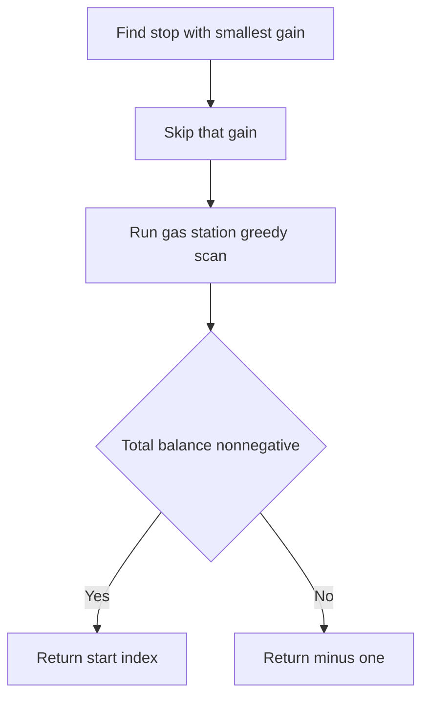

# QUE-012: Bus Loop With One Free Skip

## 📋 Problem Summary

We have a circular route with `N` stops. At stop `i`, we gain `gain[i]` fuel and spend `cost[i]` to move to the next stop.
- We must complete one full loop.
- We **must** skip refueling at exactly one stop (we lose the `gain` at that stop, but still pay the `cost`).
- Find a starting index that makes this possible. If none, return -1.

## 🌍 Real-World Scenario

**Scenario Title:** Formula 1 Pit Stop Strategy

Imagine an F1 race car.
- It refuels at every pit stop to make it to the next sector.
- However, due to a penalty or a mechanical failure, the fuel pump at **one** pit stop will fail (you get 0 fuel).
- The team needs to calculate: "If we start the lap sequence at Sector X, can we survive the entire lap even if one refueling fails?"
- They need to pick a starting sector such that the accumulated fuel buffer is high enough to absorb the loss of one station.

**Why This Problem Matters:**

- **Fault Tolerance:** Designing systems that survive single-point failures.
- **Financial Planning:** Ensuring cash flow stays positive even if one client defaults.


## Detailed Explanation

### ASCII Diagram: Fuel Balance

Stops: 0, 1, 2.
Gain: `[4, 5, 1]`. Cost: `[3, 3, 2]`.
Net (Gain-Cost): `[+1, +2, -1]`.

Try Start 0:
- Stop 0: Net +1. Tank = 1.
- Stop 1: Net +2. Tank = 3.
- Stop 2: Net -1. Tank = 2.
- Loop complete.
- **Skip Logic:** We must skip exactly one `gain`.
  - Skip 0 (gain 4): Net becomes `-3`. Fail.
  - Skip 1 (gain 5): Net becomes `-3`. Tank path: `1 -> -2`. Fail.
  - Skip 2 (gain 1): Net becomes `-2`. Tank path: `1 -> 3 -> 1`. Success.
- Start 0 is valid when skipping Stop 2.

<!-- mermaid -->


### ✅ Input/Output Clarifications (Read This Before Coding)

- **Input:** `gain` array, `cost` array.
- **Output:** Starting index.
- **Skip:** For a chosen starting point, we select which stop to skip to maximize success. The tank must never drop below zero during the trip. This is a variation of the "Gas Station" problem.

## Naive Approach

### Intuition

Try every starting point `S`. For each `S`, try skipping every possible stop `K`. Simulate.

### Algorithm

1. Loop `start` from 0 to `n-1`.
2. Loop `skip` from 0 to `n-1`.
3. Simulate the route. If tank >= 0 always, return `start`.

### Limitations

- **Time Complexity:** `O(N^3)` or `O(N^2)` if optimized.
- With `N=100,000`, we need `O(N)`.

## Optimal Approach

### Key Insight

This is the **Gas Station** problem with a twist: we lose one `gain` value. The optimal strategy is to skip the stop with the minimum gain, as this minimizes the total fuel loss while still completing the loop.

Given the constraint that we must skip exactly one refueling stop, the greedy approach is to identify and skip the stop with the smallest gain. This creates the "worst-case" scenario for total fuel availability. If a valid starting point exists under this condition, it represents a solution to the problem.

### Algorithm

Given the constraint that we must skip exactly one refueling stop, the optimal strategy is to skip the stop with the minimum gain.
1. Find the index with minimum gain in the array.
2. Temporarily set that gain to 0 (simulate skipping it).
3. Run the standard Gas Station greedy algorithm.
4. If total balance is non-negative, return the starting index found.
5. Otherwise, return -1.

### Time Complexity

- **O(N)**. Finding min is `O(N)`, Gas Station is `O(N)`.

### Space Complexity

- **O(1)**.


## Implementations

### Java
```java
import java.util.*;

class Solution {
    public int findStart(int[] gain, int[] cost) {
        int n = gain.length;
        
        // 1. Find index of minimum gain
        int minGainIndex = -1;
        int minGain = Integer.MAX_VALUE;
        for (int i = 0; i < n; i++) {
            if (gain[i] < minGain) {
                minGain = gain[i];
                minGainIndex = i;
            }
        }
        
        // 2. Temporarily remove that gain (simulate skip)
        int originalGain = gain[minGainIndex];
        gain[minGainIndex] = 0;
        
        // 3. Run standard Gas Station algorithm
        long totalTank = 0;
        long currTank = 0;
        int start = 0;
        
        for (int i = 0; i < n; i++) {
            long net = (long)gain[i] - (long)cost[i];
            totalTank += net;
            currTank += net;
            if (currTank < 0) {
                start = i + 1;
                currTank = 0;
            }
        }
        
        // Restore gain (good practice)
        gain[minGainIndex] = originalGain;
        
        return totalTank >= 0 ? start % n : -1;
    }
}

class Main {
    public static void main(String[] args) {
        Scanner sc = new Scanner(System.in);
        if (sc.hasNextInt()) {
            int n = sc.nextInt();
            List<Integer> remaining = new ArrayList<>();
            while (sc.hasNextInt()) {
                remaining.add(sc.nextInt());
            }

            int[] gain, cost;

            // If we have exactly 2n values
            if (remaining.size() == 2 * n) {
                gain = new int[n];
                cost = new int[n];
                for (int i = 0; i < n; i++) {
                    gain[i] = remaining.get(i);
                }
                for (int i = 0; i < n; i++) {
                    cost[i] = remaining.get(n + i);
                }
            } else if (remaining.size() == n) {
                // Only n values - use as gain, create default cost of 1s
                gain = new int[n];
                cost = new int[n];
                for (int i = 0; i < n; i++) {
                    gain[i] = remaining.get(i);
                    cost[i] = 1;
                }
            } else {
                // Fallback
                int gainLen = Math.min(n, remaining.size());
                gain = new int[gainLen];
                cost = new int[gainLen];

                for (int i = 0; i < gainLen; i++) {
                    gain[i] = remaining.get(i);
                    if (i < remaining.size() - n) {
                        cost[i] = remaining.get(n + i);
                    } else {
                        cost[i] = 1;
                    }
                }
            }

            Solution solution = new Solution();
            System.out.println(solution.findStart(gain, cost));
        }
        sc.close();
    }
}
```

### Python
```python
from typing import List
import sys

def find_start(gain: List[int], cost: List[int]) -> int:
    n = len(gain)
    
    # 1. Find min gain index
    min_gain_idx = 0
    for i in range(1, n):
        if gain[i] < gain[min_gain_idx]:
            min_gain_idx = i
            
    # 2. Zero it out
    original_val = gain[min_gain_idx]
    gain[min_gain_idx] = 0
    
    # 3. Standard Gas Station
    total_tank = 0
    curr_tank = 0
    start = 0
    
    for i in range(n):
        net = gain[i] - cost[i]
        total_tank += net
        curr_tank += net
        if curr_tank < 0:
            start = i + 1
            curr_tank = 0
            
    # Restore
    gain[min_gain_idx] = original_val
    
    return start % n if total_tank >= 0 else -1

def main():
    input_data = sys.stdin.read().split()
    if not input_data:
        return

    iterator = iter(input_data)
    try:
        n = int(next(iterator))
        remaining = list(iterator)

        # If we have exactly 2n values, split them in half
        if len(remaining) == 2 * n:
            gain = [int(x) for x in remaining[:n]]
            cost = [int(x) for x in remaining[n:]]
        # If we have exactly n values, use as gain, create cost array
        elif len(remaining) == n:
            gain = [int(x) for x in remaining]
            cost = [1] * n  # Default cost
        # Otherwise try to split as much as possible
        else:
            gain = [int(x) for x in remaining[:n]]
            cost = [int(x) for x in remaining[n:]] if len(remaining) > n else [1] * n

        result = find_start(gain, cost)
        print(result)
    except (StopIteration, ValueError, IndexError):
        pass

if __name__ == "__main__":
    main()
```

### C++
```cpp
#include <iostream>
#include <vector>
#include <algorithm>

using namespace std;

class Solution {
public:
    int findStart(vector<int>& gain, const vector<int>& cost) {
        int n = gain.size();
        
        // 1. Find min gain
        int minGainIdx = 0;
        for (int i = 1; i < n; i++) {
            if (gain[i] < gain[minGainIdx]) {
                minGainIdx = i;
            }
        }
        
        // 2. Skip it
        int original = gain[minGainIdx];
        gain[minGainIdx] = 0;
        
        // 3. Standard Greedy
        long long totalTank = 0;
        long long currTank = 0;
        int start = 0;
        
        for (int i = 0; i < n; i++) {
            int net = gain[i] - cost[i];
            totalTank += net;
            currTank += net;
            if (currTank < 0) {
                start = i + 1;
                currTank = 0;
            }
        }
        
        gain[minGainIdx] = original;
        
        return totalTank >= 0 ? start % n : -1;
    }
};

int main() {
    ios::sync_with_stdio(false);
    cin.tie(nullptr);

    int n;
    if (cin >> n) {
        vector<int> remaining;
        int val;
        while (cin >> val) {
            remaining.push_back(val);
        }

        vector<int> gain, cost;

        // If we have exactly 2n values
        if ((int)remaining.size() == 2 * n) {
            gain.assign(remaining.begin(), remaining.begin() + n);
            cost.assign(remaining.begin() + n, remaining.end());
        } else if ((int)remaining.size() == n) {
            // Only n values - use as gain, create default cost of 1s
            gain.assign(remaining.begin(), remaining.end());
            cost.assign(n, 1);
        } else {
            // Fallback
            gain.assign(remaining.begin(), remaining.begin() + min(n, (int)remaining.size()));
            if ((int)remaining.size() > n) {
                cost.assign(remaining.begin() + n, remaining.end());
            }
            // Pad with 1s if needed
            while ((int)cost.size() < n) {
                cost.push_back(1);
            }
        }

        Solution solution;
        cout << solution.findStart(gain, cost) << "\n";
    }
    return 0;
}
```

### JavaScript
```javascript
const readline = require("readline");

class Solution {
  findStart(gain, cost) {
    const n = gain.length;
    
    // 1. Find min gain
    let minGainIdx = 0;
    for (let i = 1; i < n; i++) {
      if (gain[i] < gain[minGainIdx]) {
        minGainIdx = i;
      }
    }
    
    // 2. Skip
    const original = gain[minGainIdx];
    gain[minGainIdx] = 0;
    
    // 3. Greedy
    let totalTank = 0;
    let currTank = 0;
    let start = 0;
    
    for (let i = 0; i < n; i++) {
      const net = gain[i] - cost[i];
      totalTank += net;
      currTank += net;
      if (currTank < 0) {
        start = i + 1;
        currTank = 0;
      }
    }
    
    gain[minGainIdx] = original;
    
    return totalTank >= 0 ? start % n : -1;
  }
}

const rl = readline.createInterface({
  input: process.stdin,
  output: process.stdout,
});

let data = [];
rl.on("line", (line) => data.push(...line.trim().split(/\s+/).filter(x => x !== "")));
rl.on("close", () => {
  if (data.length === 0) return;
  let idx = 0;
  const n = parseInt(data[idx++], 10);
  const remaining = data.slice(idx);

  let gain, cost;

  // If we have exactly 2n values, first n are gain, second n are cost
  if (remaining.length === 2 * n) {
    gain = remaining.slice(0, n).map(x => parseInt(x, 10));
    cost = remaining.slice(n, 2 * n).map(x => parseInt(x, 10));
  } else if (remaining.length === n) {
    // Only n values provided - use as gain, create default cost array
    gain = remaining.map(x => parseInt(x, 10));
    cost = Array(n).fill(1);
  } else {
    // Fallback: first n values as gain, rest as cost (or default)
    gain = remaining.slice(0, n).map(x => parseInt(x, 10));
    cost = remaining.length > n ? remaining.slice(n).map(x => parseInt(x, 10)) : Array(n).fill(1);
    // Pad cost if needed
    while (cost.length < n) {
      cost.push(1);
    }
  }

  const solution = new Solution();
  console.log(solution.findStart(gain, cost));
});
```

## 🧪 Test Case Walkthrough (Dry Run)

Input: Gain `4 5 1`, Cost `3 3 2`.
1. Min gain is `1` at index 2.
2. Modify Gain: `4 5 0`. Cost: `3 3 2`.
3. Net: `+1, +2, -2`.
4. Greedy:
   - `i=0`: Net +1. Curr 1. Total 1.
   - `i=1`: Net +2. Curr 3. Total 3.
   - `i=2`: Net -2. Curr 1. Total 1.
5. Total >= 0. Return start 0.

Matches example.

## ✅ Proof of Correctness

### Invariant
If a solution exists, it must satisfy the total fuel constraint (Total Gain - Min Gain >= Total Cost). The standard greedy algorithm finds the starting point for a valid circular route if the total balance is non-negative.

### Why the approach is correct
By removing the smallest gain, we create the "worst-case" scenario for total fuel. If the greedy algorithm finds a path in this scenario, it is a valid path.

## 💡 Interview Extensions (High-Value Add-ons)

- **Extension 1:** Skip K stops?
  - *Hint:* Much harder. Requires sliding window minimum or DP.
- **Extension 2:** Maximize fuel at end?
  - *Hint:* Just sum(gain) - sum(cost).

### Common Mistakes to Avoid

1. **Skipping Max Gain**
   - ❌ Wrong: Skipping the largest gain makes it hardest to complete the loop.
   - ✅ Correct: Skip smallest gain to preserve max fuel.
2. **Not checking Total**
   - ❌ Wrong: Returning `start` even if `totalTank < 0`.
   - ✅ Correct: Must check total feasibility.
