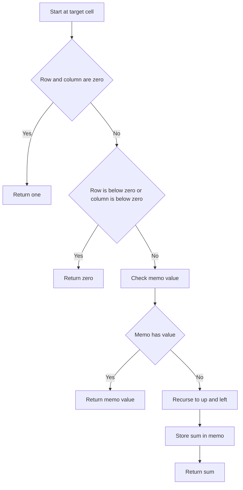

# Dorm Room Paths - Editorial

## Problem Summary

You are given a grid of size `R x C`. Starting from the top-left cell `(0, 0)`, you need to reach the bottom-right cell `(R-1, C-1)`. The only allowed moves are **Right** and **Down**. You need to count the total number of distinct paths to reach the destination.


## Constraints

- `1 <= r, c <= 25`
- Answer fits in 64-bit signed integer
## Real-World Scenario

Imagine a **Robot Vacuum Cleaner** in a rectangular room. It starts at its charging station in one corner and needs to reach a dust bunny in the opposite corner. Due to its simple programming, it only moves forward (Right) or sideways (Down) towards the target, never backtracking. How many different routes can it take?

Another example is **City Navigation** in a grid-like city (like Manhattan). If you are at 1st Ave & 1st St and want to go to 5th Ave & 5th St, and you only walk East and South, how many unique paths can you walk?

## Problem Exploration

### 1. Recursive Structure
To reach the cell `(r, c)`, we must have come from either:
-   The cell above: `(r-1, c)`
-   The cell to the left: `(r, c-1)`

Thus, `paths(r, c) = paths(r-1, c) + paths(r, c-1)`.
This is a classic recursive relation.

### 2. Base Cases
-   If we are at the starting cell `(0, 0)`, there is exactly 1 way to be there (start).
-   Alternatively, if we are in the first row (`r=0`), we can only come from the left.
-   If we are in the first column (`c=0`), we can only come from above.

### 3. Overlapping Subproblems
A naive recursive solution will re-calculate the number of paths for the same cell multiple times. For example, to calculate paths to `(2, 2)`, we need `(1, 2)` and `(2, 1)`. Both of those will eventually ask for `(1, 1)`. This suggests **Memoization** or **Dynamic Programming**.

<!-- mermaid -->


## Approaches

### Approach 1: Naive Recursion (Exponential)

We simply implement the recurrence:
`count(r, c) = count(r-1, c) + count(r, c-1)`
-   **Complexity**: `O(2^R+C)`. This is too slow for `R, C >= 15`.

### Approach 2: Recursion with Memoization (Top-Down DP)

We store the result of `count(r, c)` in a 2D array `memo`. Before computing, we check if `memo[r][c]` is already computed.
-   **Complexity**:
    -   Time: `O(R x C)`. Each state is computed once.
    -   Space: `O(R x C)` for the memoization table + recursion stack.

### Approach 3: Combinatorics (Math)

The total number of steps to take is `(R-1) + (C-1)`. Out of these steps, exactly `R-1` must be "Down" and `C-1` must be "Right". The number of ways is choosing which steps are "Down":

`\binom(R-1) + (C-1)R-1`

-   **Complexity**: `O(R+C)` or `O(1)` depending on implementation.
-   *Note*: The problem specifically asks for "Recursion with Memoization", so we will implement Approach 2, but Approach 3 is good to know for interviews.

## Implementations

### Java
```java
import java.util.*;

class Solution {
    private long[][] memo;

    public long countPaths(int r, int c) {
        memo = new long[r][c];
        for (long[] row : memo) {
            Arrays.fill(row, -1);
        }
        return helper(r - 1, c - 1);
    }

    private long helper(int r, int c) {
        // Base case: Start point
        if (r == 0 && c == 0) return 1;
        
        // Out of bounds
        if (r < 0 || c < 0) return 0;
        
        // Return memoized value
        if (memo[r][c] != -1) return memo[r][c];
        
        // Recursive step
        long paths = helper(r - 1, c) + helper(r, c - 1);
        memo[r][c] = paths;
        return paths;
    }
}


class Main {
    public static void main(String[] args) {
        Scanner sc = new Scanner(System.in);
        int r = sc.nextInt();
        int c = sc.nextInt();
        Solution sol = new Solution();
        System.out.println(sol.countPaths(r, c));
        sc.close();
    }
}
```

### Python
```python
import sys

# Increase recursion depth for deep grids
sys.setrecursionlimit(2000)

def count_paths(r: int, c: int) -> int:
    memo = {}

    def helper(i, j):
        if i == 0 and j == 0:
            return 1
        if i < 0 or j < 0:
            return 0
        
        state = (i, j)
        if state in memo:
            return memo[state]
        
        res = helper(i - 1, j) + helper(i, j - 1)
        memo[state] = res
        return res

    return helper(r - 1, c - 1)


def main():
    import sys
    data = sys.stdin.read().strip().split()
    if not data or len(data) < 2:
        return

    r = int(data[0])
    c = int(data[1])
    print(count_paths(r, c))

if __name__ == "__main__":
    main()
```

### C++
```cpp
#include <iostream>
#include <vector>
using namespace std;

class Solution {
    vector<vector<long long>> memo;
public:
    long long countPaths(int r, int c) {
        memo.assign(r, vector<long long>(c, -1));
        return helper(r - 1, c - 1);
    }

    long long helper(int r, int c) {
        if (r == 0 && c == 0) return 1;
        if (r < 0 || c < 0) return 0;
        
        if (memo[r][c] != -1) return memo[r][c];
        
        return memo[r][c] = helper(r - 1, c) + helper(r, c - 1);
    }
};


int main() {
    ios::sync_with_stdio(false); cin.tie(nullptr);
    int r; cin >> r;
    int c; cin >> c;
    Solution sol;
    cout << sol.countPaths(r, c) << endl;
    return 0;
}
```

### JavaScript
```javascript
class Solution {
  countPaths(r, c) {
    const memo = Array.from({ length: r }, () => Array(c).fill(-1));

    const helper = (i, j) => {
      if (i === 0 && j === 0) return 1;
      if (i < 0 || j < 0) return 0;

      if (memo[i][j] !== -1) return memo[i][j];

      // Use BigInt if numbers might exceed 2^53 - 1, though problem says 64-bit signed int
      // Standard JS numbers are doubles, safe up to 2^53. 
      // For R, C <= 25, result is C(48, 24) which is huge (~3e13), fits in Number.
      memo[i][j] = helper(i - 1, j) + helper(i, j - 1);
      return memo[i][j];
    };

    return helper(r - 1, c - 1);
  }
}


const readline = require('readline');
const rl = readline.createInterface({ input: process.stdin, output: process.stdout });
let tokens = [];
rl.on('line', (line) => { tokens.push(...line.trim().split(/\s+/)); });
rl.on('close', () => {
    if(tokens.length===0) return;
    let ptr = 0;
    const r = parseInt(tokens[ptr++]);
    const c = parseInt(tokens[ptr++]);
    const sol = new Solution();
    console.log(sol.countPaths(r, c));
});
```

## 🧪 Test Case Walkthrough (Dry Run)
**Input:** `2 3` (2 rows, 3 columns)

Target: `(1, 2)` (0-indexed)

1.  `helper(1, 2)` calls `helper(0, 2)` and `helper(1, 1)`.
2.  `helper(0, 2)` calls `helper(-1, 2)` (0) and `helper(0, 1)`.
    -   `helper(0, 1)` calls `helper(-1, 1)` (0) and `helper(0, 0)` (1).
    -   So `helper(0, 1)` returns 1.
    -   `helper(0, 2)` returns 1.
3.  `helper(1, 1)` calls `helper(0, 1)` (memoized 1) and `helper(1, 0)`.
    -   `helper(1, 0)` calls `helper(0, 0)` (1) and `helper(1, -1)` (0).
    -   So `helper(1, 0)` returns 1.
    -   `helper(1, 1)` returns `1 + 1 = 2`.
4.  `helper(1, 2)` returns `1 + 2 = 3`.

**Output:** `3`

## Proof of Correctness

The recurrence `paths(r, c) = paths(r-1, c) + paths(r, c-1)` correctly partitions the set of all paths to `(r, c)` into two disjoint sets: those arriving from the top and those arriving from the left. Since these are the only two valid moves, the sum covers all possibilities. The base case `(0, 0)` correctly initiates the count. Memoization ensures termination and efficiency.

## Interview Extensions

1.  **What if there are obstacles?**
    -   If `grid[r][c]` is an obstacle, return 0 for that cell. The recursion naturally handles this (paths through obstacles become 0).

2.  **Can we optimize space?**
    -   Yes, using Iterative DP (Bottom-Up), we only need the previous row to calculate the current row. Space reduces to `O(C)`.

3.  **What if we can move diagonally?**
    -   Add a term: `helper(r-1, c-1)` to the recurrence.

### Common Mistakes

-   **Off-by-one errors**: Confusing 0-based indexing with 1-based dimensions. The target is `(r-1, c-1)`.
-   **Integer Overflow**: For larger grids (e.g., `30 x 30`), the number of paths exceeds `2^31-1`. Use `long` (Java/C++) or `BigInt` (JS) if necessary, though constraints here say it fits in 64-bit.
-   **Forgetting Base Cases**: Leading to infinite recursion or stack overflow.

## Related Concepts

-   **Dynamic Programming**: This is a standard Grid DP problem.
-   **Pascal's Triangle**: The number of paths to `(r, c)` corresponds to binomial coefficients found in Pascal's Triangle.
