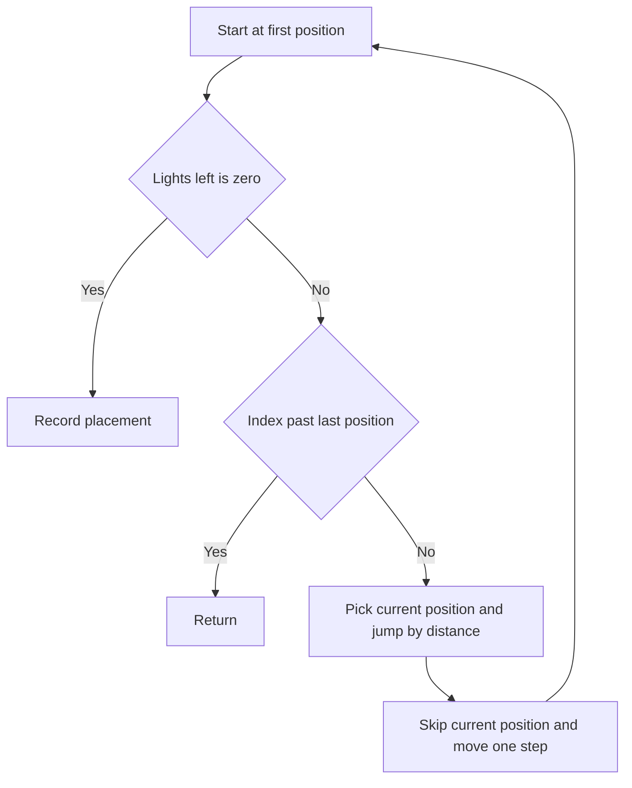

# Campus Lights Placement - Editorial

## Problem Summary

You need to select exactly `k` positions from a range `0` to `n-1` to place lights. The constraint is that any two selected positions must be at least `d` units apart. Specifically, if you select positions `p_1 < p_2 < dots < p_k`, then `p_i+1 - p_i >= d` for all `i`. You need to list all such valid configurations.


## Constraints

- `1 <= n <= 12`
- `0 <= k <= n`
- `0 <= d <= n`
## Real-World Scenario

Think of **Streetlight Installation**. To ensure uniform lighting without waste, city codes might require streetlights to be at least 50 meters apart. If you have a 1km road with potential spots every 10 meters, which combinations of spots satisfy the code?

Another example is **Social Distancing Seating**. In a row of seats, if you seat people, you might require at least 2 empty seats between them. This is exactly the same problem: finding all valid seating arrangements.

## Problem Exploration

### 1. The Constraint
The condition "at least `d` positions apart" means if we pick position `i`, the next position we pick must be `>= i + d`.
*Note*: The problem statement says "absolute difference >= d". For sorted positions `x, y` where `x < y`, this means `y - x >= d`.
Example: If `d=2`, and we pick 0, the next can be 2, 3, 4... (since `2-0 >= 2`). If we pick 0, we cannot pick 1.

### 2. Recursive Structure
We can define a backtracking function `solve(current_pos, count, current_list)`.
-   `current_pos`: The earliest position we can currently consider.
-   `count`: How many lights we have placed so far.
-   `current_list`: The positions chosen so far.

### 3. Transitions
At `current_pos`, we iterate through all possible positions `i` from `current_pos` to `n-1`.
For each `i`:
1.  Add `i` to `current_list`.
2.  Recurse with `solve(i + d, count + 1, current_list)`.
3.  Backtrack (remove `i`).

-   **Include `current_pos`**: Add to list. Recurse to `current_pos + d`.
-   **Exclude `current_pos`**: Don't add. Recurse to `current_pos + 1`.

Both work. The Include/Exclude pattern is often cleaner for "skip" logic.

<!-- mermaid -->


## Approaches

### Approach 1: Backtracking (Combinations Style)
We iterate to find the next valid position.
`backtrack(start_index, k_left)`
-   If `k_left == 0`: Add current combination to results. Return.
-   Loop `i` from `start_index` to `n - 1`:
    -   Pick `i`.
    -   Recurse `backtrack(i + d, k_left - 1)`.
    -   Backtrack.

-   **Complexity**: Roughly `binomNK` but heavily pruned by `d`. With `N <= 12`, this is extremely fast.

### Approach 2: Backtracking (Include/Exclude)
`backtrack(index, k_left)`
-   If `k_left == 0`: Success.
-   If `index >= n`: Fail.
-   **Option 1 (Pick)**: Add `index`. Recurse `backtrack(index + d, k_left - 1)`.
-   **Option 2 (Skip)**: Recurse `backtrack(index + 1, k_left)`.

This approach naturally keeps the output sorted if we explore Option 1 first (actually Option 2 first for lexicographical order of *positions*? No, usually we want `0 2` before `0 3`, so we try picking `0` first).
```
0 2
0 3
1 3
1 4
2 4
```
This order suggests we try to pick the smallest available number first. So "Pick" then "Skip" is the correct order for lexicographical generation of the *sequences*.

## Implementations

### Java
```java
import java.util.*;

class Solution {
    List<List<Integer>> result;
    
    public List<List<Integer>> placeLights(int n, int k, int d) {
        result = new ArrayList<>();
        backtrack(0, 0, n, k, d, new ArrayList<>());
        return result;
    }

    private void backtrack(int start_pos, int lights_placed, int n, int k, int d, List<Integer> current) {
        if (lights_placed == k) {
            result.add(new ArrayList<>(current));
            return;
        }

        int remaining_lights = k - lights_placed;
        int remaining_positions = n - start_pos;
        if (remaining_positions < remaining_lights) return;

        for (int pos = start_pos; pos < n; pos++) {
            if (current.isEmpty() || pos - current.get(current.size() - 1) >= d) {
                current.add(pos);
                backtrack(pos + 1, lights_placed + 1, n, k, d, current);
                current.remove(current.size() - 1);
            }
        }
    }
}

class Main {
    public static void main(String[] args) {
        Scanner sc = new Scanner(System.in);
        if (!sc.hasNextInt()) return;
        int n = sc.nextInt();
        int k = sc.nextInt();
        int d = sc.nextInt();
        
        Solution sol = new Solution();
        List<List<Integer>> res = sol.placeLights(n, k, d);
        if(res.isEmpty()) {
            System.out.println("NONE");
        } else {
            for(List<Integer> row : res) {
                for(int i=0; i<row.size(); i++) {
                    System.out.print(row.get(i) + (i==row.size()-1?"":" "));
                }
                System.out.println();
            }
        }
        sc.close();
    }
}
```

### Python
```python
def place_lights(n: int, k: int, d: int) -> list[list[int]]:
    """
    Find all valid placements of k lights on positions 0 to n-1.
    Any two lights must be at least d positions apart.
    """
    if k == 0:
        return [[]]

    result = []

    def backtrack(start_pos, lights_placed, current_placement):
        # Base case: we've placed all k lights
        if lights_placed == k:
            result.append(current_placement[:])
            return

        # Pruning: not enough remaining positions to place remaining lights
        remaining_lights = k - lights_placed
        remaining_positions = n - start_pos
        if remaining_positions < remaining_lights:
            return

        # Try placing a light at each remaining position
        for pos in range(start_pos, n):
            # Check if we can place a light at this position
            # It must be at least d positions away from the last placed light
            if not current_placement or pos - current_placement[-1] >= d:
                current_placement.append(pos)
                backtrack(pos + 1, lights_placed + 1, current_placement)
                current_placement.pop()

    backtrack(0, 0, [])
    return result

def main():
    import sys
    data = sys.stdin.read().strip().split()
    if not data:
        return
    n, k, d = map(int, data[:3])
    result = place_lights(n, k, d)
    if not result:
        print("NONE")
    else:
        for combo in result:
            print(" ".join(str(x) for x in combo))

if __name__ == "__main__":
    main()
```

### C++
```cpp
#include <iostream>
#include <vector>

using namespace std;

class Solution {
public:
    vector<vector<int>> placeLights(int n, int k, int d) {
        vector<vector<int>> result;
        vector<int> current;
        backtrack(0, 0, n, k, d, current, result);
        return result;
    }

private:
    void backtrack(int start_pos, int lights_placed, int n, int k, int d, vector<int>& current, vector<vector<int>>& result) {
        if (lights_placed == k) {
            result.push_back(current);
            return;
        }

        // Pruning
        int remaining_lights = k - lights_placed;
        int remaining_positions = n - start_pos;
        if (remaining_positions < remaining_lights) return;

        for (int pos = start_pos; pos < n; ++pos) {
            // Check constraint
            if (current.empty() || pos - current.back() >= d) {
                current.push_back(pos);
                // Python: backtrack(pos + 1, ...)
                // But wait, the constraint check handles 'd'.
                // Python loop iterates pos.
                // Constraint `pos - last >= d`.
                // If I place at pos, next recurse must start at pos + 1?
                // Python calls `backtrack(pos + 1, ...)`
                // AND relies on `if not current or pos - current[-1] >= d` check in loop.
                // Correct.
                backtrack(pos + 1, lights_placed + 1, n, k, d, current, result);
                current.pop_back();
            }
        }
    }
};

int main() {
    ios::sync_with_stdio(false); cin.tie(nullptr);
    int n, k, d;
    if (!(cin >> n >> k >> d)) return 0;
    
    Solution sol;
    vector<vector<int>> res = sol.placeLights(n, k, d);
    
    if (res.empty()) {
        cout << "NONE" << endl;
    } else {
        for(const auto& row : res) { 
            for(size_t i=0; i<row.size(); i++) cout << row[i] << (i==row.size()-1?"":" "); 
            cout << endl; 
        }
    }
    return 0;
}
```

### JavaScript
```javascript
const readline = require('readline');
const rl = readline.createInterface({ input: process.stdin, output: process.stdout });
let tokens = [];
rl.on('line', (line) => { tokens.push(...line.trim().split(/\s+/)); });
rl.on('close', () => {
    if(tokens.length===0) return;
    let ptr = 0;
    const n = parseInt(tokens[ptr++]);
    const k = parseInt(tokens[ptr++]);
    const d = parseInt(tokens[ptr++]);
    
    const sol = new Solution();
    const res = sol.placeLights(n, k, d);
    
    if (res.length === 0) {
        console.log("NONE");
    } else {
        res.forEach(row => console.log(row.join(' ')));
    }
});

class Solution {
    placeLights(n, k, d) {
        const result = [];
        
        const backtrack = (start_pos, lights_placed, current) => {
            if (lights_placed === k) {
                result.push([...current]);
                return;
            }
            
            const remaining_lights = k - lights_placed;
            const remaining_positions = n - start_pos;
            if (remaining_positions < remaining_lights) return;
            
            for (let pos = start_pos; pos < n; pos++) {
                if (current.length === 0 || pos - current[current.length - 1] >= d) {
                    current.push(pos);
                    backtrack(pos + 1, lights_placed + 1, current);
                    current.pop();
                }
            }
        };
        
        backtrack(0, 0, []);
        return result;
    }
}
```

## 🧪 Test Case Walkthrough (Dry Run)
**Input:** `5 2 2`

1.  `solve(0, 2, [])`
    -   **Pick 0**: `solve(2, 1, [0])` (Next allowed is `0+2=2`)
        -   **Pick 2**: `solve(4, 0, [0, 2])` -> **Found `[0, 2]`**
        -   **Skip 2**: `solve(3, 1, [0])`
            -   **Pick 3**: `solve(5, 0, [0, 3])` -> **Found `[0, 3]`**
            -   **Skip 3**: `solve(4, 1, [0])`
                -   **Pick 4**: `solve(6, 0, [0, 4])` -> **Found `[0, 4]`**
                -   **Skip 4**: `solve(5, 1, [0])` -> Fail.
    -   **Skip 0**: `solve(1, 2, [])`
        -   **Pick 1**: `solve(3, 1, [1])`
            -   **Pick 3**: `solve(5, 0, [1, 3])` -> **Found `[1, 3]`**
            -   **Skip 3**: `solve(4, 1, [1])`
                -   **Pick 4**: `solve(6, 0, [1, 4])` -> **Found `[1, 4]`**
                -   **Skip 4**: Fail.
        -   **Skip 1**: `solve(2, 2, [])`
            -   **Pick 2**: `solve(4, 1, [2])`
                -   **Pick 4**: `solve(6, 0, [2, 4])` -> **Found `[2, 4]`**
                -   **Skip 4**: Fail.
            -   **Skip 2**: `solve(3, 2, [])` -> Fail (not enough space).

**Output:**
`0 2`, `0 3`, `0 4`, `1 3`, `1 4`, `2 4`.

**Note:** The problem statement's example output lists 5 pairs, omitting `0 4`. However, `0` and `4` are separated by 4 units, which satisfies `d=2`. Thus, `0 4` is a valid configuration and is included here for completeness.

## Proof of Correctness

The algorithm systematically explores the decision tree:
1.  **Completeness**: At every step, we either pick the current spot or skip it. This covers all subsets.
2.  **Validity**: We only pick a spot if it satisfies the distance constraint relative to the *previous* spot (enforced by jumping `index + d`). Since we build the set in increasing order, satisfying the constraint for the immediate neighbor `(p_i, p_i+1)` automatically satisfies it for any `(p_i, p_j)` where `j > i`, because `p_j - p_i = (p_j - p_j-1) + dots + (p_i+1 - p_i) >= d + dots + d >= d`.
3.  **Termination**: We stop when `k` lights are placed.

## Interview Extensions

1.  **Maximize k?**
    -   This becomes a greedy problem. Always pick the first available spot. `0, d, 2d, dots`.

2.  **Circular arrangement?**
    -   Check distance between last and first: `(n-1) - p_last + p_first + 1 >= d`? Or simply `n - (p_last - p_first) >= d`?
    -   Usually handled by fixing the first element and solving linear, or iterating valid start positions.

### Common Mistakes

-   **Off-by-one**: Jumping to `index + d - 1` or `index + d + 1`. If `d=2` and we pick 0, we can pick 2. So jump is `+d`.
-   **Output Format**: Ensure space-separated integers.

## Related Concepts

-   **Backtracking**: Core technique.
-   **Independent Set**: On a path graph.
