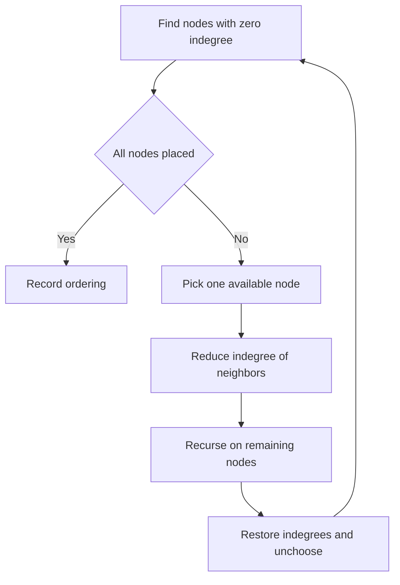

# Campus Course Ordering - Editorial

## Problem Summary

You are given `n` courses and a list of prerequisites. If course `u` is a prerequisite for `v`, you must take `u` before `v`. You need to find **all possible valid sequences** (topological sorts) of taking all `n` courses.


## Constraints

- `1 <= n <= 8`
- `0 <= m <= 15`
- Course IDs are in `[0, n-1]`
## Real-World Scenario

Imagine **University Degree Planning**. You have a set of core courses. "Intro to CS" must be taken before "Data Structures", and "Calculus I" before "Calculus II". However, "History" and "Art" have no prerequisites relative to each other. You want to see every possible schedule that satisfies the rules so you can choose the one that fits your lifestyle best.

## Problem Exploration

### 1. Topological Sort
This is the classic definition of Topological Sort on a Directed Acyclic Graph (DAG).
-   Nodes: Courses.
-   Edges: Prerequisite `u -> v`.
-   A valid ordering is a linear arrangement of vertices such that for every edge `u -> v`, `u` comes before `v`.

### 2. Kahn's Algorithm (Modified)
Standard Kahn's algorithm finds *one* topological sort using indegrees.
-   Calculate indegree of all nodes.
-   Put all nodes with `indegree == 0` into a queue.
-   While queue not empty:
    -   Pop `u`. Add to result.
    -   Decrease indegree of neighbors. If neighbor becomes 0, add to queue.

To find **all** topological sorts, we can use backtracking with the same logic.
Instead of a queue, at each step of the recursion, we can pick **any** node that currently has `indegree == 0` and has not been visited yet.

### 3. Backtracking Strategy
`backtrack(current_path, current_indegrees)`
-   If `current_path` length is `n`: We found a valid sort. Add to results.
-   Iterate through all nodes `i` from `0` to `n-1`.
-   If `indegree[i] == 0` and `!visited[i]`:
    -   **Choose**: Add `i` to path. Mark visited. Decrease indegree of neighbors.
    -   **Recurse**: `backtrack(...)`
    -   **Unchoose (Backtrack)**: Remove `i`. Unmark visited. Increase indegree of neighbors (restore state).

<!-- mermaid -->


## Approaches

### Approach 1: Backtracking with Indegree Array
We maintain the dynamic state of indegrees.
-   **Complexity**: `O(N! * (N+M))`. In the worst case (no edges), there are `N!` permutations. With `N <= 8`, `8! = 40,320`, which is small enough.
-   **Output Order**: To ensure lexicographical order of permutations, we should iterate nodes `0` to `n-1` at each step.

## Implementations

### Java
```java
import java.util.*;

class Solution {
    public List<Integer> findOrder(int n, int[][] edges) {
        List<List<Integer>> adj = new ArrayList<>();
        for (int i = 0; i < n; i++) adj.add(new ArrayList<>());
        int[] inDegree = new int[n];

        for (int[] edge : edges) {
            adj.get(edge[0]).add(edge[1]);
            inDegree[edge[1]]++;
        }

        Queue<Integer> q = new LinkedList<>();
        for (int i = 0; i < n; i++) {
            if (inDegree[i] == 0) {
                q.offer(i);
            }
        }

        List<Integer> result = new ArrayList<>();
        while (!q.isEmpty()) {
            int u = q.poll();
            result.add(u);

            for (int v : adj.get(u)) {
                inDegree[v]--;
                if (inDegree[v] == 0) {
                    q.offer(v);
                }
            }
        }

        if (result.size() == n) {
            return result;
        } else {
            return new ArrayList<>();
        }
    }
}

class Main {
    public static void main(String[] args) {
        Scanner sc = new Scanner(System.in);
        if (!sc.hasNextInt()) return;
        int n = sc.nextInt();
        int m = sc.nextInt();
        
        int[][] edges = new int[m][2];
        for(int i=0; i<m; i++) {
            edges[i][0] = sc.nextInt();
            edges[i][1] = sc.nextInt();
        }
        
        Solution sol = new Solution();
        List<Integer> res = sol.findOrder(n, edges);
        if(res.isEmpty()) {
            System.out.println("IMPOSSIBLE");
        } else {
            for(int i=0; i<res.size(); i++) {
                System.out.print(res.get(i) + (i==res.size()-1?"":" "));
            }
            System.out.println();
        }
        sc.close();
    }
}
```

### Python
```python
def find_topological_order(n: int, edges: list[tuple[int, int]]) -> list[int]:
    """
    Find a topological ordering of courses using Kahn's algorithm.
    edges contains (u, v) meaning course u must come before course v.
    Returns a valid ordering or empty list if a cycle exists (IMPOSSIBLE).
    """
    from collections import deque

    # Build adjacency list and in-degree count
    graph = [[] for _ in range(n)]
    in_degree = [0] * n

    for u, v in edges:
        graph[u].append(v)
        in_degree[v] += 1

    # Initialize queue with all nodes having in-degree 0
    queue = deque()
    for i in range(n):
        if in_degree[i] == 0:
            queue.append(i)

    result = []

    while queue:
        # Process the node with smallest index (lexicographic order)
        node = queue.popleft()
        result.append(node)

        # Reduce in-degree for all neighbors
        for neighbor in graph[node]:
            in_degree[neighbor] -= 1
            if in_degree[neighbor] == 0:
                queue.append(neighbor)

    # If we processed all nodes, we have a valid ordering
    if len(result) == n:
        return result
    else:
        return []  # Cycle detected

def main():
    import sys
    lines = sys.stdin.read().strip().split('\n')
    if not lines:
        return

    first = lines[0].split()
    n = int(first[0])
    m = int(first[1])

    edges = []
    for i in range(1, 1 + m):
        if i < len(lines):
            parts = lines[i].split()
            u, v = int(parts[0]), int(parts[1])
            edges.append((u, v))

    result = find_topological_order(n, edges)
    if not result:
        print("IMPOSSIBLE")
    else:
        print(" ".join(str(x) for x in result))

if __name__ == "__main__":
    main()
```

### C++
```cpp
#include <iostream>
#include <vector>
#include <queue>
#include <algorithm>

using namespace std;

class Solution {
public:
    vector<int> findOrder(int n, const vector<pair<int, int>>& edges) {
        vector<vector<int>> adj(n);
        vector<int> inDegree(n, 0);

        for (const auto& edge : edges) {
            adj[edge.first].push_back(edge.second);
            inDegree[edge.second]++;
        }

        // Use Queue for standard Kahn's BFS (matches Python logic)
        queue<int> q;
        for (int i = 0; i < n; i++) {
            if (inDegree[i] == 0) {
                q.push(i);
            }
        }

        vector<int> result;
        while (!q.empty()) {
            int u = q.front();
            q.pop();
            result.push_back(u);

            for (int v : adj[u]) {
                inDegree[v]--;
                if (inDegree[v] == 0) {
                    q.push(v);
                }
            }
        }

        if (result.size() == n) {
            return result;
        } else {
            return {}; // IMPOSSIBLE
        }
    }
};

int main() {
    ios::sync_with_stdio(false); cin.tie(nullptr);
    int n, m;
    if (!(cin >> n >> m)) return 0;

    vector<pair<int, int>> edges(m);
    for(int i=0; i<m; i++) {
        cin >> edges[i].first >> edges[i].second;
    }

    Solution sol;
    vector<int> res = sol.findOrder(n, edges);
    if (res.empty()) {
        cout << "IMPOSSIBLE" << endl;
    } else {
        for (size_t i = 0; i < res.size(); i++) {
            cout << res[i] << (i == res.size() - 1 ? "" : " ");
        }
        cout << endl;
    }
    return 0;
}
```

### JavaScript
```javascript
const readline = require('readline');
const rl = readline.createInterface({ input: process.stdin, output: process.stdout });
let tokens = [];
rl.on('line', (line) => { tokens.push(...line.trim().split(/\s+/)); });
rl.on('close', () => {
    if(tokens.length===0) return;
    let ptr = 0;
    const n = parseInt(tokens[ptr++]);
    const m = parseInt(tokens[ptr++]);
    
    const edges = [];
    for(let i=0; i<m; i++) {
        edges.push([parseInt(tokens[ptr++]), parseInt(tokens[ptr++])]);
    }
    
    const sol = new Solution();
    const res = sol.findOrder(n, edges);
    if (res.length === 0) {
        console.log("IMPOSSIBLE");
    } else {
        console.log(res.join(" "));
    }
});

class Solution {
    findOrder(n, edges) {
        const adj = Array.from({length: n}, () => []);
        const inDegree = Array(n).fill(0);
        
        for(let [u, v] of edges) {
            adj[u].push(v);
            inDegree[v]++;
        }
        
        const q = []; // Simple array as Queue
        for(let i=0; i<n; i++) {
            if(inDegree[i] === 0) q.push(i);
        }
        
        const result = [];
        let head = 0; // Pointer for queue for O(1) dequeue effect
        
        while(head < q.length) {
            const u = q[head++];
            result.push(u);
            
            for(let v of adj[u]) {
                inDegree[v]--;
                if(inDegree[v] === 0) q.push(v);
            }
        }
        
        if (result.length === n) return result;
        return [];
    }
}
```

## 🧪 Test Case Walkthrough (Dry Run)
**Input:** `3 2`, Edges `0->1`, `0->2`

1.  **Indegrees**: `0:0`, `1:1`, `2:1`.
2.  `backtrack([])`:
    -   Available (indegree 0): `0`.
    -   **Pick 0**: Path `[0]`.
        -   Update neighbors: `1` (indegree 1->0), `2` (indegree 1->0).
        -   `backtrack([0])`:
            -   Available: `1`, `2`.
            -   **Pick 1**: Path `[0, 1]`.
                -   `backtrack([0, 1])`:
                    -   Available: `2`.
                    -   **Pick 2**: Path `[0, 1, 2]`.
                        -   Found `[0, 1, 2]`.
            -   **Pick 2**: Path `[0, 2]`.
                -   `backtrack([0, 2])`:
                    -   Available: `1`.
                    -   **Pick 1**: Path `[0, 2, 1]`.
                        -   Found `[0, 2, 1]`.

**Result:**
`0 1 2`
`0 2 1`

## Proof of Correctness

The algorithm explores the state space of all valid topological sorts.
-   **Validity**: At each step, we only pick a node with `indegree == 0`, ensuring all its prerequisites have been satisfied (visited).
-   **Completeness**: We iterate through *all* currently available nodes, branching to find all possible valid sequences.
-   **Termination**: Each step adds a node. Stops at depth `n`.

## Interview Extensions

1.  **Detect Cycle?**
    -   If the recursion finishes but `path.size() < n`, a cycle exists (or simply if at some step `path.size() < n` but no node has `indegree == 0`).
2.  **Count only?**
    -   Use DP with bitmask `dp[mask]` = number of ways to order the subset `mask`. `O(2^n * n)`.

### Common Mistakes

-   **Modifying Indegree**: Forgetting to restore `indegree` values during backtracking.
-   **Visited Array**: Necessary to distinguish between "indegree 0 because processed" and "indegree 0 because available". Or just check if node is in current path.
