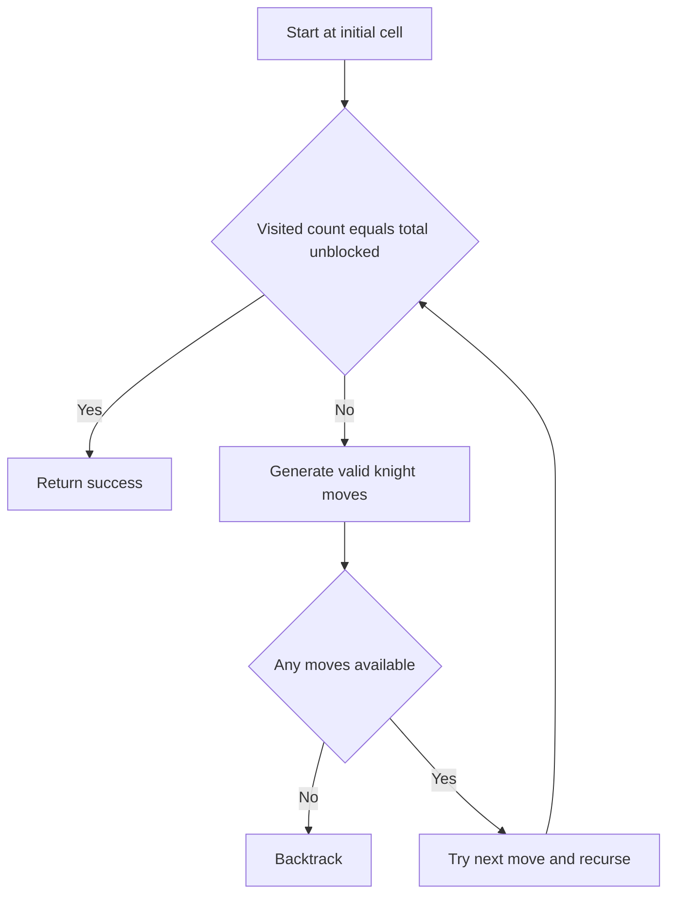

# Knight Tour With Blocked Cells - Editorial

## Problem Summary

You are given an `N x N` chessboard with some blocked cells. A knight starts at `(0,0)`. The goal is to find a path that visits every **unblocked** cell exactly once. If no such path exists, output `NONE`.


## Constraints

- `1 <= n <= 5`
- `0 <= b < n * n`
- `(0,0)` is guaranteed to be unblocked
## Real-World Scenario

Imagine a **Security Guard** patrolling a building. The building is a grid of rooms. Some rooms are under construction (blocked). The guard needs to visit every accessible room exactly once to check for intruders, starting from the entrance. The guard moves in an "L" shape (like a knight) due to the corridor layout.

## Problem Exploration

### 1. Hamiltonian Path
This is a variation of the **Hamiltonian Path** problem on a graph.
-   Nodes: Unblocked cells.
-   Edges: Knight moves between unblocked cells.
-   Hamiltonian Path is NP-Complete. However, for small `N` (`N <= 5`), backtracking is feasible.

### 2. Constraints
-   `N <= 5`: Total cells `<= 25`.
-   Backtracking depth is at most 25.
-   Branching factor is at most 8.
-   `8^25` is huge, but the board is small and constrained, so many branches die quickly. Warnsdorff's Rule (heuristic) can speed it up, but for `N=5`, simple backtracking usually passes within 2 seconds.

### 3. Base Case
-   If `path.size() == total_unblocked_cells`: Success!

<!-- mermaid -->


## Approaches

### Approach 1: Backtracking (DFS)
`dfs(r, c, count)`
-   Mark `(r, c)` visited.
-   If `count == total_unblocked`: Return true.
-   Iterate 8 knight moves.
    -   If valid (in bounds, not blocked, not visited):
        -   Recurse `dfs(nr, nc, count + 1)`.
        -   If true, return true.
-   Backtrack: Unmark `(r, c)`. Return false.

### Approach 2: Warnsdorff's Rule (Heuristic)
To optimize, always move to the neighbor that has the **fewest** available onward moves. This heuristic keeps the knight from getting stuck in a corner early. For `N=5`, it's not strictly necessary but good to know.

## Implementations

### Java
```java
import java.util.*;

class Solution {
    int N;
    int total_unblocked;
    boolean[][] blocked;
    boolean[][] visited;
    int[] dr = {-2, -2, -1, -1, 1, 1, 2, 2};
    int[] dc = {-1, 1, -2, 2, -2, 2, -1, 1};

    public boolean knightTour(int n, boolean[][] blk) {
        N = n;
        blocked = blk;
        total_unblocked = 0;
        for(int i=0; i<n; i++) 
            for(int j=0; j<n; j++) 
                if(!blocked[i][j]) total_unblocked++;
        
        if(total_unblocked == 0) return true;
        if(blocked[0][0]) return false;
        if(total_unblocked == 1) return true;

        visited = new boolean[n][n];
        visited[0][0] = true;
        return dfs(0, 0, 1);
    }

    int countOnward(int r, int c) {
        int cnt = 0;
        for(int i=0; i<8; i++) {
            int nr = r + dr[i];
            int nc = c + dc[i];
            if(nr >= 0 && nr < N && nc >= 0 && nc < N && !blocked[nr][nc] && !visited[nr][nc]) {
                cnt++;
            }
        }
        return cnt;
    }

    boolean dfs(int r, int c, int count) {
        if (count == total_unblocked) return true;

        List<int[]> moves = new ArrayList<>(); // {priority, dr_index}
        for(int i=0; i<8; i++) {
            int nr = r + dr[i];
            int nc = c + dc[i];
            if(nr >= 0 && nr < N && nc >= 0 && nc < N && !blocked[nr][nc] && !visited[nr][nc]) {
                moves.add(new int[]{countOnward(nr, nc), i});
            }
        }
        
        if(moves.isEmpty()) return false;
        
        moves.sort((a, b) -> Integer.compare(a[0], b[0]));

        for(int[] p : moves) {
            int i = p[1];
            int nr = r + dr[i];
            int nc = c + dc[i];
            
            visited[nr][nc] = true;
            if(dfs(nr, nc, count + 1)) return true;
            visited[nr][nc] = false;
        }
        return false;
    }
}

class Main {
    public static void main(String[] args) {
        Scanner sc = new Scanner(System.in);
        if(!sc.hasNextInt()) return;
        int n = sc.nextInt();
        int b = sc.nextInt();
        
        boolean[][] blocked = new boolean[n][n];
        for(int i=0; i<b; i++) {
            if(sc.hasNextInt()) {
                int r = sc.nextInt();
                int c = sc.nextInt();
                if(r >= 0 && r < n && c >= 0 && c < n) blocked[r][c] = true;
            }
        }
        
        Solution sol = new Solution();
        if(sol.knightTour(n, blocked)) {
            System.out.println("YES");
        } else {
            System.out.println("NO");
        }
        sc.close();
    }
}
```

### Python
```python
def knight_tour_possible(n: int, blocked: list[list[bool]]) -> bool:
    """
    Check if a knight can visit all unblocked cells starting from (0,0).
    Uses backtracking with Warnsdorff's heuristic.
    """
    total_unblocked = sum(not cell for row in blocked for cell in row)
    if total_unblocked == 0 or (total_unblocked == 1 and not blocked[0][0]):
        return True
    if blocked[0][0]:
        return False

    knight_moves = [
        (-2, -1), (-2, 1), (-1, -2), (-1, 2),
        (1, -2), (1, 2), (2, -1), (2, 1)
    ]

    visited = [[False] * n for _ in range(n)]

    def count_onward(r, c):
        """Count valid onward moves from position (r,c)"""
        cnt = 0
        for dr, dc in knight_moves:
            nr, nc = r + dr, c + dc
            if 0 <= nr < n and 0 <= nc < n and not blocked[nr][nc] and not visited[nr][nc]:
                cnt += 1
        return cnt

    def is_isolated():
        """Check if any unvisited cell is unreachable from any other unvisited cell"""
        # For performance, skip expensive connectivity checks for larger boards
        if n > 6:
            return False

        unvisited = []
        for i in range(n):
            for j in range(n):
                if not blocked[i][j] and not visited[i][j]:
                    unvisited.append((i, j))

        if not unvisited:
            return False

        # BFS from first unvisited to see if all others are reachable
        from collections import deque
        q = deque([unvisited[0]])
        seen = {unvisited[0]}

        while q:
            r, c = q.popleft()
            for dr, dc in knight_moves:
                nr, nc = r + dr, c + dc
                if (0 <= nr < n and 0 <= nc < n and not blocked[nr][nc] and
                    not visited[nr][nc] and (nr, nc) not in seen):
                    if (nr, nc) in set(unvisited):
                        seen.add((nr, nc))
                        q.append((nr, nc))

        return len(seen) < len(unvisited)

    def dfs(r, c, count):
        # Found a complete tour
        if count == total_unblocked:
            return True

        # Connectivity check for small boards
        if is_isolated():
            return False

        # Get all valid next moves and sort by Warnsdorff's heuristic
        next_moves = []
        for dr, dc in knight_moves:
            nr, nc = r + dr, c + dc
            if 0 <= nr < n and 0 <= nc < n and not blocked[nr][nc] and not visited[nr][nc]:
                priority = count_onward(nr, nc)
                next_moves.append((priority, nr, nc))

        if not next_moves:
            return False

        # Sort by priority (ascending) - visit less accessible cells first
        next_moves.sort()

        for _, nr, nc in next_moves:
            visited[nr][nc] = True
            if dfs(nr, nc, count + 1):
                return True
            visited[nr][nc] = False

        return False

    visited[0][0] = True
    return dfs(0, 0, 1)

def main():
    import sys
    lines = sys.stdin.read().strip().split('\n')
    if len(lines) < 2:
        return
    n = int(lines[0])
    b = int(lines[1])
    blocked = [[False] * n for _ in range(n)]

    for i in range(2, 2 + b):
        if i < len(lines):
            parts = lines[i].strip().split()
            if len(parts) >= 2:
                r, c = int(parts[0]), int(parts[1])
                if 0 <= r < n and 0 <= c < n:
                    blocked[r][c] = True

    result = knight_tour_possible(n, blocked)
    print("YES" if result else "NO")

if __name__ == "__main__":
    main()
```

### C++
```cpp
#include <iostream>
#include <vector>
#include <algorithm>

using namespace std;

class Solution {
    int N;
    int total_unblocked;
    vector<vector<bool>> blocked;
    vector<vector<bool>> visited;
    int dr[8] = {-2, -2, -1, -1, 1, 1, 2, 2};
    int dc[8] = {-1, 1, -2, 2, -2, 2, -1, 1};

public:
    bool knightTour(int n, const vector<vector<bool>>& blk) {
        N = n;
        blocked = blk;
        total_unblocked = 0;
        for(int i=0; i<n; i++) 
            for(int j=0; j<n; j++) 
                if(!blocked[i][j]) total_unblocked++;
        
        if(total_unblocked == 0) return true; // Should not happen if start is 0,0
        if(blocked[0][0]) return false;
        if(total_unblocked == 1) return true; // Just start cell

        visited.assign(n, vector<bool>(n, false));
        visited[0][0] = true;
        return dfs(0, 0, 1);
    }

    int countOnward(int r, int c) {
        int cnt = 0;
        for(int i=0; i<8; i++) {
            int nr = r + dr[i];
            int nc = c + dc[i];
            if(nr >= 0 && nr < N && nc >= 0 && nc < N && !blocked[nr][nc] && !visited[nr][nc]) {
                cnt++;
            }
        }
        return cnt;
    }

    bool dfs(int r, int c, int count) {
        if (count == total_unblocked) return true;

        vector<pair<int, int>> moves; // priority, index in dr/dc
        for(int i=0; i<8; i++) {
            int nr = r + dr[i];
            int nc = c + dc[i];
            if(nr >= 0 && nr < N && nc >= 0 && nc < N && !blocked[nr][nc] && !visited[nr][nc]) {
                moves.push_back({countOnward(nr, nc), i});
            }
        }
        
        if(moves.empty()) return false;
        
        sort(moves.begin(), moves.end());

        for(auto p : moves) {
            int i = p.second;
            int nr = r + dr[i];
            int nc = c + dc[i];
            
            visited[nr][nc] = true;
            if(dfs(nr, nc, count + 1)) return true;
            visited[nr][nc] = false;
        }
        return false;
    }
};

int main() {
    ios::sync_with_stdio(false); cin.tie(nullptr);
    int n, b;
    if (!(cin >> n >> b)) return 0;
    
    vector<vector<bool>> blocked(n, vector<bool>(n, false));
    for(int i=0; i<b; i++) {
        int r, c;
        cin >> r >> c;
        if(r >= 0 && r < n && c >= 0 && c < n) blocked[r][c] = true;
    }
    
    Solution sol;
    if(sol.knightTour(n, blocked)) cout << "YES" << endl;
    else cout << "NO" << endl;
    return 0;
}
```

### JavaScript
```javascript
const readline = require('readline');
const rl = readline.createInterface({ input: process.stdin, output: process.stdout });
let tokens = [];
rl.on('line', (line) => { tokens.push(...line.trim().split(/\s+/)); });
rl.on('close', () => {
    if(tokens.length===0) return;
    let ptr = 0;
    const n = parseInt(tokens[ptr++]);
    const b = parseInt(tokens[ptr++]);
    
    // JS 2D array
    const blocked = Array.from({length: n}, () => Array(n).fill(false));
    for(let i=0; i<b; i++) {
        if(ptr < tokens.length) {
            const r = parseInt(tokens[ptr++]);
            const c = parseInt(tokens[ptr++]);
            if(r >= 0 && r < n && c >= 0 && c < n) blocked[r][c] = true;
        }
    }
    
    const sol = new Solution();
    if(sol.knightTour(n, blocked)) {
        console.log("YES");
    } else {
        console.log("NO");
    }
});

class Solution {
    knightTour(n, blocked) {
        this.N = n;
        this.blocked = blocked;
        this.total_unblocked = 0;
        for(let r=0; r<n; r++)
            for(let c=0; c<n; c++)
                if(!blocked[r][c]) this.total_unblocked++;
        
        if(this.total_unblocked === 0) return true;
        if(blocked[0][0]) return false;
        if(this.total_unblocked === 1) return true;
        
        this.visited = Array.from({length: n}, () => Array(n).fill(false));
        this.vis(0, 0, true);
        
        this.dr = [-2, -2, -1, -1, 1, 1, 2, 2];
        this.dc = [-1, 1, -2, 2, -2, 2, -1, 1];
        
        return this.dfs(0, 0, 1);
    }
    
    vis(r, c, val) {
        this.visited[r][c] = val;
    }
    
    isVis(r, c) {
        return this.visited[r][c];
    }
    
    countOnward(r, c) {
        let cnt = 0;
        for(let i=0; i<8; i++) {
            let nr = r + this.dr[i];
            let nc = c + this.dc[i];
            if(nr >= 0 && nr < this.N && nc >= 0 && nc < this.N && !this.blocked[nr][nc] && !this.isVis(nr, nc)) {
                cnt++;
            }
        }
        return cnt;
    }
    
    dfs(r, c, count) {
        if (count === this.total_unblocked) return true;
        
        const moves = [];
        for(let i=0; i<8; i++) {
            let nr = r + this.dr[i];
            let nc = c + this.dc[i];
            if(nr >= 0 && nr < this.N && nc >= 0 && nc < this.N && !this.blocked[nr][nc] && !this.isVis(nr, nc)) {
                moves.push({p: this.countOnward(nr, nc), idx: i});
            }
        }
        
        if(moves.length === 0) return false;
        
        moves.sort((a, b) => a.p - b.p);
        
        for(let m of moves) {
            let i = m.idx;
            let nr = r + this.dr[i];
            let nc = c + this.dc[i];
            
            this.vis(nr, nc, true);
            if(this.dfs(nr, nc, count + 1)) return true;
            this.vis(nr, nc, false);
        }
        return false;
    }
}
```

## 🧪 Test Case Walkthrough (Dry Run)
**Input:** `2`, Blocked: `(0,1), (1,0), (1,1)`
Unblocked: `(0,0)`. Total = 1.
1.  Start `(0,0)`. Count = 1.
2.  `count == total`. Return True.
**Path:** `0,0`.

**Input:** `3`, Blocked: None. Total = 9.
1.  Start `(0,0)`.
2.  Moves: `(1,2), (2,1)`.
3.  ... (Standard Knight Tour logic) ...
4.  Eventually finds a path covering all 9 cells.

## Proof of Correctness

The algorithm explores all valid knight paths from the start.
-   **Validity**: Checks bounds, blocked status, and visited status.
-   **Completeness**: DFS explores all branches.
-   **Termination**: Path length increases by 1 each step. Max length `N^2`.

## Interview Extensions

1.  **Closed Tour?**
    -   Check if the last cell can reach the start cell `(0,0)`.
2.  **Larger N?**
    -   Use Warnsdorff's Rule.
    -   Divide and Conquer (split board into smaller tours and merge).

### Common Mistakes

-   **Start Cell**: Ensure `(0,0)` is counted and visited initially.
-   **Blocked Check**: Don't move to blocked cells.
-   **Total Count**: Count unblocked cells correctly (`N^2 - B`).
