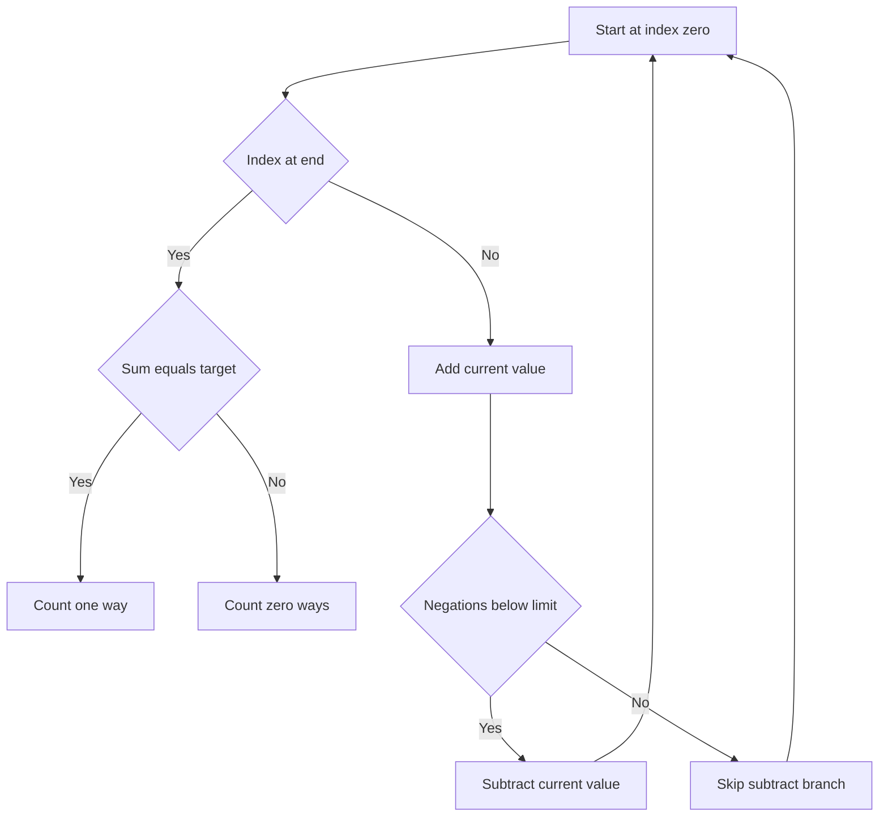

# Target Sum With Limited Negations - Editorial

## Problem Summary

You are given an array of integers `nums`. You need to assign a sign (`+` or `-`) to each integer such that the sum of the resulting values equals `target`. However, there is a constraint: you can use the `-` sign at most `K` times. Return the number of ways to achieve the target.


## Constraints

- `1 <= n <= 20`
- `0 <= K <= n`
- `|nums[i]| <= 20`
- `|target| <= 10^9`
## Real-World Scenario

Imagine **Budget Balancing**. You have a list of potential expenses and incomes. By default, everything is an income (+). You can choose to classify at most `K` items as expenses (-) to make your final balance exactly `target`.

## Problem Exploration

### 1. Relation to Subset Sum
Let `P` be the set of numbers assigned `+`, and `N` be the set of numbers assigned `-`.
Sum = `sum P - sum N = target`.
We also know `sum P + sum N = sum_all nums = S`.
Adding equations: `2 sum P = S + target`.
So `sum P = (S + target) / 2`.
This transforms the standard Target Sum problem into finding a subset `P` with a specific sum.
However, we have an additional constraint: `|N| <= K`.
This means we need to pick a subset `N` (the negated numbers) such that:
1.  Sum of `N` is `(S - target) / 2`.
2.  Size of `N` is `<= K`.

### 2. Recursive Structure
We can stick to the original formulation for backtracking:
`solve(index, current_sum, negations_count)`
-   **Base Case**:
    -   If `index == n`: Return 1 if `current_sum == target`, else 0.
-   **Transitions**:
    -   **Add (+)**: `solve(index + 1, current_sum + nums[index], negations_count)`
    -   **Subtract (-)**: Only if `negations_count < K`. `solve(index + 1, current_sum - nums[index], negations_count + 1)`

<!-- mermaid -->


### 3. Constraints
-   `N <= 20`: `2^20 ~= 10^6`. This is small enough for pure recursion without memoization.
-   If `N` were larger (e.g., 100), we would need DP: `dp[index][current_sum][negations_count]`.

## Approaches

### Approach 1: Pure Backtracking
Since `N` is small, we explore the decision tree.
At each step, try adding `nums[i]` and subtracting `nums[i]` (if allowed).
Sum up the valid paths.

### Approach 2: Meet-in-the-middle (Optimization)
Split array into two halves. Generate all `(sum, negation_count)` pairs for both halves. Combine them. This reduces complexity to `O(2^N/2)`. Not needed for `N=20`.

## Implementations

### Java
```java
import java.util.*;

class Solution {
    int N, K, Target;
    List<Integer> Nums;
    Map<String, Boolean> memo;

    public boolean countAssignments(List<Integer> nums, int k, int target) {
        Nums = nums;
        N = nums.size();
        K = k;
        Target = target;
        memo = new HashMap<>();
        return backtrack(0, 0, 0);
    }

    private boolean backtrack(int index, long current_sum, int negations) {
        if (index == N) return current_sum == Target;

        String key = index + "," + current_sum + "," + negations;
        if (memo.containsKey(key)) return memo.get(key);

        // Positive
        if (backtrack(index + 1, current_sum + Nums.get(index), negations)) {
            memo.put(key, true);
            return true;
        }

        // Negative
        if (negations < K) {
            if (backtrack(index + 1, current_sum - Nums.get(index), negations + 1)) {
                memo.put(key, true);
                return true;
            }
        }

        memo.put(key, false);
        return false;
    }
}

class Main {
    public static void main(String[] args) {
        Scanner sc = new Scanner(System.in);
        if(!sc.hasNextInt()) return;
        int n = sc.nextInt();
        int k = sc.nextInt();
        int target = sc.nextInt();
        
        List<Integer> nums = new ArrayList<>();
        for(int i=0; i<n; i++) nums.add(sc.nextInt());
        
        Solution sol = new Solution();
        if(sol.countAssignments(nums, k, target)) {
            System.out.println("YES");
        } else {
            System.out.println("NO");
        }
        sc.close();
    }
}
```

### Python
```python
def can_achieve_target(nums: list[int], K: int, target: int) -> bool:
    n = len(nums)
    memo = {}

    def backtrack(index, current_sum, negations):
        if index == n:
            return current_sum == target
        if (index, current_sum, negations) in memo:
            return memo[(index, current_sum, negations)]
        
        if backtrack(index + 1, current_sum + nums[index], negations):
            memo[(index, current_sum, negations)] = True
            return True
        if negations < K and backtrack(index + 1, current_sum - nums[index], negations + 1):
            memo[(index, current_sum, negations)] = True
            return True
        memo[(index, current_sum, negations)] = False
        return False

    return backtrack(0, 0, 0)

def main():
    import sys
    lines = sys.stdin.read().strip().split('\n')
    if len(lines) < 2:
        return
    first_line = lines[0].split()
    n = int(first_line[0])
    K = int(first_line[1])
    target = int(first_line[2])
    nums = list(map(int, lines[1].split()))
    result = can_achieve_target(nums, K, target)
    print("YES" if result else "NO")

if __name__ == "__main__":
    main()
```

### C++
```cpp
#include <iostream>
#include <vector>
#include <numeric>
#include <map>

using namespace std;

class Solution {
    int N;
    int K;
    int Target;
    map<pair<int, pair<int, int>>, bool> memo;
    vector<int> Nums;

public:
    bool countAssignments(const vector<int>& nums, int k, int target) {
        Nums = nums;
        N = nums.size();
        K = k;
        Target = target;
        memo.clear();
        return backtrack(0, 0, 0);
    }

    bool backtrack(int index, long long current_sum, int negations) {
        if (index == N) {
            return current_sum == Target;
        }
        
        // Memo key: index, sum, negations
        // sum can be negative. Map handles pair safely.
        if (memo.count({index, {(int)current_sum, negations}})) {
            return memo[{index, {(int)current_sum, negations}}];
        }

        // Option 1: Positive (Add)
        if (backtrack(index + 1, current_sum + Nums[index], negations)) {
            return memo[{index, {(int)current_sum, negations}}] = true;
        }

        // Option 2: Negative (Subtract) - consumes negation
        if (negations < K) {
            if (backtrack(index + 1, current_sum - Nums[index], negations + 1)) {
                return memo[{index, {(int)current_sum, negations}}] = true;
            }
        }

        return memo[{index, {(int)current_sum, negations}}] = false;
    }
};

int main() {
    ios::sync_with_stdio(false); cin.tie(nullptr);
    int n; 
    if (!(cin >> n)) return 0;
    
    int k, target; 
    cin >> k >> target;
    
    vector<int> nums(n);
    for(int i=0; i<n; i++) cin >> nums[i];

    Solution sol;
    if (sol.countAssignments(nums, k, target)) {
        cout << "YES" << endl;
    } else {
        cout << "NO" << endl;
    }
    return 0;
}
```

### JavaScript
```javascript
const readline = require('readline');
const rl = readline.createInterface({ input: process.stdin, output: process.stdout });
let tokens = [];
rl.on('line', (line) => { tokens.push(...line.trim().split(/\s+/)); });
rl.on('close', () => {
    if(tokens.length===0) return;
    let ptr = 0;
    const n = parseInt(tokens[ptr++]);
    const k = parseInt(tokens[ptr++]);
    const target = parseInt(tokens[ptr++]);
    
    const nums = [];
    for(let i=0; i<n; i++) nums.push(parseInt(tokens[ptr++]));
    
    const sol = new Solution();
    if(sol.countAssignments(nums, k, target)) {
        console.log("YES");
    } else {
        console.log("NO");
    }
});

class Solution {
    countAssignments(nums, k, target) {
        this.nums = nums;
        this.k = k;
        this.target = target;
        this.n = nums.length;
        this.memo = new Map();
        return this.backtrack(0, 0, 0);
    }
    
    backtrack(index, current_sum, negations) {
        if (index === this.n) return current_sum === this.target;
        
        const key = `${index},${current_sum},${negations}`;
        if (this.memo.has(key)) return this.memo.get(key);
        
        if (this.backtrack(index + 1, current_sum + this.nums[index], negations)) {
            this.memo.set(key, true);
            return true;
        }
        
        if (negations < this.k) {
            if (this.backtrack(index + 1, current_sum - this.nums[index], negations + 1)) {
                this.memo.set(key, true);
                return true;
            }
        }
        
        this.memo.set(key, false);
        return false;
    }
}
```

## 🧪 Test Case Walkthrough (Dry Run)
**Input:** `nums=[1, 2, 3]`, `K=1`, `target=2`

1.  `solve(0, 0, 0)`
    -   **+1**: `solve(1, 1, 0)`
        -   **+2**: `solve(2, 3, 0)`
            -   **+3**: `solve(3, 6, 0)` -> Sum 6 != 2. Return 0.
            -   **-3**: `solve(3, 0, 1)` -> Sum 0 != 2. Return 0.
        -   **-2**: `solve(2, -1, 1)`
            -   **+3**: `solve(3, 2, 1)` -> Sum 2 == 2. **Found**. path: `+1 -2 +3`.
            -   **-3**: (Negations 1 < 1 False). Skip.
    -   **-1**: `solve(1, -1, 1)`
        -   **+2**: `solve(2, 1, 1)`
            -   **+3**: `solve(3, 4, 1)` -> Sum 4 != 2. Return 0.

Total valid: 1.

The algorithm explores all valid assignments respecting the negation limit.

## Proof of Correctness

The algorithm explores all `2^N` sign combinations (pruned by K).
-   **Correctness**: It sums the terms and checks against `target`.
-   **Constraint**: It ensures `negations <= K`.

## Interview Extensions

1.  **Optimize for large N?**
    -   Use DP if sum range is small. `dp[i][current_sum][negations]`.
    -   Use Meet-in-the-middle if sum is large.

### Common Mistakes

-   **Base Case**: Returning 1 only if `sum == target`.
-   **Negation Count**: Only increment when using `-`.
