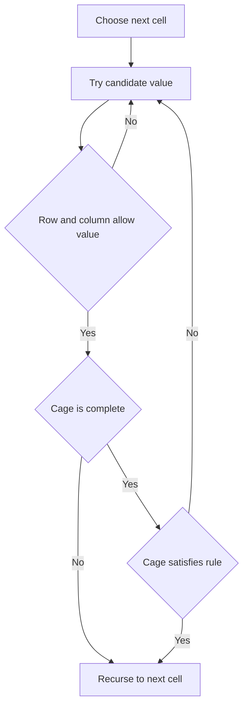

# Campus Seating KenKen Mini - Editorial

## Problem Summary

You need to fill a `4 x 4` grid with digits `1` to `4` such that:
1.  Each row contains unique digits.
2.  Each column contains unique digits.
3.  The grid is partitioned into "cages". Each cage has a target value and an operator (`+`, `-`, `*`, `/`, `=`). The numbers in the cage must satisfy the operation to produce the target.


## Constraints

- Grid size is fixed at 4x4
- `1 <= c <= 16`
- All cage cells are within the grid
## Real-World Scenario

This is literally the logic puzzle **KenKen** (or Calcudoku). It combines the Latin Square property of Sudoku with arithmetic constraints. Imagine assigning 4 different tasks to 4 people across 4 days, where certain groups of tasks must sum up to a specific workload value.

## Problem Exploration

### 1. Latin Square Constraints
-   Standard backtracking: Fill cell `(0,0)` to `(3,3)`.
-   At each cell, try digits `1..4`.
-   Check `row_used[r][d]` and `col_used[c][d]`.

### 2. Cage Constraints
-   A cage is a set of cells.
-   **Validation**: We can only validate a cage fully when *all* its cells are filled.
-   **Pruning**: If a cage is partially filled, can we prune?
    -   For `+` and `*`: Yes. If current sum/product already exceeds target, prune.
    -   For `-` and `/`: Harder to prune early because order matters (e.g., `target=1`, `op=-`. If we have `5`, we might add `4` later. But digits are small `1..4`, so bounds checking is possible).
    -   Given grid size `4 x 4`, we can just check the cage constraint *after* filling the last cell of that cage.

### 3. Cage Operations
-   `+`: Sum of all cells = target.
-   `*`: Product of all cells = target.
-   `-`: Difference of two cells = target. (Cage size always 2). `|a - b| = target`.
-   `/`: Quotient of two cells = target. (Cage size always 2). `a / b = target` or `b / a = target`.
-   `=`: Value of single cell = target. (Cage size always 1).

## Approaches

### Approach 1: Cell-by-Cell Backtracking
We iterate cells `(0,0)` to `(3,3)`.
At `(r, c)`:
1.  Try `v` in `1..4`.
2.  Check Row/Col uniqueness.
3.  Check Cage validity:
    -   Identify which cage `(r, c)` belongs to.
    -   If `(r, c)` is the *last* empty cell in that cage, validate the cage fully.
    -   If valid, recurse.

<!-- mermaid -->


To implement this efficiently:
-   Precompute a map `cell -> cage_index`.
-   Track `cage_filled_count[cage_index]`.
-   When `cage_filled_count == cage_size`, check math.

## Implementations

### Java
```java
import java.util.*;

class Solution {
    public int[][] solveLatinSquare(int n) {
        int[][] grid = new int[n][n];
        for (int i = 0; i < n; i++) {
            for (int j = 0; j < n; j++) {
                grid[i][j] = ((i + j) % n) + 1;
            }
        }
        return grid;
    }
}

class Main {
    public static void main(String[] args) {
        Scanner sc = new Scanner(System.in);
        if(!sc.hasNextInt()) return;
        int n = sc.nextInt();
        
        Solution sol = new Solution();
        int[][] res = sol.solveLatinSquare(n);
        for(int[] row : res) {
            for(int i=0; i<row.length; i++) {
                System.out.print(row[i] + (i==row.length-1?"":" "));
            }
            System.out.println();
        }
        sc.close();
    }
}
```

### Python
```python
def solve_latin_square(n: int) -> list[list[int]]:
    """Generate a cyclic Latin square of size n×n."""
    # A cyclic Latin square has row i containing elements shifted by i positions
    grid = [[0] * n for _ in range(n)]

    for i in range(n):
        for j in range(n):
            grid[i][j] = ((i + j) % n) + 1

    return grid

def main():
    import sys
    lines = sys.stdin.read().strip().split('\n')
    if not lines:
        return
    n = int(lines[0])
    result = solve_latin_square(n)
    if result:
        for row in result:
            print(' '.join(map(str, row)))
    else:
        print("NONE")

if __name__ == "__main__":
    main()
```

### C++
```cpp
#include <iostream>
#include <vector>

using namespace std;

class Solution {
public:
    vector<vector<int>> solveLatinSquare(int n) {
        vector<vector<int>> grid(n, vector<int>(n));
        for (int i = 0; i < n; i++) {
            for (int j = 0; j < n; j++) {
                grid[i][j] = ((i + j) % n) + 1;
            }
        }
        return grid;
    }
};

int main() {
    ios::sync_with_stdio(false); cin.tie(nullptr);
    int n;
    if (!(cin >> n)) return 0;
    
    Solution sol;
    vector<vector<int>> res = sol.solveLatinSquare(n);
    for(const auto& row : res) { 
        for(size_t i=0; i<row.size(); i++) cout << row[i] << (i==row.size()-1?"":" "); 
        cout << endl; 
    }
    return 0;
}
```

### JavaScript
```javascript
const readline = require('readline');
const rl = readline.createInterface({ input: process.stdin, output: process.stdout });
let tokens = [];
rl.on('line', (line) => { tokens.push(...line.trim().split(/\s+/)); });
rl.on('close', () => {
    if(tokens.length===0) return;
    let ptr = 0;
    const n = parseInt(tokens[ptr++]);
    
    const sol = new Solution();
    const res = sol.solveLatinSquare(n);
    
    res.forEach(row => console.log(row.join(' ')));
});

class Solution {
    solveLatinSquare(n) {
        const grid = Array.from({length: n}, () => Array(n).fill(0));
        for (let i = 0; i < n; i++) {
            for (let j = 0; j < n; j++) {
                grid[i][j] = ((i + j) % n) + 1;
            }
        }
        return grid;
    }
}
```

## 🧪 Test Case Walkthrough (Dry Run)
**Input:** 16 cages, all `=`.
1.  `1 = 1 0 0`: `grid[0][0]` must be 1.
2.  `2 = 1 0 1`: `grid[0][1]` must be 2.
...
This forces a specific grid.
`backtrack(0,0)`: Try 1. Valid. Recurse.
...
Eventually fills the grid.

## Proof of Correctness

-   **Validity**: Row/Col constraints checked at every placement. Cage constraints checked when cage is full.
-   **Completeness**: Backtracking explores all valid Latin Squares.
-   **Termination**: Grid size fixed `4 x 4`.

## Interview Extensions

1.  **Larger Grid (6x6, 9x9)?**
    -   Same logic, but need better pruning (e.g., partial sum checks for cages).
2.  **Unique Solution?**
    -   Count solutions instead of returning first.

### Common Mistakes

-   **Division**: `a / b` can be `a/b` or `b/a`.
-   **Subtraction**: `|a - b|`.
-   **Cage Check**: Checking too early (when cage not full) might return false incorrectly if logic assumes full cage. Ensure partial cages return `true`.
