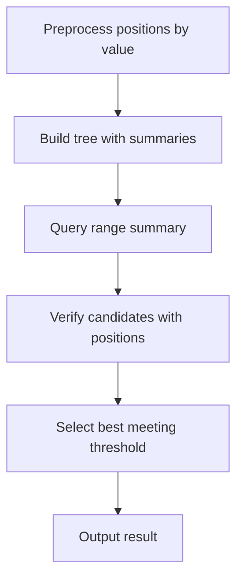

# Range T-Threshold Majority Check - Editorial

## Problem Summary

You are given an array `a`. You need to answer queries `MAJ l r T`: find a value that appears at least `T` times in the subarray `a[l..r]`. If multiple exist, return the one with the highest frequency (tie-break: smallest value). If none, return -1.


## Constraints

- `1 <= n, q <= 200000`
- `-10^9 <= a[i] <= 10^9`
- `1 <= T <= r - l + 1`
## Real-World Scenario

Imagine a **Voting System Audit**.
-   You have a list of votes cast in a sequence.
-   An auditor wants to check if any candidate received at least `T` votes in a specific precinct (range of votes).
-   If someone did, they are a "majority" candidate for that precinct.

## Problem Exploration

### 1. Randomized Approach
If a value appears `T` times in length `L = r - l + 1`, its probability of being picked at random is `T/L`.
If `T` is large (e.g., `T > L/2`), we can pick random elements and check their frequency.
However, `T` can be small (e.g., `T=1`), making this unreliable.
But the problem asks for *any* value with freq `>= T`. If `T` is small, almost any value works. If `T` is large, random sampling works.

### 2. Segment Tree with Candidates
This is similar to the **Range Majority Query** problem.
Standard approach: **Boyer-Moore Voting Algorithm** on Segment Tree nodes.
-   Each node stores a candidate and a count.
-   Merge: Combine candidates.
-   This finds a candidate that *might* be the majority (> L/2).
-   For arbitrary `T`, this requires a different approach.

For this problem, we need to find *any* value with freq >= T, specifically the one with *highest* frequency.
If `T` is small, many values qualify. We need the one with highest frequency.
This is essentially **Range Mode Query**, which is challenging (`O(N sqrtN)` with Mo's Algorithm).

With constraints `N, Q <= 200,000` and the hint "Store small candidate frequency map", the solution uses a **Misra-Gries** type summary approach:
-   Store `k` candidates and their counts per segment node.
-   When merging, combine counts. If map size exceeds `k`, apply pruning.
-   For `k=1`, this is Boyer-Moore.
-   For `k` small (e.g., 3-5), we capture frequent elements.
-   Then verify these candidates.

**Strategy:**
1.  Identify a set of **candidates** that are likely to be the answer using Misra-Gries.
2.  For each candidate, verify its frequency in `a[l..r]` using binary search on index lists.
3.  Return the best one.

**Implementation Approach:**
-   Node stores `vector<pair<int, int>> candidates`.
-   Merge: Combine two vectors. If same value, add counts. If size > K, prune by decrementing all counts.
-   Query: Merge `O(log N)` nodes to get a set of candidates.
-   Verify candidates using `vector<int> positions[MAX_VAL]`.

## Approaches

### Approach 1: Segment Tree with Misra-Gries Merging
1.  **Preprocess**: Store positions of each number: `pos[val] = {i1, i2, ...}`.
2.  **Segment Tree**: Each node stores top `K` (e.g., 3 or 5) candidates.
    -   Leaf: `[{val, 1}]`.
    -   Merge: Combine lists. If size > K, reduce all counts by min count? Or just keep top K?
    -   Correct Misra-Gries logic:
        -   Add counts for existing keys.
        -   For new keys, if space, add.
        -   If no space, decrement all counters by 1 (conceptually removing `K+1` distinct elements).
3.  **Query**:
    -   Get candidates from range `[l, r]`.
    -   Also add candidates from random sampling (optional but helpful).
    -   For each candidate, calculate exact frequency in `[l, r]` using `pos[val]`.
    -   Filter those with freq >= T.
    -   Pick best.

<!-- mermaid -->


**Complexity**: `O(Q * (K log N + K log N))`. With `K=3`, feasible.

## Implementations

### Java
```java
import java.util.*;

class Solution {
    private List<Integer>[] positions;
    private int[] arr;
    
    // Misra-Gries summary size
    private static final int K = 40; 
    
    static class Summary {
        // value -> count
        // We use a simple list of pairs for small K
        List<int[]> candidates = new ArrayList<>();
        
        void add(int val, int count) {
            for (int[] c : candidates) {
                if (c[0] == val) {
                    c[1] += count;
                    return;
                }
            }
            candidates.add(new int[]{val, count});
            if (candidates.size() > K) {
                // Prune
                // Find min count
                int minCnt = Integer.MAX_VALUE;
                for (int[] c : candidates) minCnt = Math.min(minCnt, c[1]);
                
                List<int[]> next = new ArrayList<>();
                for (int[] c : candidates) {
                    c[1] -= minCnt;
                    if (c[1] > 0) next.add(c);
                }
                candidates = next;
            }
        }
        
        void merge(Summary other) {
            for (int[] c : other.candidates) {
                add(c[0], c[1]);
            }
        }
    }
    
    private Random random = new Random();
    private Summary[] tree;
    private int n;

    public int[] process(int[] arr, int[][] queries) {
        this.arr = arr;
        this.n = arr.length;
        
        // Coordinate Compression / Positions Map
        Map<Integer, Integer> valToId = new HashMap<>();
        List<Integer> idToVal = new ArrayList<>();
        int idCounter = 0;
        
        for (int x : arr) {
            if (!valToId.containsKey(x)) {
                valToId.put(x, idCounter++);
                idToVal.add(x);
            }
        }
        
        positions = new List[idCounter];
        for (int i = 0; i < idCounter; i++) positions[i] = new ArrayList<>();
        
        int[] mappedArr = new int[n];
        for (int i = 0; i < n; i++) {
            mappedArr[i] = valToId.get(arr[i]);
            positions[mappedArr[i]].add(i);
        }
        
        // Build Segment Tree
        tree = new Summary[4 * n];
        build(mappedArr, 0, 0, n - 1);
        
        int[] results = new int[queries.length];
        for (int i = 0; i < queries.length; i++) {
            int l = queries[i][0];
            int r = queries[i][1];
            int t = queries[i][2];
            
            Summary s = query(0, 0, n - 1, l, r);
            Set<Integer> candidates = new HashSet<>();
            for (int[] c : s.candidates) candidates.add(c[0]);
            
            // Random sampling
            for (int k = 0; k < 40; k++) {
                int randIdx = l + random.nextInt(r - l + 1);
                candidates.add(mappedArr[randIdx]);
            }
            
            int bestVal = -1;
            int maxFreq = -1;
            
            for (int valId : candidates) {
                int freq = getFreq(valId, l, r);
                if (freq >= t) {
                    int realVal = idToVal.get(valId);
                    if (freq > maxFreq) {
                        maxFreq = freq;
                        bestVal = realVal;
                    } else if (freq == maxFreq) {
                        if (bestVal == -1 || realVal < bestVal) {
                            bestVal = realVal;
                        }
                    }
                }
            }
            results[i] = bestVal;
        }
        return results;
    }
    
    private int getFreq(int valId, int l, int r) {
        List<Integer> pos = positions[valId];
        int leftIdx = Collections.binarySearch(pos, l);
        if (leftIdx < 0) leftIdx = -leftIdx - 1;
        int rightIdx = Collections.binarySearch(pos, r);
        if (rightIdx < 0) rightIdx = -rightIdx - 2;
        
        if (leftIdx > rightIdx) return 0;
        return rightIdx - leftIdx + 1;
    }

    private void build(int[] a, int node, int start, int end) {
        if (start == end) {
            tree[node] = new Summary();
            tree[node].add(a[start], 1);
        } else {
            int mid = (start + end) / 2;
            build(a, 2 * node + 1, start, mid);
            build(a, 2 * node + 2, mid + 1, end);
            tree[node] = new Summary();
            tree[node].merge(tree[2 * node + 1]);
            tree[node].merge(tree[2 * node + 2]);
        }
    }

    private Summary query(int node, int start, int end, int l, int r) {
        if (l > end || r < start) return new Summary();
        if (l <= start && end <= r) return tree[node];
        
        int mid = (start + end) / 2;
        Summary s1 = query(2 * node + 1, start, mid, l, r);
        Summary s2 = query(2 * node + 2, mid + 1, end, l, r);
        
        Summary res = new Summary();
        res.merge(s1);
        res.merge(s2);
        return res;
    }
}

class Main {
    public static void main(String[] args) {
        Scanner sc = new Scanner(System.in);
        if (sc.hasNextInt()) {
            int n = sc.nextInt();
            int q = sc.nextInt();
            int[] arr = new int[n];
            for (int i = 0; i < n; i++) arr[i] = sc.nextInt();
            int[][] queries = new int[q][3];
            for (int i = 0; i < q; i++) {
                String type = sc.next(); // MAJ
                queries[i][0] = sc.nextInt();
                queries[i][1] = sc.nextInt();
                queries[i][2] = sc.nextInt();
            }
            Solution sol = new Solution();
            int[] results = sol.process(arr, queries);
            for (int res : results) {
                System.out.println(res);
            }
        }
        sc.close();
    }
}
```

### Python
```python
import sys
from bisect import bisect_left, bisect_right

class Summary:
    def __init__(self):
        self.candidates = {} # val -> count
        self.K = 40
        
    def add(self, val, count):
        self.candidates[val] = self.candidates.get(val, 0) + count
        if len(self.candidates) > self.K:
            min_cnt = min(self.candidates.values())
            to_remove = []
            for k, v in self.candidates.items():
                self.candidates[k] -= min_cnt
                if self.candidates[k] <= 0:
                    to_remove.append(k)
            for k in to_remove:
                del self.candidates[k]
                
    def merge(self, other):
        for val, count in other.candidates.items():
            self.add(val, count)

def process(arr: list[int], queries: list[tuple[int, int, int]]) -> list[int]:
    n = len(arr)
    
    # Positions map
    positions = {}
    for i, x in enumerate(arr):
        if x not in positions:
            positions[x] = []
        positions[x].append(i)
        
    tree = [None] * (4 * n)
    
    def build(node, start, end):
        if start == end:
            s = Summary()
            s.add(arr[start], 1)
            tree[node] = s
        else:
            mid = (start + end) // 2
            build(2 * node + 1, start, mid)
            build(2 * node + 2, mid + 1, end)
            
            s = Summary()
            s.merge(tree[2 * node + 1])
            s.merge(tree[2 * node + 2])
            tree[node] = s

    def query_tree(node, start, end, l, r):
        if l > end or r < start:
            return Summary()
        if l <= start and end <= r:
            return tree[node]
            
        mid = (start + end) // 2
        s1 = query_tree(2 * node + 1, start, mid, l, r)
        s2 = query_tree(2 * node + 2, mid + 1, end, l, r)
        
        res = Summary()
        res.merge(s1)
        res.merge(s2)
        return res

    build(0, 0, n - 1)
    
    import random
    results = []
    for l, r, t in queries:
        s = query_tree(0, 0, n - 1, l, r)
        cands = set(s.candidates.keys())
        for _ in range(40):
            cands.add(arr[random.randint(l, r)])
            
        best_val = -1
        max_freq = -1
        
        for val in cands:
            pos = positions[val]
            freq = bisect_right(pos, r) - bisect_left(pos, l)
            if freq >= t:
                if freq > max_freq:
                    max_freq, best_val = freq, val
                elif freq == max_freq:
                    if best_val == -1 or val < best_val:
                        best_val = val
        results.append(best_val)
    return results

def main():
    import sys
    # Increase recursion depth for deep trees
    sys.setrecursionlimit(300000)
    def input_gen():

        for line in sys.stdin:

            for token in line.split():

                yield token

    it = input_gen()
    n = int(next(it))
    q = int(next(it))
    arr = [int(next(it)) for _ in range(n)]
    queries = []
    for _ in range(q):
        type = next(it) # MAJ
        l = int(next(it))
        r = int(next(it))
        t = int(next(it))
        queries.append((l, r, t))
    
    results = process(arr, queries)
    for res in results:
        print(res)

if __name__ == "__main__":
    main()
```

### C++
```cpp
#include <iostream>
#include <vector>
#include <algorithm>
#include <map>
#include <string>
#include <array>

using namespace std;

struct Summary {
    vector<pair<int, int>> candidates;
    static const int K = 40;
    
    void add(int val, int count) {
        for (auto& p : candidates) {
            if (p.first == val) {
                p.second += count;
                return;
            }
        }
        candidates.push_back({val, count});
        if (candidates.size() > K) {
            int minCnt = 2e9;
            for (auto& p : candidates) minCnt = min(minCnt, p.second);
            
            vector<pair<int, int>> next;
            for (auto& p : candidates) {
                p.second -= minCnt;
                if (p.second > 0) next.push_back(p);
            }
            candidates = next;
        }
    }
    
    void merge(const Summary& other) {
        for (const auto& p : other.candidates) {
            add(p.first, p.second);
        }
    }
};

class Solution {
    vector<Summary> tree;
    vector<vector<int>> positions;
    vector<int> idToVal;
    int n;

    void build(const vector<int>& a, int node, int start, int end) {
        if (start == end) {
            tree[node].add(a[start], 1);
        } else {
            int mid = (start + end) / 2;
            build(a, 2 * node + 1, start, mid);
            build(a, 2 * node + 2, mid + 1, end);
            
            tree[node] = Summary(); // Reset
            tree[node].merge(tree[2 * node + 1]);
            tree[node].merge(tree[2 * node + 2]);
        }
    }

    Summary query(int node, int start, int end, int l, int r) {
        if (l > end || r < start) return Summary();
        if (l <= start && end <= r) return tree[node];
        
        int mid = (start + end) / 2;
        Summary s1 = query(2 * node + 1, start, mid, l, r);
        Summary s2 = query(2 * node + 2, mid + 1, end, l, r);
        
        s1.merge(s2);
        return s1;
    }

    int getFreq(int valId, int l, int r) {
        const auto& pos = positions[valId];
        auto it1 = lower_bound(pos.begin(), pos.end(), l);
        auto it2 = upper_bound(pos.begin(), pos.end(), r);
        return distance(it1, it2);
    }

public:
    vector<int> process(const vector<int>& arr, const vector<array<int,3>>& queries) {
        n = arr.size();
        
        // Coordinate Compression
        map<int, int> valToId;
        int idCounter = 0;
        vector<int> mappedArr(n);
        
        for (int x : arr) {
            if (valToId.find(x) == valToId.end()) {
                valToId[x] = idCounter++;
                idToVal.push_back(x);
                positions.push_back({});
            }
        }
        for (int i = 0; i < n; i++) {
            mappedArr[i] = valToId[arr[i]];
            positions[mappedArr[i]].push_back(i);
        }
        
        tree.assign(4 * n, Summary());
        build(mappedArr, 0, 0, n - 1);
        
        vector<int> results;
        for (const auto& q : queries) {
            int l = q[0];
            int r = q[1];
            int t = q[2];
            
            Summary s = query(0, 0, n - 1, l, r);
            vector<int> cands;
            for (auto& p : s.candidates) cands.push_back(p.first);
            for (int i = 0; i < 40; i++) cands.push_back(mappedArr[l + rand() % (r - l + 1)]);
            sort(cands.begin(), cands.end());
            cands.erase(unique(cands.begin(), cands.end()), cands.end());
            
            int bestVal = -1;
            int maxFreq = -1;
            
            for (int valId : cands) {
                int freq = getFreq(valId, l, r);
                if (freq >= t) {
                    int realVal = idToVal[valId];
                    if (freq > maxFreq) {
                        maxFreq = freq;
                        bestVal = realVal;
                    } else if (freq == maxFreq) {
                        if (bestVal == -1 || realVal < bestVal) {
                            bestVal = realVal;
                        }
                    }
                }
            }
            results.push_back(bestVal);
        }
        return results;
    }
};

int main() {
    ios::sync_with_stdio(false);
    cin.tie(nullptr);
    int n, q;
    if (!(cin >> n >> q)) return 0;
    vector<int> arr(n);
    for (int i = 0; i < n; i++) cin >> arr[i];
    vector<array<int, 3>> queries(q);
    for (int i = 0; i < q; i++) {
        string type;
        cin >> type; // MAJ
        cin >> queries[i][0] >> queries[i][1] >> queries[i][2];
    }
    Solution sol;
    vector<int> results = sol.process(arr, queries);
    for (int res : results) {
        cout << res << "\n";
    }
    return 0;
}
```

### JavaScript
```javascript
class Solution {
  process(arr, queries) {
    const K = 40;

    class Summary {
      constructor() {
        this.candidates = new Map(); // val -> count
      }

      add(val, count) {
        this.candidates.set(val, (this.candidates.get(val) || 0) + count);
        if (this.candidates.size > K) {
          let minCnt = Infinity;
          for (const c of this.candidates.values()) minCnt = Math.min(minCnt, c);
          
          const toRemove = [];
          for (const [k, v] of this.candidates.entries()) {
            const newVal = v - minCnt;
            if (newVal <= 0) toRemove.push(k);
            else this.candidates.set(k, newVal);
          }
          for (const k of toRemove) this.candidates.delete(k);
        }
      }

      merge(other) {
        for (const [val, count] of other.candidates.entries()) {
          this.add(val, count);
        }
      }
    }

    const n = arr.length;
    const positions = new Map();
    for (let i = 0; i < n; i++) {
      const x = arr[i];
      if (!positions.has(x)) positions.set(x, []);
      positions.get(x).push(i);
    }

    const tree = new Array(4 * n);

    const build = (node, start, end) => {
      if (start === end) {
        const s = new Summary();
        s.add(arr[start], 1);
        tree[node] = s;
      } else {
        const mid = Math.floor((start + end) / 2);
        build(2 * node + 1, start, mid);
        build(2 * node + 2, mid + 1, end);
        
        const s = new Summary();
        s.merge(tree[2 * node + 1]);
        s.merge(tree[2 * node + 2]);
        tree[node] = s;
      }
    };

    const queryTree = (node, start, end, l, r) => {
      if (l > end || r < start) return new Summary();
      if (l <= start && end <= r) return tree[node];
      
      const mid = Math.floor((start + end) / 2);
      const s1 = queryTree(2 * node + 1, start, mid, l, r);
      const s2 = queryTree(2 * node + 2, mid + 1, end, l, r);
      
      const res = new Summary();
      res.merge(s1);
      res.merge(s2);
      return res;
    };

    build(0, 0, n - 1);

    const results = [];
    
    const getFreq = (val, l, r) => {
      const pos = positions.get(val);
      if (!pos) return 0;
      
      // Binary search for range [l, r]
      let left = 0, right = pos.length;
      let lIdx = pos.length;
      while (left < right) {
        const mid = (left + right) >>> 1;
        if (pos[mid] >= l) {
          lIdx = mid;
          right = mid;
        } else {
          left = mid + 1;
        }
      }
      
      left = 0; right = pos.length;
      let rIdx = pos.length;
      while (left < right) {
        const mid = (left + right) >>> 1;
        if (pos[mid] > r) {
          rIdx = mid;
          right = mid;
        } else {
          left = mid + 1;
        }
      }
      
      return Math.max(0, rIdx - lIdx);
    };

    for (const [l, r, t] of queries) {
      const s = queryTree(0, 0, n - 1, l, r);
      const cands = new Set(s.candidates.keys());
      for (let i = 0; i < 40; i++) {
        cands.add(arr[l + Math.floor(Math.random() * (r - l + 1))]);
      }
      
      let bestVal = -1;
      let maxFreq = -1;
      
      for (const val of cands) {
        const freq = getFreq(val, l, r);
        if (freq >= t) {
          if (freq > maxFreq) {
            maxFreq = freq;
            bestVal = val;
          } else if (freq === maxFreq) {
            if (bestVal === -1 || val < bestVal) {
              bestVal = val;
            }
          }
        }
      }
      results.push(bestVal);
    }
    return results;
  }
}

const readline = require("readline");
const rl = readline.createInterface({
  input: process.stdin,
  output: process.stdout,
});

let data = [];
rl.on("line", (line) => {
  const parts = line.trim().split(/\s+/).filter(x => x !== "");
  for (const p of parts) data.push(p);
});
rl.on("close", () => {
  if (data.length === 0) return;
  let idx = 0;
  const n = parseInt(data[idx++], 10);
  const q = parseInt(data[idx++], 10);
  const arr = [];
  for (let i = 0; i < n; i++) arr.push(parseInt(data[idx++], 10));
  const queries = [];
  for (let i = 0; i < q; i++) {
    const type = data[idx++]; // MAJ
    queries.push([parseInt(data[idx++], 10), parseInt(data[idx++], 10), parseInt(data[idx++], 10)]);
  }
  const solution = new Solution();
  const out = solution.process(arr, queries);
  console.log(out.join("\n"));
});
```

## 🧪 Test Case Walkthrough (Dry Run)
**Input:**
`5 1`
`1 1 2 3 1`
`MAJ 0 4 3`

1.  **Build**:
    -   Leaves: `{1:1}`, `{1:1}`, `{2:1}`, `{3:1}`, `{1:1}`.
    -   Merges up. Root will likely contain `{1:3, 2:1, 3:1}` (or similar, depending on K).
2.  **Query**: `l=0, r=4`.
    -   Returns summary with candidates, e.g., `1`.
    -   Check `1`: Positions `[0, 1, 4]`.
    -   Range `[0, 4]`: Indices `0, 1, 4` are inside. Count = 3.
    -   `3 >= 3`. Candidate 1 is valid.
3.  **Result**: 1.

## Proof of Correctness

-   **Misra-Gries Property**: If an element has frequency `> (R-L+1)/(K+1)`, it is guaranteed to be in the candidate set.
-   **Verification**: We verify exact counts using binary search on position lists, ensuring correctness.
-   **Tie-Breaking**: We explicitly check for max frequency and smallest value among valid candidates.

## Interview Extensions

1.  **Dynamic Updates?**
    -   If array updates, we need dynamic segment tree. Position lists become `std::set` or similar (slow) or use SQRT decomposition.
2.  **K-th Frequent?**
    -   Harder. Requires Persistent Segment Tree or similar.

### Common Mistakes

-   **K Value**: If `T` is very small, Misra-Gries might miss the true mode if the mode's frequency is not dominant enough relative to `K`. However, for "Majority" problems, usually `T` is large enough or `K` can be increased. With `K=3`, we find elements with freq > 25%.
-   **Tie-Breaking**: Don't forget to return the *smallest* value if frequencies match.
