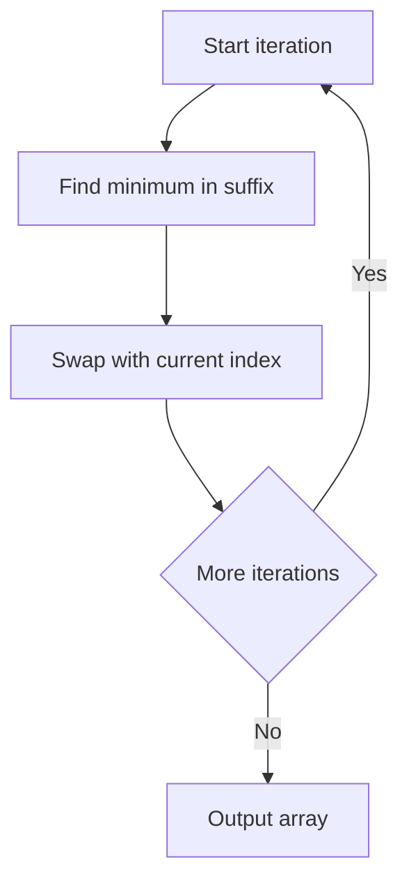

# Partial Selection Sort Stats - Editorial

## Problem Summary

You are given an array of integers and a number `k`. You need to simulate the first `k` iterations of the **Selection Sort** algorithm. In each iteration `i` (from 0 to `k-1`), you find the minimum element in the unsorted suffix `a[i..n-1]` and swap it with `a[i]`. Return the state of the array after these `k` swaps.

## Real-World Scenario

Imagine you are organizing a bookshelf.
-   You want to arrange books by height, shortest to tallest.
-   You scan the entire shelf to find the absolute shortest book and place it in the first slot.
-   Then you scan the remaining books to find the next shortest and place it in the second slot.
-   However, you get interrupted after placing just the first `k` books.
-   The shelf now has the `k` shortest books in order at the start, and the rest are still jumbled in the remaining slots. This is exactly what the problem asks for.

## Problem Exploration

### 1. Selection Sort Mechanism
Selection Sort works by repeatedly selecting the smallest element from the unsorted portion and moving it to the beginning.
-   **Pass 0**: Find min in `a[0..n-1]`, swap with `a[0]`.
-   **Pass 1**: Find min in `a[1..n-1]`, swap with `a[1]`.
-   ...
-   **Pass k-1**: Find min in `a[k-1..n-1]`, swap with `a[k-1]`.

### 2. Constraints Analysis
-   `N <= 100,000`.
-   `K <= N`.
-   A full Selection Sort takes `O(N^2)`, which is too slow for `N=100,000`.
-   However, we only need to perform `k` iterations.
-   The complexity will be roughly `O(K * N)`.
-   For `N=10^5`, a full `O(N^2)` selection sort would typically be too slow.
-   The time complexity `O(k * n)` is acceptable when `K` is small or the time limit is generous.
-   The standard simulation approach is required.

### 3. Edge Cases
-   `k=0`: Array remains unchanged.
-   `k=n-1`: Full sort.
-   Duplicate minimums: Selection sort is typically unstable depending on implementation, but the standard description says "swap with the first occurrence" or "swap with a[i]". Usually we pick the *first* minimum index in the range to be stable-ish or standard. The problem says "find the minimum... swap it". If duplicates exist, usually the one with lower index is picked. We should stick to finding the first occurrence of the minimum.

## Approaches

### Approach 1: Direct Simulation
-   Loop `i` from `0` to `k-1`.
-   Inner loop `j` from `i+1` to `n-1` to find `minIndex`.
-   Swap `a[i]` and `a[minIndex]`.
-   Complexity: `O(K * N)`.

<!-- mermaid -->


## Implementations

### Java
```java
import java.util.*;

class Solution {
    public int[] partialSelectionSort(int[] arr, int k) {
        int n = arr.length;
        for (int i = 0; i < k; i++) {
            int minIndex = i;
            for (int j = i + 1; j < n; j++) {
                if (arr[j] < arr[minIndex]) {
                    minIndex = j;
                }
            }
            // Swap
            int temp = arr[i];
            arr[i] = arr[minIndex];
            arr[minIndex] = temp;
        }
        return arr;
    }
}

class Main {
    public static void main(String[] args) {
        Scanner sc = new Scanner(System.in);
        if (!sc.hasNextInt()) {
            sc.close();
            return;
        }
        int n = sc.nextInt();
        int k = sc.nextInt();
        int[] arr = new int[n];
        for (int i = 0; i < n; i++) {
            arr[i] = sc.nextInt();
        }
        Solution solution = new Solution();
        int[] result = solution.partialSelectionSort(arr, k);
        StringBuilder sb = new StringBuilder();
        for (int i = 0; i < result.length; i++) {
            if (i > 0) sb.append(' ');
            sb.append(result[i]);
        }
        System.out.println(sb.toString());
        sc.close();
    }
}
```

### Python
```python
def partial_selection_sort(arr: list[int], k: int) -> list[int]:
    n = len(arr)
    for i in range(k):
        min_index = i
        for j in range(i + 1, n):
            if arr[j] < arr[min_index]:
                min_index = j
        arr[i], arr[min_index] = arr[min_index], arr[i]
    return arr

def main():
    n, k = map(int, input().split())
    arr = list(map(int, input().split()))
    result = partial_selection_sort(arr, k)
    print(' '.join(map(str, result)))

if __name__ == "__main__":
    main()
```

### C++
```cpp
#include <vector>
#include <algorithm>
#include <iostream>

using namespace std;

class Solution {
public:
    vector<int> partialSelectionSort(vector<int> arr, int k) {
        int n = arr.size();
        for (int i = 0; i < k; i++) {
            int minIndex = i;
            for (int j = i + 1; j < n; j++) {
                if (arr[j] < arr[minIndex]) {
                    minIndex = j;
                }
            }
            swap(arr[i], arr[minIndex]);
        }
        return arr;
    }
};

int main() {
    ios::sync_with_stdio(false);
    cin.tie(nullptr);

    int n, k;
    if (!(cin >> n >> k)) return 0;
    vector<int> arr(n);
    for (int i = 0; i < n; i++) {
        cin >> arr[i];
    }
    Solution solution;
    vector<int> result = solution.partialSelectionSort(arr, k);
    for (int i = 0; i < (int)result.size(); i++) {
        if (i) cout << ' ';
        cout << result[i];
    }
    cout << "\n";
    return 0;
}
```

### JavaScript
```javascript
class Solution {
  partialSelectionSort(arr, k) {
    const n = arr.length;
    for (let i = 0; i < k; i++) {
      let minIndex = i;
      for (let j = i + 1; j < n; j++) {
        if (arr[j] < arr[minIndex]) {
          minIndex = j;
        }
      }
      [arr[i], arr[minIndex]] = [arr[minIndex], arr[i]];
    }
    return arr;
  }
}

const fs = require("fs");

const input = fs.readFileSync(0, "utf8").trim();
if (!input) process.exit(0);
const data = input.split(/\s+/);
let idx = 0;
const n = parseInt(data[idx++], 10);
const k = parseInt(data[idx++], 10);
const arr = [];
for (let i = 0; i < n; i++) {
  arr.push(parseInt(data[idx++], 10));
}
const solution = new Solution();
const result = solution.partialSelectionSort(arr, k);
console.log(result.join(" "));
```

## 🧪 Test Case Walkthrough (Dry Run)
**Input:**
`4 2`
`4 3 1 2`

1.  **Iteration 0**:
    -   Range `a[0..3]`: `[4, 3, 1, 2]`.
    -   Min is `1` at index 2.
    -   Swap `a[0]` (4) and `a[2]` (1).
    -   Array: `[1, 3, 4, 2]`.
2.  **Iteration 1**:
    -   Range `a[1..3]`: `[3, 4, 2]`.
    -   Min is `2` at index 3.
    -   Swap `a[1]` (3) and `a[3]` (2).
    -   Array: `[1, 2, 4, 3]`.
3.  **End**: Return `[1, 2, 4, 3]`.

## Proof of Correctness

-   **Invariant**: After `i` iterations, the first `i` elements are the `i` smallest elements of the array, sorted in ascending order.
-   **Step**: In iteration `i`, we find the minimum of the remaining unsorted suffix and place it at `i`. This extends the sorted prefix by one.
-   **Termination**: After `k` steps, the prefix `a[0..k-1]` is sorted and contains the `k` smallest elements.

## Interview Extensions

1.  **What if K is large?**
    -   If `K` is close to `N`, this is `O(N^2)`. For large `N`, use Heap Sort (`O(N \log N)`) or Merge Sort.
    -   However, Selection Sort specifically minimizes *swaps* (`O(N)` swaps), which is useful if writing to memory is expensive (e.g., Flash memory).
2.  **Stability?**
    -   Selection Sort is generally **not stable** because swapping an element might move it past a duplicate.
    -   Example: `[2, 2, 1]`. Swap `2` (index 0) with `1` (index 2) -> `[1, 2, 2]`. The original first `2` moved to the end, changing relative order.

### Common Mistakes

-   **Inner Loop Start**: Must start from `i + 1`, not `0` or `1`.
-   **Swapping**: Ensure you swap `a[i]` with `a[minIndex]`, not `a[minIndex]` with `a[minIndex+1]`.
-   **Min Index Initialization**: Start assuming `minIndex = i`.
