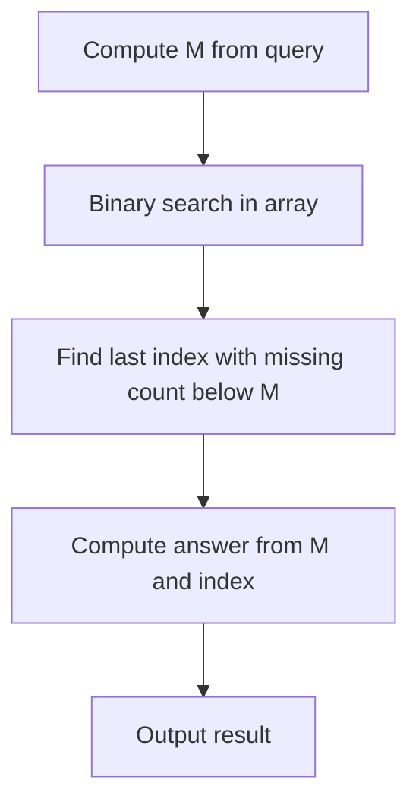

# Kth Missing Positive with Blocks - Editorial

## Problem Summary

You are given a sorted array of unique positive integers `a`. This array defines a set of "present" numbers. The set of "missing" positive integers is the infinite sequence of positive integers not in `a`. You need to answer queries of the form `(k, blockSize)`, asking for the last number in the `k`-th block of size `blockSize` from the missing sequence. This is equivalent to finding the `(k * blockSize)`-th missing positive integer.

## Real-World Scenario

Imagine a **Ticket Reservation System**.
-   Seats are numbered 1, 2, 3, ...
-   Some seats are already booked (the array `a`).
-   The remaining seats are available (the missing numbers).
-   A large group wants to book seats in batches (blocks).
-   Query: "If we book the `k`-th batch of `blockSize` seats, what is the seat number of the last person in that batch?"

## Problem Exploration

### 1. Understanding Missing Numbers
-   Let `missing(x)` be the count of missing positive integers strictly less than `x`.
-   If `x` is in the array `a`, then `missing(x) = x - (index of x in a + 1)`.
-   If `a` is sorted, `count of elements < a[i]` is `i`.
-   So, just before `a[i]`, the number of missing positives is `a[i] - 1 - i`.

### 2. Binary Search Approach
-   We want to find the `M`-th missing number, where `M = k * blockSize`.
-   Let `f(v)` be the count of missing numbers less than `v`.
-   `f(v)` is a non-decreasing function.
-   We want to find `v` such that `f(v) < M` and `f(v+1) >= M`.
-   We can binary search for the index `i` in `a` such that the `M`-th missing number falls between `a[i]` and `a[i+1]` (or before `a[0]`, or after `a[n-1]`).
-   Specifically, let `miss_at_i = a[i] - (i + 1)`. This is the count of missing numbers up to `a[i]`.
-   If `M <= miss_at_i`, then the target is to the left of `a[i]`.
-   If `M > miss_at_i`, then the target is to the right.

### 3. Algorithm
-   Calculate `M = k * blockSize`.
-   Binary search on the array `a` to find the largest index `idx` such that `a[idx] - (idx + 1) < M`.
-   If no such index exists (i.e., `M` is small and the missing number is before `a[0]`), the answer is simply `M`.
-   Otherwise, the answer is `a[idx] + (M - (a[idx] - (idx + 1))) = a[idx] + M - a[idx] + idx + 1 = M + idx + 1`.
    -   Suppose `a = [2, 3, 7]`.
    -   `i=0, a[0]=2`. Missing before: `2 - 1 = 1` (number 1). `miss_count = 2 - (0+1) = 1`.
    -   `i=1, a[1]=3`. Missing before: `3 - 2 = 1` (number 1). `miss_count = 3 - (1+1) = 1`.
    -   `i=2, a[2]=7`. Missing before: `7 - 3 = 4` (1, 4, 5, 6). `miss_count = 7 - (2+1) = 4`.
-   Query `M = 3`.
    -   `miss_count` at `i=1` is 1 (< 3).
    -   `miss_count` at `i=2` is 4 (>= 3).
    -   So `idx = 1`.
    -   Formula: `M + idx + 1 = 3 + 1 + 1 = 5`.
    -   Is 5 the 3rd missing? Missing: 1, 4, 5. Yes.
-   Query `M = 6`.
    -   `miss_count` at `i=2` is 4 (< 6).
    -   So `idx = 2`.
    -   Formula: `6 + 2 + 1 = 9`.
    -   Missing: 1, 4, 5, 6, 8, 9. Yes.

## Approaches

### Approach 1: Binary Search on Array
-   For each query, calculate `M`.
-   Use `upper_bound` or custom binary search to find `idx`.
-   Compute result in `O(1)`.
-   Total Complexity: `O(Q * log N)`.

<!-- mermaid -->


## Implementations

### Java
```java
import java.util.*;

class Solution {
    public long[] solve(int[] arr, long[][] queries) {
        int n = arr.length;
        long[] results = new long[queries.length];
        
        for (int i = 0; i < queries.length; i++) {
            long k = queries[i][0];
            long b = queries[i][1];
            long m = k * b;
            
            // Binary search for largest idx such that arr[idx] - (idx + 1) < m
            int low = 0, high = n - 1;
            int idx = -1;
            
            while (low <= high) {
                int mid = low + (high - low) / 2;
                long missingCount = arr[mid] - (mid + 1);
                if (missingCount < m) {
                    idx = mid;
                    low = mid + 1;
                } else {
                    high = mid - 1;
                }
            }
            
            results[i] = m + idx + 1;
        }
        return results;
    }
}

class Main {
    public static void main(String[] args) {
        Scanner sc = new Scanner(System.in);
        if (!sc.hasNextInt()) {
            sc.close();
            return;
        }
        int n = sc.nextInt();
        int q = sc.nextInt();
        int[] arr = new int[n];
        for (int i = 0; i < n; i++) {
            arr[i] = sc.nextInt();
        }
        long[][] queries = new long[q][2];
        for (int i = 0; i < q; i++) {
            queries[i][0] = sc.nextLong();
            queries[i][1] = sc.nextLong();
        }
        Solution solution = new Solution();
        long[] results = solution.solve(arr, queries);
        StringBuilder sb = new StringBuilder();
        for (int i = 0; i < results.length; i++) {
            if (i > 0) sb.append('\n');
            sb.append(results[i]);
        }
        System.out.println(sb.toString());
        sc.close();
    }
}
```

### Python
```python
def solve(arr: list[int], queries: list[tuple[int, int]]) -> list[int]:
    results = []
    n = len(arr)

    for k, b in queries:
        m = k * b

        # Binary search
        low, high = 0, n - 1
        idx = -1

        while low <= high:
            mid = (low + high) // 2
            missing_count = arr[mid] - (mid + 1)
            if missing_count < m:
                idx = mid
                low = mid + 1
            else:
                high = mid - 1

        results.append(m + idx + 1)

    return results

def main():
    n, q = map(int, input().split())
    arr = list(map(int, input().split()))
    queries = []
    for _ in range(q):
        k, b = map(int, input().split())
        queries.append((k, b))

    results = solve(arr, queries)
    for res in results:
        print(res)

if __name__ == "__main__":
    main()
```

### C++
```cpp
#include <vector>
#include <algorithm>
#include <iostream>

using namespace std;

class Solution {
public:
    vector<long long> solve(const vector<int>& arr, const vector<pair<long long,long long>>& queries) {
        vector<long long> results;
        results.reserve(queries.size());
        int n = arr.size();
        
        for (const auto& q : queries) {
            long long m = q.first * q.second;
            
            int low = 0, high = n - 1;
            int idx = -1;
            
            while (low <= high) {
                int mid = low + (high - low) / 2;
                long long missingCount = arr[mid] - (mid + 1);
                if (missingCount < m) {
                    idx = mid;
                    low = mid + 1;
                } else {
                    high = mid - 1;
                }
            }
            
            results.push_back(m + idx + 1);
        }
        return results;
    }
};

int main() {
    ios::sync_with_stdio(false);
    cin.tie(nullptr);

    int n, q;
    if (!(cin >> n >> q)) return 0;
    vector<int> arr(n);
    for (int i = 0; i < n; i++) {
        cin >> arr[i];
    }
    vector<pair<long long, long long>> queries;
    queries.reserve(q);
    for (int i = 0; i < q; i++) {
        long long k, b;
        cin >> k >> b;
        queries.push_back({k, b});
    }
    Solution solution;
    vector<long long> results = solution.solve(arr, queries);
    for (long long v : results) {
        cout << v << "\n";
    }
    return 0;
}
```

### JavaScript
```javascript
class Solution {
  solve(arr, queries) {
    const results = [];
    const n = arr.length;
    
    for (const [k, b] of queries) {
      // Use BigInt for safety as k*b can exceed 2^53
      const m = BigInt(k) * BigInt(b);
      
      let low = 0;
      let high = n - 1;
      let idx = -1;
      
      while (low <= high) {
        const mid = Math.floor((low + high) / 2);
        const missingCount = BigInt(arr[mid]) - BigInt(mid + 1);
        if (missingCount < m) {
          idx = mid;
          low = mid + 1;
        } else {
          high = mid - 1;
        }
      }
      
      // Result is m + idx + 1
      // idx is number, m is BigInt. 
      // idx + 1 is the count of numbers in arr that are <= result
      results.push(Number(m + BigInt(idx + 1)));
    }
    return results;
  }
}

const fs = require("fs");

const input = fs.readFileSync(0, "utf8").trim();
if (!input) process.exit(0);
const data = input.split(/\s+/);
let idx = 0;
const n = parseInt(data[idx++], 10);
const q = parseInt(data[idx++], 10);
const arr = [];
for (let i = 0; i < n; i++) {
  arr.push(parseInt(data[idx++], 10));
}
const queries = [];
for (let i = 0; i < q; i++) {
  const k = data[idx++];
  const b = data[idx++];
  queries.push([k, b]);
}
const solution = new Solution();
const results = solution.solve(arr, queries);
console.log(results.join("\n"));
```

## 🧪 Test Case Walkthrough (Dry Run)
**Input:**
`3 1`
`2 3 7`
`3 2`

1.  **Query**: `k=3, b=2`. `M = 6`.
2.  **Binary Search**:
    -   `low=0, high=2`. `mid=1`. `arr[1]=3`. `missing = 3 - 2 = 1`. `1 < 6`. `idx=1`. `low=2`.
    -   `low=2, high=2`. `mid=2`. `arr[2]=7`. `missing = 7 - 3 = 4`. `4 < 6`. `idx=2`. `low=3`.
    -   `low=3, high=2`. Loop ends.
3.  **Result**: `M + idx + 1 = 6 + 2 + 1 = 9`.

## Proof of Correctness

-   Let the answer be `X`.
-   The number of missing integers less than or equal to `X` is `X - (count of elements in a <= X)`.
-   We want this count to be `M`.
-   So `X - (idx + 1) = M`, where `idx` is the index of the largest element in `a` less than `X`.
-   This rearranges to `X = M + idx + 1`.
-   Our binary search finds exactly this `idx` because `arr[idx] - (idx + 1)` is the count of missing numbers *strictly before* `arr[idx]`. If this is `< M`, then the `M`-th missing number must be at least `arr[idx] + 1` (actually greater, since `arr[idx]` is present).
-   If `arr[idx+1] - (idx + 2) >= M`, it means the `M`-th missing number is before `arr[idx+1]`.

## Interview Extensions

1.  **What if updates are allowed?**
    -   If we can insert/delete from `a`, we can use a Segment Tree or Fenwick Tree (on values if range is small, or coordinate compressed/dynamic if large) to track counts.
2.  **Kth Missing in Unsorted Array?**
    -   Sort it first (`O(N log N)`).
    -   Or use QuickSelect-like approach (`O(N)`), but that's for finding Kth *element*, not Kth *missing*. Sorting is usually required or a hash set if range is small.

### Common Mistakes

-   **Off-by-one**: Calculating missing count as `arr[i] - i` vs `arr[i] - (i+1)`. Since indices are 0-based, `i+1` elements are processed.
-   **Large Numbers**: `k * blockSize` can exceed 32-bit integer. Use `long long` in C++/Java and `BigInt` in JS.
