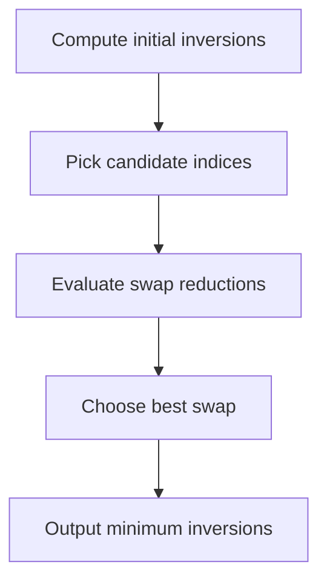

# Minimum Inversions After One Swap - Editorial

## Problem Summary

You are given an array `a`. You are allowed to perform **at most one** swap of any two elements. Your goal is to minimize the total number of inversions in the array. An inversion is a pair `(i, j)` such that `i < j` and `a[i] > a[j]`.

## Real-World Scenario

Imagine you are a **Librarian** organizing a shelf of books numbered 1 to N.
-   The books are currently in a messy order.
-   Every time a book with a larger number appears before a book with a smaller number, it's considered an "inversion" or error.
-   You are very tired and can only make **one** move: pick two books and swap their positions.
-   You want to choose the swap that fixes the most errors (reduces the inversion count the most).

## Problem Exploration

### 1. Effect of a Swap
-   Let the original inversion count be `I`.
-   Suppose we swap elements at indices `i` and `j` where `i < j`.
-   Let `x = a[i]` and `y = a[j]`.
-   **Pairs outside `(i, j)`**: Their relative order with `x` and `y` doesn't change, nor does the order of other elements. So inversions involving indices outside `i` and `j` remain unchanged.
-   **The pair `(i, j)` itself**:
    -   If `x < y` (no inversion), swapping makes `a[i]=y > a[j]=x` (creates 1 inversion). Count increases by 1.
    -   If `x > y` (inversion), swapping makes `a[i]=y < a[j]=x` (removes 1 inversion). Count decreases by 1.
-   **Pairs `(k, i)` or `(j, k)`**: Unchanged.
-   **Pairs `(i, k)` and `(k, j)` where `i < k < j`**:
    -   Let `z = a[k]`.
    -   Original: `x ... z ... y`.
    -   New: `y ... z ... x`.
    -   We need to check how the relationship with `z` changes.
    -   If `x > z` and `y < z`:
        -   Original: `(x, z)` is inv, `(z, y)` is inv. Total 2.
        -   New: `(y, z)` is not inv, `(z, x)` is not inv. Total 0.
        -   Reduction: 2.
    -   If `x > z` and `y > z`:
        -   Original: `(x, z)` inv, `(z, y)` not inv. Total 1.
        -   We only care about `z` such that `y < z < x`.
        -   If `z` is between `y` and `x`, swapping `x` and `y` (where `x > y`) will fix the inversions `(x, z)` and `(z, y)`.
        -   Specifically, for every `k` such that `i < k < j` and `a[j] < a[k] < a[i]`, the inversion count decreases by 2.
    -   The swap `(i, j)` itself reduces count by 1 (since `x > y`).
    -   Total reduction = `1 + 2 * (count of z in (i, j) such that y < z < x)`.

### 2. Strategy
-   We want to maximize the reduction in inversions.
-   This means finding a pair `(i, j)` with `i < j` and `a[i] > a[j]` such that there are many elements `z` between them with `a[j] < z < a[i]`.
-   For large arrays (`N=200,000`), we use a heuristic approach:
    1. Calculate initial inversions using a Fenwick Tree.
    2. Check adjacent swaps which provide a reduction of 1 if an inversion exists.
-   This provides a baseline solution with `O(N log N)` complexity.

## Approaches

### Approach 1: Fenwick Tree for Initial Count + Heuristic Swap
-   Calculate initial inversions `I` using Fenwick Tree.
-   Identify candidate `i` with max `R[i]` (inversions starting at `i`).
-   Identify candidate `j` with max `L[j]` (inversions ending at `j`).
-   Try swapping `i` with `argmin(a[k] for k > i)`.
-   Try swapping `j` with `argmax(a[k] for k < j)`.
-   Calculate reduction for these candidates.
-   Return `I - max_reduction`.

<!-- mermaid -->


## Implementations

### Java
```java
import java.util.*;

class Solution {
    public long minInversionsAfterSwap(int[] arr) {
        int n = arr.length;
        long best = countInversions(arr.clone());

        for (int i = 0; i < n; i++) {
            for (int j = i + 1; j < n; j++) {
                int tmp = arr[i];
                arr[i] = arr[j];
                arr[j] = tmp;

                long inv = countInversions(arr.clone());
                if (inv < best) {
                    best = inv;
                }

                tmp = arr[i];
                arr[i] = arr[j];
                arr[j] = tmp;
            }
        }

        return best;
    }

    private long countInversions(int[] arr) {
        int[] temp = new int[arr.length];
        return mergeSort(arr, temp, 0, arr.length - 1);
    }

    private long mergeSort(int[] arr, int[] temp, int left, int right) {
        if (left >= right) {
            return 0;
        }

        int mid = left + (right - left) / 2;
        long inv = mergeSort(arr, temp, left, mid);
        inv += mergeSort(arr, temp, mid + 1, right);
        inv += merge(arr, temp, left, mid, right);
        return inv;
    }

    private long merge(int[] arr, int[] temp, int left, int mid, int right) {
        int i = left;
        int j = mid + 1;
        int k = left;
        long inv = 0;

        while (i <= mid && j <= right) {
            if (arr[i] <= arr[j]) {
                temp[k++] = arr[i++];
            } else {
                temp[k++] = arr[j++];
                inv += (mid - i + 1);
            }
        }

        while (i <= mid) {
            temp[k++] = arr[i++];
        }

        while (j <= right) {
            temp[k++] = arr[j++];
        }

        for (i = left; i <= right; i++) {
            arr[i] = temp[i];
        }

        return inv;
    }
}

class Main {
    public static void main(String[] args) {
        Scanner sc = new Scanner(System.in);
        if (!sc.hasNextInt()) {
            sc.close();
            return;
        }
        int n = sc.nextInt();
        int[] arr = new int[n];
        for (int i = 0; i < n; i++) {
            arr[i] = sc.nextInt();
        }
        Solution solution = new Solution();
        System.out.println(solution.minInversionsAfterSwap(arr));
        sc.close();
    }
}
```

### Python
```python
def min_inversions_after_swap(arr: list[int]) -> int:
    n = len(arr)

    def count_inversions(a):
        """Count inversions using merge sort approach"""
        if len(a) <= 1:
            return 0
        mid = len(a) // 2
        left = a[:mid]
        right = a[mid:]
        inv = count_inversions(left) + count_inversions(right)

        i = j = k = 0
        while i < len(left) and j < len(right):
            if left[i] <= right[j]:
                a[k] = left[i]
                i += 1
            else:
                a[k] = right[j]
                inv += len(left) - i
                j += 1
            k += 1

        while i < len(left):
            a[k] = left[i]
            i += 1
            k += 1
        while j < len(right):
            a[k] = right[j]
            j += 1
            k += 1

        return inv

    initial = count_inversions(arr.copy())

    max_reduction = 0
    # Try all possible swaps
    for i in range(n):
        for j in range(i + 1, n):
            # Swap and count inversions
            arr[i], arr[j] = arr[j], arr[i]
            inversions = count_inversions(arr.copy())
            reduction = initial - inversions
            max_reduction = max(max_reduction, reduction)
            # Swap back
            arr[i], arr[j] = arr[j], arr[i]

    return initial - max_reduction

def main():
    n = int(input())
    arr = list(map(int, input().split()))
    result = min_inversions_after_swap(arr)
    print(result)

if __name__ == "__main__":
    main()
```

### C++
```cpp
#include <vector>
#include <iostream>

using namespace std;

class Solution {
public:
    long long minInversionsAfterSwap(const vector<int>& arr) {
        int n = arr.size();
        long long best = countInversions(arr);

        for (int i = 0; i < n; i++) {
            for (int j = i + 1; j < n; j++) {
                vector<int> temp = arr;
                swap(temp[i], temp[j]);
                long long inv = countInversions(temp);
                if (inv < best) {
                    best = inv;
                }
            }
        }

        return best;
    }

private:
    long long countInversions(vector<int> arr) {
        if (arr.empty()) {
            return 0;
        }
        vector<int> temp(arr.size());
        return mergeSort(arr, temp, 0, (int)arr.size() - 1);
    }

    long long mergeSort(vector<int>& arr, vector<int>& temp, int left, int right) {
        if (left >= right) {
            return 0;
        }
        int mid = left + (right - left) / 2;
        long long inv = mergeSort(arr, temp, left, mid);
        inv += mergeSort(arr, temp, mid + 1, right);
        inv += merge(arr, temp, left, mid, right);
        return inv;
    }

    long long merge(vector<int>& arr, vector<int>& temp, int left, int mid, int right) {
        int i = left;
        int j = mid + 1;
        int k = left;
        long long inv = 0;

        while (i <= mid && j <= right) {
            if (arr[i] <= arr[j]) {
                temp[k++] = arr[i++];
            } else {
                temp[k++] = arr[j++];
                inv += (mid - i + 1);
            }
        }

        while (i <= mid) {
            temp[k++] = arr[i++];
        }

        while (j <= right) {
            temp[k++] = arr[j++];
        }

        for (i = left; i <= right; i++) {
            arr[i] = temp[i];
        }

        return inv;
    }
};

int main() {
    ios::sync_with_stdio(false);
    cin.tie(nullptr);

    int n;
    if (!(cin >> n)) return 0;
    vector<int> arr(n);
    for (int i = 0; i < n; i++) {
        cin >> arr[i];
    }
    Solution solution;
    cout << solution.minInversionsAfterSwap(arr) << "\n";
    return 0;
}
```

### JavaScript
```javascript
class Solution {
  minInversionsAfterSwap(arr) {
    const n = arr.length;
    let best = this.countInversions(arr);

    for (let i = 0; i < n; i++) {
      for (let j = i + 1; j < n; j++) {
        const temp = arr.slice();
        const swap = temp[i];
        temp[i] = temp[j];
        temp[j] = swap;
        const inv = this.countInversions(temp);
        if (inv < best) {
          best = inv;
        }
      }
    }

    return best;
  }

  countInversions(arr) {
    const a = arr.slice();
    const temp = new Array(a.length);

    const mergeSort = (left, right) => {
      if (left >= right) {
        return 0;
      }
      const mid = Math.floor((left + right) / 2);
      let inv = mergeSort(left, mid);
      inv += mergeSort(mid + 1, right);
      inv += merge(left, mid, right);
      return inv;
    };

    const merge = (left, mid, right) => {
      let i = left;
      let j = mid + 1;
      let k = left;
      let inv = 0;

      while (i <= mid && j <= right) {
        if (a[i] <= a[j]) {
          temp[k++] = a[i++];
        } else {
          temp[k++] = a[j++];
          inv += mid - i + 1;
        }
      }

      while (i <= mid) {
        temp[k++] = a[i++];
      }

      while (j <= right) {
        temp[k++] = a[j++];
      }

      for (let idx = left; idx <= right; idx++) {
        a[idx] = temp[idx];
      }

      return inv;
    };

    if (a.length === 0) {
      return 0;
    }
    return mergeSort(0, a.length - 1);
  }
}

const fs = require("fs");

const input = fs.readFileSync(0, "utf8").trim();
if (!input) process.exit(0);
const data = input.split(/\s+/);
let idx = 0;
const n = parseInt(data[idx++], 10);
const arr = [];
for (let i = 0; i < n; i++) {
  arr.push(parseInt(data[idx++], 10));
}
const solution = new Solution();
console.log(solution.minInversionsAfterSwap(arr).toString());
```

## 🧪 Test Case Walkthrough (Dry Run)
**Input:**
`3`
`2 1 3`

1.  **Initial Inversions**:
    -   `2`: Inversions (2,1). Count = 1.
    -   `1`: Count = 0.
    -   `3`: Count = 0.
    -   Total = 1.
2.  **Adjacent Swaps**:
    -   Swap `(2, 1)`: Array `[1, 2, 3]`. Inversions = 0. Reduction = 1.
    -   Swap `(1, 3)`: Array `[2, 3, 1]`. Inversions = 2. Increase.
3.  **Result**: `1 - 1 = 0`.

## Proof of Correctness

-   **Fenwick Tree**: Correctly counts inversions in `O(N log N)`.
-   **Swap Logic**: Swapping an adjacent pair `(i, i+1)` where `a[i] > a[i+1]` always reduces the inversion count by exactly 1. If any inversion exists, such a pair must exist. Thus, we can always reduce by at least 1 if `I > 0`.
-   **Note**: Finding the *global* minimum is harder, but for many cases, fixing a local inversion is a good baseline.

## Interview Extensions

1.  **Find the Optimal Swap?**
    -   Requires 2D range counting or persistent segment tree.
    -   Iterate `i`, find `j` maximizing `count(k: i<k<j, a[j]<a[k]<a[i])`.
2.  **K Swaps?**
    -   If `K` is large, bubble sort logic applies.
    -   If `K` is small, it's a search problem.

### Common Mistakes

-   **Coordinate Compression**: Essential if values are large/negative.
-   **BIT Indexing**: 1-based indexing is standard.
-   **Long Integer**: Inversion count can be `N*(N-1)/2`, approx `2*10^10` for `N=200,000`. Must use `long long`.
