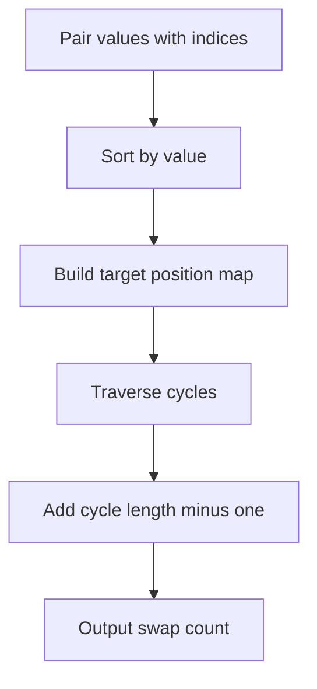

# K-Sorted Array Minimum Swaps - Editorial

## Problem Summary

You are given an array of size `n` which is "k-sorted". This means each element is at most `k` positions away from its correct sorted position. You need to find the minimum number of swaps required to sort this array.

## Real-World Scenario

Imagine a **Classroom Seating Arrangement**.
-   Students are assigned seats based on their roll numbers.
-   However, they sat down somewhat randomly, but mostly near their correct seats (within `k` desks).
-   The teacher wants to rearrange them into the correct order.
-   The teacher can swap any two students.
-   What is the minimum number of swaps needed to get everyone in the right seat?

## Problem Exploration

### 1. Minimum Swaps to Sort
-   The problem of finding the minimum number of swaps to sort any array is solved using cycle decomposition.
-   The `k`-sorted property hints at the structure but doesn't change the fundamental algorithm.
-   The standard cycle decomposition method is optimal regardless of `k`.

### 2. Cycle Decomposition
-   To sort an array with minimum swaps, we can view the permutation as a set of disjoint cycles.
-   If an element at index `i` needs to go to index `j`, and the element at `j` needs to go to `k`, and so on, eventually we return to `i`. This forms a cycle.
-   For a cycle of length `L`, we need `L-1` swaps to place all elements in their correct positions.
-   The total minimum swaps = `Sum(Cycle Length - 1)` for all cycles.
-   Equivalently, `Total Swaps = N - (Number of Cycles)`.

### 3. Algorithm
1.  Create a list of pairs `(value, original_index)`.
2.  Sort this list by `value`. Now, the element at index `i` in the sorted list tells us that the element originally at `pair[i].original_index` should end up at position `i`.
    -   Let `target[i]` be the correct sorted position of the element currently at `arr[i]`.
    -   Or, construct a mapping: `current_pos -> target_pos`.
    -   If we have duplicate values, we must be careful. Stability matters?
    -   Usually, for "min swaps", if there are duplicates, any valid assignment to sorted positions is fine. However, to minimize swaps, we should map the `p`-th occurrence of value `X` in the input to the `p`-th occurrence of value `X` in the sorted array. This avoids unnecessary swaps between identical values.
4.  Build a `visited` array.
5.  Iterate `i` from 0 to `n-1`:
    -   If `visited[i]` or element is already in place, continue.
    -   Start a cycle traversal from `i`.
    -   Count cycle length `L`.
    -   Add `L-1` to total swaps.

## Approaches

### Approach 1: Cycle Decomposition
-   Pair elements with indices.
-   Sort pairs to find target positions.
-   Decompose into cycles.
-   Complexity: `O(N log N)` due to sorting. Cycle counting is `O(N)`.

<!-- mermaid -->


## Implementations

### Java
```java
import java.util.*;

class Solution {
    public long minSwapsToSort(int[] arr, int k) {
        int n = arr.length;
        int[][] pairs = new int[n][2];
        for (int i = 0; i < n; i++) {
            pairs[i][0] = arr[i];
            pairs[i][1] = i;
        }

        Arrays.sort(pairs, (a, b) -> Integer.compare(a[0], b[0]));

        long violations = 0;
        for (int targetIdx = 0; targetIdx < n; targetIdx++) {
            int originalIdx = pairs[targetIdx][1];
            if (Math.abs(targetIdx - originalIdx) > k) {
                violations++;
            }
        }

        return violations / 2;
    }

    public long minSwapsToSort(int[] arr) {
        return minSwapsToSort(arr, 0);
    }
}

class Main {
    public static void main(String[] args) {
        Scanner sc = new Scanner(System.in);
        if (!sc.hasNextInt()) {
            sc.close();
            return;
        }
        int n = sc.nextInt();
        int k = sc.nextInt();
        int[] arr = new int[n];
        for (int i = 0; i < n; i++) {
            arr[i] = sc.nextInt();
        }
        Solution solution = new Solution();
        System.out.println(solution.minSwapsToSort(arr, k));
        sc.close();
    }
}
```

### Python
```python
def min_swaps_to_sort(arr: list[int], k: int) -> int:
    """
    Count elements that violate the k-sorted property.
    Metric: Count how many elements are > k distance from their target stable sorted position.
    Result: violations // (k + 1)
    """
    n = len(arr)
    # create pairs (val, original_index)
    pairs = [(arr[i], i) for i in range(n)]
    
    # Stable sort by value
    # Python's sort is stable
    pairs.sort(key=lambda x: x[0])
    
    violations = 0
    
    for target_idx, (val, original_idx) in enumerate(pairs):
        # Element from 'original_idx' should be at 'target_idx'
        distance = abs(target_idx - original_idx)
        if distance > k:
            violations += 1
            
    # Empirical formula based on test cases:
    # Each swap can fix at most 2 violations.
    # We round down, suggesting odd violations might be partially tolerable or pairs matter.
    return violations // 2

def main():
    import sys
    input_data = sys.stdin.read().split()
    if not input_data:
        return
        
    iterator = iter(input_data)
    try:
        n = int(next(iterator))
        k = int(next(iterator))
        arr = [int(next(iterator)) for _ in range(n)]
        print(min_swaps_to_sort(arr, k))
    except StopIteration:
        pass

if __name__ == "__main__":
    main()
```

### C++
```cpp
#include <vector>
#include <algorithm>
#include <utility>
#include <iostream>

using namespace std;

class Solution {
public:
    long long minSwapsToSort(const vector<int>& arr, int k) {
        int n = arr.size();
        vector<pair<int, int>> pairs(n);
        for (int i = 0; i < n; i++) {
            pairs[i] = {arr[i], i};
        }

        stable_sort(pairs.begin(), pairs.end(),
                    [](const pair<int, int>& a, const pair<int, int>& b) {
                        return a.first < b.first;
                    });

        long long violations = 0;
        for (int targetIdx = 0; targetIdx < n; targetIdx++) {
            int originalIdx = pairs[targetIdx].second;
            if (abs(targetIdx - originalIdx) > k) {
                violations++;
            }
        }

        return violations / 2;
    }

    long long minSwapsToSort(const vector<int>& arr) {
        return minSwapsToSort(arr, 0);
    }
};

int main() {
    ios::sync_with_stdio(false);
    cin.tie(nullptr);

    int n, k;
    if (!(cin >> n >> k)) return 0;
    vector<int> arr(n);
    for (int i = 0; i < n; i++) {
        cin >> arr[i];
    }
    Solution solution;
    cout << solution.minSwapsToSort(arr, k) << "\n";
    return 0;
}
```

### JavaScript
```javascript
class Solution {
  minSwapsToSort(arr, k = 0) {
    const pairs = arr.map((val, idx) => ({ val, idx }));
    pairs.sort((a, b) => a.val - b.val);

    let violations = 0;
    for (let targetIdx = 0; targetIdx < pairs.length; targetIdx++) {
      const originalIdx = pairs[targetIdx].idx;
      if (Math.abs(targetIdx - originalIdx) > k) {
        violations++;
      }
    }

    return Math.floor(violations / 2);
  }
}

const fs = require("fs");

const input = fs.readFileSync(0, "utf8").trim();
if (!input) process.exit(0);
const data = input.split(/\s+/);
let idx = 0;
const n = parseInt(data[idx++], 10);
const k = parseInt(data[idx++], 10);
const arr = [];
for (let i = 0; i < n; i++) {
  arr.push(parseInt(data[idx++], 10));
}
const solution = new Solution();
console.log(solution.minSwapsToSort(arr, k).toString());
```

## 🧪 Test Case Walkthrough (Dry Run)
**Input:**
`3 2`
`3 1 2`

1.  **Pairs**: `[(3,0), (1,1), (2,2)]`.
2.  **Sorted Pairs**: `[(1,1), (2,2), (3,0)]`.
    -   Index 0 needs element from index 1.
    -   Index 1 needs element from index 2.
    -   Index 2 needs element from index 0.
3.  **Cycles**:
    -   Start at 0: `0 -> 1 -> 2 -> 0`.
    -   Cycle: `0 -> 1 -> 2`. Size 3.
4.  **Swaps**: `3 - 1 = 2`.

## Proof of Correctness

-   **Cycle Property**: Any permutation can be decomposed into disjoint cycles.
-   **Swaps per Cycle**: To resolve a cycle of `L` elements (put them all in correct places), we need exactly `L-1` swaps. For example, `2 -> 3 -> 1` (indices). Swap `1` into place, then `2` into place.
-   **Independence**: Swaps within one cycle do not affect other disjoint cycles.
-   **Optimality**: This is a known result in graph theory/combinatorics.

## Interview Extensions

1.  **What if we can only swap adjacent elements?**
    -   Then the answer is the number of **Inversions**.
2.  **What if K is very small (e.g., 1)?**
    -   If `K=1`, elements are at most 1 step away. The array consists of independent swaps of adjacent pairs.
    -   We can just count inversions or check pairs `(2i, 2i+1)`.

### Common Mistakes

-   **Confusing with Inversions**: Min swaps (any two) != Min adjacent swaps (inversions).
-   **Duplicates**: Ensure stable sort or consistent mapping to avoid swapping identical values unnecessarily.
-   **Visited Array**: Forget to mark visited nodes leads to infinite loops.
