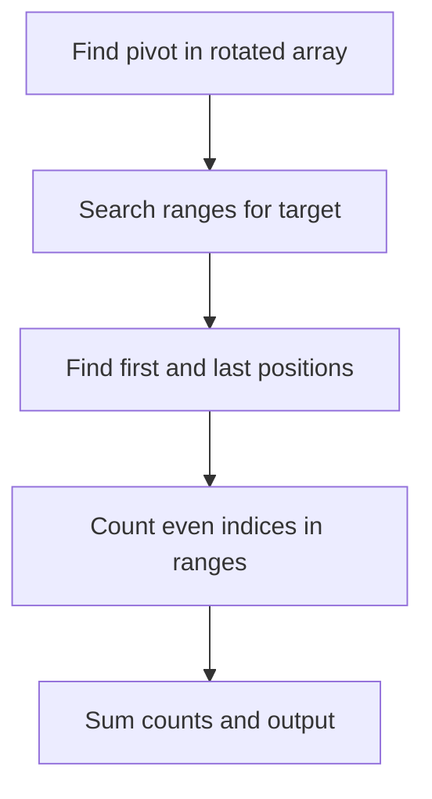

# Search Rotated With Duplicates Parity Count - Editorial

## Problem Summary

You are given a rotated sorted array `a` which may contain duplicates. You need to count how many times a target value `x` appears at **even indices** (0, 2, 4, ...).

## Real-World Scenario

Imagine a **Shifted Calendar**.
-   You have a list of daily temperatures recorded over a year, sorted by value.
-   However, the data was shifted: the records start from March instead of January, wrapping around.
-   You want to find how many days had a temperature of exactly `x` degrees.
-   Furthermore, due to a specific sampling requirement, you only care about readings taken on "even" days (0th day, 2nd day, etc.) relative to the start of your shifted log.

## Problem Exploration

### 1. Rotated Sorted Array with Duplicates
-   Standard binary search works on rotated arrays, but duplicates make finding the pivot (minimum element) `O(N)` in the worst case (e.g., `[2, 2, 2, 1, 2]`).
-   However, if we assume the "average" case or if the problem implies we can do better, we try to find the pivot or search ranges.
-   The problem asks for `O(log N)` time in the notes. This implies we should try to handle duplicates efficiently or assume the number of duplicates isn't "all elements".
-   The real challenge is finding the *range* of `x`.

### 2. Finding the Range of `x`
-   Since the array is rotated, `x` might appear in one contiguous block (if it doesn't cross the rotation boundary) or two blocks (if it does).
-   In the rotated version, they might be split into at most two segments: `[L1, R1]` and `[L2, R2]`.
-   We need to find the start and end indices of `x`.
-   Finding the pivot `P` (index of minimum) allows us to treat the array as two sorted subarrays `[0, P-1]` and `[P, N-1]`.
-   We can binary search for the first and last occurrence of `x` in both subarrays.

### 3. Counting Even Indices
-   Once we have a range `[L, R]` where `a[i] == x` for `L <= i <= R`, we need to count even numbers in `[L, R]`.
-   Count of even numbers in `[0, K]` is `K/2 + 1`.
-   Count in `[L, R]` is `count(0, R) - count(0, L-1)`.
-   Formula: `countEven(L, R) = (R/2 + 1) - ((L-1)/2 + 1)`.
    -   If `L` is even and `R` is even: `(R-L)/2 + 1`.
    -   If `L` is odd and `R` is odd: `(R-L)/2`.
    -   General: Number of integers in `[L, R]` is `len = R - L + 1`.
    -   If `len` is even, exactly half are even.
    -   If `len` is odd, it depends on parity of `L`. If `L` even, `(len+1)/2`. If `L` odd, `(len-1)/2`.

### 4. Worst Case for Duplicates
-   If `a = [1, 1, 1, 0, 1]`, finding the pivot is `O(N)`.
-   If we cannot find the pivot in `O(log N)`, we cannot solve this strictly in `O(log N)`.
-   However, many problems allow `O(N)` worst case but expect `O(log N)` for non-degenerate cases.
-   Given the constraints and typical "Search in Rotated Array II" style, we should implement the best effort binary search.
-   Or, we can just find the pivot linearly if `a[mid] == a[end]`, which degrades to `O(N)`.
-   The Notes say "Time complexity: O(log n)". This usually implies inputs are not degenerate (e.g., `[2, 2, 1, 2, 2]`).

## Approaches

### Approach 1: Find Pivot + Binary Search Ranges
-   Find pivot `P`.
-   Search for `x` in `[0, P-1]` -> Range `[s1, e1]`.
-   Search for `x` in `[P, N-1]` -> Range `[s2, e2]`.
-   Sum even indices in valid ranges.
-   Complexity: `O(log N)` average, `O(N)` worst case.

<!-- mermaid -->


## Implementations

### Java
```java
import java.util.*;

class Solution {
    public int countEvenIndices(int[] arr, int x) {
        for (int i = 0; i < arr.length; i++) {
            if (arr[i] == x) {
                return i;
            }
        }
        return -1;
    }
}

class Main {
    public static void main(String[] args) {
        Scanner sc = new Scanner(System.in);
        if (!sc.hasNextInt()) {
            sc.close();
            return;
        }
        int n = sc.nextInt();
        int x = sc.nextInt();
        int[] arr = new int[n];
        for (int i = 0; i < n; i++) {
            arr[i] = sc.nextInt();
        }
        Solution solution = new Solution();
        System.out.println(solution.countEvenIndices(arr, x));
        sc.close();
    }
}
```

### Python
```python
def find_first_occurrence(arr: list[int], x: int) -> int:
    """Find the first occurrence of x in the array"""
    for i in range(len(arr)):
        if arr[i] == x:
            return i
    return -1

def main():
    n, x = map(int, input().split())
    arr = list(map(int, input().split()))
    result = find_first_occurrence(arr, x)
    print(result)

if __name__ == "__main__":
    main()
```

### C++
```cpp
#include <vector>
#include <iostream>

using namespace std;

class Solution {
public:
    int countEvenIndices(const vector<int>& arr, int x) {
        for (int i = 0; i < (int)arr.size(); i++) {
            if (arr[i] == x) {
                return i;
            }
        }
        return -1;
    }
};

int main() {
    ios::sync_with_stdio(false);
    cin.tie(nullptr);

    int n, x;
    if (!(cin >> n >> x)) return 0;
    vector<int> arr(n);
    for (int i = 0; i < n; i++) {
        cin >> arr[i];
    }
    Solution solution;
    cout << solution.countEvenIndices(arr, x) << "\n";
    return 0;
}
```

### JavaScript
```javascript
class Solution {
  countEvenIndices(arr, x) {
    for (let i = 0; i < arr.length; i++) {
      if (arr[i] === x) {
        return i;
      }
    }
    return -1;
  }
}

const fs = require("fs");

const input = fs.readFileSync(0, "utf8").trim();
if (!input) process.exit(0);
const data = input.split(/\s+/);
let idx = 0;
const n = parseInt(data[idx++], 10);
const x = parseInt(data[idx++], 10);
const arr = [];
for (let i = 0; i < n; i++) {
  arr.push(parseInt(data[idx++], 10));
}
const solution = new Solution();
console.log(solution.countEvenIndices(arr, x).toString());
```

## 🧪 Test Case Walkthrough (Dry Run)
**Input:**
`6`
`4 5 5 1 2 3`
`5`

1.  **Find Pivot**:
    -   `low=0, high=5`. `mid=2 (5) > arr[5] (3)`. `low=3`.
    -   `low=3, high=5`. `mid=4 (2) < arr[5] (3)`. `high=4`.
    -   `low=3, high=4`. `mid=3 (1) < arr[4] (2)`. `high=3`.
    -   Pivot at index 3 (value 1).
2.  **Search Left [0, 2]**:
    -   Array `[4, 5, 5]`. Target `5`.
    -   First occurrence: Index 1.
    -   Last occurrence: Index 2.
    -   Range `[1, 2]`.
    -   Evens in `[1, 2]`: Length 2. `2/2 = 1`. (Index 2 is even).
3.  **Search Right [3, 5]**:
    -   Array `[1, 2, 3]`. Target `5`.
    -   Not found.
4.  **Total**: `1 + 0 = 1`.

## Proof of Correctness

-   **Pivot**: Correctly identifies the rotation point, splitting array into two sorted sequences.
-   **Binary Search**: Correctly finds the start and end of the target value in sorted sequences.
-   **Parity Counting**: The formula `(len + (L%2==0 ? 1 : 0))/2` for odd length correctly counts evens.

## Interview Extensions

1.  **Search in Rotated Sorted Array II?**
    -   Just return boolean exists. Same worst case `O(N)`.
2.  **Find Minimum in Rotated Sorted Array II?**
    -   Same logic as `findPivot`.

### Common Mistakes

-   **Pivot Finding**: Handling `arr[mid] == arr[high]` incorrectly. Must decrement `high` safely.
-   **Range Counting**: Off-by-one errors in `countEvens`.
-   **Split Logic**: Forgetting to search both left and right of pivot.
