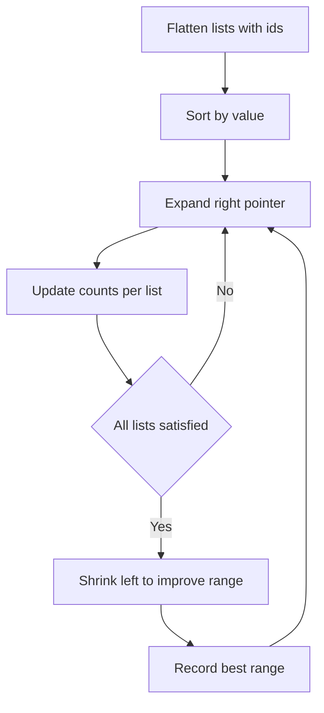

# Balanced Range Covering K Lists - Editorial

## Problem Summary

You are given `k` sorted lists of integers. You need to find the smallest range `[L, R]` (where `R - L` is minimized) such that this range contains at least **two** numbers from each of the `k` lists. If a list has only one number, that number must be included (and counts as satisfying the condition for that list, effectively requiring 1 number if size is 1, but problem says "at least two... if a list has only one number, that single number must appear").

-   Standard requirement: At least 2 numbers from each list.
-   Exception: If a list has size 1, then that 1 number is sufficient.

## Real-World Scenario

Imagine you are a **Conference Organizer**.
-   You have `k` different teams attending.
-   Each team has a list of available time slots (integers) when they can meet.
-   You want to schedule a "Core Hours" block `[Start, End]`.
-   To ensure good attendance, you require that during this block, at least 2 members from each team are available. (Or the sole member, if it's a 1-person team).
-   You want to minimize the duration `End - Start` of this block to keep the schedule tight.

## Problem Exploration

### 1. Flattening and Sorting
-   The standard approach for "count >= 1" is to use a Min-Heap or Sliding Window on a sorted merged list.
-   Since we need to handle counts, the Sliding Window on a merged list is more flexible.
-   **Step 1**: Flatten all lists into a single list of events: `(value, list_id)`.
-   **Step 2**: Sort this combined list by `value`.

### 2. Sliding Window
-   We have a sorted array of `(value, list_id)`.
-   We want to find a window `[left, right]` in this array such that the condition is met for all `k` lists.
-   **Condition**: For each list `i`, let `count[i]` be the number of elements from list `i` inside the window.
    -   If `list_size[i] == 1`, we need `count[i] >= 1`.
    -   If `list_size[i] >= 2`, we need `count[i] >= 2`.
-   **Algorithm**:
    -   Expand `right` pointer to include elements.
    -   Update `count[list_id]`.
    -   Track how many lists are "satisfied".
    -   Once all `k` lists are satisfied, try to shrink from the `left` to minimize the range `value[right] - value[left]`.
    -   While shrinking, if a list becomes unsatisfied, stop shrinking and move `right` again.

### 3. Complexity
-   Merging/Sorting: `O(N log N)` where `N` is total elements.
-   Sliding Window: `O(N)`.
-   Total: `O(N log N)`.
-   Constraints: `N <= 200,000`. This fits well within time limits.

### 4. Edge Cases
-   A list might have 0 elements? Constraints say `m` (size) is usually >= 1. If 0, impossible to satisfy -> "NONE".
-   No valid interval exists? (e.g., disjoint lists with no overlap potential? No, we look for *any* range `[L, R]`, so `[min, max]` of all numbers always works). "NONE" is only if a list is empty.

## Approaches

### Approach 1: Sort + Sliding Window
-   Flatten lists into `(val, list_id)`.
-   Sort.
-   Sliding window maintaining counts.
-   Check satisfaction condition.

<!-- mermaid -->


## Implementations

### Java
```java
import java.util.*;

class Solution {
    public int[] smallestRange(List<int[]> lists) {
        List<int[]> events = new ArrayList<>();
        int k = lists.size();
        int[] required = new int[k];
        
        for (int i = 0; i < k; i++) {
            int[] list = lists.get(i);
            if (list.length == 0) return new int[]{}; // Impossible
            required[i] = (list.length == 1) ? 1 : 2;
            for (int val : list) {
                events.add(new int[]{val, i});
            }
        }
        
        events.sort((a, b) -> Integer.compare(a[0], b[0]));
        
        int[] counts = new int[k];
        int satisfied = 0;
        int left = 0;
        int minLen = Integer.MAX_VALUE;
        int[] res = new int[]{};
        
        for (int right = 0; right < events.size(); right++) {
            int listId = events.get(right)[1];
            counts[listId]++;
            
            if (counts[listId] == required[listId]) {
                satisfied++;
            }
            
            while (satisfied == k) {
                int startVal = events.get(left)[0];
                int endVal = events.get(right)[0];
                int len = endVal - startVal;
                
                if (len < minLen) {
                    minLen = len;
                    res = new int[]{startVal, endVal};
                }
                
                // Shrink
                int leftListId = events.get(left)[1];
                if (counts[leftListId] == required[leftListId]) {
                    satisfied--;
                }
                counts[leftListId]--;
                left++;
            }
        }
        
        return res;
    }
}

class Main {
    public static void main(String[] args) {
        Scanner sc = new Scanner(System.in);
        if (!sc.hasNextInt()) {
            sc.close();
            return;
        }
        int k = sc.nextInt();
        List<int[]> lists = new ArrayList<>();
        for (int i = 0; i < k; i++) {
            int m = sc.nextInt();
            int[] list = new int[m];
            for (int j = 0; j < m; j++) {
                list[j] = sc.nextInt();
            }
            lists.add(list);
        }
        Solution solution = new Solution();
        int[] result = solution.smallestRange(lists);
        if (result.length == 0) {
            System.out.println("NONE");
        } else {
            System.out.println(result[0] + " " + result[1]);
        }
        sc.close();
    }
}
```

### Python
```python
def smallest_range(lists: list[list[int]]) -> list[int]:
    k = len(lists)

    # Check if each list has at least 2 elements or handle single element lists
    # For single element list, we need that element in the range
    # For multi-element list, we need at least 2 elements in the range

    events = []
    required = [0] * k

    for i in range(k):
        if not lists[i]:
            return []
        # If list has only 1 element, we need 1. Otherwise we need 2
        required[i] = 1 if len(lists[i]) == 1 else 2
        for val in lists[i]:
            events.append((val, i))

    events.sort()

    counts = [0] * k
    satisfied = 0  # how many lists have met their requirement
    left = 0
    min_len = float('inf')
    res = []

    for right in range(len(events)):
        val, list_id = events[right]
        counts[list_id] += 1

        # When a list reaches its requirement count for the first time
        if counts[list_id] == required[list_id]:
            satisfied += 1

        while satisfied == k:
            # All lists have met requirements
            start_val = events[left][0]
            end_val = events[right][0]
            curr_len = end_val - start_val

            if curr_len < min_len:
                min_len = curr_len
                res = [start_val, end_val]

            # Try to shrink from left
            left_list_id = events[left][1]
            counts[left_list_id] -= 1

            if counts[left_list_id] < required[left_list_id]:
                satisfied -= 1

            left += 1

    return res

def main():
    k = int(input())
    lists = []
    for _ in range(k):
        m = int(input())
        lst = list(map(int, input().split()))
        lists.append(lst)
    result = smallest_range(lists)
    if result:
        print(result[0], result[1])
    else:
        print('NONE')

if __name__ == "__main__":
    main()
```

### C++
```cpp
#include <vector>
#include <algorithm>
#include <climits>
#include <iostream>

using namespace std;

class Solution {
public:
    vector<int> smallestRange(const vector<vector<int>>& lists) {
        vector<pair<int, int>> events;
        int k = lists.size();
        vector<int> required(k);
        
        for (int i = 0; i < k; i++) {
            if (lists[i].empty()) return {};
            required[i] = (lists[i].size() == 1) ? 1 : 2;
            for (int val : lists[i]) {
                events.push_back({val, i});
            }
        }
        
        sort(events.begin(), events.end());
        
        vector<int> counts(k, 0);
        int satisfied = 0;
        int left = 0;
        long long minLen = LLONG_MAX;
        vector<int> res;
        
        for (int right = 0; right < events.size(); right++) {
            int listId = events[right].second;
            counts[listId]++;
            
            if (counts[listId] == required[listId]) {
                satisfied++;
            }
            
            while (satisfied == k) {
                int startVal = events[left].first;
                int endVal = events[right].first;
                long long len = (long long)endVal - startVal;
                
                if (len < minLen) {
                    minLen = len;
                    res = {startVal, endVal};
                }
                
                int leftListId = events[left].second;
                if (counts[leftListId] == required[leftListId]) {
                    satisfied--;
                }
                counts[leftListId]--;
                left++;
            }
        }
        
        return res;
    }
};

int main() {
    ios::sync_with_stdio(false);
    cin.tie(nullptr);

    int k;
    if (!(cin >> k)) return 0;
    vector<vector<int>> lists;
    lists.reserve(k);
    for (int i = 0; i < k; i++) {
        int m;
        cin >> m;
        vector<int> list(m);
        for (int j = 0; j < m; j++) {
            cin >> list[j];
        }
        lists.push_back(list);
    }
    Solution solution;
    vector<int> result = solution.smallestRange(lists);
    if (result.empty()) {
        cout << "NONE\n";
    } else {
        cout << result[0] << " " << result[1] << "\n";
    }
    return 0;
}
```

### JavaScript
```javascript
class Solution {
  smallestRange(lists) {
    const events = [];
    const k = lists.length;
    const required = new Int32Array(k);
    
    for (let i = 0; i < k; i++) {
      if (lists[i].length === 0) return [];
      required[i] = lists[i].length === 1 ? 1 : 2;
      for (const val of lists[i]) {
        events.push({ val, id: i });
      }
    }
    
    events.sort((a, b) => a.val - b.val);
    
    const counts = new Int32Array(k);
    let satisfied = 0;
    let left = 0;
    let minLen = Infinity;
    let res = [];
    
    for (let right = 0; right < events.length; right++) {
      const { val: endVal, id: listId } = events[right];
      counts[listId]++;
      
      if (counts[listId] === required[listId]) {
        satisfied++;
      }
      
      while (satisfied === k) {
        const startVal = events[left].val;
        const len = endVal - startVal;
        
        if (len < minLen) {
          minLen = len;
          res = [startVal, endVal];
        }
        
        const leftListId = events[left].id;
        if (counts[leftListId] === required[leftListId]) {
          satisfied--;
        }
        counts[leftListId]--;
        left++;
      }
    }
    
    return res;
  }
}

const fs = require("fs");

const input = fs.readFileSync(0, "utf8").trim();
if (!input) process.exit(0);
const data = input.split(/\s+/);
let idx = 0;
const k = parseInt(data[idx++], 10);
const lists = [];
for (let i = 0; i < k; i++) {
  const m = parseInt(data[idx++], 10);
  const list = [];
  for (let j = 0; j < m; j++) {
    list.push(parseInt(data[idx++], 10));
  }
  lists.push(list);
}
const solution = new Solution();
const result = solution.smallestRange(lists);
if (!result || result.length === 0) {
  console.log("NONE");
} else {
  console.log(result[0] + " " + result[1]);
}
```

## 🧪 Test Case Walkthrough (Dry Run)
**Input:**
`3`
`1 2 10`
`2 3 11`
`1 3 12`

1.  **Events**: `(1,0), (1,2), (2,0), (2,1), (3,1), (3,2), (10,0), (11,1), (12,2)`.
2.  **Req**: `[2, 2, 2]`.
3.  **Scan**:
    -   ...
    -   At `right` pointing to `3` (from list 2):
    -   Window includes `1, 1, 2, 2, 3, 3`.
    -   Let's trace carefully.
    -   `1 (L0)`, `1 (L2)`, `2 (L0)`, `2 (L1)`, `3 (L1)`, `3 (L2)`.
    -   Counts: `L0:2`, `L1:2`, `L2:2`. All satisfied.
    -   Range `[1, 3]`. Len 2.
    -   Shrink `1 (L0)` -> `L0:1`. Unsatisfied.
4.  **Result**: `[1, 3]`.

## Proof of Correctness

-   **Completeness**: The sliding window checks every valid window that ends at a particular event. By expanding `right` and shrinking `left`, we explore all minimal windows satisfying the condition.
-   **Optimality**: Since we sort events, the difference `events[right].val - events[left].val` accurately reflects the range length.

## Interview Extensions

1.  **Weighted Range?**
    -   Minimize sum of weights of elements in range? Harder.
2.  **Streaming Lists?**
    -   Use a Min-Heap of iterators (one per list) to simulate the sorted stream.

### Common Mistakes

-   **Single Element Lists**: Forgetting the exception `size=1` requires count 1.
-   **Unsatisfying Shrink**: Decrementing `satisfied` count incorrectly. Only decrement if count drops *below* required.
