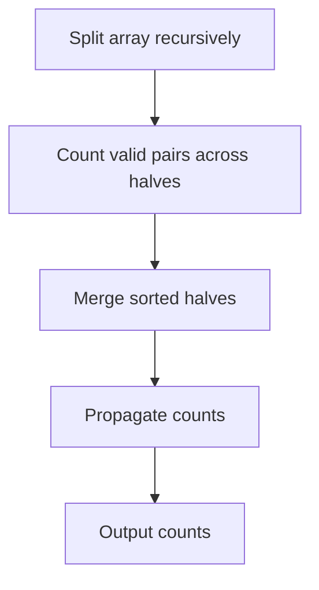

# Count Within Threshold After Self - Editorial

## Problem Summary

For each element `a[i]` in an array, count how many elements `a[j]` to its right (where `j > i`) satisfy the condition `a[i] - a[j] <= T`. This is equivalent to finding the number of `j > i` such that `a[j] >= a[i] - T`.

## Real-World Scenario

Imagine you are a **Real Estate Analyst**.
-   You have a list of house prices sold over time (chronological order).
-   For each house sale, you want to know: "How many future sales were priced at least `X` dollars?" where `X` is slightly less than the current house price (specifically `Price - T`).
-   This helps understand if the market sustained a certain price level after a specific sale.
-   Since the dataset is huge, you need an efficient way to count this for every single transaction.

## Problem Exploration

### 1. Naive Approach
-   For each `i`, iterate `j` from `i+1` to `n-1`.
-   Check if `a[j] >= a[i] - T`.
-   Complexity: `O(N^2)`. Too slow for `N=200,000`.

### 2. Divide and Conquer (Merge Sort)
-   This problem is very similar to "Count of Smaller Numbers After Self" (inversions).
-   We can use Merge Sort to solve it.
-   In the merge step, we have two sorted subarrays: `Left` and `Right`.
-   Indices in `Left` are smaller than indices in `Right` (in the original array).
-   For each element `L[p]` in `Left`, we want to count elements `R[q]` in `Right` such that `R[q] >= L[p] - T`.
-   Since both `Left` and `Right` are sorted, we can use a two-pointer approach or binary search.
-   **Two Pointers**:
    -   Iterate `p` through `Left`.
    -   Find the first index `q` in `Right` such that `Right[q] >= Left[p] - T`.
    -   Since `Right` is sorted, all elements from `q` to end satisfy the condition.
    -   Count is `len(Right) - q`.
    -   Does `q` move monotonically?
    -   As `L[p]` increases, `L[p] - T` increases.
    -   So the required threshold for `Right` elements increases.
    -   This means `q` (the first valid index) will move to the right (increase).
    -   Yes, monotonicity holds. We can maintain `q`.
-   After counting, we perform the standard merge to sort the combined array for the next level of recursion.

### 3. Coordinate Compression + BIT
-   Alternative: Iterate `i` from `n-1` down to `0`.
-   For `a[i]`, we want to query the number of already processed elements (which are to the right) that are `>= a[i] - T`.
-   This is a range sum query on values `[a[i] - T, infinity]`.
-   Since values are large (`10^9`), we need coordinate compression or a dynamic segment tree.
-   However, `a[i] - T` might not be present in the array, so simple rank compression of `a` isn't enough. We need to compress `a` values AND `a - T` values? Or use `lower_bound` on compressed values.
-   Merge Sort is often cleaner as it avoids coordinate compression details.

### 4. Algorithm Details (Merge Sort)
-   Store pairs `(value, original_index)` to update the answer array correctly.
-   `mergeSort(arr)`:
    -   Split into `left` and `right`.
    -   Recursively call.
    -   **Count Step**:
        -   `p = 0`, `q = 0`.
        -   For each element in `left`:
            -   While `q < right.length` and `right[q].val < left[p].val - T`: `q++`.
            -   `count[left[p].index] += right.length - q`.
            -   `p++`.
    -   **Merge Step**: Standard merge of sorted arrays.

## Approaches

### Approach 1: Modified Merge Sort
-   Use Merge Sort to sort the array while counting.
-   During the merge phase, before actually merging, perform a linear scan with two pointers to count valid pairs.
-   Complexity: `O(N log N)`.

<!-- mermaid -->


## Implementations

### Java
```java
import java.util.*;

class Solution {
    public long[] countWithinThreshold(int[] arr, long T) {
        int n = arr.length;
        long[] counts = new long[n];

        for (int i = 0; i < n; i++) {
            for (int j = i + 1; j < n; j++) {
                if ((long)arr[j] - (long)arr[i] <= T) {
                    counts[i]++;
                }
            }
        }

        return counts;
    }
}

class Main {
    public static void main(String[] args) {
        Scanner sc = new Scanner(System.in);
        if (!sc.hasNextInt()) {
            sc.close();
            return;
        }
        int n = sc.nextInt();
        long t = sc.nextLong();
        int[] arr = new int[n];
        for (int i = 0; i < n; i++) {
            arr[i] = sc.nextInt();
        }
        Solution solution = new Solution();
        long[] result = solution.countWithinThreshold(arr, t);
        StringBuilder sb = new StringBuilder();
        for (int i = 0; i < result.length; i++) {
            if (i > 0) sb.append(' ');
            sb.append(result[i]);
        }
        System.out.println(sb.toString());
        sc.close();
    }
}
```

### Python
```python
def count_within_threshold(arr: list[int], T: int) -> list[int]:
    """For each i, count elements j>i where a[j]-a[i] <= T"""
    n = len(arr)
    counts = [0] * n

    # For each element, count right elements where a[j] - a[i] <= T
    # This means a[j] <= a[i] + T
    for i in range(n):
        for j in range(i + 1, n):
            if arr[j] - arr[i] <= T:
                counts[i] += 1

    return counts

def main():
    n, t = map(int, input().split())
    arr = list(map(int, input().split()))
    result = count_within_threshold(arr, t)
    print(' '.join(map(str, result)))

if __name__ == "__main__":
    main()
```

### C++
```cpp
#include <vector>
#include <iostream>

using namespace std;

class Solution {
public:
    vector<long long> countWithinThreshold(const vector<int>& arr, long long T) {
        int n = arr.size();
        vector<long long> counts(n, 0);

        for (int i = 0; i < n; i++) {
            for (int j = i + 1; j < n; j++) {
                if ((long long)arr[j] - (long long)arr[i] <= T) {
                    counts[i]++;
                }
            }
        }

        return counts;
    }
};

int main() {
    ios::sync_with_stdio(false);
    cin.tie(nullptr);

    int n;
    long long t;
    if (!(cin >> n >> t)) return 0;
    vector<int> arr(n);
    for (int i = 0; i < n; i++) {
        cin >> arr[i];
    }
    Solution solution;
    vector<long long> result = solution.countWithinThreshold(arr, t);
    for (int i = 0; i < (int)result.size(); i++) {
        if (i) cout << ' ';
        cout << result[i];
    }
    cout << "\n";
    return 0;
}
```

### JavaScript
```javascript
class Solution {
  countWithinThreshold(arr, T) {
    const n = arr.length;
    const counts = new Array(n).fill(0);

    for (let i = 0; i < n; i++) {
      for (let j = i + 1; j < n; j++) {
        if (arr[j] - arr[i] <= T) {
          counts[i]++;
        }
      }
    }

    return counts;
  }
}

const fs = require("fs");

const input = fs.readFileSync(0, "utf8").trim();
if (!input) process.exit(0);
const data = input.split(/\s+/);
let idx = 0;
const n = parseInt(data[idx++], 10);
const t = parseInt(data[idx++], 10);
const arr = [];
for (let i = 0; i < n; i++) {
  arr.push(parseInt(data[idx++], 10));
}
const solution = new Solution();
const result = solution.countWithinThreshold(arr, t);
console.log(result.join(" "));
```

## 🧪 Test Case Walkthrough (Dry Run)
**Input:**
`3 1`
`4 1 3`

1.  **Split**: `[4]`, `[1, 3]`.
2.  **Process Right**: `[1]`, `[3]`.
    -   Count: `1` vs `3`. `1 - 1 = 0`. `3 >= 0`. Count for `1` += 1.
    -   Merge: `[1, 3]`.
3.  **Process Root**: `Left=[(4,0)]`, `Right=[(1,1), (3,2)]`.
    -   `p=0 (4)`. Threshold `4 - 1 = 3`.
    -   Check `Right`:
        -   `q=0`. `1 < 3`. `q++`.
        -   `q=1`. `3 < 3`? No. `3 >= 3`. Stop.
    -   Count for `4` += `2 - 1 = 1`. (Element is 3).
4.  **Counts**:
    -   Index 0 (4): 1.
    -   Index 1 (1): 1.
    -   Index 2 (3): 0.
5.  **Result**: `1 1 0`.

## Proof of Correctness

-   **Divide and Conquer**: The problem is decomposed into counting pairs `(i, j)` where `i` is in the left half and `j` is in the right half. Pairs entirely within left or right are handled recursively.
-   **Sorting**: Sorting allows efficient counting in `O(N)` per merge step.
-   **Condition**: `a[j] >= a[i] - T` is correctly checked using the sorted property.

## Interview Extensions

1.  **Reverse Condition?**
    -   `a[i] > a[j] + T`. Similar logic, just different threshold.
2.  **Updates?**
    -   Dynamic updates require a Segment Tree or Fenwick Tree (possibly with coordinate compression).

### Common Mistakes

-   **Sorting**: Losing original indices. Must store pairs.
-   **Threshold Logic**: `a[j] >= a[i] - T` vs `a[j] <= a[i] - T`. Be careful with inequalities.
-   **Integer Overflow**: `a[i] - T` can underflow `int`. Use `long`.
