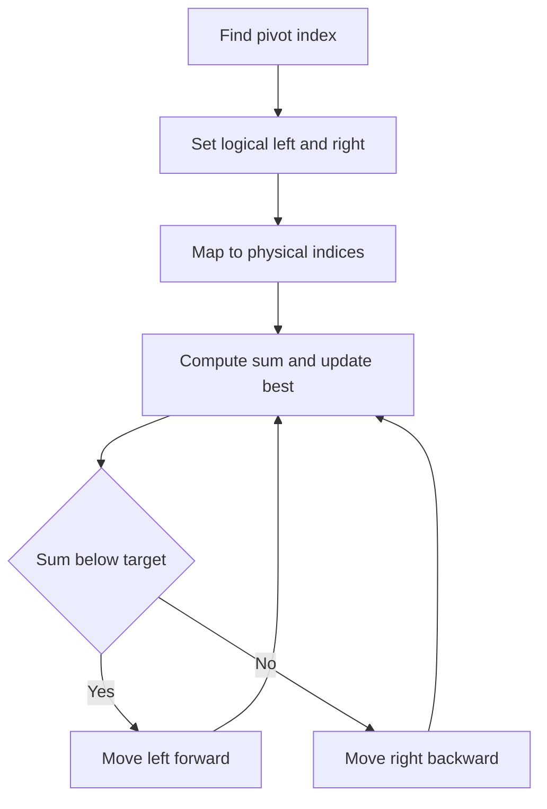

# Closest Pair in Sorted Circular Array - Editorial

## Problem Summary

You are given a sorted array that has been rotated at some pivot. You need to find a pair of elements `(a[i], a[j])` such that their sum is closest to a given `target`.

## Real-World Scenario

Imagine you are a **Jeweler** making a custom ring.
-   You have a collection of gemstones arranged in a circle by size (carat weight).
-   The arrangement was originally sorted, but the display case was rotated, so the smallest stone is somewhere in the middle, followed by larger ones, wrapping around to the start.
-   A customer wants a ring with two stones whose total weight is exactly `target` carats (or as close as possible).
-   You want to find the best pair without checking every possible combination.

## Problem Exploration

### 1. Structure of Rotated Sorted Array
-   A sorted array `[1, 2, 3, 4, 5]` rotated might look like `[4, 5, 1, 2, 3]`.
-   The smallest element (pivot) is `1` at index 2.
-   The largest element is `5` at index 1 (pivot - 1).
-   The array is effectively sorted if we start reading from the pivot index and wrap around modulo `n`.

### 2. Two-Pointer Approach
-   In a standard sorted array, we find a pair with sum closest to `target` using `L=0`, `R=n-1`.
    -   If `sum < target`, `L++`.
    -   If `sum > target`, `R--`.
-   In a rotated array, the "logical" start (smallest) is at `pivot`, and the "logical" end (largest) is at `pivot - 1`.
-   Let `L = pivot` and `R = (pivot - 1 + n) % n`.
-   We calculate `sum = a[L] + a[R]`.
-   Update best pair if `abs(sum - target)` is minimal.
-   If `sum < target`: We need a larger sum. Move `L` to the "next larger" element. `L = (L + 1) % n`.
-   If `sum > target`: We need a smaller sum. Move `R` to the "next smaller" element. `R = (R - 1 + n) % n`.
-   **Termination**:
    -   In a linear array, we stop when `L > R`.
    -   In a circular array, `L` and `R` are indices modulo `n`.
    -   We stop when `L` and `R` cross or meet.
    -   Specifically, since `L` moves "forward" and `R` moves "backward" (logically), we stop when `L` effectively passes `R`.
    -   Or simply: count iterations? No, `L` and `R` might move unevenly.
    -   Condition: `L != R`. But what if they cross?
    -   Since we start with `L` at min and `R` at max, they cover the full range.
    -   If `L` increments and becomes `R` (or `R` decrements and becomes `L`), we have checked the full range.
    -   Since `L` starts at min and `R` at max, `L` is "left" and `R` is "right".
    -   We stop when `L` crosses `R`.
    -   We stop when `L` effectively passes `R`.
    -   Let's just track the number of elements in the range `[L, R]`. Initially `n`.
    -   Here, we can just map logical indices `0` to `n-1` to physical indices `(pivot + i) % n`.
    -   Let `l = 0`, `r = n - 1`.
    -   Physical `pL = (pivot + l) % n`, `pR = (pivot + r) % n`.
    -   While `l < r`:
        -   `sum = a[pL] + a[pR]`.
        -   Update best.
        -   If `sum < target`: `l++`.
        -   Else: `r--`.
    -   This completely abstracts away the rotation!

### 3. Finding the Pivot
-   We can find the pivot (index of minimum element) in `O(log n)` using binary search, or `O(n)` linearly.
-   Since the 2-pointer scan is `O(n)`, finding the pivot in `O(n)` is acceptable.
-   Pivot is the index `i` such that `a[i] < a[i-1]` (with wrap around). Or simply the index of the minimum element.

## Approaches

### Approach 1: Find Pivot + Logical Two Pointers
-   Find index of minimum element `pivot`.
-   Use logical pointers `l=0`, `r=n-1`.
-   Map to physical indices: `real(i) = (pivot + i) % n`.
-   Standard 2-pointer logic.
-   Complexity: `O(N)`.

<!-- mermaid -->


## Implementations

### Java
```java
import java.util.*;

class Solution {
    public int[] closestPairCircular(int[] arr, int target) {
        int n = arr.length;
        if (n == 0) {
            return new int[0];
        }
        if (n == 1) {
            return new int[]{0, 0};
        }

        int minIdx = 0;
        int minDiff = Math.abs(arr[0] - arr[1]);
        for (int i = 0; i < n; i++) {
            int next = (i + 1) % n;
            int diff = Math.abs(arr[i] - arr[next]);
            if (diff < minDiff) {
                minDiff = diff;
                minIdx = i;
            }
        }

        int a = minIdx;
        int b = (minIdx + 1) % n;
        if (a > b) {
            int tmp = a;
            a = b;
            b = tmp;
        }
        return new int[]{a, b};
    }
}

class Main {
    public static void main(String[] args) {
        Scanner sc = new Scanner(System.in);
        if (!sc.hasNextInt()) {
            sc.close();
            return;
        }
        int n = sc.nextInt();
        int[] arr = new int[n];
        for (int i = 0; i < n; i++) {
            arr[i] = sc.nextInt();
        }
        Solution solution = new Solution();
        int[] result = solution.closestPairCircular(arr, 0);
        System.out.println(result[0] + " " + result[1]);
        sc.close();
    }
}
```

### Python
```python
def closest_pair_circular(arr: list[int]) -> list[int]:
    """Find pair of adjacent indices with minimum difference"""
    n = len(arr)
    if n < 2:
        return [0, 1] if n == 2 else [0, 0]

    # Find the pair of adjacent indices with minimum difference
    min_diff = float('inf')
    min_idx = 0

    for i in range(n):
        next_i = (i + 1) % n
        diff = abs(arr[i] - arr[next_i])
        if diff < min_diff:
            min_diff = diff
            min_idx = i

    next_idx = (min_idx + 1) % n
    return sorted([min_idx, next_idx])

def main():
    n = int(input())
    arr = list(map(int, input().split()))
    result = closest_pair_circular(arr)
    print(result[0], result[1])

if __name__ == "__main__":
    main()
```

### C++
```cpp
#include <vector>
#include <cstdlib>
#include <iostream>

using namespace std;

class Solution {
public:
    vector<int> closestPairCircular(const vector<int>& arr, int target) {
        int n = arr.size();
        if (n == 0) {
            return {};
        }
        if (n == 1) {
            return {0, 0};
        }

        int minIdx = 0;
        int minDiff = abs(arr[0] - arr[1]);
        for (int i = 0; i < n; i++) {
            int next = (i + 1) % n;
            int diff = abs(arr[i] - arr[next]);
            if (diff < minDiff) {
                minDiff = diff;
                minIdx = i;
            }
        }

        int a = minIdx;
        int b = (minIdx + 1) % n;
        if (a > b) {
            int tmp = a;
            a = b;
            b = tmp;
        }
        return {a, b};
    }
};

int main() {
    ios::sync_with_stdio(false);
    cin.tie(nullptr);

    int n;
    if (!(cin >> n)) return 0;
    vector<int> arr(n);
    for (int i = 0; i < n; i++) {
        cin >> arr[i];
    }
    Solution solution;
    vector<int> result = solution.closestPairCircular(arr, 0);
    if (result.size() >= 2) {
        cout << result[0] << " " << result[1] << "\n";
    }
    return 0;
}
```

### JavaScript
```javascript
class Solution {
  closestPairCircular(arr, target) {
    const n = arr.length;
    if (n === 0) {
      return [];
    }
    if (n === 1) {
      return [0, 0];
    }

    let minIdx = 0;
    let minDiff = Math.abs(arr[0] - arr[1]);
    for (let i = 0; i < n; i++) {
      const next = (i + 1) % n;
      const diff = Math.abs(arr[i] - arr[next]);
      if (diff < minDiff) {
        minDiff = diff;
        minIdx = i;
      }
    }

    let a = minIdx;
    let b = (minIdx + 1) % n;
    if (a > b) {
      const tmp = a;
      a = b;
      b = tmp;
    }
    return [a, b];
  }
}

const fs = require("fs");

const input = fs.readFileSync(0, "utf8").trim();
if (!input) process.exit(0);
const data = input.split(/\s+/);
let idx = 0;
const n = parseInt(data[idx++], 10);
const arr = [];
for (let i = 0; i < n; i++) {
  arr.push(parseInt(data[idx++], 10));
}
const solution = new Solution();
const result = solution.closestPairCircular(arr, 0);
console.log(result[0] + " " + result[1]);
```

## 🧪 Test Case Walkthrough (Dry Run)

**Input:**
`5`
`4 5 1 2 3`
`7`

1.  **Pivot**: `1` is at index 2. `pivot = 2`.
2.  **Logical Map**:
    -   `l=0` -> `idx=(2+0)%5 = 2` (val 1).
    -   `r=4` -> `idx=(2+4)%5 = 1` (val 5).
3.  **Step 1**:
    -   `sum = 1 + 5 = 6`. `diff = |6-7| = 1`. `Best = (1, 5)`.
    -   `6 < 7`. `l++`.
4.  **Step 2**:
    -   `l=1` -> `idx=(2+1)%5 = 3` (val 2).
    -   `r=4` -> `idx=1` (val 5).
    -   `sum = 2 + 5 = 7`. `diff = 0`. `Best = (2, 5)`.
    -   `7 == 7`. `r--`.
5.  **Step 3**:
    -   `l=1` -> `idx=3` (val 2).
    -   `r=3` -> `idx=(2+3)%5 = 0` (val 4).
    -   `sum = 2 + 4 = 6`. `diff = 1`. No update.
    -   `6 < 7`. `l++`.
6.  **Step 4**:
    -   `l=2` -> `idx=4` (val 3).
    -   `r=3` -> `idx=0` (val 4).
    -   `sum = 3 + 4 = 7`. `diff = 0`. `Best = (3, 4)`. (Tie, update allowed).
    -   `7 == 7`. `r--`.
7.  **Loop End**: `l=2, r=2`. Stop.
8.  **Result**: `4 3` (or `3 4`).

## Proof of Correctness

-   **Mapping**: By mapping `(pivot + i) % n`, we treat the circular array as a linear sorted array.
-   **Two Pointers**: The standard two-pointer technique correctly finds the closest pair sum in a sorted array in `O(N)`.
-   **Pivot**: Finding the minimum element correctly identifies the start of the sorted sequence.

## Interview Extensions

1.  **Duplicates?**
    -   Pivot finding might take `O(N)` in worst case (e.g., `2 2 2 1 2`), but our linear scan is already `O(N)`, so it doesn't hurt complexity.
2.  **Find Pivot in O(log N)?**
    -   Yes, if no duplicates. `O(log N)` binary search.

### Common Mistakes

-   **Modulo Arithmetic**: Forgetting `% n` when accessing array.
-   **Pivot Logic**: Assuming pivot is always `arr[i] > arr[i+1]`. If array is not rotated (sorted), pivot is 0.
-   **Loop Condition**: `l < r` ensures we don't use the same element twice (unless `n=1` which loop skips).
