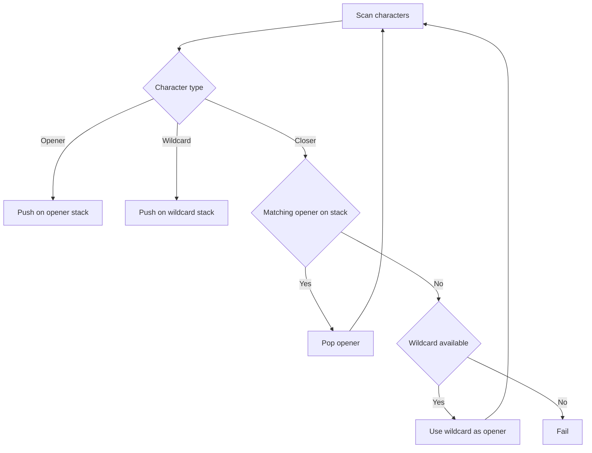

# Lab Mixed Bracket Repair - Editorial

## Problem Summary

You are given a string containing brackets `()[]{}` and wildcards `?`. Each `?` can be replaced by any single bracket character. Determine if it is possible to replace all `?`s such that the resulting string is balanced and well-nested.


## Constraints

- `1 <= |s| <= 100000`
- `s` contains only `()[]{}` and `?`
## Real-World Scenario

Imagine you are a **Code Linter** analyzing a corrupted source code file.
-   Some characters have been corrupted and appear as `?`.
-   You know the code relies heavily on nested structures (functions `{}`, arrays `[]`, expressions `()`).
-   You want to check if there is *any* way to interpret the corrupted characters so that the code's structure remains valid.
-   If no such interpretation exists, you flag the file as "Irreparably Broken".

## Problem Exploration

### 1. The Power of Wildcards
-   A `?` is extremely flexible. It can become any opener `(`, `[`, `{` or any closer `)`, `]`, `}`.
-   This flexibility suggests a greedy approach. We should use `?` to fix immediate problems if possible, but save it for later if not needed immediately.

### 2. Constraints
-   The string length `N` is up to `100,000`.
-   We need an `O(N)` solution. Trying all replacements (`6^count(?)`) is impossible.

### 3. Two-Pass Greedy Strategy
-   With multiple types, we must ensure specific openers match specific closers (e.g., `(` must match `)`).
-   **Key Insight**: We should prioritize matching actual brackets with each other. If a specific opener (like `(`) matches a specific closer (like `)`), we should pair them up. If they mismatch (like `[` and `)`), we *must* use a `?` to resolve the conflict (by turning `?` into the required opener).

## Approaches

### Approach 1: Two-Stack Greedy
-   We use two stacks:
    1.  `LeftStack`: Stores indices of open brackets `(`, `[`, `{`.
    2.  `StarStack`: Stores indices of wildcards `?`.
-   **Pass 1 (Left to Right)**: Handle Closers.
    -   Iterate through the string.
    -   If char is `(`, `[`, `{`: Push index to `LeftStack`.
    -   If char is `?`: Push index to `StarStack`.
    -   If char is `)`, `]`, `}`:
        -   Check `LeftStack`. If the top matches (e.g., `(` for `)`), pop `LeftStack`. (Prioritize exact match).
        -   If `LeftStack` top mismatches or is empty, check `StarStack`. If available, pop `StarStack`. (Use `?` as the matching opener).
        -   If neither is available/valid, return `false`.
-   **Pass 2 (Cleanup)**: Handle Remaining Openers.
    -   After Pass 1, we might have unmatched openers in `LeftStack` and unused `?` in `StarStack`.
    -   We need to pair each remaining opener with a `?` that appears *after* it (to act as a closer).
    -   Iterate while `LeftStack` is not empty:
        -   If `StarStack` is empty, return `false`.
        -   If `LeftStack.top() < StarStack.top()`: Pop both. (Valid pair).
        -   Else: Return `false` (Wildcard is before opener, cannot close it).
-   **Final Check**:
    -   The remaining `?`s in `StarStack` must be paired with each other. Since `?` can be anything, any even number of `?`s can form valid pairs (e.g., `()`, `[]`).
    -   Return `StarStack.size() % 2 == 0`.

<!-- mermaid -->


## Implementations

### Java
```java
import java.util.*;
import java.io.*;

class Solution {
    public int countChanges(String s) {
        Stack<Character> stack = new Stack<>();
        String opens = "([{";
        String closes = ")]}";
        Map<Character, Character> pairs = new HashMap<>();
        pairs.put(')', '(');
        pairs.put(']', '[');
        pairs.put('}', '{');
        
        for (char c : s.toCharArray()) {
            if (opens.indexOf(c) != -1) {
                stack.push(c);
            } else if (closes.indexOf(c) != -1) {
                if (!stack.isEmpty() && stack.peek() == pairs.get(c)) {
                    stack.pop();
                } else {
                    stack.push(c);
                }
            } else if (c == '?') {
                stack.push('(');
            }
        }
        
        return stack.size();
    }
}

class Main {
    public static void main(String[] args) throws IOException {
        BufferedReader br = new BufferedReader(new InputStreamReader(System.in));
        StringBuilder sb = new StringBuilder();
        String line;
        while ((line = br.readLine()) != null) {
            sb.append(line);
        }
        String s = sb.toString().trim();
        
        if (s.isEmpty()) {
            System.out.println(0);
            return;
        }

        Solution sol = new Solution();
        System.out.println(sol.countChanges(s));
    }
}
```

### Python
```python
def count_changes(s: str) -> int:
    """
    Count minimum number of characters to change to make brackets balanced.
    Uses a stack to track unmatched characters.
    """
    stack = []

    for c in s:
        if c in '([{':
            stack.append(c)
        elif c in ')]}':
            pairs = {')': '(', ']': '[', '}': '{'}
            if stack and stack[-1] == pairs[c]:
                stack.pop()
            else:
                stack.append(c)
        elif c == '?':
            # Wildcard - treat as opening bracket
            stack.append('(')

    # Count unmatched characters
    # Each unmatched character needs to be changed to balance
    return len(stack)


def main():
    import sys
    s = sys.stdin.read().strip()
    result = count_changes(s)
    print(result)

if __name__ == "__main__":
    main()
```

### C++
```cpp
#include <iostream>
#include <string>
#include <stack>
#include <vector>
#include <map>

using namespace std;

class Solution {
public:
    int countChanges(string s) {
        // Count minimum number of changes to make brackets balanced.
        // Stack tracks unmatched open brackets.
        
        stack<char> st;
        int n = s.length();
        
        string opens = "([{";
        string closes = ")]}";
        map<char, char> pairs;
        pairs[')'] = '(';
        pairs[']'] = '[';
        pairs['}'] = '{';
        
        for (char c : s) {
            if (opens.find(c) != string::npos) {
                st.push(c);
            } else if (closes.find(c) != string::npos) {
                if (!st.empty() && st.top() == pairs[c]) {
                    st.pop();
                } else {
                    st.push(c);
                }
            } else if (c == '?') {
                // Wildcard treated as open bracket as per Python reference?
                // Python: elif c == '?': stack.append('(')
                st.push('(');
            }
        }
        
        // Python logic returns len(stack).
        // This implies each remaining char in stack is an unmatched bracket requiring change.
        return st.size();
    }
};

int main() {
    ios::sync_with_stdio(false);
    cin.tie(nullptr);
    
    // Read all input until EOF
    string s;
    char c;
    while (cin.get(c)) {
        s += c;
    }
    
    // Trim string (remove trailing newline/whitespace if any)
    while (!s.empty() && isspace(s.back())) s.pop_back();
    while (!s.empty() && isspace(s.front())) s.erase(0, 1);

    if (s.empty()) {
        cout << 0 << endl;
        return 0;
    }

    Solution sol;
    cout << sol.countChanges(s) << endl;
    
    return 0;
}
```

### JavaScript
```javascript
class Solution {
  countChanges(s) {
    const stack = [];
    const opens = "([{";
    const closes = ")]}";
    const pairs = { ')': '(', ']': '[', '}': '{' };

    for (const c of s) {
      if (opens.includes(c)) {
        stack.push(c);
      } else if (closes.includes(c)) {
        if (stack.length > 0 && stack[stack.length - 1] === pairs[c]) {
          stack.pop();
        } else {
          stack.push(c);
        }
      } else if (c === '?') {
        stack.push('(');
      }
    }
    return stack.length;
  }
}

const readline = require("readline");
const rl = readline.createInterface({
  input: process.stdin,
  output: process.stdout,
});

let data = "";
rl.on("line", (line) => {
  data += line;
});

rl.on("close", () => {
  const s = data.trim();
  if (s.length === 0) {
      console.log(0);
      return;
  }
  const solution = new Solution();
  console.log(solution.countChanges(s));
});
```

## 🧪 Test Case Walkthrough (Dry Run)
**Input:** `(?[?])??`

1.  **Pass 1**:
    -   `(` (0) -> `LeftStack: [0]`
    -   `?` (1) -> `StarStack: [1]`
    -   `[` (2) -> `LeftStack: [0, 2]`
    -   `?` (3) -> `StarStack: [1, 3]`
    -   `]` (4) -> Matches `[` (2). Pop `LeftStack`. `LeftStack: [0]`.
    -   `)` (5) -> Matches `(` (0). Pop `LeftStack`. `LeftStack: []`.
    -   `?` (6) -> `StarStack: [1, 3, 6]`
    -   `?` (7) -> `StarStack: [1, 3, 6, 7]`
2.  **Pass 2**:
    -   `LeftStack` is empty. No matching needed.
3.  **Final Check**:
    -   `StarStack` size is 4. Even.
    -   Return `true`.

## Proof of Correctness

-   **Priority**: By prioritizing exact matches in Pass 1, we ensure that specific constraints are met whenever possible. Using a `?` to match a closer is a fallback that consumes a wildcard (making it an opener).
-   **Flexibility**: In Pass 2, we use remaining `?`s as closers. The index check `left < star` ensures the `?` appears after the opener, preserving valid nesting order.
-   **Parity**: The final check ensures remaining `?`s can form pairs among themselves.

## Interview Extensions

1.  **Min/Max Depth**: Can you calculate the minimum and maximum possible nesting depth?
2.  **Construct String**: Can you output *one* valid string instead of just boolean?
    -   *Hint*: Track which `?` was used as opener/closer and fill accordingly.

### Common Mistakes

-   **Ignoring Types**: Treating `(` and `]` as a match because "one is open, one is close".
-   **Greedy Mismatch**: Using a `?` to match a closer when a matching opener was available. This wastes the `?` and might leave the opener unmatched.
-   **Order in Pass 2**: Forgetting to check indices. A `?` before an opener cannot close it.
