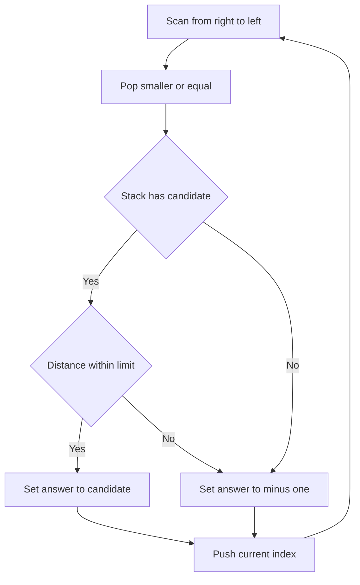

# Workshop Next Taller with Width - Editorial

## Problem Summary

For every element in an array, find the **Next Greater Element** (NGE) to its right. However, there is a constraint: the NGE must be within a distance `w`. If the nearest taller element is more than `w` steps away, or if no taller element exists, the answer is `-1`.


## Constraints

- `1 <= n <= 200000`
- `0 <= h[i] <= 10^9`
- `1 <= w <= n`
## Real-World Scenario

Imagine you are in a **Workshop** arranging tools on a wall rack.
-   Tools are arranged by height.
-   For each tool, you want to find a "Reference Tool" to its right that is taller, so you can draw a visual comparison line.
-   However, your ruler is only `w` units long.
-   You need to find the *nearest* taller tool to the right that is reachable with your ruler. If the nearest taller tool is too far, you can't use it (and certainly can't use any taller tools even further away).

## Problem Exploration

### 1. Next Greater Element (NGE)
-   The core of this problem is finding the Next Greater Element.
-   The standard solution uses a **Monotonic Stack**.
-   If we iterate from **Right to Left**, we can maintain a stack of indices representing potential NGE candidates.
-   For a current element `h[i]`, we pop elements from the stack that are smaller than or equal to `h[i]`. These popped elements can never be the NGE for `i` (because `h[i]` blocks them) or for any element to the left of `i` (because `h[i]` is closer and taller/equal).

### 2. Distance Constraint
-   After popping, the element at the top of the stack (let's call its index `j`) is the *nearest* element to the right such that `h[j] > h[i]`.
-   We simply need to check the distance: `j - i`.
-   If `j - i <= w`, then `h[j]` is our answer.
-   If `j - i > w`, then the nearest taller element is too far.
-   **Crucial Insight**: If the *nearest* taller element is too far, then *any* other taller element `k` (where `k > j`) is even further away. Thus, if the top of the stack is invalid due to distance, no other element in the stack can be valid either. We report `-1`.

## Approaches

### Approach 1: Monotonic Stack (Right to Left)
-   Initialize `result` array with `-1`.
-   Use a stack to store indices.
-   Iterate `i` from `n-1` down to `0`.
-   While stack is not empty and `h[stack.peek()] <= h[i]`:
    -   `stack.pop()`
-   If stack is not empty:
    -   `j = stack.peek()`
    -   If `j - i <= w`: `result[i] = h[j]`
    -   Else: `result[i] = -1` (Nearest is too far)
-   `stack.push(i)`
-   Complexity: `O(N)` time, `O(N)` space.

<!-- mermaid -->


## Implementations

### Java
```java
import java.util.*;
import java.io.*;

class Solution {
    public int[] nextTallerWithin(int[] h, int w) {
        int n = h.length;
        int[] result = new int[n];
        Arrays.fill(result, -1);
        Stack<Integer> stack = new Stack<>(); // Indices
        
        for (int i = n - 1; i >= 0; i--) {
            while (!stack.isEmpty() && h[stack.peek()] <= h[i]) {
                stack.pop();
            }
            
            if (!stack.isEmpty()) {
                int j = stack.peek();
                if (j - i <= w) {
                    result[i] = h[j];
                }
            }
            
            stack.push(i);
        }
        return result;
    }
}

class Main {
    public static void main(String[] args) throws IOException {
        BufferedReader br = new BufferedReader(new InputStreamReader(System.in));
        
        // Read N (Line 1) or first token
        String line = "";
        while ((line = br.readLine()) != null && line.trim().isEmpty()) {}
        if (line == null) return;
        
        // We might need to handle token-based parsing robustly
        // Problem format: N, then Array, then W.
        // Array tokens might be on second line. W on third line.
        // Or all spread out.
        // Let's use a tokenizer approach.
        
        StringTokenizer st = new StringTokenizer(line);
        if (!st.hasMoreTokens()) st = new StringTokenizer(br.readLine());
        
        int n = Integer.parseInt(st.nextToken());
        int[] h = new int[n];
        
        int loaded = 0;
        while (loaded < n) {
            if (!st.hasMoreTokens()) {
                String l = br.readLine();
                if (l == null) break;
                st = new StringTokenizer(l);
            }
            if (st.hasMoreTokens()) {
                h[loaded++] = Integer.parseInt(st.nextToken());
            }
        }
        
        // Read W
        while (!st.hasMoreTokens()) {
            String l = br.readLine();
            if (l == null) break;
            st = new StringTokenizer(l);
        }
        int w = 0;
        if (st.hasMoreTokens()) {
            w = Integer.parseInt(st.nextToken());
        }
        
        Solution sol = new Solution();
        int[] res = sol.nextTallerWithin(h, w);
        for (int val : res) {
            System.out.println(val);
        }
    }
}
```

### Python
```python
def next_taller_within(h: list[int], w: int) -> list[int]:
    n = len(h)
    result = [-1] * n
    stack = [] # Stores indices
    
    for i in range(n - 1, -1, -1):
        while stack and h[stack[-1]] <= h[i]:
            stack.pop()
            
        if stack:
            j = stack[-1]
            if j - i <= w:
                result[i] = h[j]
            else:
                result[i] = -1
        
        stack.append(i)
        
    return result


def main():
    import sys
    lines = sys.stdin.read().strip().split('\n')
    if not lines:
        return

    n = int(lines[0])
    h = list(map(int, lines[1].split()))
    w = int(lines[2])
    result = next_taller_within(h, w)
    for r in result:
        print(r)

if __name__ == "__main__":
    main()
```

### C++
```cpp
#include <iostream>
#include <vector>
#include <stack>

using namespace std;

class Solution {
public:
    vector<int> nextTallerWithin(vector<int>& h, int w) {
        int n = h.size();
        vector<int> result(n, -1);
        stack<int> st; // Indices
        
        for (int i = n - 1; i >= 0; i--) {
            while (!st.empty() && h[st.top()] <= h[i]) {
                st.pop();
            }
            
            if (!st.empty()) {
                int j = st.top();
                if (j - i <= w) {
                    result[i] = h[j];
                }
            }
            
            st.push(i);
        }
        return result;
    }
};

int main() {
    ios::sync_with_stdio(false);
    cin.tie(nullptr);
    
    int n;
    if (!(cin >> n)) return 0;
    
    vector<int> h(n);
    for (int i = 0; i < n; i++) {
        cin >> h[i];
    }
    
    int w;
    cin >> w;
    
    Solution sol;
    vector<int> res = sol.nextTallerWithin(h, w);
    
    for (int val : res) {
        cout << val << "\n";
    }
    
    return 0;
}
```

### JavaScript
```javascript
class Solution {
  nextTallerWithin(h, w) {
    const n = h.length;
    const result = new Array(n).fill(-1);
    const stack = []; // Indices

    for (let i = n - 1; i >= 0; i--) {
      while (stack.length > 0 && h[stack[stack.length - 1]] <= h[i]) {
        stack.pop();
      }

      if (stack.length > 0) {
        const j = stack[stack.length - 1];
        if (j - i <= w) {
          result[i] = h[j];
        }
      }

      stack.push(i);
    }
    return result;
  }
}

const readline = require("readline");
const rl = readline.createInterface({
  input: process.stdin,
  output: process.stdout,
});

let data = [];
rl.on("line", (line) => {
  const parts = line.trim().split(/\s+/).filter(x => x !== "");
  for (const p of parts) data.push(p);
});

rl.on("close", () => {
  if (data.length === 0) return;
  
  let idx = 0;
  const n = parseInt(data[idx++], 10);
  const h = [];
  for (let i = 0; i < n; i++) {
    h.push(parseInt(data[idx++], 10));
  }
  const w = parseInt(data[idx++], 10);
  
  const solution = new Solution();
  const res = solution.nextTallerWithin(h, w);
  console.log(res.join("\n"));
});
```

## 🧪 Test Case Walkthrough (Dry Run)
**Input:** `h = [1, 7, 3, 4, 2]`, `w = 2`

1.  `i=4` (2): Stack empty. `res[4] = -1`. Push 4. Stack: `[4]` (val 2).
2.  `i=3` (4): Pop 4 (2 <= 4). Stack empty. `res[3] = -1`. Push 3. Stack: `[3]` (val 4).
3.  `i=2` (3): Top is 3 (val 4). `4 > 3`. Dist `3 - 2 = 1 <= 2`. `res[2] = 4`. Push 2. Stack: `[3, 2]` (vals 4, 3).
4.  `i=1` (7): Pop 2 (3 <= 7). Pop 3 (4 <= 7). Stack empty. `res[1] = -1`. Push 1. Stack: `[1]` (val 7).
5.  `i=0` (1): Top is 1 (val 7). `7 > 1`. Dist `1 - 0 = 1 <= 2`. `res[0] = 7`. Push 0. Stack: `[1, 0]` (vals 7, 1).

**Result:** `[7, -1, 4, -1, -1]`

## Proof of Correctness

-   **Nearest Taller**: The stack logic guarantees that `stack.peek()` is the nearest index `j > i` with `h[j] > h[i]`.
-   **Distance Check**: Since `stack.peek()` is the *nearest* taller element, checking its distance is sufficient. If the nearest is too far, all others are strictly farther.
-   **Linear Complexity**: Each element is pushed and popped at most once.

## Interview Extensions

1.  **Circular Array**: What if the array is circular?
    -   *Hint*: Concatenate the array to itself (`h + h`) or iterate `2n` times using modulo arithmetic.
2.  **Next Smaller**: Find the next smaller element.
    -   *Hint*: Change the while condition to `h[stack.peek()] >= h[i]`.
3.  **Count Visible**: How many elements to the right are smaller than the current element before a larger one?
    -   *Hint*: This is `j - i - 1` where `j` is the NGE index.

### Common Mistakes

-   **Storing Values instead of Indices**: We need indices to calculate distance.
-   **Direction**: Iterating Left to Right makes finding the *Next* Greater Element harder (requires waiting). Right to Left is more natural for NGE.
-   **Distance Logic**: Thinking we need to search deeper in the stack if the top is too far. (Incorrect, stack is sorted by index, top is nearest).
